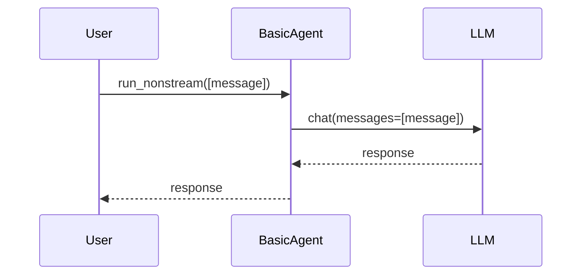

# Chapter 1: Agent

Welcome to the world of `Qwen-Agent`! We're starting with the most fundamental concept: the **Agent**.

Imagine you have a personal assistant who can answer your questions, write code, or even create images for you. That's essentially what an Agent is in the context of `Qwen-Agent`.

**Why do we need Agents?**

Think about a simple task: "Summarize this article and then translate the summary into Spanish." You *could* manually copy and paste the article into one tool to summarize it, and then copy the summary into another tool to translate it. But that's tedious!

An Agent automates this process. It's a single entity that can:

1.  Understand your request.
2.  Decide what steps are needed to fulfill the request (summarization, translation).
3.  Use the right tools to perform those steps.
4.  Provide you with the final result.

In short, Agents let you build more complex and intelligent systems by combining different capabilities into a single, manageable unit.

**Key Concepts**

Let's break down what makes up an Agent:

*   **LLM (Large Language Model):** This is the "brain" of the Agent. It understands language, generates text, and makes decisions. In `Qwen-Agent`, the LLM is handled by the [LLM (BaseChatModel)](04_llm__basechatmodel_.md) abstraction. Think of it as the core reasoning engine.
*   **Tools:** These are the specific skills or capabilities the Agent possesses. Examples include a code interpreter, a web search tool, or an image generator. We will cover these in detail in [Tool](05_tool.md). Tools allow the Agent to interact with the outside world.
*   **System Message:** This is a set of instructions that tells the LLM how to behave. It defines the Agent's personality, role, and constraints. Think of it as a guiding principle for the Agent.
*   **Logic:** This is the code that ties everything together. It determines how the Agent processes messages, selects tools, and generates responses. This logic is the core functionality of each Agent type.

**A Simple Example: The BasicAgent**

Let's look at a very basic Agent: `BasicAgent`. As the name suggests, it's the simplest form of an Agent in `Qwen-Agent`. It essentially just passes your message to the LLM and returns the LLM's response.

Here's a snippet that shows how it works:

```python
from qwen_agent.agent import BasicAgent
from qwen_agent.llm.schema import Message

# Initialize the BasicAgent with an LLM (you need to configure your LLM first!)
agent = BasicAgent(llm={'model': 'your_model_name', 'api_key': 'your_api_key'})

# Create a message
message = Message(role='user', content='Hello, how are you?')

# Run the agent (get the LLM's response)
response = agent.run_nonstream([message])

print(response)
```

Explanation:

1. We first initialize the `BasicAgent`. The `llm` parameter should contain configuration details about your LLM. Replace `"your_model_name"` and `"your_api_key"` with actual values.
2. We create a `Message` object. The `role` is set to `user` to indicate that this is a user's message. The `content` is the actual message.
3. We call the `run_nonstream` method to get the agent's response. `run_nonstream` executes the agent and returns the final result.
4. The `response` will be a list containing a single message that is the LLM's reply to the user message.

**How does it work under the hood?**

Let's walk through what happens when you call `agent.run_nonstream([message])` in the `BasicAgent`.



1.  The `User` calls the `run_nonstream` method on the `BasicAgent` instance, providing a list containing the user's message.
2.  The `BasicAgent` then calls the `chat` method of the [LLM (BaseChatModel)](04_llm__basechatmodel_.md) instance, passing the message along.
3.  The [LLM (BaseChatModel)](04_llm__basechatmodel_.md) processes the message and generates a response.
4.  The `BasicAgent` receives the response from the [LLM (BaseChatModel)](04_llm__basechatmodel_.md).
5.  Finally, the `BasicAgent` returns the response to the `User`.

Now let's look at the code of the `BasicAgent` from `qwen_agent/agent.py`:

```python
class BasicAgent(Agent):

    def _run(self, messages: List[Message], lang: str = 'en', **kwargs) -> Iterator[List[Message]]:
        extra_generate_cfg = {'lang': lang}
        if kwargs.get('seed') is not None:
            extra_generate_cfg['seed'] = kwargs['seed']
        return self._call_llm(messages, extra_generate_cfg=extra_generate_cfg)
```

Explanation:

1. The `_run` method is the core logic of the `BasicAgent`. It receives the `messages` and other parameters.
2. It prepares the extra configurations for LLM by setting language (`lang`) and random seed (`seed`).
3. It calls the `_call_llm` method to interact with the LLM. This method is inherited from the parent class `Agent`.

The `_call_llm` function (also in `qwen_agent/agent.py`) handles the actual interaction with the LLM:

```python
    def _call_llm(
        self,
        messages: List[Message],
        functions: Optional[List[Dict]] = None,
        stream: bool = True,
        extra_generate_cfg: Optional[dict] = None,
    ) -> Iterator[List[Message]]:
        """The interface of calling LLM for the agent.

        We prepend the system_message of this agent to the messages, and call LLM.

        Args:
            messages: A list of messages.
            functions: The list of functions provided to LLM.
            stream: LLM streaming output or non-streaming output.
              For consistency, we default to using streaming output across all agents.

        Yields:
            The response generator of LLM.
        """
        return self.llm.chat(messages=messages,
                             functions=functions,
                             stream=stream,
                             extra_generate_cfg=merge_generate_cfgs(
                                 base_generate_cfg=self.extra_generate_cfg,
                                 new_generate_cfg=extra_generate_cfg,
                             ))
```

Explanation:

1.  This method takes the messages and any additional configuration.
2.  It then calls the `chat` method of the [LLM (BaseChatModel)](04_llm__basechatmodel_.md) instance (`self.llm`), passing the messages and configurations.
3.  The `chat` method returns a generator that yields responses from the LLM.

**Different Agent Types**

The `BasicAgent` is just the starting point. `Qwen-Agent` provides various other Agent types, each with its own specialized logic and capabilities. Examples include `FnCallAgent` to use tools, `ReActChat` for complex reasoning, and `Assistant` that is integrated with RAG capabilities. We will explore some of these in later chapters.

**Conclusion**

In this chapter, you've learned the fundamental concept of an Agent in `Qwen-Agent`. You've seen how it combines an LLM, tools, and logic to create intelligent systems. You've also explored the `BasicAgent` as a simple example.

Next, we'll dive into the [WebUI](02_webui.md), the primary way to interact with your Agent!


---

Generated by [AI Codebase Knowledge Builder](https://github.com/The-Pocket/Tutorial-Codebase-Knowledge)