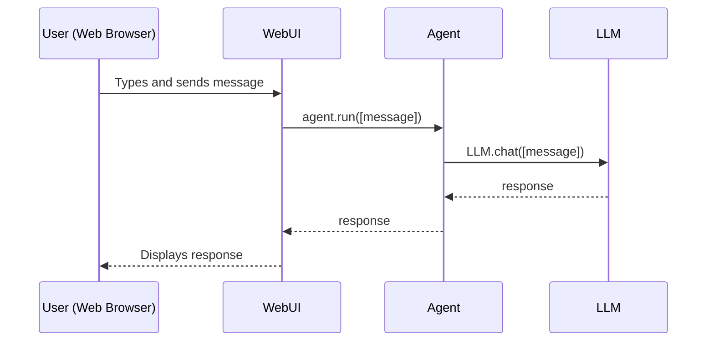

# Chapter 2: WebUI

In the previous chapter, [Agent](01_agent.md), we learned about the core concept of an Agent and how it can automate complex tasks. But how do we actually *talk* to the Agent? That's where the WebUI comes in!

Imagine you want to ask your Agent to write a short poem about cats. You could write some code to send the request to the Agent and display the response in your terminal. But wouldn't it be easier to have a simple chat interface where you can just type your request and see the Agent's response?

That's exactly what the WebUI provides. It's a user-friendly graphical interface that allows you to interact with your Agent through a web browser. It's like the control panel for your intelligent system.

**What is the WebUI?**

The WebUI in `Qwen-Agent` is a Gradio-based interface. Gradio is a Python library that makes it easy to create web interfaces for your machine learning models.

Here's what the WebUI allows you to do:

*   **Input text:** Type your questions or instructions for the Agent.
*   **Upload files:** Provide files (like images or documents) as context for the Agent.
*   **View responses:** See the Agent's answers, code, or generated content in a clear and readable format.
*   **Configure settings:** Adjust various settings for the Agent, such as the model being used (though this is often done beforehand via code).
*   **Interact easily:** Makes interacting with agents much easier for everyone, not just programmers!

**Why use the WebUI?**

*   **Simplicity:** No coding required to interact with the Agent.
*   **Accessibility:** Accessible through any web browser.
*   **Visualization:** Presents information in a user-friendly way.
*   **Ease of Deployment:** Simplifies the deployment and interaction with Qwen Agents.

**How to use the WebUI**

Let's see how we can use the WebUI to interact with an Agent. First, you need to have an Agent set up. For this example, let's assume you have a `BasicAgent` initialized (as we saw in the [Agent](01_agent.md) chapter) and named `agent`.

To start the WebUI, you'll use the `WebUI` class from `qwen_agent.gui`. Here's a simple example:

```python
from qwen_agent.gui import WebUI

# Assuming you have an agent instance named 'agent'
web_ui = WebUI(agent=agent)
web_ui.run()
```

Explanation:

1.  We import the `WebUI` class.
2.  We create an instance of `WebUI`, passing our `agent` as an argument. This tells the WebUI which agent to connect to.
3.  We call the `run()` method to start the WebUI. This will launch a web server, and the URL to access the interface will be printed in your console.

Now, open your web browser and go to the URL provided in the console (usually something like `http://127.0.0.1:7860`). You should see the WebUI interface!

You can now type your message in the input box and press Enter. The Agent will process your message, and the response will be displayed in the chat window. For example, you could type "Tell me a joke" and see what the agent comes up with.

**Input and Output in the WebUI**

When you interact with the WebUI, you provide input in the form of text, and optionally files.

*   **Input:** The text you type in the input box, and any files you upload.
*   **Output:** The Agent's response, which can be text, code, or even images. The output is displayed in the chat window.

**Under the Hood: How the WebUI Works**

Let's take a peek at what happens behind the scenes when you send a message through the WebUI.



1.  The `User` types a message in the web browser and sends it.
2.  The `WebUI` receives the message and calls the `agent.run([message])` method, passing the message to the [Agent](01_agent.md).
3.  The [Agent](01_agent.md) then calls the `chat` method of the [LLM (BaseChatModel)](04_llm__basechatmodel_.md) to process the message and generate a response.
4.  The [LLM (BaseChatModel)](04_llm__basechatmodel_.md) sends back the response to the Agent.
5.  The [Agent](01_agent.md) receives the response and sends it back to the WebUI.
6.  The `WebUI` receives the response and displays it in the web browser.

Now, let's look at some of the code that makes this happen. The main file for the WebUI is `qwen_agent/gui/web_ui.py`.

Here's a snippet from the `WebUI` class that handles adding text input:

```python
    def add_text(self, _input, _chatbot, _history):
        _history.append({
            ROLE: USER,
            CONTENT: [{
                'text': _input.text
            }],
        })

        _chatbot.append([_input, None])

        from qwen_agent.gui.gradio_dep import gr

        yield gr.update(interactive=False, value=None), _chatbot, _history
```

Explanation:

1.  This method is called when the user submits text input.
2.  It appends the user's message to the `_history` list.
3.  It then appends the message to the `_chatbot` list, which is used to display the conversation in the WebUI.
4.  Finally, it yields updates to the Gradio components to update the interface.

Another important part is the `agent_run` method, which calls the Agent:

```python
    def agent_run(self, _chatbot, _history, _agent_selector=None):
        agent_runner = self.agent_list[_agent_selector or 0]
        responses = []
        for responses in agent_runner.run(_history, **self.run_kwargs):
            # ... process responses and update chatbot ...
            yield _chatbot, _history
```

Explanation:

1.  This method retrieves the appropriate [Agent](01_agent.md) from the `agent_list`.
2.  It calls the `run` method of the Agent, passing the chat history.
3.  It then processes the responses from the Agent and updates the `_chatbot` list to display the results in the WebUI.

**Important Note:**

The code snippets shown here are simplified for clarity. The actual implementation in `qwen_agent/gui/web_ui.py` is more complex, handling various features such as file uploads, agent selection, and streaming responses.

**Conclusion**

In this chapter, you've learned about the WebUI, a user-friendly interface for interacting with `Qwen-Agent`. You've seen how it simplifies the process of sending messages to an Agent and viewing its responses. You've also gained a basic understanding of how the WebUI works under the hood.

In the next chapter, we'll explore the structure of [Message](03_message.md), which represents the information exchanged between the user, the Agent, and the LLM.


---

Generated by [AI Codebase Knowledge Builder](https://github.com/The-Pocket/Tutorial-Codebase-Knowledge)