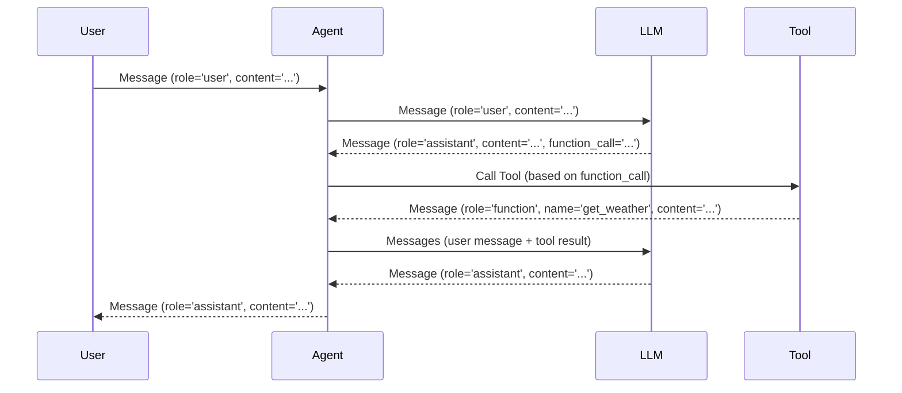

# Chapter 3: Message

In the previous chapter, [WebUI](02_webui.md), we learned how to use a web interface to talk to our Agent. But what *exactly* are we sending back and forth? What kind of information is being exchanged? The answer is: **Messages**.

Imagine you're writing notes to a friend. You write something, they read it, and then they write back. In `Qwen-Agent`, Messages are those notes! They're the fundamental way that the user and the Agent communicate.

**Why do we need Messages?**

Think about asking an Agent to summarize a news article. You need to *tell* the Agent which article to summarize. You do this by sending a Message. The Agent then *responds* with a summary, also in the form of a Message. Messages are how we give Agents instructions and how they give us results!

**What is a Message?**

A Message is a container for information. It tells us:

*   **Who sent it (the `role`)**
*   **What they said (the `content`)**
*   **And optionally, other important details.**

Let's break this down further:

*   **`role`:** This tells us who sent the message. It can be:
    *   `user`: You, the person interacting with the Agent.
    *   `assistant`: The Agent itself.
    *   `system`: A special message providing instructions to the Agent (we'll talk more about this later).
    *   `function`: The result of a tool being called by the agent.

*   **`content`:** This is the actual message being sent. It's usually text, but it can also be other types of data like images, files, audio or video! It depends on the capabilities of the LLM and the tools available to it.

*   **`name`:** If the message is the result of calling a tool (a "function"), this field stores the name of the function.

*   **`function_call`:** This field contains structured information about the function that the Agent wants to call, including the function's name and the arguments to pass to it. It's how the Agent requests to use a tool.

**Creating a Message**

Let's see how to create a simple message. We'll use the `Message` class from `qwen_agent.llm.schema`:

```python
from qwen_agent.llm.schema import Message

# Create a message from the user
user_message = Message(role='user', content='What is the capital of France?')

print(user_message)
```

Explanation:

1.  We import the `Message` class.
2.  We create a `Message` object.
    *   `role='user'` indicates that this message is from the user.
    *   `content='What is the capital of France?'` is the actual question we're asking.
3.  We print the message.  You will see something like: `Message({'role': 'user', 'content': 'What is the capital of France?', 'reasoning_content': None, 'name': None, 'function_call': None, 'extra': None})`

**Messages in Action: Talking to the Agent**

Remember the `BasicAgent` from the [Agent](01_agent.md) chapter? We used it like this:

```python
from qwen_agent.agent import BasicAgent
from qwen_agent.llm.schema import Message

# Initialize the BasicAgent (replace with your actual LLM configuration)
agent = BasicAgent(llm={'model': 'your_model_name', 'api_key': 'your_api_key'})

# Create a user message
message = Message(role='user', content='Hello, how are you?')

# Run the agent
response = agent.run_nonstream([message])

print(response)
```

Explanation:

1. We create a `Message` with the `role` as `user` and the content as "Hello, how are you?".
2. We pass this `Message` to the `agent.run_nonstream` method.
3. The Agent processes the `Message` and returns a `Message` containing its response.

The `response` variable will hold a list containing a single message. This message will have:

*   `role='assistant'` (because it's from the Agent).
*   `content='...'` (the Agent's reply, something like "I'm doing well, thank you! How can I help you?").

**More Complex Messages: Function Calls**

Things get interesting when we start using tools. Imagine we have a tool called `get_weather` that can fetch the weather for a given city. The Agent might generate a message that looks like this:

```python
from qwen_agent.llm.schema import Message, FunctionCall

# The agent wants to call the 'get_weather' function
message = Message(
    role='assistant',
    content='I need to get the weather for London.',
    function_call=FunctionCall(name='get_weather', arguments='{"city": "London"}')
)

print(message)
```

Explanation:

1.  `role='assistant'` because the Agent is sending this message.
2.  `content='I need to get the weather for London.'` explains what the Agent *intends* to do.
3.  `function_call=FunctionCall(name='get_weather', arguments='{"city": "London"}'` tells us *which* function to call (`get_weather`) and *what* arguments to use (`{"city": "London"}`).

When the Agent receives this message, it knows it needs to call the `get_weather` tool with the argument "London". The `function_call` is the structured way that the Agent requests to use its tools.

**Under the Hood: How Messages are Used**

Let's see what happens when we send a message to an Agent.



1.  The `User` sends a `Message` to the `Agent`.
2.  The `Agent` passes the `Message` to the `LLM`.
3.  The `LLM` might respond with a `Message` containing a `function_call`, indicating that it wants to use a tool.
4.  The `Agent` calls the appropriate `Tool` based on the `function_call`.
5.  The `Tool` executes and returns a `Message` with the result. This Message has the role `function` and includes the name of the tool that was called.
6. The `Agent` sends a list of messages including the original user message and the tool call result to the LLM for the final response.
7.  The `LLM` generates a final response, which is sent back to the `Agent`.
8.  The `Agent` sends the final response `Message` back to the `User`.

Now, let's look at the code from `qwen_agent/llm/schema.py`:

```python
class Message(BaseModelCompatibleDict):
    role: str
    content: Union[str, List[ContentItem]]
    reasoning_content: Optional[Union[str, List[ContentItem]]] = None
    name: Optional[str] = None
    function_call: Optional[FunctionCall] = None
    extra: Optional[dict] = None
```

This code defines the `Message` class. As you can see, it includes the `role`, `content`, `name`, and `function_call` attributes that we discussed earlier.  It also defines `ContentItem` to support different types of content, such as text, images, files, audio and video.

The `role_checker` method ensures that the `role` is one of the valid options (`user`, `assistant`, `system`, `function`).

```python
    @field_validator('role')
    def role_checker(cls, value: str) -> str:
        if value not in [USER, ASSISTANT, SYSTEM, FUNCTION]:
            raise ValueError(f'{value} must be one of {",".join([USER, ASSISTANT, SYSTEM, FUNCTION])}')
        return value
```

This is a simple example of how the `Message` class is defined and used to validate the `role` attribute.

**Conclusion**

In this chapter, you've learned about the `Message` class, which is the fundamental unit of communication in `Qwen-Agent`. You've seen how to create messages, how they're used to interact with the Agent, and how they can contain information about function calls.

Next, we'll take a deeper look at the [LLM (BaseChatModel)](04_llm__basechatmodel_.md), the "brain" behind the Agent, and how it processes these messages!


---

Generated by [AI Codebase Knowledge Builder](https://github.com/The-Pocket/Tutorial-Codebase-Knowledge)