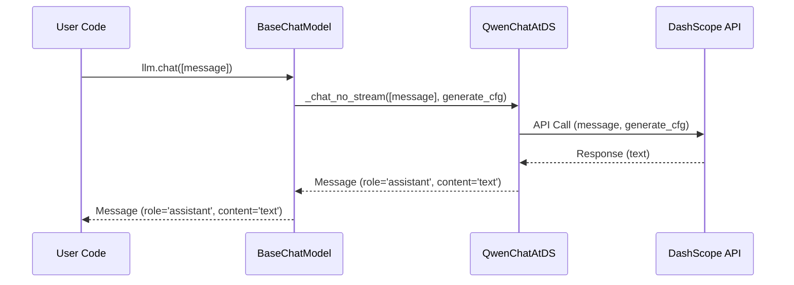

# Chapter 4: LLM (BaseChatModel)

In the previous chapter, [Message](03_message.md), we learned about how information is structured and passed between the user and the Agent. But where does the Agent's intelligence *actually* come from? How does it understand our requests and generate responses? The answer lies in the **LLM (BaseChatModel)**.

Think of the LLM as the Agent's brain. It's the core engine that understands language, reasons, and produces text. It's the most vital part of the agent.

**Why do we need the BaseChatModel Abstraction?**

Imagine you want your Agent to be able to use *different* LLMs. One day you might want to use Qwen, another day you might want to use GPT-4. Each of these LLMs has its own way of being accessed and used.

The `BaseChatModel` abstraction provides a *consistent* way to interact with different LLMs. It hides the messy details of dealing with different LLM providers (like DashScope or OpenAI) and provides a unified interface. This means you can easily switch between LLMs without changing the rest of your Agent's code! It makes the agent much more flexible.

**Key Concepts**

Let's break down the key concepts of the `BaseChatModel`:

*   **LLM Provider:** This is the company or organization that provides the LLM. Examples include DashScope (Alibaba Cloud), OpenAI, and others.
*   **Model Name:** This is the specific LLM that you want to use. For example, `qwen-max` (from DashScope) or `gpt-4o-mini` (from OpenAI).
*   **API Key:** This is a secret key that you use to authenticate with the LLM provider. You need an API key to access the LLM.
*   **Prompt:** This is the input that you send to the LLM. It's usually a text-based instruction or question.
*   **Response:** This is the output that the LLM generates based on the prompt. It's usually text, but it can also be other types of data.
*   **Chat:** This refers to the ongoing "conversation" with the LLM. The LLM keeps track of the previous messages in the conversation, which helps it understand the context of your current request.

**Using the BaseChatModel**

Let's see how we can use the `BaseChatModel` to interact with an LLM. We'll use the `get_chat_model` function to create a `BaseChatModel` instance.

```python
from qwen_agent.llm import get_chat_model
from qwen_agent.llm.schema import Message

# Configure your LLM (replace with your actual API key and model name)
llm_config = {
    'model': 'qwen-max', # Replace with your desired model
    'api_key': 'YOUR_DASHSCOPE_API_KEY' # Replace with your actual API key
}

# Get the chat model
llm = get_chat_model(llm_config)

# Create a message
message = Message(role='user', content='Tell me a short story.')

# Get the LLM's response
response = llm.chat([message])

print(response)
```

Explanation:

1.  We import the `get_chat_model` function and the `Message` class.
2.  We create a `llm_config` dictionary with the configuration details for our LLM. **IMPORTANT:** You *must* replace `"YOUR_DASHSCOPE_API_KEY"` with your actual API key from DashScope (or whatever provider you are using). You'll need to create an account with DashScope to get an API key if you don't already have one.
3.  We call the `get_chat_model` function to create a `BaseChatModel` instance. This function automatically selects the correct `BaseChatModel` implementation based on the configuration.
4.  We create a `Message` object with the `role` as `user` and the content as "Tell me a short story.".
5.  We call the `llm.chat` method to get the LLM's response.
6.  The `response` variable will hold a list containing a single message that is the LLM's reply to the user message.

The output `response` will be a list containing a `Message` object with `role='assistant'` and the content containing the short story generated by the LLM.

**Important:** This code assumes you have the `dashscope` package installed. If not, you'll need to install it using `pip install dashscope`. You'll also want to choose a model and service provider that aligns with the agents capabilties!

**Under the Hood: How it Works**

Let's take a look at what happens behind the scenes when you call the `llm.chat` method.



1.  Your code calls the `chat` method on the `BaseChatModel` instance.
2.  The `BaseChatModel` then calls the `_chat_no_stream` method (or `_chat_stream` for streaming) of the specific LLM implementation (e.g., `QwenChatAtDS` if you're using DashScope's Qwen model).
3.  The `QwenChatAtDS` class prepares the prompt and calls the DashScope API.
4.  The DashScope API processes the prompt and returns a response.
5.  The `QwenChatAtDS` class creates a `Message` object from the response.
6.  The `BaseChatModel` returns the `Message` object to your code.

Now, let's look at some of the code that makes this happen. The `BaseChatModel` class is defined in `qwen_agent/llm/base.py`. The `QwenChatAtDS` class (which handles the DashScope integration) is defined in `qwen_agent/llm/qwen_dashscope.py`.

Here's a simplified snippet from `qwen_agent/llm/base.py`:

```python
class BaseChatModel(ABC):
    # ... other methods ...

    @abstractmethod
    def _chat_no_stream(
        self,
        messages: List[Message],
        generate_cfg: dict,
    ) -> List[Message]:
        raise NotImplementedError
```

Explanation:

*   The `BaseChatModel` class is an abstract base class. This means that it defines a common interface for all LLM implementations.
*   The `_chat_no_stream` method is an abstract method. This means that each LLM implementation must provide its own implementation of this method.

Here's a simplified snippet from `qwen_agent/llm/qwen_dashscope.py`:

```python
@register_llm('qwen_dashscope')
class QwenChatAtDS(BaseFnCallModel):
    # ... other methods ...

    def _chat_no_stream(
        self,
        messages: List[Message],
        generate_cfg: dict,
    ) -> List[Message]:
        # ... code to call the DashScope API and create a Message object ...
        pass
```

Explanation:

*   The `@register_llm('qwen_dashscope')` decorator registers the `QwenChatAtDS` class as an LLM implementation.
*   The `_chat_no_stream` method implements the `_chat_no_stream` abstract method from the `BaseChatModel` class. It handles the specific details of calling the DashScope API and creating a `Message` object from the response.

**Different LLM Implementations**

`Qwen-Agent` provides several different `BaseChatModel` implementations, including:

*   `QwenChatAtDS`: For using Qwen models from DashScope.
*   `TextChatAtOAI`: For using OpenAI models.
*   `QwenVLChatAtDS`: For using multimodal Qwen models (image and text) from DashScope.

You can choose the appropriate implementation by configuring the `model` and `model_server` (or `model_type`) parameters when creating the `BaseChatModel` instance. See the code samples in `qwen_agent/llm/__init__.py` for details.

**Conclusion**

In this chapter, you've learned about the `LLM (BaseChatModel)` abstraction, which provides a consistent way to interact with different LLMs. You've seen how to create a `BaseChatModel` instance, how to send prompts to the LLM, and how to receive responses. You've also gained a basic understanding of how the `BaseChatModel` works under the hood.

Next, we'll explore [Tool](05_tool.md), which allows the agent to interact with external APIs such as search engines or database access!


---

Generated by [AI Codebase Knowledge Builder](https://github.com/The-Pocket/Tutorial-Codebase-Knowledge)