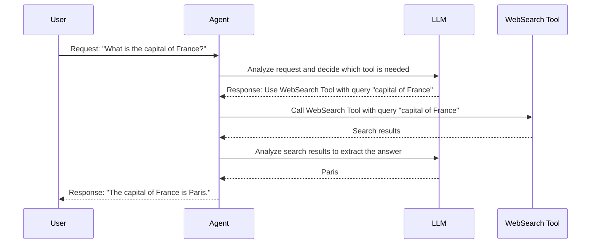

# Chapter 5: Tool

In the previous chapter, [LLM (BaseChatModel)](04_llm__basechatmodel_.md), we learned how the Agent's "brain" – the LLM – works. But a brain is only useful if it can interact with the world! That's where **Tools** come in.

Imagine you want your Agent to book a flight. The LLM itself doesn't know how to book flights. It needs a *Tool* – something like a "Flight Booking API" – that it can use to actually perform the booking.

**What is a Tool?**

Tools provide Agents with access to external resources and functionalities, extending their capabilities beyond the LLM's inherent knowledge. Imagine them as specialized instruments or APIs the Agent can use to perform tasks, like retrieving information from the web, running code, or generating images.

Think of a Swiss Army knife. Each blade is a specialized tool. In `Qwen-Agent`, a Tool could be a search engine, a calculator, or even a code interpreter.

**Key Concepts**

Let's break down the key concepts of a Tool:

*   **Name:** A unique identifier for the Tool (e.g., "web_search", "calculator").  This is how the Agent knows *which* tool to use.
*   **Description:** A human-readable explanation of what the Tool does (e.g., "Searches the web for information", "Performs mathematical calculations"). This helps the Agent decide *when* to use the tool.
*   **Parameters:** Defines the inputs the Tool needs to function (e.g., for "web_search", the parameter might be "query"). Parameters are what you provide to the tool.

**Why do we need Tools?**

LLMs are powerful, but they have limitations:

*   **They don't have access to real-time information:** The LLM's knowledge is limited to the data it was trained on. It can't tell you today's weather or the current stock price.
*   **They can't perform actions in the real world:** An LLM can't book a flight, send an email, or control a robot.

Tools solve these limitations by providing Agents with a way to interact with the outside world.

**A Concrete Example: Web Search**

Let's say we want our Agent to answer the question, "What is the current price of Bitcoin?"  The Agent can't know this directly. It needs to use a web search tool to find the answer.

1.  The Agent *decides* that it needs to use a web search tool.
2.  The Agent *calls* the web search tool with the *parameter* "Bitcoin price".
3.  The web search tool *returns* the search results.
4.  The Agent *reads* the search results and *extracts* the answer.
5.  The Agent *responds* to the user with the answer.

**Using Tools in `Qwen-Agent`**

Let's look at a simple example of how to use a Tool in `Qwen-Agent`. We'll use the `WebSearch` tool.

```python
from qwen_agent.tools import WebSearch

# Create a WebSearch tool instance
web_search = WebSearch()

# Define the query
query = "current price of Bitcoin"

# Call the tool with the query as the parameter
result = web_search.call(query)

print(result)
```

Explanation:

1. We import the `WebSearch` class from `qwen_agent.tools`.
2. We create an instance of the `WebSearch` tool.
3. We define the `query` string that we want to search for.
4. We call the `call` method of the `WebSearch` tool, passing the `query` as the parameter. This will search the web and return the results.
5. We print the `result`. The result will be a string containing the search results from the web.

The `WebSearch` tool uses the `serper.dev` API to search the web. You'll need to sign up for a free API key at [https://serper.dev/](https://serper.dev/) and set the `SERPER_API_KEY` environment variable.

**How the Agent Knows to Use a Tool**

The magic happens when the Agent combines the LLM with the Tool. The Agent uses the LLM to *reason* about the user's request and *decide* which Tool to use.

For example, if the user asks "What's the weather in London?", the Agent uses the LLM to understand that this requires looking up weather information. The Agent then chooses the appropriate Tool (e.g., a weather API tool) and calls it with the appropriate parameters (e.g., "London"). The LLM also uses the description of the tool to determine the best tool to use.

**Under the Hood: How Tools Work**

Let's take a peek at what happens behind the scenes when an Agent uses a Tool.



1.  The `User` sends a request to the `Agent`.
2.  The `Agent` uses the `LLM` to analyze the request and decide which tool is needed.
3.  The `LLM` responds with the name of the tool to use and the parameters to pass to it.
4.  The `Agent` calls the appropriate `Tool` with the specified parameters.
5.  The `Tool` executes and returns the results to the `Agent`.
6. The `Agent` sends the tool call results back to the LLM for final processing.
7.  The `Agent` sends the final response back to the `User`.

Let's look at some of the code that makes this happen. The `BaseTool` class is defined in `qwen_agent/tools/base.py`. The `WebSearch` class is defined in `qwen_agent/tools/web_search.py`.

Here's a simplified snippet from `qwen_agent/tools/base.py`:

```python
from abc import ABC, abstractmethod
from typing import Union

class BaseTool(ABC):
    name: str = ''
    description: str = ''
    parameters: Union[List[dict], dict] = []

    @abstractmethod
    def call(self, params: Union[str, dict], **kwargs) -> str:
        raise NotImplementedError
```

Explanation:

*   The `BaseTool` class is an abstract base class. This means that it defines a common interface for all Tool implementations.
*   The `call` method is an abstract method. This means that each Tool implementation must provide its own implementation of this method.

Here's a simplified snippet from `qwen_agent/tools/web_search.py`:

```python
from typing import Union
from qwen_agent.tools.base import BaseTool, register_tool

@register_tool('web_search')
class WebSearch(BaseTool):
    description = 'useful for when you need to answer questions about current events'
    parameters = [{'name': 'q', 'type': 'string', 'description': 'search query', 'required': True}]

    def call(self, params: Union[str, dict], **kwargs) -> str:
        # ... code to call the Serper API and return the results ...
        pass
```

Explanation:

*   The `@register_tool('web_search')` decorator registers the `WebSearch` class as a Tool implementation.
*   The `call` method implements the `call` abstract method from the `BaseTool` class. It handles the specific details of calling the Serper API and returning the results.

**Different Types of Tools**

`Qwen-Agent` provides several different Tool implementations, including:

*   `WebSearch`: For searching the web.
*   `CodeInterpreter`: For executing Python code.
*   `ImageGen`: For generating images.

You can choose the appropriate Tool based on the task you want to perform.

**Conclusion**

In this chapter, you've learned about Tools, which provide Agents with access to external resources and functionalities. You've seen how to create and use Tools, and how they extend the capabilities of Agents beyond the LLM's inherent knowledge. Tools are essential for building powerful and versatile Agents.

Next, we'll explore [Memory](06_memory.md), which allows Agents to remember past interactions and use that information to improve future performance!


---

Generated by [AI Codebase Knowledge Builder](https://github.com/The-Pocket/Tutorial-Codebase-Knowledge)