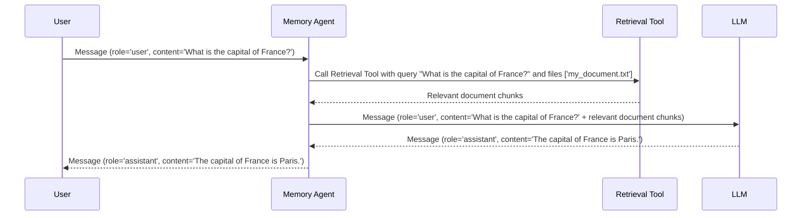

# Chapter 6: Memory

In the previous chapter, [Tool](05_tool.md), we learned how Agents can use external tools to access information and perform actions. But what if the Agent needs to *remember* things from past conversations or access information from documents you've uploaded? That's where **Memory** comes in!

Imagine you're teaching an Agent about a specific topic by providing it with a document. You don't want to have to re-explain the whole topic every time you ask a question. The Memory component allows the Agent to "remember" the information in the document and use it to answer your questions later.

**What is Memory?**

The Memory component in `Qwen-Agent` is like a personal notebook for the Agent. It allows the Agent to:

*   **Retain past interactions:** Remember what you've talked about before in the current conversation.
*   **Access uploaded knowledge:** Integrate information from files you upload, like PDFs or text documents.

It does this using a technique called **Retrieval-Augmented Generation (RAG)**.  Think of RAG like this:

1.  You give the Agent a document (or it remembers a past conversation).
2.  The Agent breaks the document (or conversation) into smaller chunks and stores them.
3.  When you ask a question, the Agent *retrieves* the relevant chunks from its "memory."
4.  The Agent *generates* an answer based on your question *and* the retrieved information.

**Why do we need Memory?**

*   **Long-term context:** Allows the Agent to understand conversations that span multiple turns.
*   **Information integration:** Enables the Agent to use information from external sources (like documents) to answer questions.
*   **Improved accuracy:** Reduces the chance of the Agent hallucinating (making things up) by grounding its answers in real data.

**Key Concepts**

Let's break down the key concepts of the Memory component:

*   **Document Chunks:** The Agent breaks down documents into smaller pieces called "chunks". This makes it easier to find relevant information quickly.
*   **Retrieval:** The process of searching for and finding the most relevant document chunks based on your question.
*   **RAG (Retrieval-Augmented Generation):** The overall process of retrieving relevant information and using it to generate a response.

**Using Memory**

Let's see how we can use the Memory component in `Qwen-Agent`.  We'll create a simple Agent with Memory and upload a document to it.

First, you'll need a document to upload. Create a text file named `my_document.txt` with the following content:

```
This document describes the capital of France. The capital of France is Paris. Paris is a beautiful city on the Seine River.
```

Now, let's create the Agent:

```python
from qwen_agent.memory import Memory
from qwen_agent.llm import get_chat_model
from qwen_agent.llm.schema import Message

# Configure your LLM (replace with your actual API key and model name)
llm_config = {
    'model': 'qwen-max', # Replace with your desired model
    'api_key': 'YOUR_DASHSCOPE_API_KEY' # Replace with your actual API key
}

# Get the chat model
llm = get_chat_model(llm_config)

# Create a Memory agent
memory_agent = Memory(llm=llm, files=['my_document.txt'])

# Ask a question
message = Message(role='user', content='What is the capital of France?')

# Get the agent's response
response = memory_agent.run_nonstream([message])

print(response)
```

Explanation:

1.  We import the necessary classes: `Memory`, `get_chat_model`, and `Message`.
2.  We configure the LLM (remember to replace `"YOUR_DASHSCOPE_API_KEY"` with your actual API key).
3.  We create a `Memory` agent, passing the LLM configuration and the list of files to use for RAG (`files=['my_document.txt']`). This tells the memory agent to load the contents of `my_document.txt`.
4.  We create a `Message` with the question we want to ask.
5.  We call `memory_agent.run_nonstream([message])` to get the agent's response.
6.  The `response` variable will be a list of messages. The last message will contain the Agent's answer, which should be "The capital of France is Paris." (or something very similar).

The `Memory` agent automatically retrieves the relevant information from `my_document.txt` and uses it to answer your question!

**Important:** This code assumes you have the `dashscope` package installed. If not, you'll need to install it using `pip install dashscope`. You'll also want to choose a model and service provider that aligns with the agents capabilties!

**Under the Hood: How Memory Works**

Let's take a peek at what happens behind the scenes when you ask the Memory agent a question:



1.  The `User` sends a `Message` to the `Memory Agent`.
2.  The `Memory Agent` calls the `Retrieval Tool`, providing it with the user's question and the list of files it should search.
3.  The `Retrieval Tool` searches the files for relevant document chunks and returns them to the `Memory Agent`.
4.  The `Memory Agent` constructs a new `Message` that includes the user's question *and* the relevant document chunks. It then sends this message to the `LLM`.
5.  The `LLM` uses the information in the message to generate an answer.
6.  The `Memory Agent` sends the `LLM`'s response back to the `User`.

Now, let's look at some of the code that makes this happen. The `Memory` class is defined in `qwen_agent/memory/memory.py`.

Here's a simplified snippet from `qwen_agent/memory/memory.py`:

```python
class Memory(Agent):
    def __init__(self,
                 function_list: Optional[List[Union[str, Dict, BaseTool]]] = None,
                 llm: Optional[Union[Dict, BaseChatModel]] = None,
                 system_message: Optional[str] = DEFAULT_SYSTEM_MESSAGE,
                 files: Optional[List[str]] = None,
                 rag_cfg: Optional[Dict] = None):

        super().__init__(function_list=[{
            'name': 'retrieval', # Uses retrieval to find relevant document chunks
        }]+ function_list,
                         llm=llm,
                         system_message=system_message)

        self.system_files = files or [] # files for RAG

    def _run(self, messages: List[Message], lang: str = 'en', **kwargs) -> Iterator[List[Message]]:
        """This agent is responsible for processing the input files in the message.
        """

        rag_files = self.get_rag_files(messages)

        if not rag_files:
            yield [Message(role=ASSISTANT, content='', name='memory')] # No files provided
        else:
            query = ''
            if messages and messages[-1].role == USER: # Retrieves query from the most recent user message.
                query = extract_text_from_message(messages[-1], add_upload_info=False)

            content = self.function_map['retrieval'].call( # Calls the retrieval tool to get the relavant documents
                {
                    'query': query,
                    'files': rag_files
                },
                **kwargs,
            )

            yield [Message(role=ASSISTANT, content=content, name='memory')] # Returns retrieved document message
```

Explanation:

*   The `Memory` class inherits from the [Agent](01_agent.md) class.
*   The `__init__` method initializes the `Memory` agent, taking a list of files as input. These files are stored in `self.system_files`. The important part is to define `retrieval` in `function_list`.
*   The `_run` method is called when the agent receives a message. It extracts the user's query from the message and calls the `retrieval` tool to find relevant document chunks. Finally, it creates a `Message` containing the retrieved information and returns it. The LLM generates the final response using this message as context.

The actual implementation of the `retrieval` tool is in `qwen_agent/tools`. It uses various search strategies to find relevant information based on the query.

**Conclusion**

In this chapter, you've learned about the Memory component, which allows Agents to remember past interactions and access information from uploaded files. You've seen how to create a Memory agent, upload documents to it, and ask questions that are answered using the information in those documents. Memory is essential for building Agents that can understand long-term context and integrate information from external sources.

Next, we'll explore [ReActChat](07_reactchat.md), which allows the agent to perform complex reasoning using a technique called ReAct!


---

Generated by [AI Codebase Knowledge Builder](https://github.com/The-Pocket/Tutorial-Codebase-Knowledge)