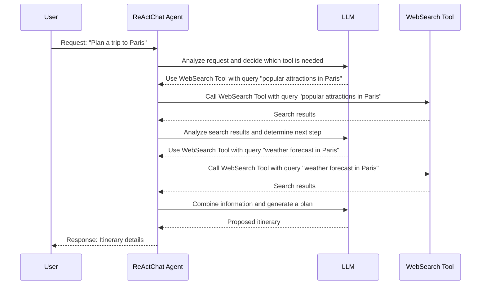

# Chapter 7: ReActChat

In the previous chapter, [Memory](06_memory.md), we learned how Agents can remember information from past conversations and uploaded documents. Now, let's explore how to build Agents that can perform complex reasoning and decision-making! This is where **ReActChat** comes in.

Imagine you want your Agent to plan a trip to a new city. This requires multiple steps: finding attractions, checking the weather, booking flights, and finding hotels. A simple Agent might struggle with this multi-step process. The ReActChat agent excels in these kinds of scenarios!

**What is ReActChat?**

ReActChat is a special type of [Agent](01_agent.md) that uses a technique called **ReAct (Reasoning-Act-Observe)** to solve complex tasks. It's like a detective that carefully analyzes the situation, takes a specific action (using a tool), observes the result, and repeats this process until a final answer is found.

Think of it as a cycle:

1.  **Reason:** The Agent thinks about the problem and what needs to be done.
2.  **Act:** The Agent takes an action, usually by using a [Tool](05_tool.md).
3.  **Observe:** The Agent observes the result of the action.

This cycle repeats until the Agent has enough information to provide a final answer.

**Why use ReActChat?**

*   **Complex Tasks:** ReActChat is designed for tasks that require multiple steps and reasoning.
*   **Tool Integration:** It seamlessly integrates with [Tools](05_tool.md) to access external information and perform actions.
*   **Improved Accuracy:** By reasoning about each step, ReActChat can avoid mistakes and provide more accurate answers.

**Key Concepts**

*   **Reasoning:** The Agent's thought process. It uses the LLM to analyze the situation and decide what to do next.
*   **Action:** The Agent's decision to use a specific [Tool](05_tool.md).
*   **Observation:** The result of using the [Tool](05_tool.md). This provides the Agent with new information.
*   **Thought/Action/Observation Loop:** The repeating cycle of reasoning, acting, and observing.
*   **Final Answer:** The Agent's final response to the user's question.

**Using ReActChat**

Let's see how we can use ReActChat to plan a trip. We'll need two [Tools](05_tool.md):

1.  `WebSearch`: To search for information about attractions and weather.
2.  `CodeInterpreter`: To help analyze information and plan the itinerary.

Here's the code to create a ReActChat agent:

```python
from qwen_agent.agents import ReActChat
from qwen_agent.llm import get_chat_model
from qwen_agent.tools import WebSearch, CodeInterpreter

# 1. Create Tools.
web_search = WebSearch()
code_interpreter = CodeInterpreter()

# 2. Configure your LLM (replace with your actual API key and model name)
llm_config = {
    'model': 'qwen-max', # Replace with your desired model
    'api_key': 'YOUR_DASHSCOPE_API_KEY' # Replace with your actual API key
}

# 3. Get the chat model
llm = get_chat_model(llm_config)

# 4. Create a ReActChat agent
react_agent = ReActChat(llm=llm, function_list=[web_search, code_interpreter])
```

Explanation:

1.  We create instances of the `WebSearch` and `CodeInterpreter` [Tools](05_tool.md).
2.  We configure the [LLM (BaseChatModel)](04_llm__basechatmodel_.md) (remember to replace `"YOUR_DASHSCOPE_API_KEY"` with your actual API key).
3.  We get the LLM using `get_chat_model`.
4.  We create a `ReActChat` agent, passing the [LLM (BaseChatModel)](04_llm__basechatmodel_.md) configuration and the list of [Tools](05_tool.md).

Now, let's ask the agent to plan a trip:

```python
from qwen_agent.llm.schema import Message

# Create a message
message = Message(role='user', content='Plan a 3-day trip to Paris, France.  What are some popular attractions, and what will the weather be like?')

# Run the agent
response = react_agent.run_nonstream([message])

print(response)
```

Explanation:

1.  We create a `Message` asking the agent to plan a trip to Paris.
2.  We call `react_agent.run_nonstream([message])` to get the agent's response.
3.  The `response` variable will contain a list of messages, including the Agent's reasoning steps, actions, observations, and final answer.

The Agent will go through the following steps (this is a simplified example):

1.  **Thought:** I need to find popular attractions in Paris.
2.  **Action:** `WebSearch`
3.  **Action Input:** `"popular attractions in Paris"`
4.  **Observation:** (Search results about the Eiffel Tower, Louvre Museum, etc.)
5.  **Thought:** I need to find the weather forecast for Paris.
6.  **Action:** `WebSearch`
7.  **Action Input:** `"weather forecast in Paris"`
8.  **Observation:** (Weather forecast information)
9.  **Thought:** I now have enough information to plan the trip.
10. **Final Answer:** "Here's a possible 3-day itinerary for your trip to Paris: ... (itinerary details)"

**Under the Hood: How ReActChat Works**

Let's take a peek at what happens behind the scenes when you ask a ReActChat agent a question.



1.  The `User` sends a request to the `ReActChat Agent`.
2.  The `ReActChat Agent` uses the [LLM (BaseChatModel)](04_llm__basechatmodel_.md) to analyze the request and decide which [Tool](05_tool.md) is needed.
3.  The [LLM (BaseChatModel)](04_llm__basechatmodel_.md) responds with the name of the [Tool](05_tool.md) to use and the parameters to pass to it.
4.  The `ReActChat Agent` calls the appropriate [Tool](05_tool.md) with the specified parameters.
5.  The [Tool](05_tool.md) executes and returns the results to the `ReActChat Agent`.
6.  The `ReActChat Agent` repeats this process until it has enough information to answer the user's request.
7.  The `ReActChat Agent` sends the final response back to the `User`.

The core logic is in the `_run` method of `qwen_agent/agents/react_chat.py`.

Here's a simplified snippet of what happens inside the `_run` function:

```python
    def _run(self, messages: List[Message], lang: Literal['en', 'zh'] = 'en', **kwargs) -> Iterator[List[Message]]:
        text_messages = self._prepend_react_prompt(messages, lang=lang)

        num_llm_calls_available = MAX_LLM_CALL_PER_RUN
        response: str = 'Thought: '
        while num_llm_calls_available > 0:
            num_llm_calls_available -= 1

            # Display the streaming response
            output = []
            for output in self._call_llm(messages=text_messages):
                if output:
                    yield [Message(role=ASSISTANT, content=response + output[-1].content)]

            # Accumulate the current response
            if output:
                response += output[-1].content

            has_action, action, action_input, thought = self._detect_tool(output[-1].content)
            if not has_action:
                break

            # Add the tool result
            observation = self._call_tool(action, action_input, messages=messages, **kwargs)
            observation = f'\nObservation: {observation}\nThought: '
            response += observation
            yield [Message(role=ASSISTANT, content=response)]

            if (not text_messages[-1].content.endswith('\nThought: ')) and (not thought.startswith('\n')):
                # Add the '\n' between '\nQuestion:' and the first 'Thought:'
                text_messages[-1].content += '\n'
            if action_input.startswith('```'):
                # Add a newline for proper markdown rendering of code
                action_input = '\n' + action_input
            text_messages[-1].content += thought + f'\nAction: {action}\nAction Input: {action_input}' + observation
```

Explanation:

1.  The `_run` method is the core logic of the `ReActChat` agent.
2.  It prepends the ReAct prompt to the messages, telling the [LLM (BaseChatModel)](04_llm__basechatmodel_.md) how to behave.
3.  It then enters a loop that continues until the agent has reached a final answer or has run out of [LLM (BaseChatModel)](04_llm__basechatmodel_.md) calls.
4.  Inside the loop, the agent calls the [LLM (BaseChatModel)](04_llm__basechatmodel_.md) to generate a response. The response includes the agent's thought, action, and action input.
5.  The agent then calls the appropriate [Tool](05_tool.md) with the specified action and action input.
6.  The agent observes the result of the tool call and adds it to the conversation.
7.  The loop continues until the agent has reached a final answer.

The `_detect_tool` method (also in `qwen_agent/agents/react_chat.py`) extracts the tool name and parameters from the [LLM (BaseChatModel)](04_llm__basechatmodel_.md)'s response.

**Conclusion**

In this chapter, you've learned about the ReActChat agent, which allows you to build Agents that can perform complex reasoning and decision-making. You've seen how it uses the ReAct pattern to solve tasks that require multiple steps and [Tool](05_tool.md) integration. ReActChat is a powerful tool for building intelligent Agents that can tackle challenging problems.

Next, we'll explore [FnCallAgent](08_fncallagent.md), another type of agent that uses function calls to interact with [Tools](05_tool.md).


---

Generated by [AI Codebase Knowledge Builder](https://github.com/The-Pocket/Tutorial-Codebase-Knowledge)