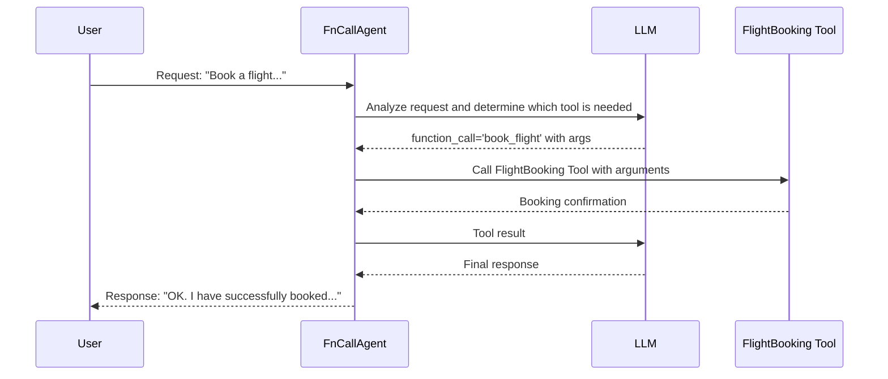

# Chapter 8: FnCallAgent

In the previous chapter, [ReActChat](07_reactchat.md), we explored how Agents can reason and act to solve complex tasks. Now, let's dive into another powerful type of Agent: the **FnCallAgent**.

Imagine you want an Agent to book a flight for you. To do this, the Agent needs to:

1.  Figure out which flight booking tool to use.
2.  Determine the necessary information to pass to the tool (departure city, destination city, date, etc.).
3.  Use the tool with the correct information.
4.  Report the booking confirmation back to you.

The `FnCallAgent` is designed to handle these types of tasks seamlessly! It's specifically designed to use function calling capabilties offered by modern LLMs to orchestrate tasks with tools.

**What is FnCallAgent?**

The `FnCallAgent` is a core Agent type specialized for utilizing function calling capabilities with LLMs. Think of it as a highly skilled function orchestrator that can dynamically call functions (our [Tools](05_tool.md)), pass arguments, and incorporate the results back into the conversation.

**Key Concepts**

Let's break down the key concepts of the `FnCallAgent`:

*   **Function Calling:**  A capability of modern LLMs to understand when and how to use external functions (i.e., our [Tools](05_tool.md)). The LLM can generate a structured request specifying which function to call and with what arguments.
*   **Tool Orchestration:** The `FnCallAgent` manages the process of selecting the right [Tool](05_tool.md), calling it with the correct arguments, and handling the result.
*   **Dynamic Tool Usage:** The agent can decide which tools to use based on the user's input and the current state of the conversation. It's not limited to using a pre-defined set of tools in a specific order.

**Why use FnCallAgent?**

*   **Automation:** Automates tasks by leveraging function calling to create interactive experiences.
*   **Flexibility:** Adapts to different user requests and situations by dynamically choosing the right [Tool](05_tool.md).
*   **Efficiency:** Streamlines the process of using [Tools](05_tool.md) by handling the details of function calling.

**Using FnCallAgent**

Let's see how we can use the `FnCallAgent` to book a flight. We'll assume we have a `FlightBooking` tool that can book flights.

```python
from qwen_agent.agents import FnCallAgent
from qwen_agent.llm import get_chat_model
from qwen_agent.tools import BaseTool
from typing import Union, Dict

# Dummy FlightBooking tool (replace with a real implementation)
class FlightBooking(BaseTool):
    name = "book_flight"
    description = "Books a flight for the user."
    parameters = [
        {"name": "departure_city", "type": "string", "description": "The city to depart from."},
        {"name": "destination_city", "type": "string", "description": "The destination city."},
        {"name": "date", "type": "string", "description": "The date of the flight (YYYY-MM-DD)."},
    ]

    def call(self, params: Union[str, Dict], **kwargs) -> str:
        # In a real implementation, this would call a flight booking API
        return f"Successfully booked flight from {params['departure_city']} to {params['destination_city']} on {params['date']}!"

# 1. Configure your LLM (replace with your actual API key and model name)
llm_config = {
    'model': 'qwen-max', # Replace with your desired model
    'api_key': 'YOUR_DASHSCOPE_API_KEY' # Replace with your actual API key
}

# 2. Get the chat model
llm = get_chat_model(llm_config)

# 3. Create the FnCallAgent
flight_agent = FnCallAgent(llm=llm, function_list=[FlightBooking()])
```

Explanation:

1.  We define a dummy `FlightBooking` tool. In a real application, this would interact with a flight booking API.
2.  We configure the [LLM (BaseChatModel)](04_llm__basechatmodel_.md) (remember to replace `"YOUR_DASHSCOPE_API_KEY"` with your actual API key).
3.  We create an instance of the `FnCallAgent`, passing in the [LLM (BaseChatModel)](04_llm__basechatmodel_.md) and the `FlightBooking` tool.

Now, let's ask the agent to book a flight:

```python
from qwen_agent.llm.schema import Message

# Create a message
message = Message(role='user', content='Book a flight from New York to London on 2024-12-25.')

# Run the agent
response = flight_agent.run_nonstream([message])

print(response)
```

Explanation:

1.  We create a `Message` asking the agent to book a flight.
2.  We call `flight_agent.run_nonstream([message])` to get the agent's response.

The Agent will likely go through the following steps:

1.  **LLM Analysis:** The LLM analyzes the message and determines that the `book_flight` tool should be called. It will also extract the values for `departure_city`, `destination_city`, and `date` from the user's message. The LLM generates a `function_call` Message, specifying the `name` of the tool and arguments to pass.
2.  **Tool Call:** The `FnCallAgent` sees the `function_call` and automatically calls the `FlightBooking` tool with the extracted parameters.
3.  **Result Handling:** The `FlightBooking` tool returns a confirmation message. The `FnCallAgent` then sends a `FUNCTION` message to the LLM indicating the results.
4.  **Final Response:** The LLM combines the tool's result into a final response, such as: "OK. I have successfully booked a flight for you from New York to London on 2024-12-25."

**Under the Hood: How FnCallAgent Works**

Let's take a peek at what happens behind the scenes when you ask the `FnCallAgent` to book a flight:



1.  The `User` sends a request to the `FnCallAgent`.
2.  The `FnCallAgent` uses the [LLM (BaseChatModel)](04_llm__basechatmodel_.md) to analyze the request and determine which [Tool](05_tool.md) is needed.  Crucially, the LLM is now generating structured function calls using the function calling API.
3.  The [LLM (BaseChatModel)](04_llm__basechatmodel_.md) responds with the name of the [Tool](05_tool.md) to use and the parameters to pass to it, encoded within the `function_call` field of the Message.
4.  The `FnCallAgent` calls the appropriate [Tool](05_tool.md) with the specified parameters.
5.  The [Tool](05_tool.md) executes and returns the results to the `FnCallAgent`.
6.  The `FnCallAgent` sends the tool's results back to the [LLM (BaseChatModel)](04_llm__basechatmodel_.md).
7.  The [LLM (BaseChatModel)](04_llm__basechatmodel_.md) generates a final response incorporating the results of the tool call.
8.  The `FnCallAgent` sends the final response back to the `User`.

Let's look at some of the key code. The `FnCallAgent` class is defined in `qwen_agent/agents/fncall_agent.py`. The core function responsible for interacting with the LLM and tools is `_run`. The overall structure is similar to `ReActChat`, but `FnCallAgent` directly leverages LLM's function call feature. This simplifies the process since the tool name and argument parsing is handled by the LLM.

Here's a simplified snippet of what happens inside the `_run` function:

```python
    def _run(self, messages: List[Message], lang: Literal['en', 'zh'] = 'en', **kwargs) -> Iterator[List[Message]]:
        messages = copy.deepcopy(messages)
        num_llm_calls_available = MAX_LLM_CALL_PER_RUN
        response = []
        while True and num_llm_calls_available > 0:
            num_llm_calls_available -= 1

            # Here it's providing the LLM with the tool descriptions.
            output_stream = self._call_llm(messages=messages,
                                           functions=[func.function for func in self.function_map.values()])
            # ... (rest of the code)
            for out in output:
                use_tool, tool_name, tool_args, _ = self._detect_tool(out)
                if use_tool: # If LLM specified a tool call
                    tool_result = self._call_tool(tool_name, tool_args, messages=messages, **kwargs) # Call the tool
                    fn_msg = Message(role=FUNCTION, name=tool_name, content=tool_result) # Put the result into a Message
                    messages.append(fn_msg) # Augment message history
                    response.append(fn_msg) # Append the response
                    yield response
```

Explanation:

1. The agent calls the LLM and *provides the tool descriptions*.
2. The `_detect_tool` method is used to determine if the LLM has requested to call a tool. This is done by inspecting the `function_call` attribute of the Message.
3. The `_call_tool` method is used to call the specified tool.
4. A `Message` is created with the `role` as `FUNCTION` and the `content` as the tool's result. This message is then added to the conversation history, so the LLM can see the results of the tool call in subsequent turns.

You can also see the base class for LLMs that support function calls `BaseFnCallModel` from `qwen_agent/llm/function_calling.py`.

**Conclusion**

In this chapter, you've learned about the `FnCallAgent`, which is specialized in utilizing function calling capabilities of modern LLMs. You've seen how it can dynamically call functions (our [Tools](05_tool.md)), pass arguments, and incorporate the results back into the conversation. The `FnCallAgent` is a powerful tool for automating tasks and building interactive experiences.

Now that we've covered the core agent types, we can explore more advanced topics such as multi-agent systems and agent deployment.


---

Generated by [AI Codebase Knowledge Builder](https://github.com/The-Pocket/Tutorial-Codebase-Knowledge)