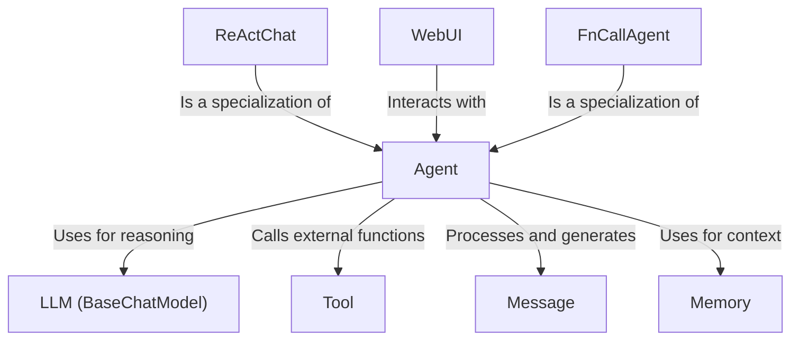

# Tutorial: Qwen-Agent

Qwen-Agent is a project that helps you build intelligent systems using **Agents**. These Agents can use various *Tools* and *LLMs* to understand requests, reason about them, and generate responses. The project provides a graphical interface (WebUI) for easy interaction with these Agents.

**Source Repository:** [https://github.com/QwenLM/Qwen-Agent](https://github.com/QwenLM/Qwen-Agent)

## Chapters

1. [Agent](01_agent.md)
2. [WebUI](02_webui.md)
3. [Message](03_message.md)
4. [LLM (BaseChatModel)](04_llm__basechatmodel_.md)
5. [Tool](05_tool.md)
6. [Memory](06_memory.md)
7. [ReActChat](07_reactchat.md)
8. [FnCallAgent](08_fncallagent.md)

---

Generated by [AI Codebase Knowledge Builder](https://github.com/The-Pocket/Tutorial-Codebase-Knowledge)