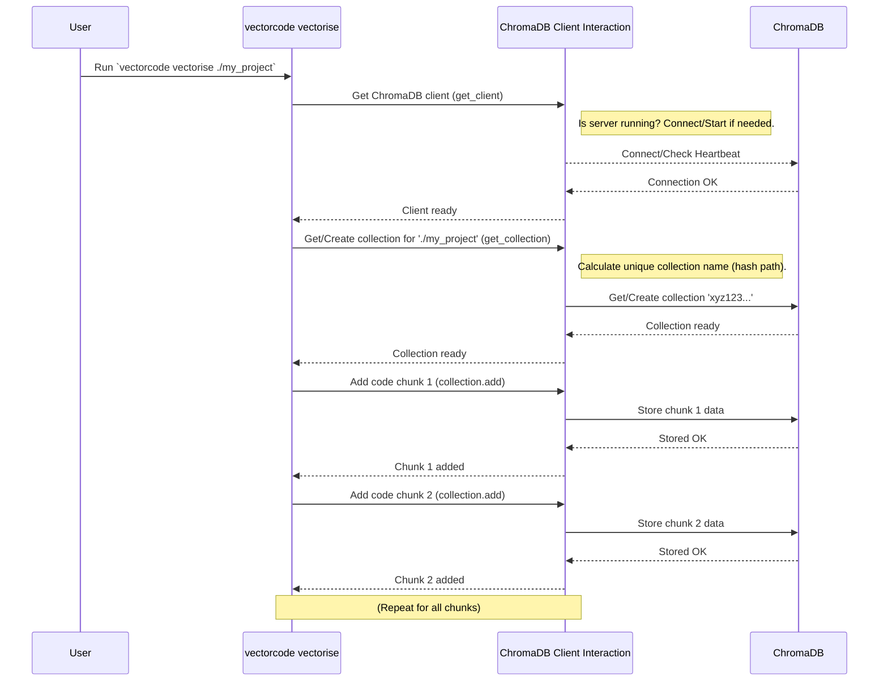

# Chapter 1: ChromaDB Client Interaction

Welcome to the VectorCode tutorial! This is the very first chapter, and we'll start by looking at how VectorCode talks to its "memory" - a special kind of database called ChromaDB.

Imagine you have a huge library full of books, but instead of books, it's filled with tiny pieces of your code. How would you find a specific piece, add new ones, or remove outdated ones? You'd need a librarian!

In VectorCode, the **ChromaDB Client Interaction** component acts like this librarian. Its job is to manage the connection to the ChromaDB database (our code library) and handle all the tasks like storing, finding, updating, and removing code information.

## Why Do We Need This?

Think about what VectorCode does: it helps you find relevant code snippets based on your search query. To do this, it first needs to:

1.  **Store:** Break down your project's code into smaller, meaningful pieces (we'll cover this in [Chapter 2: Code Chunking](02_code_chunking_.md)).
2.  **Remember:** Convert these pieces into a format the database understands (called embeddings or vectors) and save them in ChromaDB.
3.  **Search:** When you ask a question (like "show me code about database connections"), it needs to ask ChromaDB to find the stored code pieces that are most similar to your question.

The ChromaDB Client Interaction module handles steps 2 and 3, acting as the bridge between VectorCode's logic and the ChromaDB database.

## Key Ideas: Talking to the Library

Let's break down the main jobs of our "librarian":

1.  **Getting a Connection (`get_client`):** Before doing anything, we need to establish a connection to the ChromaDB library. This is like getting the librarian's attention or picking up the phone to call the library. Sometimes, if the library isn't open (the ChromaDB server isn't running), VectorCode might even start a local, temporary version for you!
2.  **Finding the Right Bookshelf (`get_collection`):** Inside the library, code from different projects is kept on separate "bookshelves" called *collections*. Each project folder usually gets its own collection. This function helps find the specific collection for your current project or create a new one if it doesn't exist. The name of the collection is cleverly generated based on your username, computer name, and the project's full path to keep things organized and unique.
3.  **Adding Books (`collection.add`):** When you add new code to your project or analyze it for the first time, VectorCode needs to store the code snippets (embeddings) in the correct collection. This function handles adding these "books" to the shelf.
4.  **Searching for Books (`collection.query`):** This is the core of finding relevant code. When you ask VectorCode a question, this function is used to search the project's collection for code snippets that best match your query.
5.  **Removing Books (`collection.delete`, `client.delete_collection`):** Sometimes code gets deleted, or you might want to remove the entire collection for a project. These functions handle removing specific snippets or entire collections.

## How VectorCode Uses the "Librarian"

You don't usually call the librarian functions directly. Instead, you use VectorCode commands, and *they* use the librarian behind the scenes.

*   **`vectorcode vectorise ./my_project`**: This command tells VectorCode to analyze the code in `my_project`.
    *   It uses `get_client` to connect to ChromaDB.
    *   It uses `get_collection` to find or create a collection for `./my_project`.
    *   It breaks the code into pieces (more in [Chapter 2: Code Chunking](02_code_chunking_.md)) and uses `collection.add` to store them.
*   **`vectorcode query "database connection logic"`**: This asks VectorCode to find relevant code.
    *   It uses `get_client` to connect.
    *   It uses `get_collection` to find the right project collection.
    *   It uses `collection.query` to search for snippets matching "database connection logic".
*   **`vectorcode update ./my_project`**: This updates the stored information for `my_project`.
    *   It connects (`get_client`) and gets the collection (`get_collection`).
    *   It checks which files have changed or been deleted.
    *   It uses `collection.add` to update or add embeddings and `collection.delete` to remove info for deleted files.
*   **`vectorcode ls`**: Lists the projects VectorCode knows about.
    *   It connects (`get_client`) and uses internal functions (`get_collections`) to ask ChromaDB about all the collections managed by VectorCode.
*   **`vectorcode drop ./my_project`**: Removes all stored information for `my_project`.
    *   It connects (`get_client`) and uses `get_collection` to find the collection, then `client.delete_collection` to remove it entirely.

These commands are orchestrated as described in [Chapter 3: CLI Command Orchestration](03_cli_command_orchestration_.md).

## Under the Hood: A Peek Inside

Let's see how the librarian actually works, step-by-step. Imagine you run `vectorcode vectorise ./my_project`.



This diagram shows the flow: the command asks the Client Interaction module to get things done, and the module talks to the actual ChromaDB database.

### Diving into the Code (Simplified)

Let's look at simplified versions of the key functions from `src/vectorcode/common.py`.

**1. Getting the Client (`get_client`)**

```python
# src/vectorcode/common.py
import chromadb
from chromadb.api import AsyncClientAPI
from chromadb.config import Settings
# ... other imports

# A cache to avoid reconnecting constantly
__CLIENT_CACHE: dict[tuple[str, int], AsyncClientAPI] = {}

async def get_client(configs: Config) -> AsyncClientAPI:
    # Use configured host and port, or defaults
    host = configs.host or "localhost"
    port = configs.port or 8000
    client_entry = (host, port)

    # If we haven't connected to this host/port before...
    if __CLIENT_CACHE.get(client_entry) is None:
        # ...try to connect
        print(f"Connecting to ChromaDB at {host}:{port}...")
        # Settings like turning off telemetry
        settings = {"anonymized_telemetry": False}
        # Create the actual client connection object
        __CLIENT_CACHE[client_entry] = await chromadb.AsyncHttpClient(
            host=host,
            port=port,
            settings=Settings(**settings),
        )
        print("Connected!")
    # Return the cached or newly created client
    return __CLIENT_CACHE[client_entry]
```

This function checks if we already have a connection (`__CLIENT_CACHE`). If not, it creates a new connection using `chromadb.AsyncHttpClient` with the host and port from the configuration and saves it in the cache for next time. It also configures some basic settings.

*(Self-Starting Server Note: The actual code also includes logic in `start_server` and `wait_for_server` to try and launch a local ChromaDB instance using `asyncio.create_subprocess_exec` if it can't connect, but that's a more advanced detail.)*

**2. Getting the Collection Name (`get_collection_name`)**

```python
# src/vectorcode/common.py
import hashlib
import os
import socket
# ... other imports

def get_collection_name(full_path: str) -> str:
    # Ensure we have the absolute, full path
    full_path = os.path.abspath(full_path)
    # Create a unique identifier string
    plain_collection_name = f"{os.environ.get('USER', 'unknown_user')}@{socket.gethostname()}:{full_path}"
    # Use SHA-256 hashing to create a short, fixed-length ID
    hasher = hashlib.sha256()
    hasher.update(plain_collection_name.encode())
    # ChromaDB names have length limits, so we truncate
    collection_id = hasher.hexdigest()[:63]
    print(f"Project path '{full_path}' maps to collection name '{collection_id}'")
    return collection_id
```

This function takes the project's full path (e.g., `/home/user/my_project`) and combines it with your username and computer name to create a unique string. It then uses a standard hashing algorithm (SHA-256) to turn this potentially long string into a shorter, unique ID suitable for ChromaDB. This ensures that the collection for `/home/user/my_project` on your machine is distinct from a project with the same name elsewhere.

**3. Getting the Collection (`get_collection`)**

```python
# src/vectorcode/common.py
from chromadb.api import AsyncClientAPI
from chromadb.api.models.AsyncCollection import AsyncCollection
# ... other imports

# Cache for collections too
__COLLECTION_CACHE: dict[str, AsyncCollection] = {}

async def get_collection(
    client: AsyncClientAPI, configs: Config, make_if_missing: bool = False
) -> AsyncCollection:
    full_path = os.path.abspath(str(configs.project_root))

    # If we haven't accessed this collection before in this session...
    if __COLLECTION_CACHE.get(full_path) is None:
        # ...get its unique name
        collection_name = get_collection_name(full_path)
        # Get the embedding function (how code is turned into numbers)
        embedding_function = get_embedding_function(configs)
        # Prepare metadata (info about the collection)
        collection_meta = {
            "path": full_path,
            "hostname": socket.gethostname(),
            "created-by": "VectorCode",
            # ... other metadata
        }

        if not make_if_missing:
            # Just try to get it, error if it doesn't exist
            print(f"Getting existing collection: {collection_name}")
            collection = await client.get_collection(
                collection_name, embedding_function
            )
        else:
            # Get it, OR create it if it doesn't exist
            print(f"Getting or Creating collection: {collection_name}")
            collection = await client.get_or_create_collection(
                collection_name,
                metadata=collection_meta,
                embedding_function=embedding_function,
            )
            # (Includes checks to prevent accidental collisions)

        # Cache the result
        __COLLECTION_CACHE[full_path] = collection
    # Return the cached or newly retrieved collection object
    return __COLLECTION_CACHE[full_path]
```

This function first checks its cache (`__COLLECTION_CACHE`). If the collection isn't cached, it calculates the unique name using `get_collection_name`. Then, depending on `make_if_missing`, it either fetches an existing collection (`client.get_collection`) or fetches/creates one (`client.get_or_create_collection`). It also stores important metadata with the collection, like the original project path.

**4. Adding Data (Conceptual)**

When `vectorcode vectorise` runs, after getting the collection, it uses code similar to this (simplified from `src/vectorcode/subcommands/vectorise.py`'s `chunked_add`):

```python
# Conceptual example based on vectorise.py
import uuid

async def add_data_example(collection: AsyncCollection, file_path: str, chunk_text: str, start_line: int, end_line: int):
    # Each item needs a unique ID
    item_id = uuid.uuid4().hex
    # The actual text content of the code chunk
    document = chunk_text
    # Metadata associated with this chunk
    metadata = {
        "path": file_path,
        "start": start_line,
        "end": end_line
    }
    print(f"Adding chunk from {file_path} (lines {start_line}-{end_line}) to collection '{collection.name}'")
    # The actual call to add to ChromaDB
    await collection.add(
        ids=[item_id],      # List of unique IDs
        documents=[document], # List of text contents
        metadatas=[metadata]  # List of metadata dicts
    )
    print("Chunk added.")
```

This shows the core `collection.add` method. You provide unique IDs for each piece of data, the text content (`documents`), and any helpful extra information (`metadatas`) like the file path and line numbers. ChromaDB then takes care of converting the `documents` into embeddings (using the configured embedding function) and storing everything.

**5. Querying Data (Conceptual)**

When `vectorcode query` runs, it uses code similar to this (simplified from `src/vectorcode/subcommands/query/__init__.py`):

```python
# Conceptual example based on query/__init__.py

async def query_data_example(collection: AsyncCollection, query_text: str, num_results: int):
    print(f"Querying collection '{collection.name}' for: '{query_text}'")
    results = await collection.query(
        query_texts=[query_text],  # The search query/queries
        n_results=num_results,     # How many results to return
        include=["metadatas", "documents", "distances"] # What info to include in results
        # Can also add 'where' filters here, e.g., where={"path": "specific_file.py"}
    )
    print(f"Found {len(results.get('ids', [[]])[0])} results.")
    # The 'results' object contains IDs, documents, metadata, and distances (similarity scores)
    return results
```

This uses `collection.query`. You give it your search text (`query_texts`), how many results you want (`n_results`), and what information you need back (`include`). ChromaDB finds the stored documents most similar to your query text and returns them, along with their metadata and a "distance" score indicating how similar they are.

## Conclusion

You've learned about the crucial role of the **ChromaDB Client Interaction** module in VectorCode. It's the librarian that manages our code library (ChromaDB), handling connections, finding project-specific collections (bookshelves), and adding, retrieving, and deleting code information (books). We saw how common VectorCode commands rely on this module and got a glimpse into the underlying functions like `get_client`, `get_collection`, `collection.add`, and `collection.query`.

Understanding this interaction is the first step to seeing how VectorCode "remembers" your code. Next, we'll explore *how* VectorCode prepares the code before giving it to the librarian – the process of breaking large code files into smaller, manageable chunks.

Ready to dive deeper? Let's move on to [Chapter 2: Code Chunking](02_code_chunking_.md).

---

Generated by [AI Codebase Knowledge Builder](https://github.com/The-Pocket/Tutorial-Codebase-Knowledge)