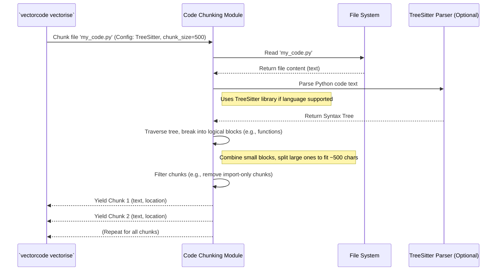

# Chapter 2: Code Chunking

Welcome back! In [Chapter 1: ChromaDB Client Interaction](01_chromadb_client_interaction_.md), we learned how VectorCode uses ChromaDB as its "memory" to store and retrieve code information, acting like a librarian for our code library.

But how does the code get *prepared* before being handed over to the librarian? Imagine you have a very long book (your source code file) that you want to analyze or translate. Processing the entire book at once is difficult! It's much easier to break it down into smaller, manageable parts like paragraphs or sentences.

This is exactly what **Code Chunking** does in VectorCode!

## Why Do We Need to Chunk Code?

VectorCode needs to understand your code to find relevant snippets when you search. It does this by converting pieces of code into special numerical representations called "embeddings" (think of them as summaries in number form) and storing them in ChromaDB.

However, these embeddings work best on relatively small pieces of text. If you try to create an embedding for an entire massive code file, the meaning gets diluted. It's like trying to summarize a whole novel in one sentence – you lose too much detail!

**Code Chunking** solves this by breaking down large source code files into smaller, meaningful pieces (chunks). These smaller chunks can then be converted into more accurate embeddings, making the search process much more effective.

Think of it like preparing a large document for translation:

1.  You have a big document (your code file).
2.  You break it into paragraphs or sections (chunks).
3.  You translate each chunk individually (convert to embeddings).
4.  You store these translated chunks (store embeddings in ChromaDB).

Sometimes, you might also want to skip certain parts of the document, like standard copyright notices or automatically generated sections (filtering chunks). The Code Chunking module handles both breaking down the code and potentially filtering out irrelevant parts.

## Key Ideas: How We Break Down Code

VectorCode uses a few different strategies for chunking:

1.  **Fixed-Size Chunking:**
    *   **Analogy:** Imagine cutting a long ribbon into pieces that are exactly 10cm long, maybe with a small overlap between pieces.
    *   **How it works:** This is the simplest method. It just cuts the code text into chunks of a predefined character length (e.g., 500 characters). It might also overlap the chunks slightly (e.g., the last 50 characters of chunk 1 are the first 50 characters of chunk 2) to avoid cutting off important information right at the boundary.
    *   **Pros:** Very simple and fast.
    *   **Cons:** It doesn't understand code structure. It might cut a function or a class right in the middle, which isn't ideal for understanding the code's meaning.

2.  **Syntax-Aware Chunking (using TreeSitter):**
    *   **Analogy:** Instead of cutting the ribbon every 10cm, you cut it at logical points, like the end of a sentence or paragraph in a text document. For code, this means cutting at the end of functions, classes, or logical blocks.
    *   **How it works:** This method uses a powerful tool called TreeSitter. TreeSitter understands the grammar and structure of many programming languages (like Python, Java, JavaScript, etc.). It builds a "syntax tree" representing the code's structure. VectorCode then walks this tree to break the code into chunks that align with logical code blocks (like functions, classes, or smaller logical units).
    *   **Pros:** Creates much more meaningful chunks that respect the code's structure. This leads to better embeddings and search results.
    *   **Cons:** More complex and slightly slower than fixed-size chunking. Requires TreeSitter parsers for the specific language.

3.  **Filtering:**
    *   **Analogy:** When preparing your document, you decide to skip the cover page and the table of contents because they aren't relevant to the main content.
    *   **How it works:** VectorCode allows you to define patterns (using regular expressions) to identify chunks that should be ignored. For example, you might configure it to skip chunks that consist only of import statements or large comment blocks. This keeps the database focused on the most relevant code logic.

## How VectorCode Uses Chunking

Chunking happens *before* the code information is stored in ChromaDB. When you run a command like `vectorcode vectorise ./my_project`, the process looks like this:

1.  VectorCode finds the code files to process (e.g., `my_app.py`).
2.  For each file, it calls the **Code Chunking** module.
3.  The chunking module reads the file content.
4.  It uses the configured strategy (e.g., TreeSitter for Python) to break the file into chunks.
5.  It might filter out some chunks based on defined patterns.
6.  These resulting chunks are then passed to the [ChromaDB Client Interaction](01_chromadb_client_interaction_.md) module, which converts them into embeddings and adds them to the database using `collection.add`.

This whole process is managed by the commands you run, as we'll see in [Chapter 3: CLI Command Orchestration](03_cli_command_orchestration_.md).

## Under the Hood: A Peek Inside

Let's see the steps involved when the chunking module processes a file.



This diagram shows that the command asks the Chunker to process a file. The Chunker reads the file, potentially uses a Parser (like TreeSitter) to understand its structure, breaks it down smartly, filters if needed, and then returns the chunks one by one.

### Diving into the Code (Simplified)

Let's look at simplified versions of the key parts from `src/vectorcode/chunking.py`.

**1. The `Chunk` Data Structure**

First, we need a way to represent a chunk. It's not just the text; we also want to know where it came from in the original file.

```python
# src/vectorcode/chunking.py
from dataclasses import dataclass
from tree_sitter import Point # Represents (row, column)

@dataclass
class Chunk:
    """Represents a piece of code, knowing its text and location."""
    text: str      # The actual code text of the chunk
    start: Point   # The starting position (row, col) in the original file
    end: Point     # The ending position (row, col) in the original file

    def __str__(self): # Make it easy to print the chunk's text
        return self.text
```

This simple `Chunk` object holds the `text` of the chunk and its `start` and `end` positions (using `Point` objects which store row and column numbers).

**2. Simple `StringChunker`**

This is the basic fixed-size chunker.

```python
# src/vectorcode/chunking.py
from vectorcode.cli_utils import Config # For settings like chunk_size

class StringChunker: # Simplified version
    def __init__(self, config: Config):
        self.config = config
        # Calculate step size based on chunk_size and overlap_ratio
        self.step_size = max(1, int(config.chunk_size * (1 - config.overlap_ratio)))

    def chunk(self, data: str): # Takes the entire file content as a string
        print(f"Using simple StringChunker (size={self.config.chunk_size})...")
        i = 0
        while i < len(data):
            # Get the next piece of text
            chunk_text = data[i : i + self.config.chunk_size]
            # Create a Chunk object (simplified position tracking here)
            yield Chunk(
                text=chunk_text,
                start=Point(row=1, column=i), # Simplified row/col
                end=Point(row=1, column=i + len(chunk_text) - 1) # Simplified row/col
            )
            # Stop if we reached the end
            if i + self.config.chunk_size >= len(data):
                break
            # Move forward by step_size (allows for overlap)
            i += self.step_size
```

This chunker iterates through the input `data` string, grabbing pieces of `chunk_size` length. The `step_size` determines how much it moves forward for the next chunk, allowing for overlap if `overlap_ratio` is greater than 0 in the `Config`.

**3. Smarter `TreeSitterChunker` (Conceptual)**

This uses TreeSitter for syntax-aware chunking. The actual implementation is more complex, but the core idea is:

```python
# src/vectorcode/chunking.py
from tree_sitter_language_pack import get_parser # Finds TreeSitter parsers
from tree_sitter import Node # Represents a node in the syntax tree
# ... other imports

class TreeSitterChunker: # Simplified concept
    def __init__(self, config: Config):
        self.config = config

    def chunk(self, file_path: str): # Takes the file path
        print(f"Using smart TreeSitterChunker for {file_path}...")
        # 1. Read the file content
        with open(file_path, encoding=self.config.encoding) as f:
            content_bytes = f.read().encode()

        # 2. Guess the language and get the TreeSitter parser
        parser = None
        language = self._guess_language(file_path, content_bytes.decode())
        if language:
            try:
                parser = get_parser(language) # e.g., get 'python' parser
                print(f"Found TreeSitter parser for: {language}")
            except LookupError:
                print(f"No TreeSitter parser found for {language}.")

        # 3. If no parser, fallback to simple chunking
        if parser is None:
            print("Falling back to StringChunker.")
            yield from StringChunker(self.config).chunk(content_bytes.decode())
            return

        # 4. Parse the code into a syntax tree
        tree = parser.parse(content_bytes)

        # 5. Walk the tree to generate chunks (Complex part, simplified)
        # This function recursively traverses the tree, combining small nodes
        # and splitting large ones to respect syntax and chunk size.
        print("Traversing syntax tree to create chunks...")
        yield from self._chunk_node_recursively(tree.root_node, content_bytes)

        # (Filtering based on config.chunk_filters would happen here too)

    def _guess_language(self, file_path: str, content: str) -> str | None:
        # ... logic to guess language (e.g., based on file extension) ...
        # (Returns 'python', 'javascript', etc., or None)
        if file_path.endswith(".py"): return "python"
        return None # Placeholder

    def _chunk_node_recursively(self, node: Node, text_bytes: bytes):
        # --- VERY SIMPLIFIED ---
        # Actual logic is complex: it looks at child nodes, combines them
        # if they fit within chunk_size, splits nodes that are too large,
        # and yields Chunk objects with correct start/end points.
        node_text = text_bytes[node.start_byte:node.end_byte].decode()
        if len(node_text) < self.config.chunk_size * 1.5: # Example condition
             # Yield simple chunk if node is reasonably sized
             yield Chunk(text=node_text, start=node.start_point, end=node.end_point)
        else:
             # If node too big, recursively call on its children
             for child in node.children:
                 yield from self._chunk_node_recursively(child, text_bytes)
        # --- END SIMPLIFIED ---
```

This chunker first tries to find a TreeSitter `parser` for the file's language. If successful, it parses the code into a `tree`. Then, a (complex, but here simplified) recursive function `_chunk_node_recursively` walks this tree, intelligently creating `Chunk` objects based on the code structure (like functions or classes) while trying to respect the `chunk_size` from the `Config`. If no parser is found, it falls back to the simpler `StringChunker`.

**4. Configuration (`Config`)**

The chunking behavior is controlled by settings in the `Config` object (from `src/vectorcode/cli_utils.py`), loaded from configuration files or command-line arguments:

```python
# src/vectorcode/cli_utils.py (relevant fields)
@dataclass
class Config:
    # ... other settings ...
    chunk_size: int = 2500 # Target size for chunks (chars/bytes)
                           # -1 means don't chunk (treat whole file as one chunk)
    overlap_ratio: float = 0.2 # How much chunks should overlap (0.0 to < 1.0)
                               # Used mainly by StringChunker
    chunk_filters: dict[str, list[str]] = field(default_factory=dict)
                           # Patterns to filter out chunks
                           # e.g., {"python": ["^import ", "^from "]}
    encoding: str = "utf8" # File encoding to use ('_auto' for detection)
    # ... other settings ...
```

These settings allow users to fine-tune how chunking works, like setting the target `chunk_size`, the `overlap_ratio` for simple chunking, or defining `chunk_filters` to ignore certain types of code blocks (like import statements in Python).

**5. Usage in `vectorise` command**

The `vectorise` command puts it all together (simplified from `src/vectorcode/subcommands/vectorise.py`):

```python
# src/vectorcode/subcommands/vectorise.py (simplified flow)
from vectorcode.chunking import TreeSitterChunker, Chunk
from vectorcode.common import get_collection # From Chapter 1
from vectorcode.cli_utils import Config

async def vectorise(configs: Config):
    # ... setup: get ChromaDB client and collection ...
    collection = await get_collection(...)
    files_to_process = configs.files # Get list of files from config

    # Create the chunker based on config (usually TreeSitter)
    chunker = TreeSitterChunker(configs)

    all_chunks_to_add = []
    all_metadatas = []
    all_ids = []

    print("Starting chunking process...")
    for file_path in files_to_process:
        try:
            # Process each file using the chunker
            file_chunks = list(chunker.chunk(str(file_path)))

            if not file_chunks: continue # Skip empty files

            print(f"Got {len(file_chunks)} chunks from {file_path}")
            for chunk in file_chunks:
                if isinstance(chunk, Chunk):
                    all_chunks_to_add.append(chunk.text)
                    # Metadata includes path and line numbers
                    metadata = {
                        "path": str(file_path),
                        "start": chunk.start.row + 1, # Adjust to 1-based index
                        "end": chunk.end.row + 1
                    }
                    all_metadatas.append(metadata)
                    all_ids.append(uuid.uuid4().hex) # Generate unique ID

        except Exception as e:
            print(f"Error chunking {file_path}: {e}")

    # Add all collected chunks to ChromaDB in batches
    print(f"Adding {len(all_chunks_to_add)} total chunks to ChromaDB...")
    # (Batching logic omitted for simplicity)
    if all_chunks_to_add:
        await collection.add(
            ids=all_ids,
            documents=all_chunks_to_add,
            metadatas=all_metadatas
        )
    print("Vectorising complete.")
```

The `vectorise` function iterates through the files, uses the `TreeSitterChunker` (which might fallback to `StringChunker`) to get `Chunk` objects for each file. It collects the text and metadata (like path and line numbers) from these chunks and then uses `collection.add` (from the [ChromaDB Client Interaction](01_chromadb_client_interaction_.md) module) to store them in the database.

## Conclusion

You've now learned about **Code Chunking**, the essential step VectorCode takes to prepare your code before storing it. We saw why breaking down large files is necessary (better embeddings, better search) and explored different methods like simple fixed-size chunking and the smarter, syntax-aware TreeSitter chunking. We also touched upon filtering out irrelevant chunks.

Chunking ensures that the information stored in ChromaDB is granular and meaningful, making VectorCode's search capabilities much more powerful.

Now that we know how code is stored ([Chapter 1: ChromaDB Client Interaction](01_chromadb_client_interaction_.md)) and how it's prepared for storage (this chapter), let's look at how the different user commands like `vectorise` and `query` actually manage these steps and interact with the user.

Next up: [Chapter 3: CLI Command Orchestration](03_cli_command_orchestration_.md)!

---

Generated by [AI Codebase Knowledge Builder](https://github.com/The-Pocket/Tutorial-Codebase-Knowledge)