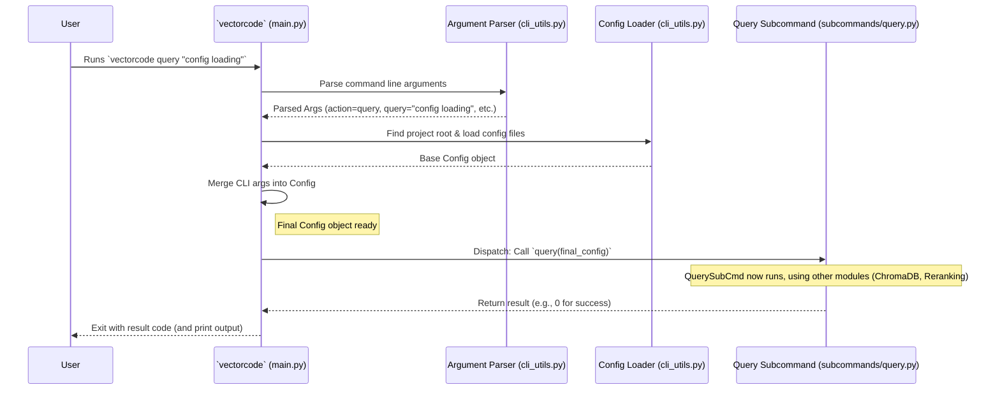

# Chapter 3: CLI Command Orchestration

Welcome back! In the previous chapters, we explored how VectorCode remembers your code using [Chapter 1: ChromaDB Client Interaction](01_chromadb_client_interaction_.md) and how it prepares the code for storage using [Chapter 2: Code Chunking](02_code_chunking_.md).

Now, let's zoom out a bit. When you type a command like `vectorcode query "database functions"` in your terminal, how does VectorCode figure out *what* you want to do and *how* to do it? How does it know to run the `query` logic and not the `vectorise` logic?

This is where **CLI Command Orchestration** comes in. It's the brain of the command-line tool, responsible for understanding your request and making sure the right part of VectorCode handles it.

## Why Do We Need This? The Reception Desk Analogy

Imagine VectorCode is a big company with different departments:

*   A department for adding new code to the database (`vectorise`)
*   A department for searching the database (`query`)
*   A department for listing projects (`ls`)
*   A department for cleaning up (`drop`, `clean`)
*   And so on...

When you arrive at the company (run a `vectorcode` command), you don't just wander around hoping to find the right place. You go to the **reception desk**.

The **CLI Command Orchestration** module is VectorCode's reception desk. Its job is to:

1.  **Listen to the Visitor:** Understand what command you typed (e.g., `vectorcode`, `query`, `"database functions"`).
2.  **Check the Visitor's ID:** Parse the command-line arguments you provided (like the query text, or options like `-n 5` for number of results).
3.  **Prepare Necessary Paperwork:** Load any required configuration settings (like where the database is located). We'll learn more about this in [Chapter 5: Configuration Management](05_configuration_management_.md).
4.  **Direct the Visitor:** Based on the command (e.g., `query`), send you (the command) to the correct department (the specific code module that handles querying).

Without this central orchestration, running VectorCode commands would be chaotic! It ensures everything is set up correctly before the real work begins.

## Key Ideas: How the Reception Desk Works

Let's break down the main tasks of the orchestrator:

1.  **Argument Parsing:** When you run `vectorcode query "find users" -n 3 --project_root ./my_api`, the orchestrator needs to figure out:
    *   The main action: `query`
    *   The query text: `"find users"`
    *   An option: `-n 3` (meaning get 3 results)
    *   Another option: `--project_root ./my_api` (specifying the project)
    It uses standard Python tools (like `argparse`) to break down your command into these structured pieces.
2.  **Configuration Loading:** VectorCode might need settings like the address of the ChromaDB server or the preferred way to chunk code. The orchestrator loads these settings from configuration files and merges them with any settings you provided directly on the command line. This creates a complete set of instructions (`Config` object). See [Chapter 5: Configuration Management](05_configuration_management_.md) for more details.
3.  **Determining the Project Root:** Many VectorCode commands operate on a specific project. The orchestrator automatically tries to find the root directory of your project (e.g., by looking for a `.git` or `.vectorcode` folder) if you don't specify it explicitly.
4.  **Dispatching:** Once the action (like `query`) is known and the configuration is ready, the orchestrator calls the specific Python function responsible for handling that action, passing it the necessary configuration and arguments.

## How VectorCode Uses the Orchestrator

You don't interact with the orchestrator directly; it's the very first piece of VectorCode that runs when you type `vectorcode` in your terminal.

1.  **You type:** `vectorcode vectorise ./my_code -r`
2.  **OS Runs:** `src/vectorcode/main.py`
3.  **Orchestrator (`main.py` + `cli_utils.py`) wakes up:**
    *   Parses the command: action=`vectorise`, path=`./my_code`, option=`-r` (recursive).
    *   Finds the project root (maybe it's the current directory).
    *   Loads configuration (global, project-local, command-line).
    *   Sees the action is `vectorise`.
4.  **Orchestrator calls:** The `vectorise` function (from `src/vectorcode/subcommands/vectorise.py`), passing it the final configuration.
5.  **`vectorise` function runs:** It uses [Chapter 2: Code Chunking](02_code_chunking_.md) and [Chapter 1: ChromaDB Client Interaction](01_chromadb_client_interaction_.md) to do its job.

## Under the Hood: Following a Command's Journey

Let's trace the path of a command like `vectorcode query "config loading"`:



This diagram shows the flow:
1.  The user runs the command.
2.  The main entry point (`main.py`) uses the Argument Parser (`cli_utils.py`) to understand the command.
3.  It then uses the Config Loader (`cli_utils.py`) to gather settings.
4.  It merges command-line arguments into the configuration.
5.  Finally, it identifies the correct subcommand (`query`) and calls its function, passing the complete configuration.

### Diving into the Code (Simplified)

Let's look at the key files involved.

**1. The Entry Point (`src/vectorcode/main.py`)**

This is where everything starts. Python runs this file when you type `vectorcode`.

```python
# src/vectorcode/main.py
import asyncio
import logging
import os
import sys
# Import helper functions for parsing and config
from vectorcode.cli_utils import (
    CliAction,
    parse_cli_args,
    find_project_root,
    get_project_config,
)
# Import the actual subcommand functions
from vectorcode import subcommands # This imports functions like query, vectorise etc.

logger = logging.getLogger(__name__)

async def async_main(): # Main logic runs asynchronously
    # 1. Parse Arguments: Understand what the user typed
    cli_args = await parse_cli_args()
    logger.info("Collected CLI arguments: %s", cli_args)

    # 2. Determine Project Root (if not specified)
    if cli_args.project_root is None:
        cwd = os.getcwd()
        # Try finding .vectorcode or .git, otherwise use current dir
        cli_args.project_root = (
            find_project_root(cwd, ".vectorcode")
            or find_project_root(cwd, ".git")
            or cwd
        )
    logger.info(f"Project root is set to {cli_args.project_root}")

    # 3. Load Configuration: Get settings from files and merge CLI args
    try:
        base_config = await get_project_config(cli_args.project_root)
        final_configs = await base_config.merge_from(cli_args)
    except IOError as e:
        print(f"Error loading configuration: {e}", file=sys.stderr)
        return 1 # Exit with an error code
    logger.info("Final configuration has been built: %s", final_configs)

    # (Simplified: Optional server starting logic omitted here)

    # 4. Dispatch to Subcommand: Call the right function
    return_val = 0
    try:
        # Use the 'action' determined during parsing to choose the function
        match final_configs.action:
            case CliAction.query:
                return_val = await subcommands.query(final_configs)
            case CliAction.vectorise:
                return_val = await subcommands.vectorise(final_configs)
            case CliAction.ls:
                return_val = await subcommands.ls(final_configs)
            case CliAction.drop:
                return_val = await subcommands.drop(final_configs)
            # ... cases for all other commands ...
            case _: # Should not happen if parsing is correct
                print(f"Unknown action: {final_configs.action}", file=sys.stderr)
                return_val = 1
    except Exception as e:
        # Handle errors during subcommand execution
        print(f"Error executing command: {e}", file=sys.stderr)
        logger.error(traceback.format_exc())
        return_val = 1
    finally:
        # (Simplified: Optional server shutdown logic omitted here)
        return return_val # Return success (0) or failure code

def main(): # The actual function called when the script runs
    # Setup logging first
    # config_logging("vectorcode") # (Setup details omitted)
    # Run the asynchronous main function
    return asyncio.run(async_main())

if __name__ == "__main__": # If the script is run directly...
    sys.exit(main()) # ...call main() and exit with its return code.
```

This `main.py` orchestrates the whole process: parse arguments (`parse_cli_args`), find the project root, load and finalize configuration (`get_project_config`, `merge_from`), and then use a `match` statement on the `action` to call the correct function from the `vectorcode.subcommands` module (like `subcommands.query` or `subcommands.vectorise`).

**2. Argument Parsing (`src/vectorcode/cli_utils.py`)**

This file defines how to understand the command-line arguments.

```python
# src/vectorcode/cli_utils.py
import argparse
from enum import Enum
from dataclasses import dataclass
# ... other imports

class CliAction(Enum): # Defines the possible main commands
    vectorise = "vectorise"
    query = "query"
    drop = "drop"
    ls = "ls"
    # ... other actions ...

@dataclass # A simple structure to hold parsed arguments temporarily
class Config: # (Simplified version for illustration)
    action: Optional[CliAction] = None
    project_root: Optional[str] = None
    files: list[str] = field(default_factory=list)
    query: Optional[list[str]] = None
    n_result: int = 1
    # ... many other fields exist in the real Config ...

def get_cli_parser(): # Function to create the argument parser
    main_parser = argparse.ArgumentParser(description="VectorCode CLI")
    subparsers = main_parser.add_subparsers(dest="action", required=True)

    # Define the 'query' subcommand and its specific arguments
    query_parser = subparsers.add_parser("query", help="Search the database")
    query_parser.add_argument("query", nargs="+", help="Query text")
    query_parser.add_argument("-n", "--number", type=int, default=1, help="Num results")
    query_parser.add_argument("--project_root", help="Project root directory")

    # Define the 'vectorise' subcommand and its arguments
    vectorise_parser = subparsers.add_parser("vectorise", help="Add code to DB")
    vectorise_parser.add_argument("file_paths", nargs="*", help="Files to add")
    vectorise_parser.add_argument("--project_root", help="Project root directory")
    # ... add arguments for other subcommands (ls, drop, etc.) ...

    return main_parser

async def parse_cli_args(): # Function called by main.py
    parser = get_cli_parser()
    # Parse the actual arguments provided by the user (like sys.argv)
    args = parser.parse_args() # e.g. args.action='query', args.query=['hello']

    # Convert parsed args into our internal Config structure (simplified)
    config_items = {
        "action": CliAction(args.action),
        "project_root": args.project_root,
    }
    if args.action == "query":
        config_items["query"] = args.query
        config_items["n_result"] = args.number
    elif args.action == "vectorise":
        config_items["files"] = args.file_paths
    # ... map arguments for other actions ...

    return Config(**config_items) # Return the partially filled Config
```

This uses Python's standard `argparse` library.
*   `CliAction` lists all valid top-level commands.
*   `get_cli_parser` defines the main `vectorcode` command and its subcommands (`query`, `vectorise`, etc.), along with the specific arguments each subcommand accepts (like `query` text or file paths).
*   `parse_cli_args` creates the parser, parses the actual command-line input, and bundles the results into a temporary `Config` object that `main.py` can use.

**3. Subcommand Modules (e.g., `src/vectorcode/subcommands/query.py`)**

These files contain the actual logic for each command. The orchestrator (`main.py`) calls the main function in the relevant file.

```python
# src/vectorcode/subcommands/query.py (Conceptual Outline)
import logging
from vectorcode.cli_utils import Config # Uses the final Config object
from vectorcode.common import get_client, get_collection # From Chapter 1
# May use reranking from Chapter 4

logger = logging.getLogger(__name__)

async def query(configs: Config) -> int: # Takes the final Config
    logger.info(f"Executing query command with query: {configs.query}")

    # 1. Use config to get ChromaDB client and collection
    client = await get_client(configs)
    collection = await get_collection(client, configs)

    # 2. Perform the query using the collection object
    search_query = " ".join(configs.query)
    results = await collection.query(
        query_texts=[search_query],
        n_results=configs.n_result * configs.query_multiplier, # Example use of config
        # ... other query parameters ...
    )

    # 3. (Optional) Rerank results (See Chapter 4: Query Reranking)
    # reranked_results = await rerank(results, search_query, configs)

    # 4. Format and print results based on configs.pipe, configs.include etc.
    print("Query Results:")
    # ... logic to print paths, documents based on results and config ...
    print(f"Found {len(results.get('ids', [[]])[0])} results.")

    return 0 # Return 0 for success
```

Each subcommand function (like `query`, `vectorise`, `ls`) receives the fully prepared `Config` object from the orchestrator. It then uses this configuration and calls other modules (like the [ChromaDB Client Interaction](01_chromadb_client_interaction_.md) module via `get_client` and `get_collection`) to perform its specific task.

## Conclusion

You've now seen how the **CLI Command Orchestration** acts as the central coordinator for VectorCode. Like a helpful reception desk, it takes your command-line request, figures out what you want (`query`, `vectorise`, etc.), gathers all the necessary information (arguments, configuration), and then dispatches the request to the correct "department" (subcommand module) to handle the work.

This orchestration ensures that commands are processed consistently and reliably, providing a smooth user experience. It uses argument parsing (`cli_utils.py`) and configuration loading ([Chapter 5: Configuration Management](05_configuration_management_.md)) before calling the appropriate function in `main.py`'s dispatch logic.

We saw that the `query` subcommand gets the initial search results from ChromaDB. But are these results always the *most* relevant? Sometimes, a quick similarity search isn't enough.

In the next chapter, we'll explore how VectorCode can take the initial search results and intelligently re-order them to bring the truly best matches to the top. Get ready for [Chapter 4: Query Reranking](04_query_reranking_.md)!

---

Generated by [AI Codebase Knowledge Builder](https://github.com/The-Pocket/Tutorial-Codebase-Knowledge)