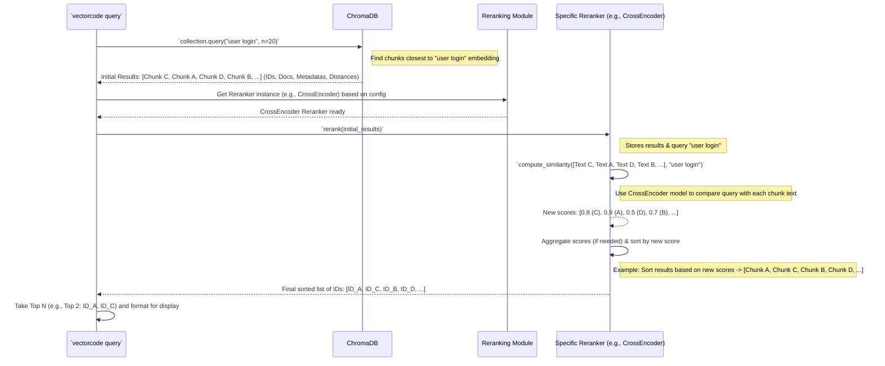

# Chapter 4: Query Reranking

Welcome back! In [Chapter 3: CLI Command Orchestration](03_cli_command_orchestration_.md), we saw how VectorCode understands your commands like `query` and prepares everything needed to execute them. Part of that execution involves getting search results from our code library, ChromaDB.

But imagine you ask the librarian (ChromaDB) for books about "efficient data processing". The librarian quickly gives you a stack of books based on keyword matches or general topic similarity. That's great, but wouldn't it be even better if an expert on data processing could quickly review that stack and pull the *most insightful* books right to the top?

That's exactly what **Query Reranking** does in VectorCode! It takes the initial search results from the vector database and applies a second, often smarter, check to re-order them, aiming to put the most *semantically relevant* code snippets at the very top.

## Why Do We Need Reranking? Refining the Search

The initial search in ChromaDB is based on "vector similarity". This means it finds code chunks whose numerical representations (embeddings) are mathematically closest to the embedding of your query. This is very fast and usually finds relevant content.

However, sometimes this initial search might:

*   Focus too much on keywords: If you search for "database connection pool", it might return chunks that mention "database" often and others that mention "connection" often, but maybe not the best ones that *combine* these concepts in the context of "pooling".
*   Miss subtle meaning: The embedding might capture the general topic but miss the specific nuance you were looking for.

**Query Reranking** acts as that expert review. It takes the top results from the initial search (say, the top 20 or 50) and uses a different method to score them specifically against your query. This second pass aims for a deeper understanding of relevance.

## Key Ideas: The Reranking Process

1.  **Initial Retrieval:** The `query` command first asks ChromaDB for a list of code chunks that are closest to your search query based on vector distance. We usually ask for more results than we plan to show the user (e.g., ask for 50 if we ultimately want to show 10).
2.  **The Reranker:** This is the core component. It takes the initial list of chunks (and their text) and your original query. It then uses a specific strategy to calculate a *new* relevance score for each chunk. Two common strategies in VectorCode are:
    *   **CrossEncoder Reranker:**
        *   **Analogy:** Imagine an expert reading your question *and* each potential answer snippet side-by-side before deciding how relevant the answer is.
        *   **How it works:** Uses a special type of machine learning model (a CrossEncoder) that is specifically trained to predict the relevance between pairs of texts (your query and a code chunk). It directly compares the query text with each chunk's text to get a very accurate relevance score. This is often slower but provides high-quality semantic matching.
    *   **Naive Reranker:**
        *   **Analogy:** This is like the librarian looking back at their original notes (the initial distances) and organizing the results based on those initial scores, perhaps grouping results from the same file together.
        *   **How it works:** This simpler method relies heavily on the *original* distance scores provided by ChromaDB during the initial retrieval. The base reranking logic in VectorCode takes these scores (or scores from another method like CrossEncoder), potentially aggregates scores if multiple chunks from the same file appear in the initial results, and then sorts based on this (potentially aggregated) score. The "Naive" name comes from the fact that its `compute_similarity` step *directly* uses the initial ChromaDB distances as the scores, without involving a complex secondary model.
3.  **Final Sorted List:** The reranker outputs a new list containing identifiers (like file paths or unique chunk IDs) sorted according to the *new* relevance scores. The `query` command then takes the top N items from this list (where N is the number of results you requested) to show you.

## How VectorCode Uses Reranking

Reranking is typically an automatic step within the `vectorcode query` command. You don't usually call it directly.

1.  You run: `vectorcode query "handle user login" -n 5`
2.  The [CLI Command Orchestration](03_cli_command_orchestration_.md) sets everything up.
3.  The `query` subcommand talks to the [ChromaDB Client Interaction](01_chromadb_client_interaction_.md) module to get initial results (maybe the top 50 based on vector similarity).
4.  The `query` subcommand then calls the **Query Reranking** module.
5.  The reranker (e.g., CrossEncoder, chosen based on configuration) calculates new scores for these 50 results against "handle user login".
6.  The reranker returns a re-sorted list of file paths or chunk IDs.
7.  The `query` subcommand takes the top 5 from this *reranked* list and displays them.

The specific reranker used (and its parameters) can often be configured, as we'll see in [Chapter 5: Configuration Management](05_configuration_management_.md).

## Under the Hood: A Reranking Example

Let's trace the flow when reranking is used:



This shows the initial results from ChromaDB might not be perfectly ordered by semantic relevance. The Reranker applies its logic (`compute_similarity`) to get better scores and provides a final, improved ordering.

### Diving into the Code (Simplified)

Let's look at the key pieces involved in reranking.

**1. Calling the Reranker (in `query/__init__.py`)**

The main `query` command orchestrates getting initial results and then calling the reranker.

```python
# src/vectorcode/subcommands/query/__init__.py
# ... other imports
from vectorcode.subcommands.query.reranker import get_reranker

async def get_query_result_files(
    collection: AsyncCollection, configs: Config
) -> list[str]:
    # ... (Code to prepare query and initial filter) ...

    # 1. Get Initial Results from ChromaDB
    num_query = configs.n_result * configs.query_multiplier # Ask for more results initially
    initial_results = await collection.query(
        query_texts=query_chunks,
        n_results=num_query,
        include=[IncludeEnum.metadatas, IncludeEnum.distances, IncludeEnum.documents],
        where=filter or None,
    )
    # ... (Handle cases with no results) ...

    # 2. Get the configured Reranker
    reranker = get_reranker(configs)

    # 3. Call the reranker with the initial results
    reranked_ids = await reranker.rerank(initial_results)

    # 4. Return the top N identifiers from the reranked list
    return reranked_ids # The base rerank method already handles slicing to n_result

# The main 'query' function calls 'build_query_results',
# which in turn calls 'get_query_result_files' shown above.
async def query(configs: Config) -> int:
    # ... (Setup: get client, get collection) ...
    structured_result = await build_query_results(collection, configs)
    # ... (Format and print 'structured_result') ...
    return 0
```

This snippet shows the `get_query_result_files` helper function first getting `initial_results` from `collection.query`. It then gets the appropriate `reranker` object using `get_reranker` and calls its `rerank` method, passing the `initial_results`. The final sorted list of identifiers is returned.

**2. Selecting the Reranker (`reranker/__init__.py`)**

This factory function determines which reranker class to use based on the configuration.

```python
# src/vectorcode/subcommands/query/reranker/__init__.py
import sys
from typing import Type
from vectorcode.cli_utils import Config
from .base import RerankerBase
from .cross_encoder import CrossEncoderReranker
from .naive import NaiveReranker

# Dictionary mapping names to reranker classes
__supported_rerankers: dict[str, Type[RerankerBase]] = {
    "CrossEncoderReranker": CrossEncoderReranker,
    "NaiveReranker": NaiveReranker,
}

def get_reranker(configs: Config) -> RerankerBase:
    reranker_name = configs.reranker # Get reranker name from config
    if reranker_name in __supported_rerankers:
        # If it's a known name, get the class...
        RerankerClass = __supported_rerankers[reranker_name]
        # ...and create an instance using its 'create' method
        print(f"Using reranker: {reranker_name}")
        return RerankerClass.create(configs)
    else:
        # Default or fallback if no valid reranker is configured
        print("Using default reranker: NaiveReranker")
        return NaiveReranker.create(configs)
```

This function checks the `configs.reranker` setting. If it matches a known reranker name (like "CrossEncoderReranker"), it creates an instance of that class. Otherwise, it defaults to the `NaiveReranker`.

**3. The Base Reranker Logic (`reranker/base.py`)**

All rerankers inherit from `RerankerBase`, which provides the main `rerank` method structure.

```python
# src/vectorcode/subcommands/query/reranker/base.py
import heapq
import numpy
from abc import ABC, abstractmethod
from collections import defaultdict
# ... other imports

class RerankerBase(ABC):
    def __init__(self, configs: Config, **kwargs: Any):
        self.configs = configs
        self.n_result = configs.n_result # How many results to finally return
        self._raw_results: Optional[QueryResult] = None # Stores initial results

    @classmethod
    def create(cls, configs: Config, **kwargs: Any): # Factory method
        # ... (Error handling omitted) ...
        return cls(configs, **kwargs)

    @abstractmethod # Each specific reranker MUST implement this
    async def compute_similarity(self, results: list[str], query: str) -> Sequence[float]:
        # Calculates similarity scores between the query and a list of documents
        raise NotImplementedError

    async def rerank(self, results: QueryResult) -> list[str]:
        self._raw_results = results # Store initial results for potential use
        query_texts = self.configs.query or [""] # Get the query text(s)

        # Dictionary to store scores, mapping identifier -> list of scores
        doc_scores: DefaultDict[str, list[float]] = defaultdict(list)

        # Process results for each query text (often just one)
        for query_idx, query_text in enumerate(query_texts):
            chunk_ids = results["ids"][query_idx]
            chunk_docs = results["documents"][query_idx] # Text of initial chunks
            chunk_metas = results["metadatas"][query_idx]

            # Call the specific reranker's method to get scores
            scores = await self.compute_similarity(chunk_docs, query_text)

            # Store scores, associating them with file path or chunk ID
            for i, score in enumerate(scores):
                if QueryInclude.chunk in self.configs.include:
                    identifier = chunk_ids[i] # Use chunk ID if outputting chunks
                else:
                    identifier = str(chunk_metas[i]["path"]) # Use file path otherwise
                doc_scores[identifier].append(float(score))

        # Aggregate scores for each identifier (e.g., average score for a file)
        final_scores = {}
        for identifier, score_list in doc_scores.items():
            # Simple averaging of scores for an identifier
            final_scores[identifier] = float(numpy.mean(score_list))

        # Get the top N identifiers based on the final aggregated score
        top_n_identifiers = heapq.nlargest(
            self.n_result,
            final_scores.keys(),
            key=lambda identifier: final_scores[identifier],
        )

        self._raw_results = None # Clear stored results
        return top_n_identifiers
```

The `rerank` method orchestrates the process:
1.  It iterates through the query texts (usually just one).
2.  For each query, it calls `compute_similarity` (which is implemented by the *specific* reranker like `NaiveReranker` or `CrossEncoderReranker`) to get scores for the initial set of documents.
3.  It aggregates these scores (e.g., if multiple chunks from the same file were retrieved, their scores are averaged for that file).
4.  It uses `heapq.nlargest` to efficiently find the top `n_result` identifiers based on these final scores.

**4. Naive Reranker Implementation (`reranker/naive.py`)**

This is the simplest reranker. Its `compute_similarity` just uses the original distances from ChromaDB.

```python
# src/vectorcode/subcommands/query/reranker/naive.py
from .base import RerankerBase
# ... other imports

class NaiveReranker(RerankerBase):
    """Uses original ChromaDB distances as relevance scores."""

    async def compute_similarity(self, results: list[str], query_message: str) -> Sequence[float]:
        # Ensure raw results (including distances) are available
        assert self._raw_results is not None
        assert self._raw_results.get("distances") is not None
        assert self.configs.query

        # Find the index corresponding to the current query_message
        query_idx = self.configs.query.index(query_message)

        # Get the distances for this query from the raw results
        # ChromaDB distances are smaller for more similar items,
        # so we negate them to turn them into similarity scores (higher is better).
        distances = self._raw_results["distances"][query_idx]
        return list(-dist for dist in distances) # Return negated distances
```

The `NaiveReranker` simply looks up the `distances` stored in `_raw_results` (which came directly from ChromaDB) for the relevant query index and returns their negated values (because higher scores should mean more relevant).

**5. CrossEncoder Reranker Implementation (`reranker/cross_encoder.py`)**

This uses a dedicated Sentence Transformers model.

```python
# src/vectorcode/subcommands/query/reranker/cross_encoder.py
import asyncio
from sentence_transformers import CrossEncoder # Import the library
from .base import RerankerBase
# ... other imports

class CrossEncoderReranker(RerankerBase):
    """Uses a CrossEncoder model for semantic relevance scoring."""

    def __init__(self, configs: Config, **kwargs: Any):
        super().__init__(configs)
        # Get model name from config, default if not provided
        model_name = configs.reranker_params.get(
            "model_name_or_path", "cross-encoder/ms-marco-MiniLM-L-6-v2"
        )
        print(f"Loading CrossEncoder model: {model_name}")
        # Load the actual CrossEncoder model
        self.model = CrossEncoder(model_name)

    async def compute_similarity(self, results: list[str], query_message: str):
        # Prepare pairs of (document, query) for the model
        model_input = [(doc, query_message) for doc in results]

        # Run model prediction (potentially slow, run in thread)
        # The model outputs scores indicating relevance.
        scores = await asyncio.to_thread(self.model.predict, model_input)
        print(f"Computed {len(scores)} CrossEncoder scores.")
        return list(float(i) for i in scores) # Return the scores
```

The `CrossEncoderReranker` initializes a `CrossEncoder` model (using a name from the configuration). Its `compute_similarity` method prepares pairs of `(document, query)` and feeds them to the `model.predict` function. This function returns the relevance scores, which are then used by the `RerankerBase.rerank` method.

## Conclusion

You've now learned about **Query Reranking**, an important step VectorCode takes to refine search results. By applying a second scoring mechanism (like a sophisticated CrossEncoder or a simpler distance-based approach) after the initial vector search, reranking significantly improves the quality and relevance of the code snippets presented to you. We saw how the `query` command uses a reranker chosen via configuration and how the `RerankerBase` class orchestrates the process of computing new scores and sorting the results.

This highlights the importance of configuration in controlling VectorCode's behavior. How exactly do we manage settings like which reranker to use, the ChromaDB address, or code chunking parameters?

Let's explore that next in [Chapter 5: Configuration Management](05_configuration_management_.md)!

---

Generated by [AI Codebase Knowledge Builder](https://github.com/The-Pocket/Tutorial-Codebase-Knowledge)