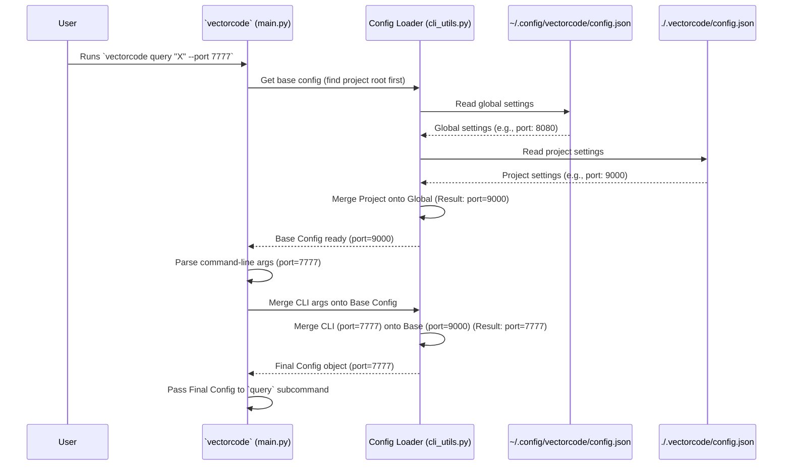

# Chapter 5: Configuration Management

Welcome back! In the previous chapter, [Chapter 4: Query Reranking](04_query_reranking_.md), we saw how VectorCode can intelligently re-order search results to improve relevance. We briefly mentioned that the specific reranker used could be controlled by settings. But how exactly does VectorCode manage settings like that, or other options like where your database is located or how code should be chunked?

Imagine you're using a new application on your computer. You might want to change its appearance, set default folders, or adjust how it behaves. You'd typically go to a "Settings" or "Preferences" menu.

**Configuration Management** in VectorCode is exactly like that settings menu! It's the system responsible for figuring out all the specific settings VectorCode should use when it runs.

## Why Do We Need Configuration Management? Customizing VectorCode

VectorCode needs to know several things to work correctly:

*   Where is the ChromaDB database? (Is it running locally? On a server?)
*   Which embedding model should be used to understand code?
*   How should code files be broken down? (Which [Chapter 2: Code Chunking](02_code_chunking_.md) method? How large should chunks be?)
*   Which reranker should be used? (As seen in [Chapter 4: Query Reranking](04_query_reranking_.md)?)
*   Are there specific files or patterns to always ignore?

Instead of hard-coding these values, Configuration Management allows you to *configure* them. This makes VectorCode flexible and adaptable to different projects and user preferences.

It also allows for different levels of settings:

*   **Global Settings:** Your default preferences that apply everywhere.
*   **Project Settings:** Settings specific to a particular codebase you're working on.
*   **Temporary Settings:** Options you specify directly in a command for a one-time adjustment.

The Configuration Management system defines how these different levels interact.

## Key Ideas: Layers of Settings

VectorCode gets its settings from a few places, layered like sheets of paper, with the ones on top taking priority:

1.  **Defaults:** Built-in default values within the VectorCode program itself. (Lowest priority)
2.  **Global Configuration File:** A file usually located in your user directory (e.g., `~/.config/vectorcode/config.json`). This holds your personal default settings for all projects.
3.  **Project Configuration File:** A file located inside your specific project directory (e.g., `./my_project/.vectorcode/config.json`). Settings here override the global ones *only* for this project.
4.  **Command-Line Arguments:** Options you type directly when running a command (e.g., `vectorcode query ... --port 8001`). These override *everything* else for that single command run. (Highest priority)

**The Rule:** **Command-Line > Project File > Global File > Defaults**

VectorCode reads these settings starting from the bottom (Defaults) and progressively overrides them with settings found in higher layers. The final result is a single configuration object (`Config`) that contains the combined, effective settings for the current operation.

## How VectorCode Uses Configuration

When you run any `vectorcode` command, the very first steps involve loading and merging configuration, managed by the [CLI Command Orchestration](03_cli_command_orchestration_.md) module.

1.  **Find Project Root:** VectorCode tries to figure out which project you're working on (often by looking for a `.vectorcode` or `.git` folder).
2.  **Load Global Config:** It looks for `~/.config/vectorcode/config.json`.
3.  **Load Project Config:** It looks for `.vectorcode/config.json` within the identified project root.
4.  **Merge:** It merges the project settings onto the global settings (project settings win if there's overlap).
5.  **Parse Command-Line Args:** It analyzes the options you typed in the command.
6.  **Final Merge:** It merges the command-line options onto the result from step 4 (command-line options win).
7.  **Create `Config` Object:** The final, effective settings are stored in a `Config` object.
8.  **Pass to Subcommand:** This `Config` object is passed to the specific function handling your command (like `query` or `vectorise`).

Other modules then use this `Config` object:
*   [Chapter 1: ChromaDB Client Interaction](01_chromadb_client_interaction_.md) uses `configs.host` and `configs.port` to connect.
*   [Chapter 2: Code Chunking](02_code_chunking_.md) uses `configs.chunk_size` and `configs.chunk_filters`.
*   [Chapter 4: Query Reranking](04_query_reranking_.md) uses `configs.reranker` and `configs.reranker_params`.

### Example: Changing the ChromaDB Port

Let's say the default port is `8000`.

*   **Scenario 1: Global Setting**
    You edit `~/.config/vectorcode/config.json`:
    ```json
    {
      "port": 8080
    }
    ```
    Now, `vectorcode` commands will try to connect to port `8080` by default for all projects.

*   **Scenario 2: Project Setting Overrides Global**
    You are in `/home/user/my_api_project`. You edit `./.vectorcode/config.json`:
    ```json
    {
      "port": 9000
    }
    ```
    Even though your global config says `8080`, when you run `vectorcode` commands inside `/home/user/my_api_project`, it will use port `9000`. In other projects, it will still use `8080`.

*   **Scenario 3: Command-Line Overrides All**
    You are in `/home/user/my_api_project`. You run:
    ```bash
    vectorcode query "find users" --port 7777
    ```
    For this *one command*, VectorCode will ignore the project setting (`9000`) and the global setting (`8080`) and connect to port `7777`.

## Under the Hood: Building the Configuration

How does VectorCode actually load and merge these settings?



This diagram shows the steps: loading global, loading project, merging them, parsing command-line arguments, and merging those on top to produce the final configuration used by the command.

### Diving into the Code (Simplified)

Let's look at the key parts involved in loading and merging.

**1. The `Config` Dataclass (`src/vectorcode/cli_utils.py`)**

This defines the structure that holds all possible settings.

```python
# src/vectorcode/cli_utils.py
from dataclasses import dataclass, field
from typing import Any, Optional, list

# Simplified version showing a few fields
@dataclass
class Config:
    # General settings
    action: Optional[CliAction] = None # What command to run
    project_root: Optional[str] = None
    pipe: bool = False # Output for machines?

    # ChromaDB settings
    host: str = "127.0.0.1"
    port: int = 8000
    db_path: Optional[str] = "~/.local/share/vectorcode/chromadb/"

    # Chunking settings
    chunk_size: int = 2500
    overlap_ratio: float = 0.2
    encoding: str = "utf8"

    # Query settings
    query: Optional[list[str]] = None
    n_result: int = 1

    # Reranking settings
    reranker: Optional[str] = "CrossEncoderReranker"
    reranker_params: dict[str, Any] = field(default_factory=dict)

    # ... many other fields for different commands and options ...

    # Method to load settings from a dictionary (like from a JSON file)
    @classmethod
    async def import_from(cls, config_dict: dict[str, Any]) -> "Config":
        # ... (complex logic to validate and map dict keys to fields) ...
        # Simplified: Assume dict keys match field names
        valid_keys = {f.name for f in fields(cls)}
        filtered_dict = {k: v for k, v in config_dict.items() if k in valid_keys}
        print(f"Loaded settings from dict: {list(filtered_dict.keys())}")
        return Config(**filtered_dict)

    # Method to merge settings from another Config object (e.g., CLI args)
    async def merge_from(self, other: "Config") -> "Config":
        # ... (complex logic to handle defaults and merging) ...
        # Simplified: 'other' overrides 'self' if 'other' has a non-default value
        final_config_dict = {}
        default_config = Config() # Get default values
        for f in fields(self):
            field_name = f.name
            other_val = getattr(other, field_name)
            self_val = getattr(self, field_name)
            default_val = getattr(default_config, field_name)

            # If 'other' has a value different from the default, use it. Otherwise, use 'self'.
            if other_val != default_val:
                final_config_dict[field_name] = other_val
            else:
                final_config_dict[field_name] = self_val
        print(f"Merged settings. Final keys used from 'other': {[k for k, v in final_config_dict.items() if v == getattr(other, k) and v != getattr(default_config, k)]}")
        return Config(**final_config_dict)

```

This `Config` class uses Python's `dataclass` feature to define all the settings. It includes methods like `import_from` to create a `Config` object from a dictionary (like one loaded from a JSON file) and `merge_from` to combine settings from another `Config` object (representing command-line arguments) onto the current one.

**2. Loading Configuration Files (`src/vectorcode/cli_utils.py`)**

These functions handle finding and reading the JSON configuration files.

```python
# src/vectorcode/cli_utils.py
import json
import os

GLOBAL_CONFIG_PATH = "~/.config/vectorcode/config.json" # Example path

# Loads a single config file
async def load_config_file(path: Optional[str] = None) -> Config:
    if path is None:
        path = os.path.expanduser(GLOBAL_CONFIG_PATH)
    else:
        path = os.path.expanduser(path)

    if os.path.isfile(path):
        print(f"Loading config from: {path}")
        try:
            with open(path) as fin:
                config_dict = json.load(fin)
            # Create a Config object from the loaded dictionary
            return await Config.import_from(config_dict)
        except json.JSONDecodeError:
            print(f"Warning: Invalid JSON in {path}. Using defaults.")
        except Exception as e:
            print(f"Warning: Error loading {path}: {e}. Using defaults.")
    else:
        print(f"Config file not found: {path}. Using defaults.")
    # Return default Config if file doesn't exist or fails to load
    return Config()

# Gets the combined config (Global + Project)
async def get_project_config(project_root: str) -> Config:
    # 1. Load global config first
    global_config = await load_config_file() # Loads from GLOBAL_CONFIG_PATH

    # 2. Try to load project-specific config
    local_config_path = os.path.join(project_root, ".vectorcode", "config.json")
    if os.path.isfile(local_config_path):
        project_config = await load_config_file(local_config_path)
        # 3. Merge project config onto global config (Project overrides Global)
        # Simplified merge: We assume merge_from handles priority correctly.
        # In reality, the logic might be slightly different, but the idea is:
        # Start with global, update with project-specific values.
        # Here, we achieve this by loading project THEN merging global onto it,
        # with merge_from prioritizing the 'other' (global in this case) ONLY if
        # the 'self' (project) value is default. Let's re-think merge_from slightly
        # for clarity or just state the priority.
        # Correct approach: Load global, then load project, then merge project ONTO global.
        base_config = await global_config.merge_from(project_config) # Let project override global
        base_config.project_root = project_root
        print("Using project config merged onto global config.")
        return base_config
    else:
        # If no project config, just use the global one
        global_config.project_root = project_root
        print("Using global config (no project config found).")
        return global_config

```

`load_config_file` reads a specified JSON file (defaulting to the global path) and uses `Config.import_from` to turn it into a `Config` object. `get_project_config` first loads the global config, then tries to load the project-specific config, and merges the project settings *onto* the global settings, ensuring project settings take precedence.

**3. Orchestrating in `main.py` (`src/vectorcode/main.py`)**

The main entry point uses these functions to build the final config.

```python
# src/vectorcode/main.py
import os
# Import helpers from cli_utils
from vectorcode.cli_utils import (
    parse_cli_args,      # Parses command-line args into a temporary Config
    find_project_root,   # Finds the root directory
    get_project_config,  # Loads and merges global/project configs
)
# Import subcommand functions (query, vectorise, etc.)
from vectorcode import subcommands

async def async_main():
    # 1. Parse command-line arguments into a preliminary Config object
    cli_args_config = await parse_cli_args() # Contains only values from CLI

    # 2. Determine project root
    if cli_args_config.project_root is None:
        # ... (logic to find project root) ...
        project_root = find_project_root(os.getcwd()) or os.getcwd()
    else:
        project_root = cli_args_config.project_root
    print(f"Using project root: {project_root}")

    # 3. Load base configuration (Global + Project)
    base_config = await get_project_config(project_root)

    # 4. Merge CLI arguments onto the base configuration
    # CLI arguments (in cli_args_config) override file settings (in base_config)
    final_configs = await base_config.merge_from(cli_args_config)
    print("Final configuration ready.")

    # 5. Dispatch to the correct subcommand using the final config
    action = final_configs.action
    if action == CliAction.query:
        await subcommands.query(final_configs)
    elif action == CliAction.vectorise:
        await subcommands.vectorise(final_configs)
    # ... other cases ...

    return 0 # Exit code

# ... (rest of main.py) ...
```

This simplified `async_main` function shows the sequence:
1.  Parse CLI arguments into `cli_args_config`.
2.  Find the project root.
3.  Load the combined global and project settings into `base_config` using `get_project_config`.
4.  Merge the `cli_args_config` onto the `base_config` using `merge_from` to get the `final_configs`.
5.  Pass `final_configs` to the appropriate subcommand function.

## Conclusion

You've now learned how VectorCode manages its settings using **Configuration Management**. It's like a multi-layered settings menu, allowing you to customize behavior globally, per-project, or even for a single command. We saw how settings are loaded from files (`config.json`) and command-line arguments, and how they are merged based on priority (Command-Line > Project > Global > Defaults) into a final `Config` object used by various parts of the tool.

This flexibility is key to adapting VectorCode to your specific needs and workflows.

So far, we've focused on using VectorCode from the command line. But what if you want to integrate its power directly into your code editor?

Next, we'll explore how VectorCode interacts with editors like Neovim. Let's dive into the [Chapter 6: Neovim Plugin Facade](06_neovim_plugin_facade_.md)!

---

Generated by [AI Codebase Knowledge Builder](https://github.com/The-Pocket/Tutorial-Codebase-Knowledge)