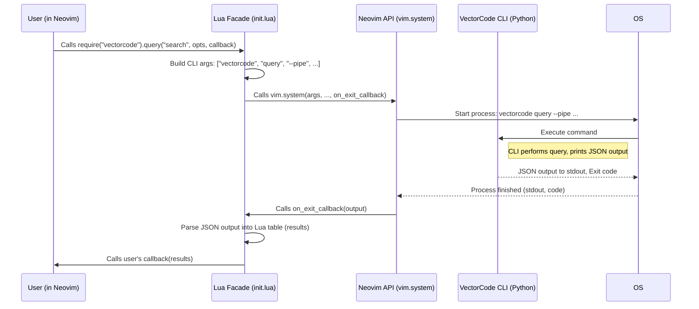

# Chapter 6: Neovim Plugin Facade

Welcome back! In [Chapter 5: Configuration Management](05_configuration_management_.md), we learned how VectorCode uses different layers of configuration files and command-line arguments to customize its behavior. That's great for using VectorCode from your terminal, but what if you want to use its powerful code search features *directly inside* your favorite code editor, Neovim?

Imagine you're editing a file and want to quickly find related code snippets from elsewhere in your project. Switching to the terminal, running `vectorcode query ...`, and then copying the results back into Neovim is cumbersome. Wouldn't it be better to have a way to trigger VectorCode actions right from within Neovim?

This is exactly what the **Neovim Plugin Facade** provides! It acts as the main control panel for VectorCode *within* the Neovim environment.

## Why Do We Need a Facade? Bridging the Gap

The core logic of VectorCode is written in Python and accessed via its command-line interface (CLI). Neovim, however, is primarily configured and extended using the Lua programming language.

How can your Lua configuration in Neovim talk to the Python-based VectorCode tool? The Neovim Plugin Facade is the bridge. It's a set of Lua functions that you can call from your Neovim configuration (`init.lua` or other plugin files). These Lua functions, in turn, know how to run the appropriate `vectorcode` CLI commands behind the scenes and return the results back to Neovim.

Think of it like a remote control for your TV:

*   **TV (VectorCode CLI):** Has all the features (changing channels, volume, etc.).
*   **Remote Control (Neovim Plugin Facade):** Provides simple buttons (Lua functions) that you can press from your couch (Neovim config).
*   **Pressing a Button:** The remote sends a signal (runs a CLI command) to the TV.
*   **TV Responds:** The TV changes the channel (the CLI command produces output).

The Facade makes interacting with VectorCode from Neovim much cleaner and easier than trying to manually construct and run CLI commands yourself.

## Key Ideas: The Lua Control Panel

The facade, primarily defined in `lua/vectorcode/init.lua`, exposes several key Lua functions that mirror the main CLI commands:

1.  **`require("vectorcode").setup(opts?)`**:
    *   **Analogy:** Setting up your remote control when you first get it (pairing it with the TV, setting preferences).
    *   **Purpose:** Initializes the VectorCode plugin within Neovim. You pass a Lua table (`opts`) containing configuration options specific to the plugin's behavior (like default number of results, notification settings, etc.). This often mirrors settings you might put in your `config.json` files (see [Chapter 5: Configuration Management](05_configuration_management_.md)), but controls the *plugin's* interaction with the CLI.
    *   **CLI Equivalent:** There isn't a direct command, but it configures how the plugin *calls* other commands.

2.  **`require("vectorcode").query(query_message, opts?, callback?)`**:
    *   **Analogy:** Pressing the "Search" or "Info" button on your remote.
    *   **Purpose:** Performs a code search. You provide the `query_message` (what you're looking for). Optionally, you can pass specific `opts` for this query (like how many results) and a `callback` function to handle the results asynchronously (without freezing Neovim). If no callback is provided, it runs synchronously (freezes Neovim until done) and returns the results directly.
    *   **CLI Equivalent:** Calls `vectorcode query "your query message" ...`

3.  **`require("vectorcode").vectorise(files, project_root?)`**:
    *   **Analogy:** Telling the TV to scan for new channels or index media.
    *   **Purpose:** Tells VectorCode to analyze and add code from specific `files` to its database for a given `project_root`.
    *   **CLI Equivalent:** Calls `vectorcode vectorise file1 file2 ... --project_root ...`

4.  **`require("vectorcode").update(project_root?)`**:
    *   **Analogy:** Asking the TV to check for software updates or refresh its program guide.
    *   **Purpose:** Tells VectorCode to update its stored information for a project, adding new files, updating changed ones, and removing deleted ones.
    *   **CLI Equivalent:** Calls `vectorcode update --project_root ...`

5.  **`require("vectorcode").check(check_item?)`**:
    *   **Analogy:** Running a diagnostic check on your TV.
    *   **Purpose:** Checks if VectorCode is set up correctly for the current project (e.g., if a configuration file exists).
    *   **CLI Equivalent:** Calls `vectorcode check config` (or other checks).

These Lua functions act as a friendly "facade" over the underlying CLI commands.

## How to Use the Facade in Neovim

Let's see how you might use these functions in your Neovim configuration (e.g., in your `init.lua` or a dedicated `vectorcode.lua` file).

**1. Setup VectorCode**

First, you need to call `setup` when Neovim starts, usually after the plugin is loaded by your plugin manager.

```lua
-- In your Neovim config (e.g., init.lua or lua/plugins/vectorcode.lua)

-- Ensure you have VectorCode installed via your plugin manager
-- Example using lazy.nvim:
-- { "Davidyz/VectorCode", dependencies = { "nvim-lua/plenary.nvim" }, opts = {} }

-- Configure VectorCode (call this after the plugin is loaded)
require("vectorcode").setup({
  -- Example: Default number of results for query
  n_query = 5,
  -- Example: Show notifications in Neovim
  notify = true,
  -- Example: Configuration for asynchronous caching (more in Chapter 7)
  async_opts = {
    debounce = 200, -- Wait 200ms after an event before querying
    events = { "BufWritePost", "TextChanged" }, -- Trigger on save or text change
  },
  -- Add other options based on docs/neovim.md...
})

print("VectorCode configured!")
```

This code calls the `setup` function, passing a Lua table with configuration options.

**2. Example: Mapping a Key to Query**

Now, let's map a key (e.g., `<leader>vc`) to query VectorCode based on the current line the cursor is on.

```lua
-- In your Neovim config

-- Get the current line number
local line_nr = vim.api.nvim_win_get_cursor(0)[1]
-- Get the text content of the current line
local line_text = vim.api.nvim_buf_get_lines(0, line_nr - 1, line_nr, false)[1]

-- Define a function to handle the query results
local function handle_query_results(results)
  if results and #results > 0 then
    print("VectorCode Found:")
    -- Print the path of each result
    for _, item in ipairs(results) do
      print("- " .. item.path)
    end
    -- You could also open results in a quickfix list, telescope, etc.
  else
    print("VectorCode: No relevant results found.")
  end
end

-- Map <leader>vc in normal mode to query using the current line text
vim.keymap.set('n', '<leader>vc', function()
  print("Querying VectorCode with line: " .. line_text)
  -- Call the query function asynchronously using a callback
  require("vectorcode").query(line_text, { n_query = 3 }, handle_query_results)
end, { noremap = true, silent = true, desc = "VectorCode Query Line" })

```

This snippet:
1.  Defines a function `handle_query_results` that will process the search results when they arrive.
2.  Uses `vim.keymap.set` to create a keybinding for `<leader>vc`.
3.  When the key is pressed, it calls `require("vectorcode").query`.
4.  It passes the text of the current line as the `query_message`.
5.  It specifies `n_query = 3` in the `opts` table for this specific query.
6.  It passes `handle_query_results` as the `callback`, making the call asynchronous (Neovim won't freeze).

Now, when you press `<leader>vc` in Neovim, the plugin will ask the VectorCode CLI to find the 3 most relevant code snippets related to the current line, and the results will be printed once they are ready.

## Under the Hood: How Lua Calls Python

What happens when you call `require("vectorcode").query(...)` in Lua?

1.  **Lua Function Call:** Your Neovim config calls the `query` function in `lua/vectorcode/init.lua`.
2.  **Argument Processing:** The Lua function processes the arguments you passed (`query_message`, `opts`, `callback`).
3.  **CLI Command Construction:** It builds the corresponding command-line arguments for the `vectorcode` CLI tool. For example, `{"vectorcode", "query", "--pipe", "-n", "3", "your line text"}`. The `--pipe` flag tells the CLI to output results in a machine-readable format (JSON).
4.  **Execute Command:** It uses Neovim's built-in `vim.system` function (or a similar job control mechanism like `plenary.job`) to run the constructed CLI command as a separate process. This is where Lua effectively tells the operating system to run the Python `vectorcode` tool.
5.  **VectorCode CLI Runs:** The `vectorcode` Python script executes (as covered in [Chapter 3: CLI Command Orchestration](03_cli_command_orchestration_.md)), performs the query against ChromaDB ([Chapter 1: ChromaDB Client Interaction](01_chromadb_client_interaction_.md)), possibly reranks the results ([Chapter 4: Query Reranking](04_query_reranking_.md)), and prints the final results as JSON to its standard output.
6.  **Capture Output:** The `vim.system` call captures the standard output (the JSON string) from the completed CLI process.
7.  **Parse Output:** The Lua code parses the JSON string back into a Lua table.
8.  **Return/Callback:**
    *   If you called the function *synchronously* (no callback), the Lua function returns the parsed Lua table directly.
    *   If you called it *asynchronously* (with a callback), the Lua function schedules your callback function (`handle_query_results` in our example) to run with the parsed Lua table as its argument.

Let's visualize this flow:



### Diving into the Code (Simplified)

Let's peek inside `lua/vectorcode/init.lua` to see how this works.

**`query` function (Simplified)**

```lua
-- lua/vectorcode/init.lua
local M = {}
local vc_config = require("vectorcode.config") -- For config and helpers
local logger = vc_config.logger -- For logging

-- Wrapper to check if CLI exists first
M.query = vc_config.check_cli_wrap(
  -- query_message: string, opts: table, callback: function
  function(query_message, opts, callback)
    logger.info("vectorcode.query called")
    -- Merge user opts with defaults from setup()
    opts = vim.tbl_deep_extend("force", vc_config.get_query_opts(), opts or {})

    -- Build the command arguments list
    local args = { "vectorcode", "query", "--pipe", "-n", tostring(opts.n_query) }
    if type(query_message) == "string" then
      table.insert(args, query_message)
    else -- Handle list of queries if needed
      vim.list_extend(args, query_message)
    end
    -- Add other args based on opts (e.g., --exclude)
    -- ...

    logger.debug("Running command: ", args)

    -- Use vim.system to run the command
    local job = vim.system(args, { text = true }, function(output)
      -- This inner function runs when the command finishes
      logger.debug("Command output: ", output)
      local decoded_response = {}
      if output.code == 0 and output.stdout then
        -- Parse the JSON output if command succeeded
        decoded_response = vim.json.decode(output.stdout, { object = true })
        logger.info("Parsed results: ", #decoded_response)
      else
        logger.error("Command failed: ", output.stderr)
      end

      -- If a callback was provided, call it with the results
      if type(callback) == "function" then
        vim.schedule(function() -- Schedule ensures callback runs safely
          callback(decoded_response)
        end)
      end
    end)

    -- If NO callback, run synchronously and wait for the result
    if callback == nil then
      local result = job:wait(opts.timeout_ms or 5000) -- Wait with timeout
      if result and result.code == 0 and result.stdout then
        return vim.json.decode(result.stdout, { object = true }) -- Return parsed result
      end
      return {} -- Return empty table on error/timeout
    end
    -- If callback exists, function returns immediately (nil)
  end
)

-- Other functions like M.update, M.vectorise, M.check follow a similar pattern:
-- 1. Build 'args' list for the specific CLI command.
-- 2. Call 'vim.system' or 'plenary.job' to run the command.
-- 3. Handle the output (often just notifications for update/vectorise).

M.update = vc_config.check_cli_wrap(function(project_root)
  logger.info("vectorcode.update called")
  local args = { "vectorcode", "update" }
  if project_root then
     table.insert(args, "--project_root")
     table.insert(args, project_root)
  end
  logger.debug("Running command: ", args)
  -- Usually run async, just notify on completion
  vim.system(args, {}, function(out)
     if vc_config.get_user_config().notify then
       -- Show notification based on out.code
       -- ... implementation omitted ...
     end
  end)
end)

M.setup = vc_config.setup -- Just points to the setup function in config.lua

return M
```

This simplified code shows the core pattern:
1.  The Lua function (`query`, `update`) prepares a list of strings (`args`) representing the CLI command and its arguments.
2.  It uses `vim.system` to execute these arguments. `vim.system` takes a callback function that is executed *when the command finishes*.
3.  Inside the `vim.system` callback, the code checks the command's exit code (`output.code`) and parses the standard output (`output.stdout`) if successful.
4.  If the original Lua function was called with a user `callback`, that callback is then invoked with the parsed results (using `vim.schedule` to be safe).
5.  If no user `callback` was provided (synchronous call), the code uses `job:wait()` to pause execution and returns the parsed result directly.

## Conclusion

The **Neovim Plugin Facade** is your gateway to using VectorCode's features without leaving your editor. It provides a convenient set of Lua functions (`setup`, `query`, `vectorise`, `update`, `check`) that act as a "remote control" for the underlying `vectorcode` CLI tool. By calling these functions from your Neovim configuration, you can seamlessly integrate code searching and management into your workflow.

We saw how these Lua functions construct and execute CLI commands using Neovim's system call capabilities, parse the results, and deliver them back to you either directly or via callbacks.

However, repeatedly calling the CLI for every query can sometimes be slow, especially if the VectorCode tool needs to load models each time. How can we make the Neovim integration feel faster and more responsive, especially for features that need frequent updates?

In the next chapter, we'll explore techniques VectorCode uses *within* Neovim to manage these background tasks more efficiently and cache results for near-instantaneous feedback. Get ready for [Chapter 7: Neovim Async Caching & Job Management](07_neovim_async_caching___job_management_.md)!

---

Generated by [AI Codebase Knowledge Builder](https://github.com/The-Pocket/Tutorial-Codebase-Knowledge)