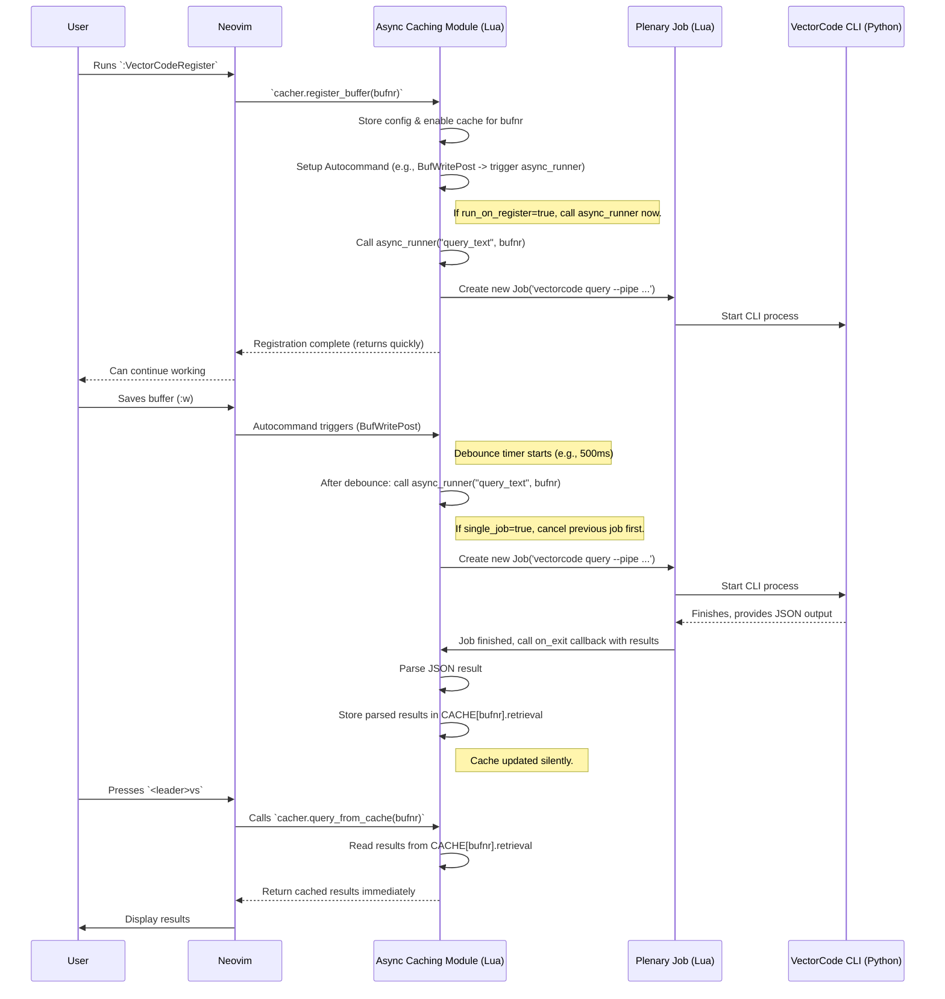

# Chapter 7: Neovim Async Caching & Job Management

Welcome back! In [Chapter 6: Neovim Plugin Facade](06_neovim_plugin_facade_.md), we learned how to interact with VectorCode directly from Neovim using Lua functions like `require("vectorcode").query()`. This is great for manual searches, but calling the command-line tool repeatedly can sometimes feel a bit slow, and it requires you to trigger the search manually.

What if you want VectorCode to *proactively* find relevant code related to the file you're currently editing, updating automatically as you work, *without* freezing Neovim? Imagine having helpful code snippets related to your current task appear almost instantly, fetched by invisible assistants working in the background.

This is precisely the problem solved by **Neovim Async Caching & Job Management**! It's the system within the VectorCode Neovim plugin that handles running tasks in the background, remembering (caching) the results, and making the whole experience smooth and responsive.

## Why Do We Need Async Caching? Keeping Neovim Smooth

Think about your typical code editor experience. You want it to be fast and responsive. If you trigger an action that takes a few seconds (like searching a large codebase), you don't want the entire editor to freeze while you wait!

*   **Synchronous (Bad):** You ask VectorCode to search. Neovim stops everything, waits for the search to finish, and *then* lets you continue working. This is disruptive.
*   **Asynchronous (Good):** You ask VectorCode to search (or it happens automatically). VectorCode starts the search in the background. Neovim *immediately* lets you continue typing and editing. When the search finishes, VectorCode quietly updates the results.

This asynchronous approach requires managing these background tasks ("jobs") and storing their results efficiently ("caching").

**Analogy:** Imagine you're cooking (editing code) and need a specific ingredient from the pantry (relevant code snippets).
*   **Synchronous:** You stop cooking, walk to the pantry, find the ingredient, walk back, and only then resume cooking. Your main task was blocked.
*   **Asynchronous:** You ask your assistant (VectorCode's async system) to fetch the ingredient. You continue chopping vegetables (editing code) without interruption. The assistant works in the background, finds the ingredient (runs the query), maybe leaves it on the counter (stores in cache), and lets you know when it's ready.

The Async Caching & Job Management module is this helpful assistant.

## Key Ideas: The Background Assistants

Let's break down how this system works:

1.  **Asynchronous Operations:** The core idea is running tasks (like `vectorcode query`) in the background without blocking Neovim's main thread. This uses Neovim's built-in job control features or communication with an external server.
2.  **Job Management:** The system needs to keep track of these background tasks. It needs to know how to:
    *   **Start:** Initiate a background query.
    *   **Stop:** Cancel a running query if it's no longer needed (e.g., you closed the buffer).
    *   **Check Status:** See if a query for a specific buffer is currently running.
    *   **Handle Output:** Process the results when the job finishes.
3.  **Caching:** Running queries can take time. If you trigger queries frequently (e.g., every time you save), re-running the exact same search is wasteful. The system stores the results of recent queries in memory (the cache), associated with the specific buffer they were run for. When you ask for results, it can often provide the cached ones instantly.
4.  **Automatic Querying (Buffer Registration):** Instead of manually triggering queries, you can "register" a buffer with the caching system. This tells VectorCode: "Keep an eye on this file. When certain things happen (like I save it, or start inserting text), automatically run a query in the background and update the cache."
5.  **Two Backends (How the Assistant Works):** The Neovim plugin can perform these background tasks in two main ways:
    *   **Default (CMD Backend):** Directly launches the `vectorcode query ...` command-line tool as a background process using Neovim's job utilities (specifically, the `plenary.nvim` library's `Job` module). Simple, works out of the box.
    *   **LSP Backend:** Communicates with a continuously running `vectorcode-server` process using the Language Server Protocol (LSP). This can be more efficient for frequent queries as the server stays loaded. Setting this up is covered more in [Chapter 8: External Server Protocols (LSP/MCP)](08_external_server_protocols__lsp_mcp__.md).

You choose which backend to use during setup, but the way you interact with the caching system (registering buffers, getting cached results) remains largely the same.

## How to Use It: Setting Up Automatic Queries

Let's configure VectorCode to automatically find related code snippets for the buffer you're editing whenever you save the file.

**1. Configuration (`setup`)**

In your Neovim configuration, you use the `setup` function (from [Chapter 6: Neovim Plugin Facade](06_neovim_plugin_facade_.md)) and provide options within the `async_opts` table:

```lua
-- In your Neovim config (e.g., init.lua or lua/plugins/vectorcode.lua)

require("vectorcode").setup({
  -- ... other options ...

  -- Choose the backend ('default' or 'lsp')
  async_backend = "default", -- Use the direct CLI job backend

  async_opts = {
    -- Events that trigger an automatic background query for registered buffers
    events = { "BufWritePost" }, -- Trigger ONLY after saving the buffer

    -- How many results to fetch in the background
    n_query = 5,

    -- Wait 500ms after an event before actually running the query
    -- Prevents running too many queries if events fire rapidly
    debounce = 500,

    -- Automatically run a query when a buffer is first registered?
    run_on_register = true,

    -- If true, automatically cancel previous running queries for the same buffer
    -- when a new one starts. Keeps things tidy.
    single_job = true,

    -- Function to generate the query based on the buffer content
    -- This example uses the filename as the query
    query_cb = function(bufnr)
      local bufname = vim.api.nvim_buf_get_name(bufnr)
      -- Use just the filename part as the query
      return vim.fn.fnamemodify(bufname, ':t')
    end,

    -- Show notifications for async jobs? (Can be noisy)
    notify = false,
  },
})
```

This configures the async system to:
*   Use the `default` backend (running CLI commands).
*   Trigger background queries only on `BufWritePost` (saving a file).
*   Fetch 5 results.
*   Wait 500ms after saving before starting the query (`debounce`).
*   Run an initial query immediately when we register a buffer (`run_on_register`).
*   Ensure only one query runs at a time per buffer (`single_job`).
*   Use the file's name as the search query (`query_cb`).

**2. Registering a Buffer**

Now, you need to tell VectorCode which buffer(s) to monitor. You can do this manually with a command or automatically for certain file types. Let's create a command to register the current buffer:

```lua
-- Add a command to register the current buffer
vim.api.nvim_create_user_command(
  'VectorCodeRegister',
  function()
    -- Get the right cacher backend (default or lsp) based on setup
    local cacher = require("vectorcode").cacher()
    if cacher then
      local bufnr = vim.api.nvim_get_current_buf()
      local bufname = vim.api.nvim_buf_get_name(bufnr)
      print("Registering buffer for VectorCode async caching: " .. bufname)
      -- Register the current buffer with default async options from setup
      cacher.register_buffer(bufnr)
    end
  end,
  { desc = "Register buffer for VectorCode async caching" }
)
```

Now, if you open a file (e.g., `my_component.js`) and run the command `:VectorCodeRegister`, VectorCode will:
*   Immediately run a background query for "my_component.js" (because `run_on_register = true`).
*   Whenever you save this file (`:w`), wait 500ms, then run another background query for "my_component.js".
*   Store the results in its cache for this specific buffer.

**3. Getting Cached Results**

How do you see the results that the background assistants fetched? You use `query_from_cache`. Let's map a key to display the cached results:

```lua
-- Map <leader>vs to show cached results
vim.keymap.set('n', '<leader>vs', function()
  local cacher = require("vectorcode").cacher()
  if cacher then
    local bufnr = vim.api.nvim_get_current_buf()
    -- Check if buffer is registered and enabled
    if cacher.buf_is_registered(bufnr) and cacher.buf_is_enabled(bufnr) then
      -- Get the results directly from the cache (very fast!)
      local results = cacher.query_from_cache(bufnr)
      print("VectorCode Cached Results (" .. #results .. "):")
      if #results > 0 then
        for _, item in ipairs(results) do
          print("- " .. item.path) -- Display file path
          -- You could format/display item.document too
        end
      else
        -- Check if a job is currently running
        local job_count = cacher.buf_job_count(bufnr)
        if job_count > 0 then
           print("Still fetching results (" .. job_count .. " jobs running)...")
        else
           print("No results found in cache.")
        end
      end
    else
      print("Buffer not registered or caching disabled.")
    end
  end
end, { noremap = true, silent = true, desc = "VectorCode Show Cache" })
```

Now, after registering a buffer and saving it, you can press `<leader>vs`. This function:
1.  Gets the appropriate `cacher` backend.
2.  Checks if the buffer is registered.
3.  Calls `query_from_cache(bufnr)` which retrieves the latest results stored by the background jobs. **This is usually instantaneous** as it just reads from memory.
4.  Prints the paths of the cached results.
5.  Includes a check for running jobs using `buf_job_count`.

You now have a system where VectorCode automatically keeps a cache of relevant snippets updated when you save, and you can view them instantly with `<leader>vs`!

## Under the Hood: How Background Jobs and Caching Work

Let's trace the flow when you register a buffer and then save it, using the `default` (CMD) backend:



This diagram illustrates:
1.  Registering sets up autocommands and potentially starts an initial background job via the `JobRunner`.
2.  Saving the buffer triggers the autocommand, which (after debouncing) starts another background job.
3.  When a background job finishes, its results are parsed and stored in the internal `CACHE` table, keyed by the buffer number.
4.  Calling `query_from_cache` simply reads from this `CACHE` table.

### Diving into the Code (Simplified Lua)

Let's look at the key Lua files involved.

**1. Selecting the Backend (`lua/vectorcode/config.lua`)**

This file reads the `setup` configuration and provides the correct cacher backend.

```lua
-- lua/vectorcode/config.lua
local M = {} -- Simplified representation

local setup_config = { -- Holds merged config from setup()
  async_backend = "default", -- Default value
  -- ... other setup options
  async_opts = { -- Default async options
     debounce = 10, events = {"BufWritePost"}, -- etc
  }
}
local cacher = nil -- Stores the loaded backend instance

M.setup = function(opts)
  -- Logic to merge user opts into setup_config
  setup_config = vim.tbl_deep_extend("force", setup_config, opts or {})
  -- ... potentially copy top-level opts into async_opts if needed ...
end

---@return VectorCode.CacheBackend?
M.get_cacher_backend = function()
  if cacher ~= nil then return cacher end -- Return cached instance

  if setup_config.async_backend == "lsp" then
    local ok, lsp_cacher = pcall(require, "vectorcode.cacher.lsp")
    if ok then
      cacher = lsp_cacher
      print("Using LSP cacher backend.")
      return cacher
    else
      print("Warning: Failed to load LSP backend, falling back to default.")
      setup_config.async_backend = "default"
    end
  end

  -- Fallback or explicit choice: load default backend
  print("Using Default (CMD) cacher backend.")
  cacher = require("vectorcode.cacher.default")
  return cacher
end

M.get_user_config = function() return setup_config end -- Access the config

return M
```

The `get_cacher_backend` function checks the `async_backend` setting. It tries to load the requested backend (`lsp` or `default`) and caches the instance. The rest of the plugin calls this function to get the correct object to work with.

**2. Default Backend (`lua/vectorcode/cacher/default.lua`)**

This file implements the caching logic using background CLI jobs.

```lua
-- lua/vectorcode/cacher/default.lua
local M = {} -- The module table to export functions
local vc_config = require("vectorcode.config") -- Access config
local Job = require("plenary.job") -- Use plenary for background jobs

---@type table<integer, VectorCode.Cache> -- BufferNr -> Cache Data
local CACHE = {} -- In-memory cache storage

-- Function to run the query asynchronously
local function async_runner(query_message, buf_nr)
  if not CACHE[buf_nr] or not CACHE[buf_nr].enabled then return end
  local cache = CACHE[buf_nr]

  -- Build CLI arguments
  local args = { "query", "--pipe", "-n", tostring(cache.options.n_query) }
  if type(query_message) == "string" then query_message = { query_message } end
  vim.list_extend(args, query_message)
  if cache.options.exclude_this then
    vim.list_extend(args, { "--exclude", vim.api.nvim_buf_get_name(buf_nr) })
  end
  -- Add project root if specified in options...

  -- If single_job=true, kill previous jobs for this buffer
  if cache.options.single_job then kill_jobs(buf_nr) end -- kill_jobs loops through cache.jobs

  print("Starting background VectorCode query job...")
  local job = Job:new({
    command = "vectorcode",
    args = args,
    on_exit = function(self, code) -- Callback when job finishes
      if not CACHE[buf_nr] then return end -- Check if buffer still registered
      CACHE[buf_nr].jobs[self.pid] = nil -- Remove job from tracking
      if code == 0 then
        local ok, decoded = pcall(vim.json.decode, table.concat(self:result()))
        if ok then
          CACHE[buf_nr].retrieval = decoded -- STORE RESULT IN CACHE!
          print("VectorCode cache updated for buffer " .. buf_nr)
        else
          print("Error decoding VectorCode result.")
        end
      else
         print("VectorCode background job failed.")
      end
    end,
  })
  job:start()
  CACHE[buf_nr].jobs[job.pid] = true -- Track the running job
end

-- Function to register a buffer
function M.register_buffer(bufnr, opts)
  bufnr = bufnr or vim.api.nvim_get_current_buf()
  print("Registering buffer " .. bufnr .. " with default cacher.")

  -- Merge opts with defaults from config
  local default_opts = vc_config.get_user_config().async_opts
  opts = vim.tbl_deep_extend("force", default_opts, opts or {})

  -- Initialize or update cache entry
  CACHE[bufnr] = {
    enabled = true,
    retrieval = nil, -- Start with empty cache
    options = opts,
    jobs = {}, -- Track running jobs for this buffer
  }

  -- Create autocommands based on configured events
  local group = vim.api.nvim_create_augroup(("VectorCodeCacheGroup%d"):format(bufnr), { clear = true })
  vim.api.nvim_create_autocmd(opts.events, {
    group = group,
    buffer = bufnr,
    debounce = opts.debounce, -- Use debounce directly!
    callback = function()
      if CACHE[bufnr] and CACHE[bufnr].enabled then
        local query = CACHE[bufnr].options.query_cb(bufnr) -- Get query text
        async_runner(query, bufnr) -- Run the background job
      end
    end,
  })

  -- Add autocommand to clean up jobs when buffer is closed
  vim.api.nvim_create_autocmd("BufWinLeave", {
     group = group, buffer = bufnr, callback = function() kill_jobs(bufnr) end
  })

  -- Run immediately if configured
  if opts.run_on_register then
    local query = opts.query_cb(bufnr)
    async_runner(query, bufnr)
  end
end

-- Function to get results from cache
function M.query_from_cache(bufnr)
  bufnr = bufnr or vim.api.nvim_get_current_buf()
  if CACHE[bufnr] and CACHE[bufnr].retrieval then
    print("Returning results from cache for buffer " .. bufnr)
    return CACHE[bufnr].retrieval
  end
  print("No results in cache for buffer " .. bufnr)
  return {}
end

-- Other helper functions (deregister_buffer, buf_is_registered, buf_job_count, etc.)
-- would interact with the CACHE table and jobs list.
-- ... (implementation omitted for brevity) ...

return M
```

This simplified `default.lua` shows:
*   The `CACHE` table stores state per buffer number (`retrieval`, `options`, `jobs`).
*   `register_buffer` sets up the `CACHE` entry and creates autocommands using the configured `events` and `debounce` time. The autocommand's `callback` calls `async_runner`.
*   `async_runner` builds the CLI arguments, uses `plenary.job` to run `vectorcode query` in the background. The job's `on_exit` callback parses the result and updates `CACHE[bufnr].retrieval`.
*   `query_from_cache` simply returns the content of `CACHE[bufnr].retrieval`.

The `lsp.lua` backend follows a similar pattern but instead of creating `plenary.job`s, it sends requests to the LSP server (`vectorcode-server`) using `CLIENT:request(...)` and handles the responses.

## Conclusion

You've now explored the powerful **Neovim Async Caching & Job Management** system in VectorCode! You learned why running tasks asynchronously is crucial for a smooth editor experience and how VectorCode achieves this using background jobs and caching. We saw how to configure automatic background queries by registering buffers and how to access the cached results instantly.

This system, whether using the default command-line backend or the LSP backend, acts like efficient background assistants, fetching relevant code information without interrupting your flow, making VectorCode feel deeply integrated and responsive within Neovim.

Speaking of the LSP backend, how does that communication work? How does VectorCode define and use protocols like LSP to talk to external tools or servers?

Let's find out in the final chapter: [Chapter 8: External Server Protocols (LSP/MCP)](08_external_server_protocols__lsp_mcp__.md).

---

Generated by [AI Codebase Knowledge Builder](https://github.com/The-Pocket/Tutorial-Codebase-Knowledge)