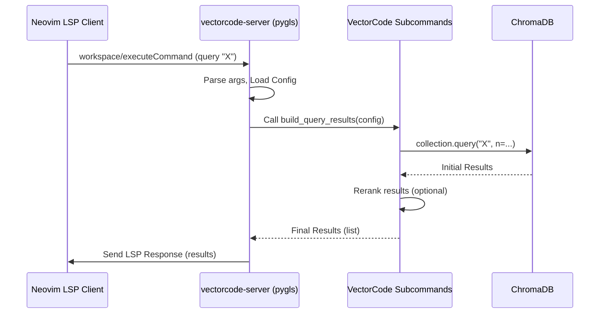
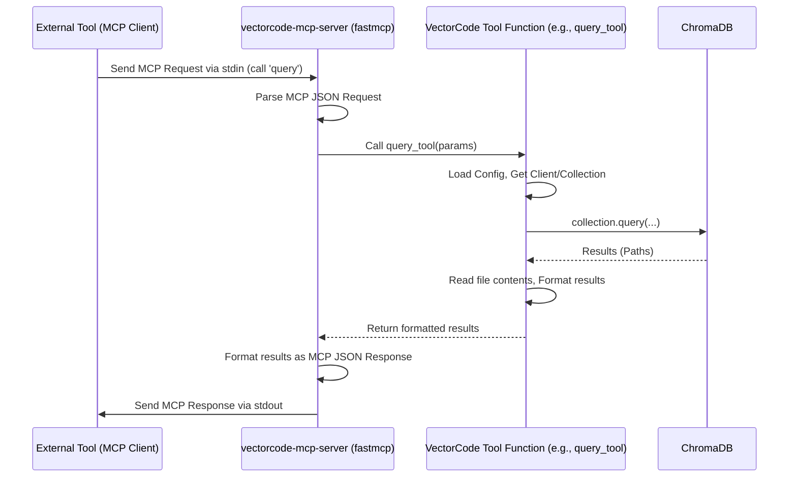

# Chapter 8: External Server Protocols (LSP/MCP)

Welcome to the final chapter! In [Chapter 7: Neovim Async Caching & Job Management](07_neovim_async_caching___job_management_.md), we saw how the VectorCode Neovim plugin can run tasks in the background and cache results to make the editor experience smoother. We briefly mentioned an "LSP backend" as one way to achieve this.

But what exactly is LSP? And are there other ways for VectorCode to talk to external applications besides its command-line interface (CLI) or the specific Neovim plugin?

Imagine you have different electronic devices – a phone, a laptop, a camera. Wouldn't it be annoying if every single device needed its own unique, custom cable for charging and data transfer? Thankfully, we have standards like USB-C! You can use the same type of cable and port for many different devices.

**External Server Protocols** in VectorCode are like these standard "plugs" or communication methods. They provide standardized ways for other applications (like code editors or AI assistants) to "talk" to VectorCode, instead of relying solely on the custom CLI commands or the specific Neovim Lua API.

This chapter explores two main protocols VectorCode uses:

1.  **LSP (Language Server Protocol):** A standard for code editors to communicate with language intelligence tools.
2.  **MCP (Model Context Protocol):** A standard for applications (especially AI models) to interact with tools that provide context or perform actions.

## Why Use Standard Protocols? Speaking the Same Language

Using standard protocols offers several advantages:

*   **Wider Integration:** Other tools that already "speak" LSP or MCP can potentially interact with VectorCode with less effort. For example, editors other than Neovim that support LSP might be able to use VectorCode's features.
*   **Potential Efficiency (LSP):** Instead of starting the `vectorcode` Python tool for every single query (which involves loading models), an LSP server (`vectorcode-server`) can run continuously in the background. It keeps the necessary models loaded in memory, potentially making repeated queries much faster.
*   **Standardized AI Interaction (MCP):** Tools like Large Language Models (LLMs) or AI agents can use the MCP server (`vectorcode-mcp-server`) to ask VectorCode for relevant code context in a structured way, without needing custom code specific to VectorCode's CLI.

## Key Ideas: The Standard Plugs

### 1. LSP (Language Server Protocol)

*   **What it is:** Think of LSP as the USB standard for code editors. It defines a common language (using JSON messages) for editors (like Neovim, VS Code, Emacs) to talk to "language servers." These servers provide features like code completion, error checking (linting), formatting, and... in our case, code searching!
*   **How VectorCode uses it:** VectorCode provides an LSP server (`vectorcode-server`). When you configure the Neovim plugin to use the `lsp` backend (as seen in [Chapter 7: Neovim Async Caching & Job Management](07_neovim_async_caching___job_management_.md)), Neovim starts and communicates with this server using the standard LSP messages.
*   **Benefits:**
    *   **Faster Queries:** The server stays running, keeping models loaded, which avoids the startup time of the CLI tool for each query.
    *   **Standard Editor Features:** Leverages Neovim's built-in LSP client capabilities for managing communication, potentially enabling features like progress notifications.

### 2. MCP (Model Context Protocol)

*   **What it is:** Imagine a standard way for your smart home assistant to talk to different smart devices (lights, thermostat, etc.). MCP aims to be a standard protocol for applications, especially AI models, to interact with "tools" or "model providers" that can supply information or perform actions. VectorCode acts as a provider of code context.
*   **How VectorCode uses it:** VectorCode provides an MCP server (`vectorcode-mcp-server`). This server exposes VectorCode's capabilities (like searching for code or listing projects) as "tools" that follow the MCP standard. An external application (like an LLM agent) can connect to this server (usually via standard input/output) and send requests formatted according to MCP to use these tools.
*   **Benefits:**
    *   **AI Integration:** Makes it easier for AI agents or LLMs to use VectorCode as a source of relevant code context to answer questions or complete tasks.
    *   **Standard Tool Use:** Provides a common interface, so AI tools don't need custom integrations for every context provider like VectorCode.

## How to Use These Servers

You typically don't interact with the protocols *directly*. You either configure your editor (for LSP) or run an external tool (for MCP) that uses them.

### Using the LSP Server (with Neovim)

1.  **Ensure Installation:** Make sure you installed the LSP extras for VectorCode (e.g., `pip install vectorcode[lsp]`). This installs `vectorcode-server` and required libraries like `python-lsp-server` (`pygls`).
2.  **Configure Neovim:** In your Neovim setup (as shown in [Chapter 7: Neovim Async Caching & Job Management](07_neovim_async_caching___job_management_.md)), set the `async_backend` to `"lsp"`:

    ```lua
    -- In your Neovim config
    require("vectorcode").setup({
      -- ... other options ...
      async_backend = "lsp", -- Use the LSP server backend
      -- LSP-specific configuration might go here or in lsp_configs
      lsp_configs = function() -- Function to return LSP client settings
         return {
            name = "vectorcode-server", -- Name matching the LSP server
            cmd = { "vectorcode-server" }, -- How to start the server
            -- Other standard Neovim LSP settings...
         }
      end,
      async_opts = {
         -- Your async/caching options...
      },
    })
    ```

3.  **How it Works:** When Neovim starts and the plugin loads, it will:
    *   Use the `lsp_configs` to automatically start the `vectorcode-server` process in the background.
    *   Establish an LSP connection to it.
    *   When you (or the async caching system) trigger a query via the Lua facade (e.g., `require("vectorcode").query(...)` or buffer registration), the LSP caching backend (`lua/vectorcode/cacher/lsp.lua`) sends a request (like `workspace/executeCommand`) to the `vectorcode-server` over the LSP connection instead of running the CLI tool.
    *   The server processes the request and sends the results back via LSP.

### Using the MCP Server (Conceptual)

1.  **Ensure Installation:** Make sure you installed the MCP extras (e.g., `pip install vectorcode[mcp]`). This installs `vectorcode-mcp-server` and libraries like `fastmcp`.
2.  **Start the Server:** Run the MCP server from your terminal, typically within your project directory:
    ```bash
    vectorcode-mcp-server
    ```
    This server will listen for requests on standard input.
3.  **External Tool Interaction:** An external application (e.g., an AI agent framework that supports MCP) would be configured to communicate with this running process.
    *   **Tool Sends Request:** The tool sends a JSON message via stdin asking, for example, to use the `query` tool with specific parameters (query text, number of results, project path).
    *   **Server Responds:** `vectorcode-mcp-server` processes the request, performs the VectorCode query, and sends a JSON response containing the results back via stdout.

## Under the Hood: How the Servers Work

### LSP Server (`vectorcode-server`)

1.  **Server Start:** Neovim launches `vectorcode-server` (which runs `src/vectorcode/lsp_main.py`).
2.  **Initialization:** The server (using the `pygls` library) starts and waits for an LSP client (Neovim) to connect. It might determine a default project root.
3.  **Client Request:** The Neovim LSP client (managed by `lua/vectorcode/cacher/lsp.lua`) sends a request, typically `workspace/executeCommand` with arguments like `["query", "--pipe", "-n", "5", "my search text"]`.
4.  **Server Receives:** The `vectorcode-server`'s `@server.command("vectorcode")` handler receives the request.
5.  **Processing:**
    *   It parses the arguments similar to the [CLI Command Orchestration](03_cli_command_orchestration_.md).
    *   It loads necessary configuration ([Chapter 5: Configuration Management](05_configuration_management_.md)).
    *   It uses the [ChromaDB Client Interaction](01_chromadb_client_interaction_.md) to get a client and collection (but keeps these connections potentially alive between requests).
    *   It calls the appropriate function (e.g., `build_query_results`).
6.  **Response:** The server formats the results and sends them back to Neovim via the LSP connection.



**Code Snippet (`lsp_main.py`):**

```python
# src/vectorcode/lsp_main.py
import logging
try:
    from pygls.server import LanguageServer # The core LSP library
    # ... other LSP imports
except ModuleNotFoundError: # pragma: nocover
    # ... error handling ...

from vectorcode import __version__
from vectorcode.cli_utils import parse_cli_args, CliAction, Config # Config/parsing
from vectorcode.common import get_client, get_collection # DB interaction
from vectorcode.subcommands.query import build_query_results # Query logic

logger = logging.getLogger(__name__)
# Create the Language Server instance
server = LanguageServer(name="vectorcode-server", version=__version__)

# Dictionary to cache loaded configs for different projects
cached_project_configs: dict[str, Config] = {}
DEFAULT_PROJECT_ROOT: str | None = None

# This function handles the custom "vectorcode" command sent by the client
@server.command("vectorcode") # Register command handler
async def execute_command(ls: LanguageServer, args: list[str]):
    global DEFAULT_PROJECT_ROOT
    logger.info("Received command arguments: %s", args)

    # 1. Parse arguments (similar to CLI)
    parsed_args = await parse_cli_args(args)
    # ... logic to determine and cache project root & config ...
    project_root = parsed_args.project_root # Simplified
    if project_root not in cached_project_configs:
         # Load and cache config for this project root (simplified)
         # await make_caches(project_root)
         cached_project_configs[project_root] = Config() # Placeholder

    # 2. Merge CLI args with cached config
    final_configs = await cached_project_configs[project_root].merge_from(parsed_args)
    final_configs.pipe = True # Ensure machine-readable output format

    # 3. Get DB client and collection (kept alive potentially)
    client = await get_client(final_configs)
    collection = await get_collection(client, final_configs) # Simplified

    logger.info("Merged final configs: %s", final_configs)
    # ... (Optional: Send progress notification to client) ...

    # 4. Dispatch to the correct logic based on action
    match final_configs.action:
        case CliAction.query:
            final_results = []
            if collection:
                # Call the same query logic used by the CLI!
                final_results.extend(
                    await build_query_results(collection, final_configs)
                )
            # ... (Optional: Send progress end notification) ...
            logger.info(f"Retrieved {len(final_results)} results.")
            # 5. Return results back to the LSP client
            return final_results
        case CliAction.ls:
            # ... similar logic for 'ls' command ...
            pass
    return None # Return None for unsupported actions

# ... (Code to start the server using server.start_io()) ...
```

This shows the server using `pygls`, defining a command handler (`@server.command`), parsing arguments, getting configurations, calling the existing VectorCode subcommand logic (`build_query_results`), and returning the result.

### MCP Server (`vectorcode-mcp-server`)

1.  **Server Start:** You run `vectorcode-mcp-server` (which executes `src/vectorcode/mcp_main.py`).
2.  **Initialization:** The server (using the `fastmcp` library) starts. It defines the "tools" it offers (like `ls` and `query`) and waits for JSON requests on standard input.
3.  **External Tool Request:** An MCP-compatible tool sends a JSON request to the server's stdin, asking to execute a specific tool (e.g., `query`) with parameters.
4.  **Server Receives:** The `fastmcp` library reads and parses the MCP request from stdin.
5.  **Tool Dispatch:** The server identifies the requested tool name (`query`) and calls the corresponding registered Python function (`query_tool`).
6.  **Processing:**
    *   The `query_tool` function receives the parameters from the MCP request.
    *   It loads configuration, gets the ChromaDB client/collection (similar to LSP/CLI).
    *   It calls the underlying VectorCode query logic (`get_query_result_files`).
    *   It formats the results (e.g., file paths and content) as expected by the MCP tool definition.
7.  **Response:** The `query_tool` function returns the results. `fastmcp` formats this into a standard MCP JSON response and prints it to standard output, which the external tool reads.



**Code Snippet (`mcp_main.py`):**

```python
# src/vectorcode/mcp_main.py
import logging
import os
try:
    from mcp.server.fastmcp import FastMCP # The core MCP server library
    # ... other MCP imports
except ModuleNotFoundError: # pragma: nocover
    # ... error handling ...

from vectorcode.cli_utils import Config, get_project_config # Config
from vectorcode.common import get_client, get_collection, get_collections # DB
from vectorcode.subcommands.query import get_query_result_files # Query logic

logger = logging.getLogger(name=__name__)

# Function registered as the 'ls' tool
async def list_collections() -> list[str]:
    # ... (Logic to get list of project paths from ChromaDB) ...
    client = await get_client(await load_config_file()) # Example
    names = []
    async for col in get_collections(client):
        if col.metadata: names.append(str(col.metadata.get("path")))
    return names

# Function registered as the 'query' tool
async def query_tool(
    n_query: int, query_messages: list[str], project_root: str
) -> list[str]:
    """MCP tool description goes here"""
    logger.info(f"MCP query tool called: {n_query=}, {query_messages=}, {project_root=}")
    # 1. Load config specific to the project_root
    config = await get_project_config(project_root)
    # 2. Get Client/Collection
    client = await get_client(config)
    collection = await get_collection(client, config, False)
    # ... (Error handling) ...
    # 3. Merge query parameters into config
    query_config = await config.merge_from(
        Config(n_result=n_query, query=query_messages)
    )
    # 4. Call core VectorCode query logic
    result_paths = await get_query_result_files(collection=collection, configs=query_config)
    # 5. Format results (path + content) for MCP response
    results: list[str] = []
    for path in result_paths:
        if os.path.isfile(path):
            with open(path) as fin:
                rel_path = os.path.relpath(path, config.project_root)
                # Combine path and content into a single string per file
                results.append(f"<path>{rel_path}</path>\n<content>{fin.read()}</content>")
    return results

# Main server setup function
async def mcp_server():
    # ... (Optional: initial setup, load default config/client) ...
    # Instructions shown to the MCP client (e.g., an LLM)
    default_instructions = "Use VectorCode tools to search code..."

    # 1. Create the MCP server instance
    mcp = FastMCP("VectorCode", instructions=default_instructions)

    # 2. Register the 'ls' tool
    mcp.add_tool(
        fn=list_collections, # The Python function to call
        name="ls",           # The name the MCP client uses
        description="List all projects indexed.", # Help text
    )

    # 3. Register the 'query' tool
    mcp.add_tool(
        fn=query_tool,       # The Python function to call
        name="query",        # The name the MCP client uses
        description="Perform vector similarity search...", # Help text
    )

    return mcp # Return the configured server object

async def run_server(): # pragma: nocover
    mcp = await mcp_server()
    # 4. Start the server listening on standard input/output
    await mcp.run_stdio_async()

# ... (Code to parse args and call run_server()) ...
```

This shows how `mcp_main.py` uses the `FastMCP` library to create a server, registers Python functions (`list_collections`, `query_tool`) as MCP tools using `mcp.add_tool`, and then runs the server to listen for requests on stdin/stdout. The registered functions wrap the core VectorCode logic.

## Conclusion

Congratulations on reaching the end of the VectorCode tutorial!

In this final chapter, we explored **External Server Protocols (LSP/MCP)**. You learned that these are like standard "plugs" (like USB) that allow VectorCode to communicate with other applications in a standardized way.

*   **LSP (`vectorcode-server`)** provides a standard interface for code editors like Neovim, potentially offering faster queries by keeping models loaded.
*   **MCP (`vectorcode-mcp-server`)** offers a standard way for AI tools or agents to request code context from VectorCode.

We saw how these servers are set up and how they leverage the core VectorCode logic we explored in earlier chapters, like [Configuration Management](05_configuration_management_.md), [ChromaDB Client Interaction](01_chromadb_client_interaction_.md), and query processing.

By understanding these different components – from storing and chunking code, orchestrating commands, reranking results, managing configuration, integrating with Neovim via facades and caching, to providing standardized server protocols – you now have a solid overview of how VectorCode works under the hood.

We hope this tutorial has been helpful in demystifying the different parts of the VectorCode project. Happy coding!

---

Generated by [AI Codebase Knowledge Builder](https://github.com/The-Pocket/Tutorial-Codebase-Knowledge)