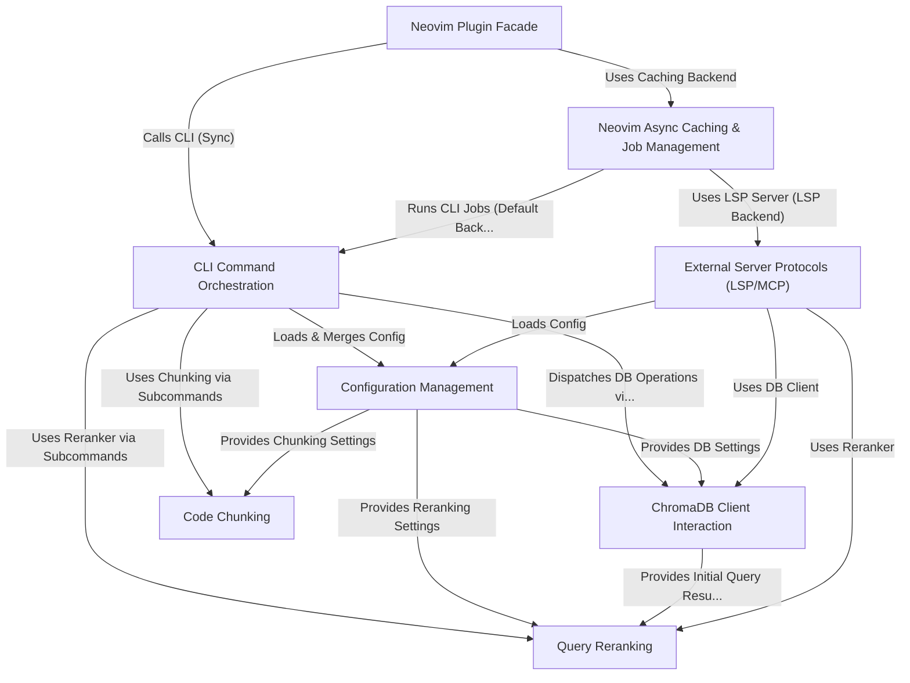

# Tutorial: VectorCode

VectorCode is a tool that helps you *search your code* using natural language.
It breaks down your source code into pieces (**chunks**), converts them into mathematical representations (**embeddings**), and stores them in a specialized **vector database** (ChromaDB).
You can then ask questions or provide keywords, and VectorCode finds the most *semantically similar* code snippets.
It works as a **command-line tool (CLI)** and also offers a **Neovim plugin** for seamless editor integration, along with standard **server protocols** (LSP/MCP) for interacting with other development tools.

**Source Repository:** [None](None)

## Chapters

1. [ChromaDB Client Interaction
](01_chromadb_client_interaction_.md)
2. [Code Chunking
](02_code_chunking_.md)
3. [CLI Command Orchestration
](03_cli_command_orchestration_.md)
4. [Query Reranking
](04_query_reranking_.md)
5. [Configuration Management
](05_configuration_management_.md)
6. [Neovim Plugin Facade
](06_neovim_plugin_facade_.md)
7. [Neovim Async Caching & Job Management
](07_neovim_async_caching___job_management_.md)
8. [External Server Protocols (LSP/MCP)
](08_external_server_protocols__lsp_mcp__.md)

---

Generated by [AI Codebase Knowledge Builder](https://github.com/The-Pocket/Tutorial-Codebase-Knowledge)