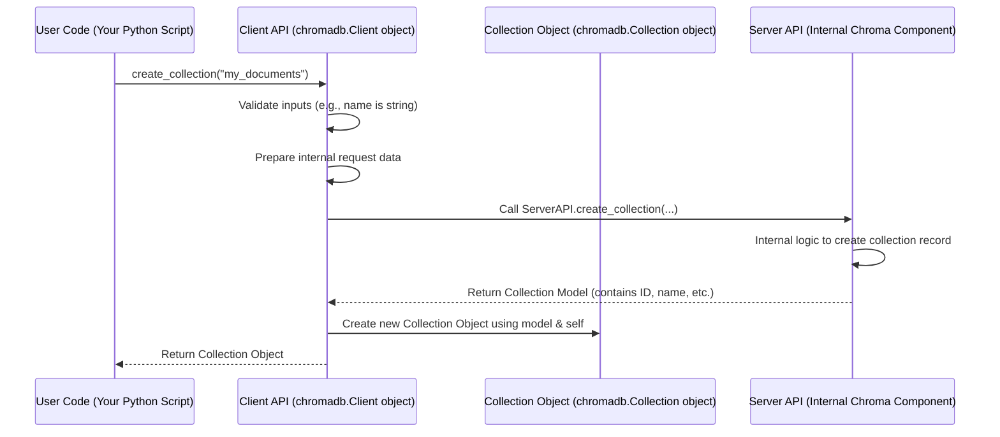

# Chapter 1: Client API

Welcome to the Chroma tutorial! In this first chapter, we'll learn about the primary way you'll interact with Chroma: the **Client API**.

Imagine you have a collection of notes, documents, or images, and you want to be able to quickly find ones that are similar to each other, even if they don't contain the exact same words. This is where Chroma, a vector database, comes in. But how do you tell Chroma what to store, what to search for, and how to manage your data?

That's the job of the **Client API**.

Think of the Chroma Client API as the dashboard or remote control for your vector database. It's a set of tools (specifically, Python classes and methods) that allow your application to connect to Chroma and perform actions like adding data, searching for similar data, and organizing your information.

It hides the complexity of communicating directly with the underlying Chroma server, handling details like sending data back and forth, validating your requests, and managing connections. You just use simple Python commands, and the Client API makes it happen.

In this chapter, we will focus on how to use the Client API to perform basic operations, guiding you through a simple use case: storing and searching small text snippets.

## Getting Started with the Client API

The first thing you need to do is get a `Client` object. There are a few ways to do this depending on where your Chroma database is running. For this beginner tutorial, we'll start with the simplest: an in-memory client. This type of client runs entirely within your Python program's memory and is great for testing and trying things out.

You get an in-memory client using the `chromadb.EphemeralClient()` function:

```python
import chromadb

# Create a temporary, in-memory Chroma client
client = chromadb.EphemeralClient()

# A simple check to see if the client is responsive
print(client.heartbeat())
```
*   The `import chromadb` line brings the Chroma library into your Python code.
*   `chromadb.EphemeralClient()` creates our in-memory client instance. We assign it to a variable named `client`.
*   `client.heartbeat()` is a simple method available on the client to check if it's running. It returns a timestamp.

Other ways to create clients include `chromadb.PersistentClient()` for a local database stored on disk, and `chromadb.HttpClient()` for connecting to a separate Chroma server process (which is recommended for production). The `Client` object you get from any of these methods offers largely the same set of operations. There's also an `AsyncClient` for asynchronous operations, but we'll stick to the standard synchronous `Client` for now.

## Organizing Your Data: Collections

In Chroma, data is organized into **Collections**. A collection is like a folder or a table where you store related data. You can have multiple collections in a single Chroma instance, each completely separate from the others.

You use the Client API to create and manage these collections. Let's create a collection named `my_documents` for our text snippets:

```python
# Assuming you have the 'client' from the previous step

# Create a new collection
# The Client API sends this request to Chroma
collection = client.create_collection(name="my_documents")

print(f"Collection '{collection.name}' created!")
print(f"ID: {collection.id}")
```
*   `client.create_collection(name="my_documents")` tells the client to create a collection named "my\_documents".
*   The Client API communicates with Chroma (in this case, the in-memory database) to make this happen.
*   If successful, it returns a `Collection` object, which we store in the `collection` variable. This `Collection` object is your handle for interacting with the data *within* this specific collection.
*   We print the collection's name and a unique ID that Chroma assigns to it.

You can also get an existing collection by its name:

```python
# Get the collection we just created
same_collection = client.get_collection(name="my_documents")

print(f"Retrieved collection: {same_collection.name}")
```
This is useful if your program already knows the name of a collection it needs to work with.

To see all your collections, you can use `list_collections()`:

```python
# List all collections managed by this client
all_collections = client.list_collections()

print("All collections:")
for c in all_collections:
    print(f"- {c.name}")
```

And to clean up, you can delete a collection:

```python
# Delete the collection
client.delete_collection(name="my_documents")

print("Collection deleted.")

# Check if it's gone
print("Remaining collections:")
print(client.list_collections())
```

## Working with Data within a Collection

Once you have a `Collection` object, you can perform operations on the data inside it, such as adding documents, retrieving them, updating them, deleting them, and most importantly, querying for similar items.

Let's recreate our collection and add some simple text documents. When you add documents, Chroma needs to convert them into numerical representations called "embeddings". By default, the Client API uses a default embedding function for you (we'll learn more about [Embedding Function](02_embedding_function_.md) in the next chapter!). You just provide the documents and unique IDs for each one.

```python
# Recreate the collection
collection = client.create_collection(name="my_documents")

# Add some documents to the collection
collection.add(
    documents=[
        "The quick brown fox jumps over the lazy dogs.",
        "A vector database stores embeddings and metadata.",
        "Chroma is a great open-source vector database.",
        "The lazy dogs slept all day.",
    ],
    ids=[
        "doc1",
        "doc2",
        "doc3",
        "doc4",
    ]
)

# Check how many items are in the collection
print(f"Number of items in collection: {collection.count()}")
```
*   `collection.add()` is the method used to add data.
*   We provide a list of `documents` (the text content) and a corresponding list of unique `ids` for each document.
*   The Client API sends this data to Chroma. Chroma processes the documents (using the embedding function) and stores the resulting embeddings, documents, and IDs.
*   `collection.count()` retrieves the total number of items currently stored in the collection.

Now that we have data in the collection, let's try searching! We'll use the `query()` method to find documents similar to a given text phrase.

```python
# Query the collection to find similar documents
# We'll search for documents similar to the phrase "vector database"
results = collection.query(
    query_texts=["Tell me about vector databases"],
    n_results=2 # We want the 2 most similar results
)

print("Query Results:")
print(results)
```
*   `collection.query()` is used for similarity search.
*   `query_texts=["Tell me about vector databases"]` is the phrase we want to use as our search query. The Client API will embed this text using the same embedding function as the documents in the collection.
*   `n_results=2` tells Chroma to return the 2 most similar documents to our query.
*   The result is a dictionary containing lists of information for the nearest neighbors found, including their IDs, documents, and the distances (similarity scores) to the query. Notice how 'doc2' and 'doc3' (about vector databases) are returned.

You can also use `get()` to retrieve items by their IDs or based on metadata filters (we didn't add metadata in this simple example, but you could!).

```python
# Retrieve a specific item by its ID
get_result = collection.get(ids=["doc1"])
print("\nRetrieved item 'doc1':")
print(get_result)
```

These examples show the core power of the Client API: providing simple Python methods (`create_collection`, `add`, `query`, `get`, etc.) to interact with your vector database.

## Under the Hood: How the Client API Works

So, what actually happens when you call one of these methods on the `client` or `collection` objects?

The Client API acts as a translator and communicator. When you call a method like `create_collection("my_documents")`, the Python `Client` object doesn't directly manipulate the database storage. Instead, it takes your request, formats it correctly, and sends it to the core Chroma "Server API" component. The Server API is the part of Chroma responsible for the actual database operations.

Here's a simplified sequence of what happens when you create a collection:



The Client API (`chromadb/api/client.py` and `chromadb/api/async_client.py`) primarily delegates the work to an internal `ServerAPI` instance. The `ServerAPI` then handles the actual interaction with Chroma's storage and indexing components.

For example, look at a simplified version of the `Client.create_collection` method:

```python
# Simplified snippet from chromadb/api/client.py
class Client(...):
    # ... other methods ...

    def create_collection( # ... arguments ... ) -> Collection:
        # ... validation and setup ...

        # Call the internal server API
        model = self._server.create_collection(
            name=name,
            metadata=metadata,
            tenant=self.tenant, # Client keeps track of tenant/database
            database=self.database,
            get_or_create=get_or_create,
            configuration=configuration,
        )

        # Wrap the result (the collection model from the server)
        # in a user-friendly Collection object
        return Collection(
            client=self._server, # The Collection object also needs a link back to the server
            model=model,
            embedding_function=embedding_function,
            data_loader=data_loader,
        )

# Simplified snippet from chromadb/__init__.py
def EphemeralClient(...):
    # ... settings setup ...
    return ClientCreator(settings=settings, tenant=tenant, database=database)

# ClientCreator is likely the 'Client' class itself or a wrapper around it.
```
The `Client.create_collection` method doesn't implement the collection creation logic itself. It calls `self._server.create_collection`. The Server API returns a simple data structure (`CollectionModel`), and the `Client` then wraps this data structure in the more user-friendly `Collection` object that you interact with.

Similarly, when you call methods on the `Collection` object (like `add`, `get`, `query`), the `Collection` object itself doesn't do the work. It uses the reference back to the `_client` (which is actually the `ServerAPI` instance in this setup) to perform the operation, passing along the collection's ID, tenant, and database.

Here's a simplified snippet from `chromadb/api/models/Collection.py`:

```python
# Simplified snippet from chromadb/api/models/Collection.py
class Collection(CollectionCommon["ServerAPI"]):
    # ... initialization and properties ...

    def add( # ... arguments like ids, documents ...):
        # ... validation and preparation (including embedding if needed) ...
        add_request = self._validate_and_prepare_add_request(...)

        # Call the internal server API via the _client attribute
        self._client._add(
            collection_id=self.id, # The Collection object knows its ID
            ids=add_request["ids"],
            embeddings=add_request["embeddings"], # Embeddings are ready now
            metadatas=add_request["metadatas"],
            documents=add_request["documents"],
            uris=add_request["uris"],
            tenant=self.tenant, # Collection object also knows tenant/database
            database=self.database,
        )

    # Similar delegation happens for get, query, update, delete, etc.
    # For example, the query method calls self._client._query(...)
    def query( # ... arguments ...):
        # ... validation and preparation ...
        query_request = self._validate_and_prepare_query_request(...)

        # Call the internal server API via the _client attribute
        query_results = self._client._query(
            collection_id=self.id, # Collection knows its ID
            query_embeddings=query_request["embeddings"],
            n_results=query_request["n_results"],
            where=query_request["where"],
            where_document=query_request["where_document"],
            include=query_request["include"],
            tenant=self.tenant, # Collection object also knows tenant/database
            database=self.database,
        )

        # Transforms the raw results from the server into the expected QueryResult format
        return self._transform_query_response( # ... )

```
This layered structure (User Code -> Client API -> Server API) is a common design pattern that keeps things organized. The Client API provides a stable, easy-to-use interface for you, regardless of how the underlying Server API is implemented or where the Chroma database is physically located.

## Conclusion

In this chapter, we learned that the Chroma Client API is your primary tool for interacting with Chroma from your applications. It provides a convenient Python interface (`Client` and `Collection` objects) to manage your collections and perform vector database operations like adding, getting, and querying data. We saw how to create a basic client, manage collections, and add/query simple documents.

The Client API simplifies interaction by handling the communication with the core Chroma server components for you.

In the next chapter, we'll dive deeper into a crucial concept hinted at in this chapter: the [Embedding Function](02_embedding_function_.md). This is the part of the system that translates your documents, images, or other data into the numerical embeddings that Chroma uses for similarity search.

---

Generated by [AI Codebase Knowledge Builder](https://github.com/The-Pocket/Tutorial-Codebase-Knowledge)