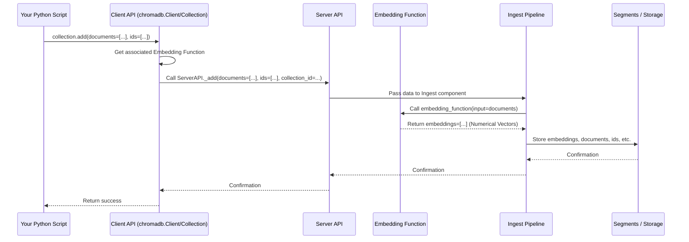
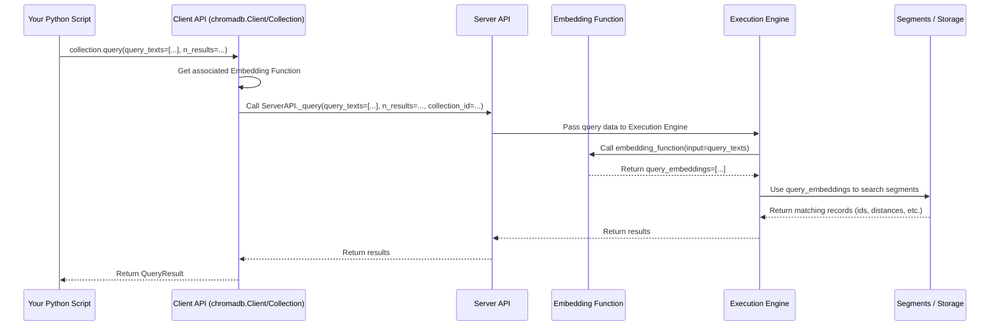

# Chapter 2: Embedding Function

In [Chapter 1: Client API](01_client_api_.md), we learned how to use Chroma's Client API to create collections, add documents, and perform searches. We saw that when you `add` text documents or `query` with text, Chroma somehow figures out which documents are similar.

But how does Chroma, which fundamentally stores and searches *numerical vectors*, understand the meaning of your text documents like "The quick brown fox jumps over the lazy dogs" or "A vector database stores embeddings and metadata"?

The answer lies in the **Embedding Function**.

Think of the Embedding Function as a *universal translator*. Its job is to take your raw data – whether it's text, an image, or even a sound clip – and convert it into a numerical language that computers (and Chroma) can understand and compare based on meaning. This numerical representation is called an **embedding**, which is just a list (or vector) of numbers.

```mermaid
graph TD
    A[Your Data<br/>(Text, Image, etc.)] --> B{Embedding Function}
    B --> C[Numerical Vector<br/>(Embedding)]
    C --> D[Chroma Database<br/>(Stores & Searches Vectors)]
```

Why are these vectors so important? Because vectors that are numerically *close* to each other in space often represent data that is *semantically* similar in meaning. The Embedding Function is what creates this link between meaning and numerical representation. Chroma then uses these vectors to power its similarity search.

## Using an Embedding Function

In [Chapter 1: Client API](01_client_api_.md), when we called `collection.add()` with just `documents` and `ids`, Chroma automatically used a **default Embedding Function** for you. This is super convenient for getting started!

```python
import chromadb

# Create an in-memory client (like in Chapter 1)
client = chromadb.EphemeralClient()

# Create a collection - Chroma uses the default embedding function here
collection = client.create_collection(name="my_documents_with_default_ef")

print(f"Collection '{collection.name}' created with default embedding function.")

# Adding documents uses the default embedding function implicitly
collection.add(
    documents=[
        "This is the first document.",
        "This is the second document.",
    ],
    ids=["doc1", "doc2"]
)

print(f"Added {collection.count()} documents.")
```

The default embedding function is a good starting point, often using a widely available model like `all-MiniLM-L6-v2` (which is efficient and runs locally). However, for more specific tasks or different data types (like images), you might want to choose a different Embedding Function.

You can explicitly specify which Embedding Function to use when you **create a collection**. Once a collection is created with a specific Embedding Function, you **must** use that same function (or one that produces vectors of the same size and meaning) for all data added to and queried from that collection.

Let's create a new collection and specify a different built-in Embedding Function. Chroma provides several built-in functions for common tasks and models. For example, `SentenceTransformerEmbeddingFunction` allows you to use various models from the `sentence-transformers` library.

```python
import chromadb
# Import a specific built-in Embedding Function
from chromadb.utils.embedding_functions import SentenceTransformerEmbeddingFunction

# Create an in-memory client
client = chromadb.EphemeralClient()

# Define the embedding function you want to use
# This function will load a model (Sentence Transformer model)
# You need the 'sentence-transformers' library installed: pip install sentence-transformers
my_embedding_function = SentenceTransformerEmbeddingFunction(model_name="all-MiniLM-L6-v2")

# Create a collection and pass your chosen embedding function
# Chroma now knows to use 'my_embedding_function' for this collection
collection_with_custom_ef = client.create_collection(
    name="my_documents_with_custom_ef",
    embedding_function=my_embedding_function # Explicitly provide the EF
)

print(f"Collection '{collection_with_custom_ef.name}' created with a custom embedding function.")

# Now, add documents. The Collection object automatically uses the specified EF.
collection_with_custom_ef.add(
    documents=[
        "The sky is blue.",
        "The grass is green.",
        "What is the capital of France?",
    ],
    ids=["color1", "color2", "fact1"]
)

print(f"Added {collection_with_custom_ef.count()} documents.")
```

When you call `add` or `query` on `collection_with_custom_ef`, Chroma will use `my_embedding_function` to convert the provided documents or query texts into vectors.

Now, let's query this collection:

```python
# Assuming collection_with_custom_ef is already created and populated

# Query the collection
# The Collection object automatically uses its assigned embedding function
results = collection_with_custom_ef.query(
    query_texts=["Tell me about nature colors"],
    n_results=2
)

print("\nQuery Results (using the custom EF):")
# Print the results nicely
for i, doc_ids in enumerate(results['ids']):
    print(f"Query result {i+1}:")
    for j, doc_id in enumerate(doc_ids):
        print(f"  ID: {doc_id}")
        # documents might not be included by default in query results, let's check if it exists
        if results['documents'] and results['documents'][i] and results['documents'][i][j]:
             print(f"  Document: {results['documents'][i][j]}")
        # distances might be included
        if results['distances'] and results['distances'][i] and results['distances'][i][j]:
             print(f"  Distance: {results['distances'][i][j]:.4f}")

# Example output might look something like:
# Query Results (using the custom EF):
# Query result 1:
#   ID: color2
#   Document: The grass is green.
#   Distance: 0.8751
# Query result 1:
#   ID: color1
#   Document: The sky is blue.
#   Distance: 0.8922
```

Notice how we didn't need to pass the `my_embedding_function` explicitly to the `add` or `query` calls. The `Collection` object holds onto the Embedding Function you specified during creation and uses it automatically.

### Providing Your Own Embeddings

What if you already have your data pre-embedded? Or what if you are using an Embedding Function that Chroma doesn't have built-in? You can provide the embeddings directly when adding data.

```python
# Assuming client is created

# Create a collection WITHOUT specifying an embedding function
# This is suitable if you plan to ALWAYS provide embeddings yourself
collection_no_ef = client.create_collection(name="my_documents_with_provided_embeddings")

print(f"Collection '{collection_no_ef.name}' created without a built-in embedding function.")

# Example dummy embeddings (replace with real ones from your source)
# These should be numpy arrays or lists of floats/ints
embedding1 = [0.1, 0.2, 0.3, 0.4]
embedding2 = [0.5, 0.6, 0.7, 0.8]

# Add documents AND provide the embeddings
collection_no_ef.add(
    documents=["Document A", "Document B"],
    ids=["docA", "docB"],
    embeddings=[embedding1, embedding2] # Provide the embeddings here
)

print(f"Added {collection_no_ef.count()} documents with provided embeddings.")

# Now, when querying, you MUST provide the query embedding yourself
# You'll need to use the same external method/function that generated the original embeddings
query_embedding = [0.15, 0.25, 0.35, 0.45] # Dummy query embedding

# Query with the provided embedding
results = collection_no_ef.query(
    query_embeddings=[query_embedding], # Provide query embedding directly
    n_results=1
)

print("\nQuery Results (using provided embeddings):")
print(results)

# Example output might look something like:
# Query Results (using provided embeddings):
# {'ids': [['docA']], 'embeddings': None, 'documents': [['Document A']], 'uris': None, 'data': None, 'metadatas': [None], 'distances': [[0.0050000000000000044]]}
```

If you create a collection without specifying an `embedding_function` and then try to `add` or `query` with only `documents` (and no `embeddings`), Chroma will raise an error because it doesn't know how to convert your data into vectors.

## Built-in Embedding Functions

Chroma ships with several ready-to-use Embedding Functions, often wrapping popular open-source libraries or commercial APIs. Some examples include:

*   `SentenceTransformerEmbeddingFunction`: Uses models from the `sentence-transformers` library (requires `sentence-transformers` installed).
*   `ONNXMiniLM_L6_V2`: A fast, local, text-based model that doesn't require extra dependencies after Chroma installation (this is the default one).
*   `OpenAIEmbeddingFunction`: Uses OpenAI's text embedding models (requires `openai` installed and an API key).
*   `CohereEmbeddingFunction`: Uses Cohere's embedding models (requires `cohere` installed and an API key).
*   `HuggingFaceEmbeddingFunction`: Uses models via the Hugging Face Inference API (requires `httpx` installed and an API key).
*   `GoogleGenerativeAiEmbeddingFunction`: Uses Google's generative AI models (requires `google-generativeai` installed and an API key).
*   `OpenCLIPEmbeddingFunction`: Can embed both text and images (requires `open_clip_torch`, `torch`, `pillow`).
*   And many more! (See `chromadb.utils.embedding_functions.__init__.py` in the codebase if you're curious).

You instantiate them like any Python class, providing necessary parameters (like API keys, model names, etc.), and then pass the instance to `client.create_collection` or `client.get_or_create_collection`.

```python
# Example of using another built-in EF (requires 'openai' and API key env var)
from chromadb.utils.embedding_functions import OpenAIEmbeddingFunction
import os

# Make sure you have OPENAI_API_KEY set in your environment
# os.environ["OPENAI_API_KEY"] = "YOUR_API_KEY"

try:
    openai_ef = OpenAIEmbeddingFunction(model_name="text-embedding-ada-002")
    openai_collection = client.create_collection(
        name="openai_embeddings_collection",
        embedding_function=openai_ef
    )
    print("OpenAI embedding function collection created.")
    # You could now add/query data using OpenAI embeddings
    # openai_collection.add(...)
    # openai_collection.query(...)

except ValueError as e:
    print(f"Could not create OpenAI collection: {e}")
    print("Make sure you have the 'openai' library installed and your API key is set.")

```

Choosing the right Embedding Function depends entirely on your data type and use case. Text search usually requires a text embedding model, while image similarity requires an image embedding model (like OpenCLIP). Different models will also capture different nuances and semantic meanings.

## Custom Embedding Functions

For advanced users, Chroma allows you to provide your own Python class that acts as an Embedding Function. This class must implement a specific `__call__` method that takes the raw data (like a list of documents or images) and returns a list of numerical vectors (embeddings).

This is useful if you have:
*   A proprietary or internal embedding model.
*   A model wrapped in a library that Chroma doesn't support out-of-the-box.
*   A complex preprocessing pipeline before embedding.

You would define your class implementing the `EmbeddingFunction` protocol (imported from `chromadb.api.types`) and then pass an instance of your class to `create_collection`, just like the built-in ones.

*(Note: Implementing a custom Embedding Function is beyond the scope of this beginner chapter, but the option exists!)*

## Under the Hood: Where the Embedding Happens

So, when you call `collection.add()` or `collection.query()` with raw data (like documents or images) and an Embedding Function is associated with the collection, where does the translation happen?

Let's look at a simplified flow for adding documents:



When you call `collection.add`, the [Client API](01_client_api_.md) gets the data and sends it to the core Chroma Server API. The Server API passes this data (including the documents) to the Ingest pipeline. The Ingest component is responsible for processing the data before it's stored. It looks at the Collection's configuration to see if an Embedding Function is specified. If it is, the Ingest component *calls* the Embedding Function, passing the documents (or other data) to its `__call__` method. The Embedding Function then does its work (loading models, calling APIs, etc.) and returns the numerical embeddings. These embeddings, along with the original documents and IDs, are then stored in the underlying [Segments](07_segments_.md) (Chroma's storage layers).

A similar process happens during `collection.query()`:



When you call `collection.query` with `query_texts`, the [Client API](01_client_api_.md) sends the text to the Server API. The Server API passes this to the Execution Engine (responsible for handling queries). The Execution Engine retrieves the Embedding Function associated with the collection, calls it with your `query_texts`, and gets back the numerical `query_embeddings`. The Execution Engine then uses these `query_embeddings` to perform the similarity search against the vectors stored in the [Segments](07_segments_.md).

The `EmbeddingFunction` in Python is simply a class with a `__call__` method. Here's a simplified look at what that looks like in one of the built-in EFs (like `ONNXMiniLM_L6_V2`):

```python
# Simplified snippet from chromadb/utils/embedding_functions/onnx_mini_lm_l6_v2.py
class ONNXMiniLM_L6_V2(EmbeddingFunction[Documents]):
    # ... initialization and model loading details skipped ...

    def __call__(self, input: Documents) -> Embeddings:
        """
        Generate embeddings for the given documents.

        Args:
            input: Documents (list of strings) to generate embeddings for.

        Returns:
            Embeddings (list of numpy arrays) for the documents.
        """
        # The actual encoding logic happens here, calling the underlying ONNX model
        embeddings = self._forward(list(input)) # Calls an internal method that uses ONNX Runtime

        # Convert to list of numpy arrays for the expected Embeddings type
        return [np.array(embedding, dtype=np.float32) for embedding in embeddings]

    @staticmethod
    def name() -> str:
        return "onnx_mini_lm_l6_v2"

    # ... other methods like get_config, build_from_config, etc. skipped ...
```

The core idea is that the `__call__` method takes the raw input data (`input: Documents` in this case) and produces the `Embeddings` (list of vectors). Chroma relies on this standard interface to integrate different embedding models seamlessly.

## Conclusion

In this chapter, we explored the **Embedding Function**, the critical component that translates your raw data (like text or images) into numerical vector representations (embeddings). These embeddings are the language Chroma uses to understand and find similar data.

We learned that:
*   Chroma uses a default Embedding Function if you don't specify one.
*   You can choose a specific built-in Embedding Function when creating a collection.
*   Once set, the Collection uses this Embedding Function automatically for `add` and `query`.
*   You can also provide embeddings directly if you handle the conversion outside of Chroma.
*   The Embedding Function's `__call__` method is where the conversion happens, called by Chroma's internal components during data ingestion and querying.

Understanding the Embedding Function is key to knowing how Chroma interprets your data's meaning. In the next chapter, we will look at the **Server API**, which is the central hub that receives requests from the Client API and orchestrates the operations, including using the Embedding Function.

[Chapter 3: Server API](03_server_api_.md)

---

Generated by [AI Codebase Knowledge Builder](https://github.com/The-Pocket/Tutorial-Codebase-Knowledge)