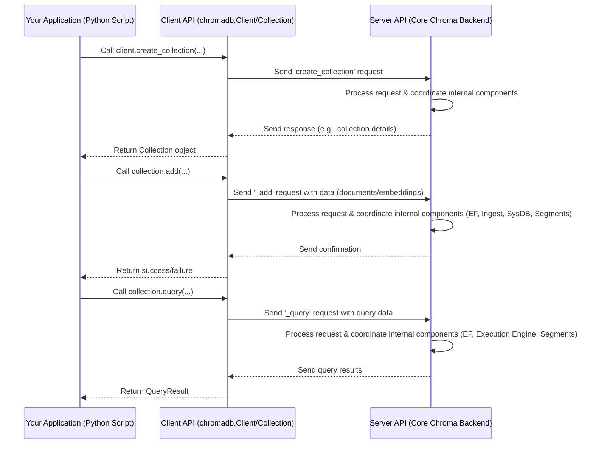
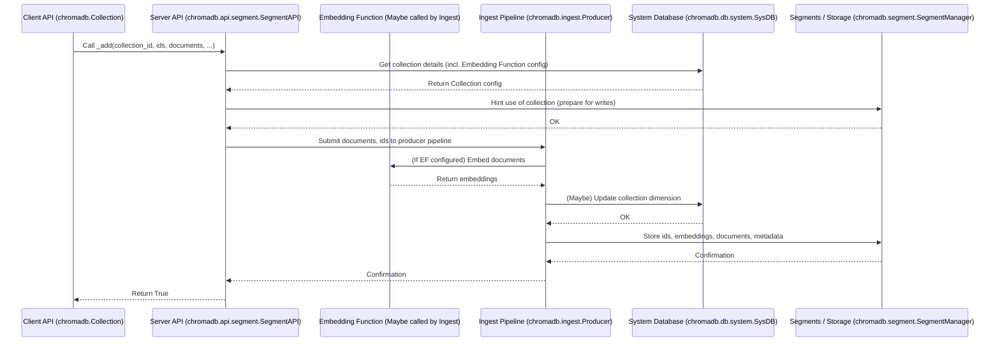
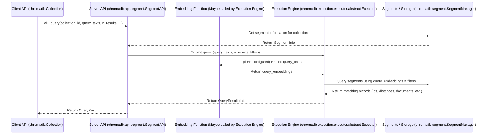

# Chapter 3: Server API

In [Chapter 1: Client API](01_client_api_.md), we learned that the Client API is the Python interface you use to tell Chroma what you want to do – create collections, add data, search for similar items. In [Chapter 2: Embedding Function](02_embedding_function_.md), we discovered the crucial role of the Embedding Function in translating your data into the numerical vectors Chroma understands.

But where do these requests go? And who is responsible for actually *doing* the work: managing the collections, calling the Embedding Function (if needed), storing the vectors, and performing the searches?

That's the job of the **Server API**.

Think of the Server API as the central command center or the main server application running in the background. While the Client API is like your dashboard or remote control, the Server API is the powerful machinery that receives those instructions and orchestrates everything that needs to happen within Chroma to fulfill your request.

It's the part of Chroma that listens on a network port (if you're running Chroma in client-server mode) or is directly embedded within your program (if you're using an in-memory or persistent client). It's the first point of contact for your requests after they leave the Client API.

The Server API defines the **contract** for what operations the Chroma server can perform. The Client API is built *on top* of this contract – it knows which functions the Server API provides and how to call them.

You won't typically interact *directly* with the Server API yourself when using Chroma. The Client API handles all communication with the Server API for you. But understanding its role is key to understanding how Chroma works internally.

## How Requests Flow to the Server API

Let's revisit the diagram from Chapter 1, slightly expanded to show the Server API's place:



As you can see, the Client API acts as the messenger and translator. When you call a user-friendly method like `collection.add()`, the Client API translates this into a request that the Server API understands and sends it across.

If you peek back at the simplified Client API code from Chapter 1, you'll see how it calls methods on an internal `_server` attribute:

```python
# Simplified snippet from chromadb/api/client.py (revisiting Chapter 1)
class Client(...):
    # ... initialization ...
    _server: "ServerAPI" # The Client holds a reference to the ServerAPI

    def create_collection( # ... arguments ... ) -> Collection:
        # ... validation and setup ...

        # Call the internal server API's method
        model = self._server.create_collection(...)

        # Wrap the server's response in a user-friendly Collection object
        return Collection(client=self._server, model=model, ...)

# Simplified snippet from chromadb/api/models/Collection.py (revisiting Chapter 1)
class Collection(...):
    # ... initialization ...
    _client: "ServerAPI" # The Collection object also holds a reference

    def add( # ... arguments like ids, documents ...):
        # ... validation and preparation ...

        # Call the internal server API's method
        self._client._add(
            collection_id=self.id, # Pass collection info
            ids=add_request["ids"],
            embeddings=add_request["embeddings"], # Embeddings ready (maybe via EF)
            metadatas=add_request["metadatas"],
            documents=add_request["documents"],
            uris=add_request["uris"],
            tenant=self.tenant, # Pass tenant/database info
            database=self.database,
        )
    # Similar calls happen for _get, _query, _update, _delete
```

This shows that the Client API's main job is to:
1.  Take your input.
2.  Perform any necessary client-side validation or preparation (like calling the [Embedding Function](02_embedding_function_.md) if you provided raw data).
3.  Call the corresponding method on the internal `ServerAPI` instance (`self._server` or `self._client` in these snippets).
4.  Receive the response from the Server API.
5.  Format the response into the nice Python objects you expect (like the `Collection` object or the `QueryResult` dictionary).

The `ServerAPI` itself defines the blueprint for these core server-side operations like `create_collection`, `_add`, `_get`, `_query`, etc. You'll notice some methods like `_add`, `_get`, `_query` have a leading underscore. This is a convention in Chroma indicating they are typically called *internally* by the Client API or other parts of the system, rather than directly by an end user.

## What the Server API Does Internally

The Server API is not a single block of code that does *everything*. It's a coordinator. When it receives a request from the Client API, it delegates tasks to specialized internal components. (We'll explore these components in more detail in [Chapter 4: System and Components](04_system_and_components_.md)).

Let's trace what might happen for an `add` request when you provide `documents` and the collection has an [Embedding Function](02_embedding_function_.md) configured:



And for a `query` request using `query_texts`:



These diagrams illustrate the Server API's role: it's the crucial layer that receives the request and coordinates the specialized components to perform the actual work. It retrieves necessary information (like collection configuration) from the [System Database (SysDB)](05_system_database__sysdb__.md), potentially involves the [Embedding Function](02_embedding_function_.md) for data transformation, sends data through the [Ingest (Producer/Consumer)](06_ingest__producer_consumer__.md) pipeline for writes, and uses the [Execution Engine](08_execution_engine_.md) to perform searches against the [Segments](07_segments_.md).

## Looking at the Server API Code

In the Chroma codebase, the core definition of the Server API interface is found in `chromadb/api/__init__.py`. This file defines Python `ABC` (Abstract Base Classes) like `ServerAPI`, outlining the methods that any Server API implementation must provide.

Here's a simplified look at some methods defined in the `ServerAPI` abstract class:

```python
# Simplified snippet from chromadb/api/__init__.py
from abc import ABC, abstractmethod
from typing import Optional, Sequence
from uuid import UUID
# Import necessary types like CollectionModel, Embeddings, etc.
from chromadb.types import Collection as CollectionModel
from chromadb.api.types import (
    Embeddings, IDs, Metadatas, Documents, URIs,
    Where, WhereDocument, Include, GetResult, QueryResult, CollectionMetadata
)

class ServerAPI(ABC):
    """An API instance that extends the relevant Base API methods by passing
    in a tenant and database. This is the root component of the Chroma System"""

    # Methods for managing collections
    @abstractmethod
    def create_collection( # ... args like name, metadata, tenant, database ...) -> CollectionModel:
        pass

    @abstractmethod
    def get_collection( # ... args like name, tenant, database ...) -> CollectionModel:
        pass

    @abstractmethod
    def delete_collection( # ... args like name, tenant, database ...) -> None:
        pass

    @abstractmethod
    def list_collections( # ... args like limit, offset, tenant, database ...) -> Sequence[CollectionModel]:
        pass

    @abstractmethod
    def count_collections( # ... args like tenant, database ...) -> int:
        pass

    # Methods for managing items within a collection (often called internally)
    @abstractmethod
    def _add( # ... args like ids, collection_id, embeddings, metadatas, documents, ... tenant, database ...) -> bool:
        pass

    @abstractmethod
    def _get( # ... args like collection_id, ids, where, limit, ... tenant, database ...) -> GetResult:
        pass

    @abstractmethod
    def _delete( # ... args like collection_id, ids, where, ... tenant, database ...) -> None:
        pass

    @abstractmethod
    def _query( # ... args like collection_id, query_embeddings, n_results, where, ... tenant, database ...) -> QueryResult:
        pass

    # ... other methods like _update, _upsert, heartbeat, reset, etc. ...

```

Different parts of Chroma provide concrete implementations of this `ServerAPI` interface. For example:

*   `chromadb/api/segment.py` contains `SegmentAPI`, the primary in-process implementation used by `EphemeralClient` and `PersistentClient`. This implementation coordinates the core internal components like SysDB, Segment Manager, Ingest, and Execution Engine.
*   `chromadb/api/fastapi.py` contains `FastAPI` (despite the name, this is a `ServerAPI` implementation that *connects to* a server running the FastAPI application). This implementation sends requests over HTTP to a separate server process.
*   `chromadb/api/async_fastapi.py` is the asynchronous version of the above.
*   `chromadb/api/rust.py` contains `RustBindingsAPI`, another in-process implementation that talks to Chroma's Rust core via bindings.

Let's look at a *very* simplified snippet from the `SegmentAPI` (in `chromadb/api/segment.py`) to see how it implements the `_add` method and coordinates other components:

```python
# Simplified snippet from chromadb/api/segment.py
class SegmentAPI(ServerAPI):
    _sysdb: SysDB # SegmentAPI has references to other components
    _manager: SegmentManager
    _executor: Executor
    _producer: Producer
    # ... other components ...

    def __init__(self, system: System):
        super().__init__(system)
        # Get instances of other components from the system
        self._sysdb = self.require(SysDB)
        self._manager = self.require(SegmentManager)
        self._executor = self.require(Executor)
        self._producer = self.require(Producer)
        # ... initialize other components ...

    # ... other methods ...

    @override # Indicates this implements the method from the base class
    # The method takes collection_id, ids, embeddings, metadatas, documents, uris, etc.
    def _add( self, ids, collection_id, embeddings, metadatas, documents, uris, tenant, database) -> bool:

        # 1. Get collection details (e.g., dimension, configuration) from SysDB
        # This is simplified, often this happens indirectly or is cached
        # coll = self._get_collection(collection_id)

        # 2. Hint the segment manager about the operation
        self._manager.hint_use_collection(collection_id, t.Operation.ADD)

        # 3. Prepare records for the ingestion pipeline
        # This involves converting inputs into OperationRecord objects
        records_to_submit = list( _records(t.Operation.ADD, ids, embeddings, metadatas, documents, uris) )

        # 4. Validate the dimension (might check against collection config from SysDB)
        # self._validate_embedding_record_set(coll, records_to_submit)

        # 5. Submit the records to the ingestion producer
        # The producer will handle sending these records to the rest of the pipeline (Ingest, Segments)
        self._producer.submit_embeddings(collection_id, records_to_submit)

        # 6. (Telemetry/Metrics)
        # self._product_telemetry_client.capture(...)

        return True # Indicate success

    # ... _query, _get, _delete methods show similar coordination ...
```

This simplified example shows how the `SegmentAPI` implementation of `_add` doesn't directly write data to disk or memory. Instead, it uses its references to other components (`_manager`, `_producer`) to push the data into the system's pipeline. The actual storing of data will happen later in the [Ingest (Producer/Consumer)](06_ingest__producer_consumer__.md) and [Segments](07_segments_.md) components.

Similarly, the `_query` method in `SegmentAPI` would primarily involve the `_executor`:

```python
# Simplified snippet from chromadb/api/segment.py
class SegmentAPI(ServerAPI):
    # ... other components ...
    _executor: Executor # SegmentAPI has a reference to the executor

    # ... other methods ...

    @override
    # The method takes collection_id, query_embeddings (already embedded!), n_results, where, etc.
    def _query(self, collection_id, query_embeddings, n_results, where, where_document, include, tenant, database) -> QueryResult:

        # 1. Prepare a Scan object (describes the collection and its segments)
        scan = self._scan(collection_id) # This call likely involves the SysDB/SegmentManager

        # 2. Validate query embeddings dimension (against collection config)
        # self._validate_dimension(scan.collection, len(query_embeddings[0]), update=False)

        # 3. Perform the query using the Execution Engine
        # The Executor receives a "plan" object describing the operation (KNN search with filters)
        # The Executor will interact with the Segments to get the results
        query_results = self._executor.knn(
            KNNPlan( # Plan for K-Nearest Neighbors search
                scan, # Information about the collection/segments
                KNN(query_embeddings, n_results), # The core KNN search
                Filter(None, where, where_document), # Apply metadata/document filters
                Projection(...), # Which fields to include (documents, metadata, distances)
            )
        )

        # 4. (Telemetry/Metrics)
        # self._product_telemetry_client.capture(...)

        return query_results # Return the raw results from the executor
```

This again highlights the delegation pattern. The Server API receives the query, does some initial setup (like validating dimension and getting collection info), and then passes the core task (the similarity search) to the `_executor` component.

## Conclusion

In this chapter, we learned that the **Server API** is the core backend component in Chroma that receives requests initiated by the [Client API](01_client_api_.md). It acts as the central orchestrator, coordinating various specialized internal components like the [System Database (SysDB)](05_system_database__sysdb__.md), [Embedding Function](02_embedding_function_.md) (if used), [Ingest (Producer/Consumer)](06_ingest__producer_consumer__.md) pipeline, [Segments](07_segments_.md), and [Execution Engine](08_execution_engine_.md) to fulfill those requests.

While you don't interact with the Server API directly, understanding its role helps paint a clearer picture of how your Client API calls translate into actual operations within the Chroma database.

In the next chapter, we'll zoom out and look at the **System and Components** as a whole, understanding how these pieces fit together to form the complete Chroma architecture.

[Chapter 4: System and Components](04_system_and_components_.md)

---

Generated by [AI Codebase Knowledge Builder](https://github.com/The-Pocket/Tutorial-Codebase-Knowledge)