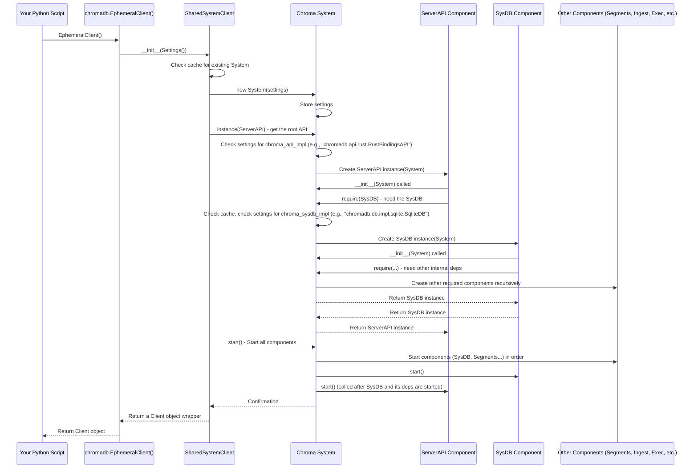

# Chapter 4: System and Components

In [Chapter 1: Client API](01_client_api_.md), we learned how to use Chroma from your Python code. In [Chapter 2: Embedding Function](02_embedding_function_.md), we saw how data is turned into vectors. And in [Chapter 3: Server API](03_server_api_.md), we looked at the central component that receives requests from the Client API and starts coordinating things.

But how is the Server API itself created? How does it find the [System Database (SysDB)](05_system_database__sysdb__.md) it needs? How are all the different internal parts of Chroma wired together when Chroma starts up?

This is where the **System and Components** architecture comes in.

Imagine Chroma as a complex machine made up of many specialized parts: a part for storing collection metadata, a part for managing the actual vector data files, a part for running searches, etc. These parts need to be created, configured, and connected correctly so they can work together. The "System and Components" framework is the blueprint and the manager for this assembly process.

Think of it like your computer's operating system (OS) and the applications installed on it:

*   The **System** is like the **Operating System**. It starts up when Chroma starts, knows about all the different possible "programs" or services (Components) that make up Chroma, decides which ones to run based on settings, creates them, and makes sure they can find each other.
*   **Components** are like the **Applications** or **Core Services** on your computer (e.g., a database service, a file manager, a web server). Each Component in Chroma is a specialized piece of functionality (like the Server API, the [System Database](05_system_database__sysdb__.md), the [Segment Manager](07_segments_.md), etc.). They are designed to be modular and replaceable.

This design allows Chroma to be very flexible. You can potentially swap out one component (like the part that stores data) for a different implementation without affecting other parts of the system, as long as the new component provides the same expected functionality.

## The Core Concepts: System and Components

Let's break down these two key ideas:

### The System: The Central Coordinator

The `System` is the heart of this architecture. When Chroma starts (for example, when you create an `EphemeralClient` or start the `chroma run` command), a `System` instance is created.

The `System`'s main responsibilities are:

1.  **Configuration:** It reads Chroma's **Settings**. These settings (which can come from environment variables, a `.env` file, or directly in code) tell the System which *specific implementation* to use for each type of Component. For example, settings determine if the Server API should be in-memory, connected to FastAPI, or use the Rust bindings. They also specify which database implementation to use for the [System Database](05_system_database__sysdb__.md), etc.
2.  **Component Creation:** Based on the settings, the System knows how to create instances of the configured Components.
3.  **Dependency Management:** Components often need to interact with other Components (e.g., the Server API needs the System Database to find collection info). The System handles these dependencies. A Component asks the System for another Component it needs using a special `require()` method. The System ensures the requested Component is created (if it doesn't exist yet) and returned.
4.  **Lifecycle Management:** The System is responsible for starting all the created Components in the correct order (based on dependencies) and stopping them gracefully when Chroma shuts down.

You typically won't create a `System` instance yourself as a user. It's managed internally by the Client API creation functions (`EphemeralClient`, `PersistentClient`, `HttpClient`). However, you influence the System's behavior by providing `Settings`.

### Components: The Pluggable Pieces

A `Component` is any part of Chroma's internal architecture that provides a specific service and needs to interact with other parts of the system.

Key characteristics of a Component:

1.  **Specialized Role:** Each Component has a well-defined job (e.g., storing metadata, performing vector search, handling incoming data).
2.  **System-Aware:** Every Component is initialized with a reference to the `System`. This allows it to `require()` other Components it depends on.
3.  **Pluggable:** Multiple implementations of a Component type can exist (e.g., different database implementations for the [System Database](05_system_database__sysdb__.md)). The `System` picks which one to use based on the `Settings`.
4.  **Lifecycle:** Components have `start()`, `stop()`, and `reset_state()` methods that the System calls during the Chroma lifecycle.

Examples of Components include:

*   The [Server API](03_server_api_.md) (e.g., `SegmentAPI` or `FastAPI` connector)
*   The [System Database (SysDB)](05_system_database__sysdb__.md) (e.g., `SqliteDB`, `Clickhouse`, `Postgres`)
*   The [Segment Manager](07_segments_.md) (`SegmentManager`)
*   The [Ingest pipeline](06_ingest__producer_consumer__.md) (`Producer`, `Consumer`)
*   The [Execution Engine](08_execution_engine_.md) (`Executor`)
*   Telemetry clients (`ProductTelemetryClient`, `OpenTelemetryClient`)
*   Authentication/Authorization providers
*   Quota and Rate Limiting enforcers

These are the building blocks that the System assembles.

## How it All Fits Together: The Assembly Line

Let's trace a simplified path of how a `System` is created and Components are assembled when you create an `EphemeralClient`:



This diagram shows a crucial pattern:

1.  The `System` is created first with the configuration (`Settings`).
2.  The root component (usually the `ServerAPI`) is requested from the System.
3.  When the `ServerAPI` (or any other component) is initialized, it declares its dependencies by calling `system.require(<ComponentType>)`.
4.  The `System` then creates those dependencies, which might recursively require *their* dependencies, building up a graph of components.
5.  Once all necessary components are created, the `System` calls `start()` on them in an order determined by their dependencies (ensuring a component's dependencies are started before it is).

This is why the Client API methods, and even the internal Server API methods we saw in [Chapter 3: Server API](03_server_api_.md), operate on *instances* of Components that were created and managed by the `System`.

## Looking at the Code

Let's look at simplified snippets related to the `System` and `Component` classes themselves, found primarily in `chromadb/config.py`.

First, the base `Component` class:

```python
# Simplified snippet from chromadb/config.py
from abc import ABC
from typing import Set, Type, TypeVar

T = TypeVar("T", bound="Component")

class Component(ABC):
    _dependencies: Set["Component"] # Tracks components this one requires
    _system: "System"             # Reference back to the System
    _running: bool

    def __init__(self, system: "System"):
        # Every component gets a reference to the system
        self._system = system
        self._dependencies = set()
        self._running = False

    def require(self, type: Type[T]) -> T:
        """Get an instance of another Component type from the System."""
        # Ask the system for the component instance
        inst = self._system.instance(type)
        # Record that this component depends on 'inst'
        self._dependencies.add(inst)
        return inst

    # start(), stop(), reset_state() methods are also defined here...
    def start(self) -> None:
        """Idempotently start this component's execution"""
        # ... (implementation logs/sets flag)
        self._running = True

    def stop(self) -> None:
        """Idempotently stop this component's execution"""
        # ... (implementation logs/sets flag)
        self._running = False

    # ... other methods ...

```
This shows how every `Component` instance holds a reference to the `System` and uses the `require` method to obtain instances of other components it needs. The `start` and `stop` methods are part of its lifecycle managed by the System.

Next, a very simplified look at the `System` class:

```python
# Simplified snippet from chromadb/config.py
from typing import Dict, Type, TypeVar
from graphlib import TopologicalSorter # Used for dependency ordering

class System(Component):
    settings: Settings # Holds the configuration
    _instances: Dict[Type[Component], Component] # Cache of created instances

    def __init__(self, settings: Settings):
        self.settings = settings
        self._instances = {}
        # System is also a Component, depends on itself conceptually
        super().__init__(self) # Pass self as the system

    def instance(self, type: Type[T]) -> T:
        """Return an instance of the component type specified, creating it if needed."""

        # If the requested type is an abstract interface (like ServerAPI),
        # look up the concrete class name in the settings.
        # (Simplified logic here)
        # if inspect.isabstract(type):
        #     fqn = self.settings.require(<setting_key_for_type>) # e.g., settings["chroma_api_impl"]
        #     type = get_class(fqn, type) # Load the actual class by name

        if type not in self._instances:
            # If instance doesn't exist, create it.
            # Pass the System itself to the new component's __init__!
            impl = type(self)
            self._instances[type] = impl
            # If the System is already running, start the new component immediately
            if self._running:
                impl.start()

        # Return the cached or newly created instance
        return self._instances[type]

    def components(self) -> Iterable[Component]:
        """Return all components in dependency order using a topological sort."""
        sorter: TopologicalSorter[Component] = TopologicalSorter()
        # Add all created instances and their dependencies to the sorter
        for component in self._instances.values():
            sorter.add(component, *component.dependencies())
        return sorter.static_order() # Return components in dependency order

    def start(self) -> None:
        """Start the System and all its components in dependency order."""
        super().start() # Mark System as running
        # Start components based on the topological sort
        for component in self.components():
            component.start()

    def stop(self) -> None:
        """Stop the System and all its components in reverse dependency order."""
        super().stop() # Mark System as stopped
        # Stop components in reverse dependency order
        for component in reversed(list(self.components())):
            component.stop()

    # ... reset_state method ...
```
This highlights how the `System` uses its `settings` to determine which component classes to instantiate. The `instance` method is the core logic for getting components and caching them. The `components` method uses a topological sort to figure out the correct order for starting and stopping based on the dependencies recorded by the `require` calls.

Finally, let's revisit the `SegmentAPI` from [Chapter 3: Server API](03_server_api_.md) one more time, now understanding its `__init__` in the context of the System and Components:

```python
# Simplified snippet from chromadb/api/segment.py (revisiting Chapter 3)
# SegmentAPI is one implementation of the abstract ServerAPI Component
from chromadb.api import ServerAPI
from chromadb.config import System # SegmentAPI is initialized with a System

class SegmentAPI(ServerAPI): # It is a Component because ServerAPI inherits from Component
    _sysdb: SysDB # Instance variable to hold the SysDB component
    _manager: SegmentManager # Instance variable to hold the SegmentManager

    def __init__(self, system: System):
        # Call parent Component __init__ (passes the system up)
        super().__init__(system)

        # Use the system to get required components!
        # The system will create these instances if they don't exist
        self._sysdb = self.require(SysDB)
        self._manager = self.require(SegmentManager)
        self._executor = self.require(Executor) # Depends on the Executor
        self._producer = self.require(Producer) # Depends on the Producer
        # ... and so on for other components it needs ...

    # ... methods like _add, _query, etc. use self._sysdb, self._manager, etc. ...
```
This confirms that when the `System` creates a `SegmentAPI` instance (because `chroma_api_impl` in `Settings` points to it), the `SegmentAPI`'s `__init__` method immediately calls `self.require()` for all the other crucial components it needs to function. The System fulfills these `require` requests, creating and returning the appropriate component instances according to the global `Settings`.

## Conclusion

In this chapter, we explored the foundational **System and Components** architecture of Chroma. We learned that the **System** acts as a central factory and coordinator, managing the creation, configuration, and lifecycle of specialized, pluggable **Components**.

This design makes Chroma modular and allows different implementations of core functionalities to be swapped in based on the **Settings**. While most users interact with Chroma through the higher-level [Client API](01_client_api_.md), understanding the System and Components provides insight into how Chroma is built and how its various parts work together to handle your data.

In the next chapter, we'll dive into one specific, crucial Component managed by the System: the **System Database (SysDB)**, which keeps track of essential information like which collections exist and their configurations.

[Chapter 5: System Database (SysDB)](05_system_database__sysdb__.md)

---

Generated by [AI Codebase Knowledge Builder](https://github.com/The-Pocket/Tutorial-Codebase-Knowledge)