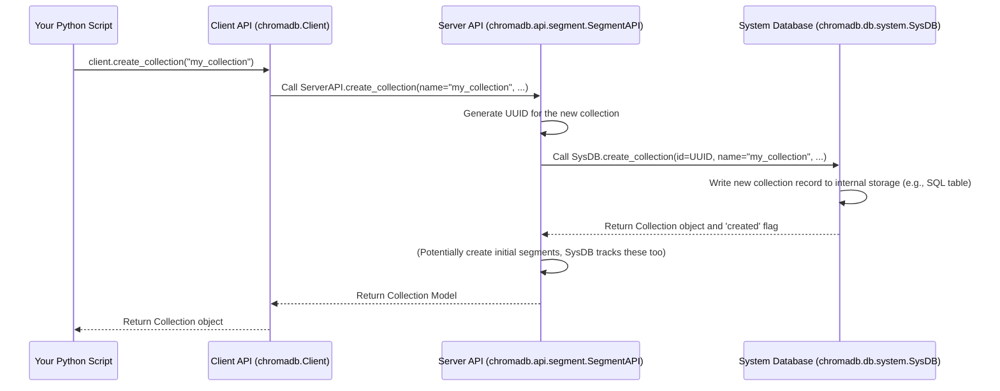
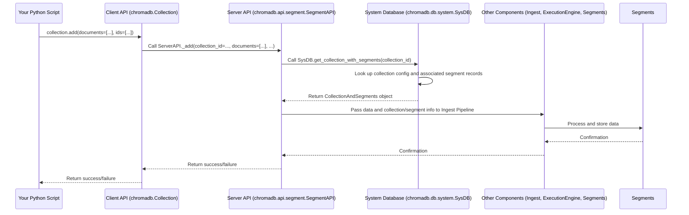

# Chapter 5: System Database (SysDB)

In the previous chapter, [Chapter 4: System and Components](04_system_and_components_.md), we zoomed out to understand how Chroma is built as a system of pluggable **Components** managed by a central **System**. We learned that the [Server API](03_server_api_.md) component, which receives requests from the [Client API](01_client_api_.md), relies on other components to do its work.

Now, let's dive into one of the most fundamental of these internal components: the **System Database (SysDB)**.

Imagine you have a large library with many different collections of books (like Sci-Fi, History, Biographies). The library needs a central place to keep track of *which* collections exist, *what they are named*, maybe who is in charge of them, and where they are physically located within the library. This central record doesn't contain the *books themselves*, just the *information about* the collections and where to find the books.

In Chroma, the **System Database (SysDB)** plays this role. It's a dedicated internal component responsible for storing **system-level metadata** about the Chroma instance. This metadata is essentially the "catalog" or "administrative records" of your Chroma database setup.

What kind of information does the SysDB store?

*   **Collections:** The most important thing! The SysDB knows every collection you've created: its unique ID, its name, any metadata you've associated with the collection itself, its configured [Embedding Function](02_embedding_function_.md) (as part of its configuration), and other settings like its expected embedding dimension.
*   **Segments:** Chroma stores the actual vector data, documents, and metadata for your items in units called **Segments** (we'll cover [Segments](07_segments_.md) in detail later). The SysDB keeps track of which segments belong to which collection, their types, scopes, and some basic metadata about the segments themselves. Again, it doesn't store the item data *within* the segments, just the list of segments and their properties.
*   **Tenants and Databases:** If you're using Chroma's multi-tenancy or multi-database features, the SysDB keeps track of the different tenants and databases and which collections belong to which tenant and database.

In short, the SysDB is the central source of truth for the structure, configuration, and overall state of your Chroma instance. It's like the control panel's backend, not the engine itself.

## You Don't Directly Interact with the SysDB

As a user interacting with Chroma through the [Client API](01_client_api_.md), you typically **do not** directly access or query the SysDB component itself.

When you call Client API methods like:

*   `client.create_collection(name="my_docs", ...)`
*   `client.get_collection(name="my_docs")`
*   `client.list_collections()`
*   `client.delete_collection(name="my_docs")`
*   `collection.add(...)` (when adding to a specific collection)

...you are interacting with the Client API. The Client API then communicates with the [Server API](03_server_api_.md), and the [Server API](03_server_api_.md) uses the SysDB component internally to:

*   **Create Collection:** Record the new collection's name, ID, and configuration in the SysDB.
*   **Get Collection:** Look up a collection's ID and configuration in the SysDB based on its name.
*   **List Collections:** Query the SysDB for a list of all collections and their basic information.
*   **Delete Collection:** Remove the collection's record (and associated segment records) from the SysDB.
*   **Add Data:** Before adding data to a collection, the [Server API](03_server_api_.md) might check the SysDB to retrieve the collection's configuration (like its dimension or associated [Embedding Function](02_embedding_function_.md)) and find out which segments belong to it.

So, while your data storage and similarity search happen elsewhere (in [Segments](07_segments_.md) and via the [Execution Engine](08_execution_engine_.md)), any operation that involves managing collections or understanding the system's structure ultimately touches the SysDB.

Let's revisit a simple example from [Chapter 1: Client API](01_client_api_.md), now understanding the SysDB's role:

```python
import chromadb

# Create an in-memory Chroma client (starts the System and Components, including SysDB)
client = chromadb.EphemeralClient()

# This call results in the Server API component writing a record
# for 'my_new_collection' into the SysDB component.
collection = client.create_collection(name="my_new_collection")

print(f"Created collection: {collection.name}")

# This call results in the Server API component querying the SysDB component
# to get a list of collection records.
all_collections = client.list_collections()

print("\nAll collections:")
for c in all_collections:
    print(f"- {c.name}")

# This call results in the Server API component deleting the record
# for 'my_new_collection' from the SysDB component.
client.delete_collection(name="my_new_collection")

print("\nCollection deleted.")
```

From your perspective using the Client API, it looks like simple Python calls. But under the hood, Chroma's internal components (especially the [Server API](03_server_api_.md)) are using the SysDB to manage this collection metadata.

## Under the Hood: How the SysDB Component is Used

Let's look at how the SysDB fits into the flow when the [Server API](03_server_api_.md) handles a request from the [Client API](01_client_api_.md). We'll use the `create_collection` example again, expanding on the diagram from [Chapter 3: Server API](03_server_api_.md).



This diagram shows that when the [Server API](03_server_api_.md) receives the `create_collection` instruction, its first major step *involves the SysDB*. It calls the `create_collection` method on its internal SysDB component instance. The SysDB component is responsible for the actual persistence of this metadata.

Similarly, for an `add` or `query` operation, the [Server API](03_server_api_.md) needs to know *which* segments belong to a collection and potentially retrieve its configuration (like dimension or [Embedding Function](02_embedding_function_.md) details).


Here, the `_add` method on the [Server API](03_server_api_.md) first calls `get_collection_with_segments` on the SysDB. This is how the [Server API](03_server_api_.md) learns about the collection's setup and the specific segments it needs to interact with. The SysDB provides this crucial metadata.

The SysDB component itself is an implementation of the `SysDB` abstract class, as defined in the Chroma codebase. It's a **Component** managed by the **System**, just like the [Server API](03_server_api_.md).

Chroma provides different implementations for the `SysDB` Component, depending on your setup:

*   **`SqlSysDB`:** Used by `EphemeralClient` and `PersistentClient`. This implementation stores the metadata in a local SQLite database file (`chroma.sqlite3`).
*   **`GrpcSysDB`:** Used when connecting to a distributed Chroma cluster. This implementation communicates over gRPC to a separate "Coordinator" service (which runs its own SysDB implementation, potentially backed by a more robust database like ClickHouse or Postgres).

Let's peek at the abstract definition and a couple of implementation snippets.

First, the abstract `SysDB` Component definition (from `chromadb/db/system.py`):

```python
# Simplified snippet from chromadb/db/system.py
from abc import abstractmethod
from typing import Optional, Sequence, Tuple
from uuid import UUID
from chromadb.config import Component # SysDB is a Component!
from chromadb.types import Collection, Segment, CollectionAndSegments, Database, Tenant # Define data structures

class SysDB(Component): # Inherits from Component
    """Data interface for Chroma's System database"""

    @abstractmethod
    def create_database( # ... args ... ) -> None:
        """Create a new database record"""
        pass

    @abstractmethod
    def get_database( # ... args ... ) -> Database:
        """Get a database record by name and tenant"""
        pass

    # ... methods for list_databases, create_tenant, get_tenant, delete_database ...

    @abstractmethod
    def create_segment( # ... args ... ) -> None:
        """Create a new segment record"""
        pass

    @abstractmethod
    def delete_segment( # ... args ... ) -> None:
        """Delete a segment record"""
        pass

    @abstractmethod
    def get_segments( # ... args ... ) -> Sequence[Segment]:
        """Find segment records"""
        pass

    @abstractmethod
    def update_segment( # ... args ... ) -> None:
        """Update a segment record"""
        pass

    @abstractmethod
    def create_collection( # ... args ... ) -> Tuple[Collection, bool]:
        """Create a new collection record and associated segment records"""
        pass

    @abstractmethod
    def delete_collection( # ... args ... ) -> None:
        """Delete a collection record and associated segment records"""
        pass

    @abstractmethod
    def get_collections( # ... args ... ) -> Sequence[Collection]:
        """Find collection records by id or name"""
        pass

    @abstractmethod
    def count_collections( # ... args ... ) -> int:
        """Count collection records"""
        pass

    @abstractmethod
    def get_collection_with_segments( # ... args ... ) -> CollectionAndSegments:
        """Get a collection record along with its associated segment records"""
        pass

    @abstractmethod
    def update_collection( # ... args ... ) -> None:
        """Update a collection record"""
        pass

    # ... other methods ...

```
This shows the contract for any class that wants to be the `SysDB` component. It defines methods for managing records about collections, segments, tenants, and databases.

Now, let's see a simplified part of the `SqlSysDB` implementation (from `chromadb/db/mixins/sysdb.py`, which is a mixin class used by `chromadb.db.impl.sqlite.SqliteDB`). This snippet shows how it might implement `get_collections` using SQL:

```python
# Simplified snippet from chromadb/db/mixins/sysdb.py
from overrides import override
# ... imports ...
from chromadb.db.base import SqlDB, ParameterValue, get_sql # Base class for SQL DBs
from chromadb.db.system import SysDB # Implements the SysDB interface
from pypika import Table, Column # Used for building SQL queries

class SqlSysDB(SqlDB, SysDB): # Inherits from SqlDB (which is a Component) and SysDB
    # ... __init__ method requiring the System and other components like Producer ...

    @override # Indicates this implements the method from SysDB
    def get_collections(
        self,
        id: Optional[UUID] = None,
        name: Optional[str] = None,
        tenant: str = DEFAULT_TENANT,
        database: str = DEFAULT_DATABASE,
        limit: Optional[int] = None,
        offset: Optional[int] = None,
    ) -> Sequence[Collection]:
        # ... (validation and setup) ...

        collections_t = Table("collections") # Represents the 'collections' SQL table
        metadata_t = Table("collection_metadata") # Represents the 'collection_metadata' SQL table
        databases_t = Table("databases") # Represents the 'databases' SQL table

        # Build a SQL query using pypika (a SQL query builder library)
        q = (
            self.querybuilder() # Get the query builder from the SqlDB base class
            .from_(collections_t)
            .select(
                collections_t.id,
                collections_t.name,
                collections_t.config_json_str, # Stores collection config as JSON
                collections_t.dimension,
                databases_t.name,
                databases_t.tenant_id,
                # Select columns for metadata keys and values (joined from collection_metadata)
                metadata_t.key,
                metadata_t.str_value,
                metadata_t.int_value,
                metadata_t.float_value,
                metadata_t.bool_value,
            )
            # Join with metadata table to get collection metadata
            .left_join(metadata_t).on(collections_t.id == metadata_t.collection_id)
            # Join with databases table to filter by database/tenant
            .left_join(databases_t).on(collections_t.database_id == databases_t.id)
            .orderby(collections_t.id) # Order results for grouping
        )

        # Add WHERE clauses based on input parameters (id, name, tenant, database)
        if id:
            q = q.where(collections_t.id == ParameterValue(self.uuid_to_db(id))) # Use uuid_to_db for SQL format
        if name:
            q = q.where(collections_t.name == ParameterValue(name))
        # ... (more filtering logic based on tenant/database) ...

        with self.tx() as cur: # Use the transaction wrapper from SqlDB base class
            sql, params = get_sql(q, self.parameter_format()) # Get the SQL string and parameters
            rows = cur.execute(sql, params).fetchall() # Execute the query

            # Process the results to group metadata by collection and build Collection objects
            collections = []
            # ... (grouping logic using itertools.groupby) ...
            # For each collection record:
            #   - Extract id, name, config_json_str, dimension, tenant, database
            #   - Parse metadata from joined rows using _metadata_from_rows helper
            #   - Load configuration object from config_json_str
            #   - Create a Collection object
            # ... (apply limit and offset) ...

            return collections # Return the list of Collection objects

    # ... other methods implementing the SysDB interface ...

```
This snippet shows how `SqlSysDB` uses SQL queries (built with `pypika`) to retrieve collection information from underlying database tables. The `_metadata_from_rows` and `_insert_metadata` helpers handle the storage of different metadata types (strings, ints, floats, booleans) in the database tables.

And here's a very simplified part of the `GrpcSysDB` implementation (from `chromadb/db/impl/grpc/client.py`), showing how it might implement `get_collections` by making a remote gRPC call:

```python
# Simplified snippet from chromadb/db/impl/grpc/client.py
from overrides import overrides
# ... imports ...
from chromadb.db.system import SysDB # Implements the SysDB interface
import chromadb.proto.coordinator_pb2 as coordinator_pb2 # Generated gRPC protobuf messages
import chromadb.proto.coordinator_pb2_grpc as coordinator_pb2_grpc # Generated gRPC client stub
import grpc # The gRPC library

class GrpcSysDB(SysDB): # Inherits from SysDB
    _sys_db_stub: coordinator_pb2_grpc.SysDBStub # The gRPC client stub

    def __init__(self, system: System):
        # ... get coordinator host/port from settings ...
        super().__init__(system)

    @overrides # Indicates this implements the method from SysDB
    def start(self) -> None:
        # Called by the System when starting this component
        # Set up the gRPC channel and the client stub
        self._channel = grpc.insecure_channel(...) # Connect to the remote gRPC server
        self._sys_db_stub = coordinator_pb2_grpc.SysDBStub(self._channel) # Create the client stub
        return super().start()

    @overrides # Indicates this implements the method from SysDB
    def get_collections(
        self,
        id: Optional[UUID] = None,
        name: Optional[str] = None,
        tenant: str = DEFAULT_TENANT,
        database: str = DEFAULT_DATABASE,
        limit: Optional[int] = None,
        offset: Optional[int] = None,
    ) -> Sequence[Collection]:
        try:
            # Prepare the gRPC request message
            request = coordinator_pb2.GetCollectionsRequest(
                id=id.hex if id else "", # Convert UUID to hex string for proto
                name=name if name else "",
                tenant=tenant,
                database=database,
                limit=limit,
                offset=offset,
            )

            # Make the remote gRPC call using the client stub
            response: coordinator_pb2.GetCollectionsResponse = self._sys_db_stub.GetCollections(
                request, timeout=self._request_timeout_seconds
            )

            # Process the gRPC response message
            results: List[Collection] = []
            for proto_collection in response.collections:
                # Convert protobuf Collection object back to Python Collection type
                results.append(from_proto_collection(proto_collection))

            return results # Return the list of Python Collection objects

        except grpc.RpcError as e:
            # Handle gRPC errors (e.g., connection issues, Not Found)
            logger.error(f"Failed to get collections due to error: {e}")
            raise InternalError() # Re-raise as a Chroma internal error

    # ... other methods implementing the SysDB interface ...
    @overrides
    def stop(self) -> None:
        # Called by the System when stopping this component
        self._channel.close() # Close the gRPC channel
        return super().stop()

```
This shows a very different implementation approach: instead of building SQL, `GrpcSysDB` constructs a protobuf message (`GetCollectionsRequest`), sends it over a gRPC channel using a client stub (`_sys_db_stub`), receives a protobuf response (`GetCollectionsResponse`), and converts the data back into Chroma's internal Python types (`Collection`).

Both `SqlSysDB` and `GrpcSysDB` provide the *same interface* (`SysDB`), but they implement it differently based on whether they need to talk to a local SQLite file or a remote gRPC service. The [Server API](03_server_api_.md) component doesn't need to know *which* implementation it's using; it just calls the methods defined in the `SysDB` interface, and the correct implementation is provided by the **System** based on the Chroma configuration.

## Conclusion

In this chapter, we explored the **System Database (SysDB)**, a crucial internal component in Chroma. We learned that it acts as the administrative database or catalog for your Chroma instance, storing essential system metadata like details about **collections**, **segments**, **tenants**, and **databases**.

We saw that you don't directly interact with the SysDB as a user; instead, your Client API calls are translated by the [Server API](03_server_api_.md), which then uses the SysDB component internally to manage collection state and configuration. The SysDB is a **Component** managed by the **System**, and different implementations exist (like `SqlSysDB` and `GrpcSysDB`) depending on your Chroma setup.

Understanding the SysDB helps clarify how Chroma keeps track of the overall structure of your data, separate from the actual item embeddings and documents. In the next chapter, we'll look at the **Ingest (Producer/Consumer)** pipeline, which is responsible for taking the data you provide via the [Client API](01_client_api_.md), processing it (including calling the [Embedding Function](02_embedding_function_.md)), and getting it ready to be stored in the [Segments](07_segments_.md).

[Chapter 6: Ingest (Producer/Consumer)](06_ingest__producer_consumer__.md)

---

Generated by [AI Codebase Knowledge Builder](https://github.com/The-Pocket/Tutorial-Codebase-Knowledge)