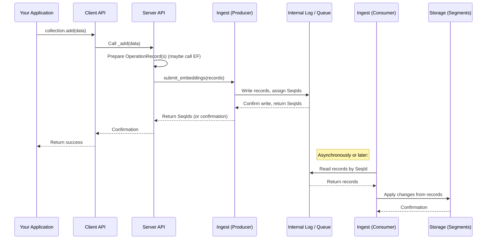

# Chapter 6: Ingest (Producer/Consumer)

In the previous chapter, [Chapter 5: System Database (SysDB)](05_system_database__sysdb__.md), we looked at the **System Database (SysDB)**, which acts like the administrative catalog for Chroma, keeping track of collections and other system-level information. We saw that the [Server API](03_server_api_.md) uses the SysDB to manage this metadata.

But how does your actual *data* – the embeddings, documents, and metadata for the items *within* your collections – flow into Chroma and get stored? When you call `collection.add()`, `collection.update()`, or `collection.delete()`, there's a process that ensures these changes are handled correctly, in the right order, and eventually saved to the physical storage layers.

This is where the **Ingest pipeline**, built around the **Producer/Consumer** pattern, comes in.

Think of it like updating a shared ledger or journal for your data changes. When you make a change (add, update, delete), it's first recorded in this journal. Then, other parts of the system read from this journal, in the exact order the changes were recorded, and apply those changes to the actual storage locations.

This "journaling" mechanism, often called a **Write-Ahead Log (WAL)** or a **messaging queue**, is powerful because it:

1.  **Ensures Order:** Changes are processed strictly in the sequence they were requested. This is critical for consistency (e.g., don't try to update an item before it's added, or delete it before an update is applied).
2.  **Provides Reliability:** If something crashes, the journal still exists. When the system restarts, it can read from the last successful point in the journal and continue applying changes, ensuring data isn't lost or corrupted.
3.  **Enables Decoupling:** The part of the system receiving your request (the [Server API](03_server_api_.md)) doesn't have to wait for the data to be fully processed and written to its final storage location. It just needs to ensure the change is safely recorded in the journal (Producer's job). Other parts (Consumers) can process the journal entries at their own pace.

The **Ingest (Producer/Consumer)** abstraction in Chroma handles this data flow using this journaling pattern.

## Key Concepts: Producer and Consumer

The core idea revolves around two main roles:

1.  **The Producer:** This component is responsible for taking the raw data changes (like documents, embeddings, IDs, and the type of operation – add, update, or delete) and writing them as structured **Operation Records** to an internal log or queue. It's like the person writing entries into the shared journal. Once the Producer confirms the record is written, the initial request (e.g., `collection.add`) can often return success, even though the data hasn't necessarily reached its final storage yet.

2.  **The Consumer:** This component reads the **Operation Records** from the log or queue, strictly in the order they were written. It then processes these records and applies the corresponding changes to the actual data storage units, which are called **Segments** (we'll cover these in the next chapter!). There can be multiple Consumers or different processing steps involved in consuming the log. They are like the assistants who read the journal entries and perform the required tasks on the shelves or index cards.

The "log" or "queue" itself is the intermediary storage that holds the **Operation Records**. Each record in the log is assigned a unique, sequential ID, often called a **SeqId** (Sequence ID), which strictly defines the order of operations.

Let's illustrate this simplified flow for adding data:



Notice how the initial `add` call returns once the data is safely in the `Log`. The actual application of changes to `Segments` happens separately by the `Consumer`. This is the decoupling benefit of the Producer/Consumer pattern.

## The Producer in Action: Submitting Data

When you use the [Client API](01_client_api_.md) to `add`, `update`, or `delete` data within a collection, the request ultimately reaches the [Server API](03_server_api_.md). The [Server API](03_server_api_.md) prepares the data into standardized **Operation Records**. These records include:

*   The type of operation (ADD, UPDATE, DELETE)
*   The unique ID(s) of the item(s) affected
*   The embedding vector(s) (for ADD/UPDATE)
*   The document content (for ADD/UPDATE)
*   Any associated metadata (for ADD/UPDATE)

Once the records are ready, the [Server API](03_server_api_.md) passes them to the **Producer** component using methods like `submit_embeddings`. The Producer's job is to ensure these records are durably written to the internal log or queue, preserving their order.

Let's look at the definition of the `Producer` interface in Chroma's code:

```python
# Simplified snippet from chromadb/ingest/__init__.py
from abc import abstractmethod
from typing import Callable, Optional, Sequence
from chromadb.types import (
    OperationRecord, # The structure for changes
    SeqId,           # Sequence ID for ordering
    Vector,          # Embedding vector type
    ScalarEncoding,  # How vector is encoded
)
from chromadb.config import Component # Producer is a Component
from uuid import UUID
import numpy as np

# OperationRecord is typically a dictionary-like object with keys like:
# 'id', 'embedding', 'encoding', 'metadata', 'document', 'uri', 'operation'

class Producer(Component):
    """Interface for writing embeddings to an ingest stream"""

    @abstractmethod
    def submit_embedding(
        self, collection_id: UUID, embedding: OperationRecord
    ) -> SeqId:
        """Add an embedding record to the given collections log. Returns the SeqID."""
        pass

    @abstractmethod
    def submit_embeddings(
        self, collection_id: UUID, embeddings: Sequence[OperationRecord]
    ) -> Sequence[SeqId]:
        """Add a batch of embedding records to the given collections log.
        Returns the SeqIDs of the records in the same order."""
        pass

    # ... other methods for log management ...

    @property
    @abstractmethod
    def max_batch_size(self) -> int:
        """Return the maximum number of records that can be submitted in one batch."""
        pass

```
This abstract class shows the core contract for any component acting as a Producer: it must be able to accept `OperationRecord`s (either one or a sequence) associated with a `collection_id` and submit them to the log, returning the `SeqId`s they were assigned.

## The Consumer in Action: Applying Changes

The **Consumer** component's role is to read from the log and process the records. Other parts of the system, particularly those responsible for managing and updating the [Segments](07_segments_.md), will "subscribe" to the Consumer to receive these records.

Here's the definition of the `Consumer` interface:

```python
# Simplified snippet from chromadb/ingest/__init__.py
from abc import abstractmethod
from typing import Callable, Optional, Sequence
from chromadb.types import (
    OperationRecord,
    LogRecord, # OperationRecord plus SeqId and log_offset
    SeqId,
)
from chromadb.config import Component
from uuid import UUID

ConsumerCallbackFn = Callable[[Sequence[LogRecord]], None] # Type for the function that receives records

class Consumer(Component):
    """Interface for reading embeddings off an ingest stream"""

    @abstractmethod
    def subscribe(
        self,
        collection_id: UUID,
        consume_fn: ConsumerCallbackFn, # The function to call with records
        start: Optional[SeqId] = None, # Start reading from this SeqId (exclusive)
        end: Optional[SeqId] = None,   # Stop reading after this SeqId (inclusive)
        id: Optional[UUID] = None,     # Optional ID for the subscription
    ) -> UUID:
        """Register a function that will be called to receive records for a log stream."""
        pass

    @abstractmethod
    def unsubscribe(self, subscription_id: UUID) -> None:
        """Unregister a subscription."""
        pass

    # ... other methods for getting SeqId boundaries ...
```
This interface shows that the primary method for a Consumer is `subscribe`. Another component (like the [Segment Manager](07_segments_.md) or parts of the [Execution Engine](08_execution_engine_.md)) calls `subscribe` with a function (`consume_fn`) that they want to be called with batches of `LogRecord`s. The `start` and `end` parameters allow subscribing to specific ranges of the log. The Consumer is responsible for delivering records to this function, maintaining order based on the `SeqId` (`log_offset`).

## Under the Hood: Implementations Vary

Just like the [System Database (SysDB)](05_system_database__sysdb__.md), the specific **implementation** of the Producer and Consumer components (and the underlying log) depends on how you run Chroma. Chroma uses the **System and Components** framework ([Chapter 4](04_system_and_components_.md)) to select the correct implementation based on your settings.

### Local (Ephemeral/Persistent) Implementation: SqlEmbeddingsQueue

For `EphemeralClient` and `PersistentClient`, the Ingest log is managed directly within the main Chroma process, often reusing the underlying SQLite database used by the [SysDB](05_system_database__sysdb__.md). The component that handles this is `SqlEmbeddingsQueue`.

This component acts as **both** the Producer and the Consumer. It writes records to a specific table in the SQLite database (`embeddings_queue`) and also provides the `subscribe` method for other components (like the Segment Manager) to register callbacks. When the Producer writes new records, the `SqlEmbeddingsQueue` implementation immediately checks if any active subscriptions need those records and calls their callback functions directly within the same process.

Here's a simplified look at how `SqlEmbeddingsQueue` implements `submit_embeddings` and `subscribe`:

```python
# Simplified snippet from chromadb/db/mixins/embeddings_queue.py

class SqlEmbeddingsQueue(SqlDB, Producer, Consumer):
    # Inherits from SqlDB (for database access), Producer, and Consumer interfaces

    _subscriptions: Dict[str, Set[Subscription]] # Stores active subscriptions
    _tenant: str
    _topic_namespace: str

    def __init__(self, system: System):
        # ... initialization, requires System ...
        self._subscriptions = defaultdict(set)
        # ... get tenant/namespace from settings ...
        super().__init__(system)

    @override
    def submit_embeddings(
        self, collection_id: UUID, embeddings: Sequence[OperationRecord]
    ) -> Sequence[SeqId]:
        # ... checks and validation ...

        topic_name = create_topic_name( # Helper to create topic name from collection ID etc.
            self._tenant, self._topic_namespace, collection_id
        )

        t = Table("embeddings_queue") # The SQL table for the log

        # Build SQL INSERT statement using pypika
        insert = (
            self.querybuilder()
            .into(t)
            .columns(t.operation, t.topic, t.id, t.vector, t.encoding, t.metadata)
        )
        # Add each record as values to the insert statement
        for embedding in embeddings:
            # ... prepare data (encode vector, dump metadata to JSON) ...
            insert = insert.insert(...) # Insert parameters for the record

        with self.tx() as cur: # Use SQL transaction
            sql, params = get_sql(insert, self.parameter_format())
            # Execute insert, returning the assigned seq_id for each record
            sql = f"{sql} RETURNING seq_id, id"
            results = cur.execute(sql, params).fetchall()

            # ... match returned seq_ids to original record order ...

            # IMPORTANT: Immediately notify subscribers in THIS process!
            log_records_with_seq_id = [] # Convert results back to LogRecord format
            # ... populate log_records_with_seq_id ...
            self._notify_all(topic_name, log_records_with_seq_id)

            # ... (optional purging based on config) ...

            return seq_ids # Return the ordered SeqIds

    @override
    def subscribe(
        self, collection_id: UUID, consume_fn: ConsumerCallbackFn, start: Optional[SeqId] = None, end: Optional[SeqId] = None, id: Optional[UUID] = None
    ) -> UUID:
        # ... validation ...
        topic_name = create_topic_name(self._tenant, self._topic_namespace, collection_id)
        subscription_id = id or uuid.uuid4()
        # ... normalize start/end SeqIds ...

        subscription = self.Subscription( subscription_id, topic_name, start, end, consume_fn )

        # First, backfill the subscriber with existing records in the DB within the range
        self._backfill(subscription) # Reads from 'embeddings_queue' table

        # Then, add the subscription to the list to receive new records
        self._subscriptions[topic_name].add(subscription)

        return subscription_id

    # ... _notify_all method iterates _subscriptions and calls callback ...
    # ... _backfill method queries the 'embeddings_queue' table and calls callback ...
```
In this setup, the `embeddings_queue` table in SQLite is the "Log". The `submit_embeddings` method writes to it and then immediately calls `_notify_all`, which finds the registered `consume_fn` for that collection's "topic" and passes the new `LogRecord`s to it. The `subscribe` method first reads any relevant existing records from the table (`_backfill`) before registering the callback to receive future writes.

### Distributed Implementation: LogService

In a distributed Chroma cluster setup, multiple Chroma nodes might be adding data concurrently. Having a single SQLite file wouldn't work. Instead, Chroma uses a dedicated, shared **Log Service**. This is often an external service designed for highly available, ordered messaging (like Apache Kafka or Pulsar, though Chroma might use its own internal Log Service implementation).

When running in distributed mode, the Producer/Consumer component in your Chroma process is `LogService`. This component does *not* store the log itself. Instead, it acts as a **client** that communicates with the separate, central Log Service over the network (e.g., using gRPC).

Here's how the `LogService` component implements the interfaces:

```python
# Simplified snippet from chromadb/logservice/logservice.py

class LogService(Producer, Consumer):
    """Distributed Chroma Log Service (acts as client to external Log Service)"""

    _log_service_stub: LogServiceStub # gRPC client for the remote service

    def __init__(self, system: System):
        # ... get remote host/port from settings ...
        super().__init__(system)

    @override
    def start(self) -> None:
        # Called by the System: setup the gRPC channel to the remote server
        self._channel = grpc.insecure_channel(...)
        self._log_service_stub = LogServiceStub(self._channel)
        return super().start()

    @override
    def submit_embeddings(
        self, collection_id: UUID, embeddings: Sequence[OperationRecord]
    ) -> Sequence[SeqId]:
        # ... checks and validation ...
        logger.info(f"Submitting {len(embeddings)} embeddings to remote log service...")

        # Prepare the gRPC request message from OperationRecords
        protos_to_submit = [to_proto_submit(record) for record in embeddings]
        request = PushLogsRequest(collection_id=str(collection_id), records=protos_to_submit)

        # Make the remote gRPC call
        response = self._log_service_stub.PushLogs(
            request, timeout=self._request_timeout_seconds
        )

        # The remote service returns confirmations/seq_ids
        # NOTE: The current implementation returns a count, not individual SeqIds per record (TODO in Chroma)
        return [response.record_count] # Simplified, conceptually returns SeqIds

    @override
    def subscribe(
        self, collection_id: UUID, consume_fn: ConsumerCallbackFn, start: Optional[SeqId] = None, end: Optional[SeqId] = None, id: Optional[UUID] = None
    ) -> UUID:
        logger.info(f"Subscribing to log for {collection_id} via remote log service...")
        # In a real distributed setup, this would involve:
        # 1. Making a gRPC call to the remote Log Service to start a consumer stream.
        # 2. The remote Log Service would push records back to this client over gRPC.
        # 3. This component would call the provided consume_fn with the received records.
        # The current `LogService` component snippet shows a placeholder/noop subscribe.
        # The actual distributed consumer logic is handled elsewhere or planned.
        # For a beginner chapter, we emphasize the _interface_ and the _role_.
        # This specific implementation snippet isn't fully functional as a consumer client.
        # We'll skip detailed code for the distributed consumer side for simplicity.
        return UUID(int=0) # Placeholder subscription ID

    @override
    def stop(self) -> None:
        # Called by the System: close the gRPC channel
        self._channel.close()
        return super().stop()

    # ... methods for pulling logs using the stub would exist here for a full consumer ...
```
Here, the `submit_embeddings` method doesn't interact with a local database. It builds a gRPC request (`PushLogsRequest`) containing the records and sends it to a remote server via `_log_service_stub`. The remote server handles storing the log and assigning `SeqId`s. The `subscribe` method would similarly interact with the remote service to receive records, but the current snippet shows it's not fully implemented for consumption in this client component, as the actual consumption logic might live elsewhere in the distributed system. The key takeaway is the *Producer* role making a network call to publish to a shared log.

## Analogy: The Library Update System

Let's refine our library analogy:

When someone wants to add a new book, update its location, or remove a book:
1.  They tell a dedicated "Change Recorder" (the **Producer**).
2.  The Change Recorder writes the details of the change (e.g., "ADD: 'New Sci-Fi Book' by [Author], shelf S3") into a central, ordered list (the **Log/Queue**). Each entry gets a number (the **SeqId**). Once it's written on the list, the Change Recorder says "Done!" (the `add` call returns).
3.  A team of "Shelf Appliers" (the **Consumers**) constantly reads from this central list, starting from where they last left off (using their `SeqId`).
4.  They read an entry ("ADD: 'New Sci-Fi Book' by [Author], shelf S3").
5.  They go to the physical shelves (the **Segments**) and put the book on shelf S3.
6.  They update the library's digital index (part of the [Execution Engine](08_execution_engine_.md) or [Segments](07_segments_.md) that makes the book searchable).
7.  They mark the entry on their list as processed and move to the next `SeqId`.

The Change Recorder (Producer) doesn't need to know *how* or *when* the Shelf Appliers (Consumers) actually update the shelves, just that the change is recorded safely in the list for them to find. This makes the system flexible and robust.

## Conclusion

In this chapter, we explored the **Ingest (Producer/Consumer)** abstraction, which is fundamental to how data changes (adds, updates, deletes) flow through Chroma. We learned about the **Producer** component's role in writing **Operation Records** to an ordered **Log/Queue**, and the **Consumer** component's role in reading from that log and applying changes.

We saw that the specific implementation of the Producer/Consumer pattern varies between local (using `SqlEmbeddingsQueue` writing to SQLite and notifying in-process) and distributed setups (using `LogService` communicating with a remote service). This pattern ensures reliable, ordered processing of data changes, decoupling the initial request from the final storage update.

The Consumers ultimately apply these changes to Chroma's storage units. In the next chapter, we will finally dive into these storage units: the **Segments**.

[Chapter 7: Segments](07_segments_.md)

---

Generated by [AI Codebase Knowledge Builder](https://github.com/The-Pocket/Tutorial-Codebase-Knowledge)