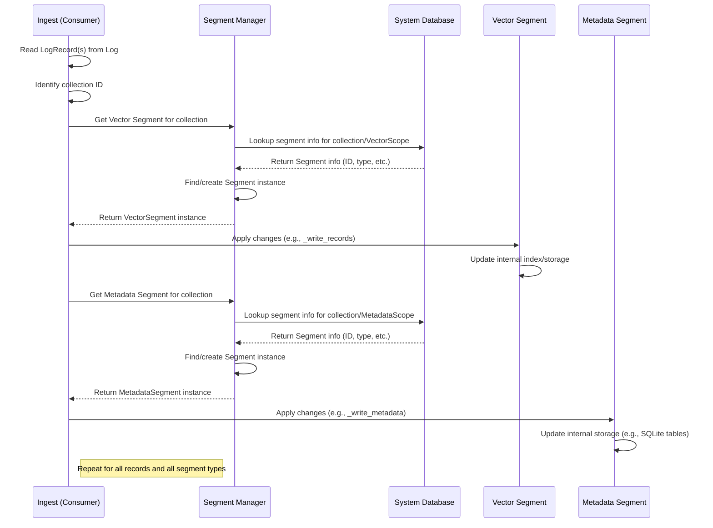
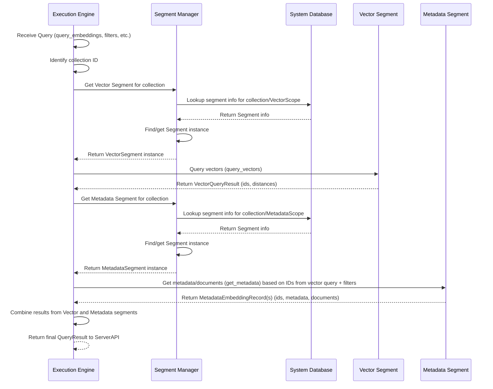

# Chapter 7: Segments

In the previous chapter, [Chapter 6: Ingest (Producer/Consumer)](06_ingest__producer_consumer__.md), we learned about the **Ingest pipeline**, which uses a **Producer** to write data changes (adds, updates, deletes) to a log and a **Consumer** to read those changes in order. The Consumer's job is to apply these changes to the actual storage layer of Chroma.

So, where does the data *actually* live? How is it organized and stored for fast searching?

This is the role of **Segments**.

Think of your Chroma database collection not as one giant block of data, but as a collection of highly specialized filing cabinets. When you add data, it's sorted and put into the correct cabinet. When you search, Chroma knows which cabinets to look in and how to quickly find what you need within them. These individual, specialized filing cabinets are **Segments**.

A collection in Chroma is made up of one or more Segments. Segments are designed to be modular and handle specific types of data efficiently. This modularity is important because it allows Chroma to use different storage techniques or indexing algorithms optimized for different kinds of information or different deployment scenarios (like running locally vs. in a distributed cluster).

Here's how the analogy plays out:

*   **The Collection:** The entire large storage facility or room containing all the filing cabinets for a specific topic (e.g., "my\_documents").
*   **Segments:** The individual, specialized filing cabinets within that room.
    *   One cabinet might be optimized for storing the numerical vectors (embeddings).
    *   Another might be for the original documents (text) and any extra information (metadata) you added with them.
    *   Yet another might be for the log of changes themselves (related to the Ingest log).

These segments are designed to be self-contained. They manage their own storage and indexing for the data they hold.

## Key Concepts: Specialized Segments

While the exact types of segments can vary slightly depending on the Chroma version and configuration (especially between local and distributed modes), the core idea is specialization. For a typical collection, you'll encounter Segments primarily responsible for:

1.  **Vector Segments:** These segments are specialized for storing the numerical embedding vectors and performing similarity searches (like K-Nearest Neighbors, KNN) on them. They often use advanced indexing algorithms like Hierarchical Navigable Small Worlds (HNSW) to make searches extremely fast, even with millions or billions of vectors.
2.  **Metadata Segments:** These segments store the document text and any associated metadata you provided when adding items. They are designed for efficiently retrieving this information when you get results from a search or fetch items by ID, and also for filtering searches based on metadata or document content.
3.  **Record Segments:** In some configurations (particularly distributed ones), dedicated segments might be used to persistently store the Operation Records from the Ingest log ([Chapter 6](06_ingest__producer_consumer__.md)). This ensures the log is durable and can be replayed if needed.

Crucially, when you add an item to a collection (providing an ID, embedding, document, and metadata), the information doesn't all go into one place. The embedding goes to a Vector Segment, the document and metadata go to a Metadata Segment, and the record of the change goes to a Record Segment (or is handled by the Ingest system's log persistence). All these pieces are linked by the item's unique ID and the sequence ID (SeqId) from the Ingest log, ensuring consistency.

## You Don't Directly Interact with Segments

As a user using the [Client API](01_client_api_.md), you don't ever directly create, read from, or write to a specific Segment. Segments are entirely an internal implementation detail managed by Chroma.

When you call:

*   `collection.add(ids=[...], embeddings=[...], documents=[...], metadatas=[...])`
*   `collection.query(query_embeddings=[...], ...)`
*   `collection.get(ids=[...], ...)`

You are interacting with the Client API, which sends requests to the [Server API](03_server_api_.md). The [Server API](03_server_api_.md) then coordinates other internal components:

*   The **[Ingest Consumer](06_ingest__producer_consumer__.md)** receives Operation Records from the log and applies them to the appropriate **Segments** (Vector, Metadata, potentially Record).
*   The **[Execution Engine](08_execution_engine_.md)** handles queries (like `query` or `get`). It asks the **Segments** for the data it needs:
    *   It queries the Vector Segments for similar embeddings.
    *   It queries the Metadata Segments for documents and metadata, applying filters if needed.
    *   It combines the results from different segments.

The **[System Database (SysDB)](05_system_database__sysDB__.md)** keeps track of *which* segments exist and *which* collection they belong to. A specialized component called the **Segment Manager** uses the SysDB to get information about segments and provides instances of the correct Segment implementations to the Ingest Consumer and Execution Engine.

## Under the Hood: Managing and Using Segments

Let's trace the flow slightly deeper, focusing on the role of the Segment Manager and how segments are used.

The **Segment Manager** is a **Component** ([Chapter 4](04_system_and_components_.md)) that is responsible for providing access to Segment *instances*. When Chroma starts, the Segment Manager is initialized. It often retrieves information about existing segments for collections from the [SysDB](05_system_database__sysdb__.md).

When a collection is created or loaded, the Segment Manager ensures the necessary Segment objects are available. When the [Ingest Consumer](06_ingest__producer_consumer__.md) needs to write data or the [Execution Engine](08_execution_engine_.md) needs to read data for a specific collection, they ask the Segment Manager for the relevant segment instances.

Here's a simplified flow for a data write hitting the segments:



And here's a simplified flow for a query hitting the segments:



These diagrams show that the Segment Manager acts as the intermediary, retrieving segment metadata from SysDB and providing the correct Segment implementation instances to the components that need to interact with the data storage.

## Looking at the Segment Code

The code snippets provided give us a glimpse into the Segment architecture:

*   `chromadb/segment/__init__.py`: Defines the base `SegmentImplementation` class and interfaces like `VectorReader` and `MetadataReader` that specific segment types implement. It also defines the `SegmentManager` interface.
*   `chromadb/segment/impl/manager/local.py`: Shows the `LocalSegmentManager`, an implementation used by local Chroma setups (Ephemeral, Persistent). It uses the [SysDB](05_system_database__sysdb__.md) (`self.require(SysDB)`) to get segment info and manages concrete segment instances (`_instances`). Its `get_segment` method is how other components get a segment instance.
*   `chromadb/segment/impl/manager/distributed.py`: Shows `DistributedSegmentManager` used in distributed setups. Note it prepares different segment types (`HNSW_DISTRIBUTED`, `BLOCKFILE_METADATA`, `BLOCKFILE_RECORD`).
*   `chromadb/segment/impl/vector/local_persistent_hnsw.py`: An example **Vector Segment** implementation (`PersistentLocalHnswSegment`). It implements `VectorReader`. Notice it receives records via `_write_records` (called by the Consumer) and performs vector search via `query_vectors`. It uses the `hnswlib` library for the core indexing and search logic.
*   `chromadb/segment/impl/metadata/sqlite.py`: An example **Metadata Segment** implementation (`SqliteMetadataSegment`). It implements `MetadataReader`. It receives records via `_write_metadata` (called by the Consumer) and stores/retrieves data using a local SQLite database (`self._db = system.instance(SqliteDB)`).

Let's look at a simplified slice of how `LocalSegmentManager` provides a segment instance:

```python
# Simplified snippet from chromadb/segment/impl/manager/local.py
from chromadb.segment import SegmentManager, SegmentImplementation, VectorReader, MetadataReader, SegmentScope
from chromadb.db.system import SysDB
from chromadb.config import System

class LocalSegmentManager(SegmentManager):
    _sysdb: SysDB # Needs SysDB to look up segment info
    _system: System
    _instances: Dict[UUID, SegmentImplementation] # Cache of running segment instances

    def __init__(self, system: System):
        super().__init__(system)
        # Get required components from the system
        self._sysdb = self.require(SysDB)
        self._system = system
        self._instances = {}
        # ... other initialization (like caches) ...

    @override # Indicates this implements the SegmentManager interface method
    def get_segment(self, collection_id: UUID, type: Type[S]) -> S:
        """
        Get an instance of a segment for a collection and specific type (Vector or Metadata).
        """
        # Determine the scope (VECTOR or METADATA) based on the requested type
        if type == MetadataReader:
            scope = SegmentScope.METADATA
        elif type == VectorReader:
            scope = SegmentScope.VECTOR
        else:
            raise ValueError(f"Invalid segment type: {type}")

        # Try to get the segment info from a cache first, then from SysDB
        segment_info = self.segment_cache[scope].get(collection_id)
        if segment_info is None:
            # Ask SysDB for segment records belonging to this collection and scope
            segment_info = self._get_segment_sysdb(collection_id, scope)
            # Store in cache
            self.segment_cache[scope].set(collection_id, segment_info)

        # Get or create the running segment instance
        # _instance handles looking up the class name from segment_info,
        # creating the instance (passing the System), starting it, and caching it
        instance = self._instance(segment_info)

        # Return the instance, cast to the requested type (VectorReader or MetadataReader)
        return cast(S, instance)

    # _get_segment_sysdb, _instance, and other methods omitted for brevity
```
This snippet shows how `get_segment` connects the pieces: it uses the collection ID and requested type (Vector or Metadata) to find the corresponding segment's configuration in the SysDB (potentially via a cache), then uses that configuration to get or create the specific `SegmentImplementation` instance from its internal cache (`_instances`) and returns it.

Now, let's see how a **Vector Segment** (`PersistentLocalHnswSegment`) might implement adding records (called by the Consumer):

```python
# Simplified snippet from chromadb/segment/impl/vector/local_persistent_hnsw.py
from chromadb.segment import VectorReader, SegmentImplementation
from chromadb.ingest import Consumer # Not used directly here, but records come from it
from chromadb.types import LogRecord, Operation, Segment, SeqId, VectorEmbeddingRecord
from chromadb.config import System
import hnswlib # Library for HNSW index
import numpy as np
from overrides import override
import logging

logger = logging.getLogger(__name__)

class PersistentLocalHnswSegment(VectorReader): # Implements the VectorReader interface
    _id: UUID
    _system: System
    _index: Optional[hnswlib.Index] # The HNSW index instance
    _id_to_label: Dict[str, int] # Mapping from item ID to HNSW internal label
    _label_to_id: Dict[int, str] # Mapping from HNSW internal label back to item ID
    _max_seq_id: SeqId # Highest SeqId processed by this segment
    # ... other fields for batching, persistence, etc. ...

    def __init__(self, system: System, segment: Segment):
        super().__init__(system, segment)
        self._system = system
        self._id = segment["id"] # Segment's own unique ID
        # ... initialize index, mappings, load from disk if persistent ...

    # This method is called by the Consumer when it processes log records
    @trace_method("PersistentLocalHnswSegment._write_records", OpenTelemetryGranularity.ALL)
    @override
    def _write_records(self, records: Sequence[LogRecord]) -> None:
        """Add/update/delete a batch of embeddings to the index."""
        if not self._running: return # Must be running to accept writes

        with WriteRWLock(self._lock): # Use a write lock for thread safety
            batch = Batch() # A temporary batch to group changes

            for record in records: # Process each record from the log
                # Keep track of the highest SeqId processed
                self._max_seq_id = max(self._max_seq_id, record["log_offset"])
                id = record["record"]["id"]
                op = record["record"]["operation"] # ADD, UPDATE, DELETE, UPSERT

                # Based on the operation, update the internal batch and/or brute-force index
                # The batch helps collect changes before applying to the main HNSW index
                if op == Operation.DELETE:
                     # Mark for deletion in batch and potentially remove from temp index
                     batch.apply(record)
                     # ... update brute-force index ...
                elif op == Operation.ADD or op == Operation.UPDATE or op == Operation.UPSERT:
                     # Add/update in batch and temp index
                     if record["record"]["embedding"] is not None:
                         batch.apply(record)
                         # ... update brute-force index ...

            # After processing all records in the batch, apply the changes to the main HNSW index
            self._apply_batch(batch)

            # Check if it's time to save the index and metadata to disk
            if self._num_log_records_since_last_persist >= self._sync_threshold:
                 self._persist() # Save state to disk

    # _apply_batch, _persist, query_vectors, etc. methods omitted for brevity
```
This illustrates how the `_write_records` method (the entry point for data coming from the Consumer) processes each `LogRecord`, updates internal state and potentially a temporary index (`batch`, `_brute_force_index`), and then calls `_apply_batch` to make the changes permanent in the core HNSW index (`_index`). It also manages persistence to disk.

Finally, a simplified look at how a **Metadata Segment** (`SqliteMetadataSegment`) might handle getting metadata (called by the Execution Engine or Client API's `get` method):

```python
# Simplified snippet from chromadb/segment/impl/metadata/sqlite.py
from chromadb.segment import MetadataReader, SegmentImplementation
from chromadb.db.impl.sqlite import SqliteDB # The underlying database connection
from chromadb.types import RequestVersionContext, Segment, Where, WhereDocument, MetadataEmbeddingRecord, LogRecord
from chromadb.config import System
import pypika # Library for building SQL queries
from overrides import override
from typing import Optional, Sequence, Any, Tuple, Generator
import logging

logger = logging.getLogger(__name__)

class SqliteMetadataSegment(MetadataReader): # Implements MetadataReader
    _db: SqliteDB # Reference to the SQLite DB component
    _id: UUID # Segment's own unique ID
    _collection_id: Optional[UUID]

    def __init__(self, system: System, segment: Segment):
        super().__init__(system, segment)
        # Get the SQLite DB component from the system
        self._db = system.instance(SqliteDB)
        self._id = segment["id"]
        self._collection_id = segment["collection"]
        # ... other initialization ...

    # This method is called by the Execution Engine or Client API's get method
    @trace_method("SqliteMetadataSegment.get_metadata", OpenTelemetryGranularity.ALL)
    @override
    def get_metadata(
        self,
        request_version_context: RequestVersionContext,
        where: Optional[Where] = None, # Metadata filters
        where_document: Optional[WhereDocument] = None, # Document filters
        ids: Optional[Sequence[str]] = None, # Specific IDs to fetch
        limit: Optional[int] = None,
        offset: Optional[int] = None,
        include_metadata: bool = True,
    ) -> Sequence[MetadataEmbeddingRecord]:
        """Query for embedding metadata and documents."""

        # Define tables for query building
        embeddings_t, metadata_t, fulltext_t = pypika.Tables(
            "embeddings", "embedding_metadata", "embedding_fulltext_search"
        )

        # Build the base query: select necessary columns from the embeddings table
        # and join with metadata and fulltext tables to get associated data
        q = (
            self._db.querybuilder()
            .from_(embeddings_t)
            .left_join(metadata_t)
            .on(embeddings_t.id == metadata_t.id) # Join by internal embedding ID
            # Add join for fulltext search if needed (details omitted)
            .select( # Select relevant columns
                embeddings_t.id, embeddings_t.embedding_id, embeddings_t.seq_id,
                # Select metadata columns if requested
                metadata_t.key, metadata_t.string_value, metadata_t.int_value, metadata_t.float_value, metadata_t.bool_value
            )
            .orderby(embeddings_t.id) # Order by ID to group results later
        )

        # Add WHERE clauses for filtering by segment ID, specific IDs, metadata, and documents
        q = q.where(embeddings_t.segment_id == ParameterValue(self._db.uuid_to_db(self._id)))
        if ids is not None:
            q = q.where(embeddings_t.embedding_id.isin(ParameterValue(ids)))
        if where is not None:
             # Call helper method to build metadata WHERE clause
             q = q.where(self._where_map_criterion(q, where, metadata_t, embeddings_t))
        if where_document is not None:
             # Call helper method to build document WHERE clause (uses fulltext_t)
             q = q.where(self._where_doc_criterion(q, where_document, metadata_t, fulltext_t, embeddings_t))

        # Apply limit and offset if filtering required joins, otherwise apply to a subquery
        # (Logic is complex, simplified here)

        with self._db.tx() as cur: # Execute query within a database transaction
            sql, params = get_sql(q)
            cur.execute(sql, params)

            # Process database rows into MetadataEmbeddingRecord objects
            # This involves grouping rows by embedding_id to collect all metadata for one item
            return list(self._records(cur, q, include_metadata)) # _records helper omitted

    # _write_metadata, _record, _where_map_criterion, _where_doc_criterion etc. methods omitted
```
This snippet shows that `get_metadata` builds a complex SQL query using the `pypika` library to select data from the internal `embeddings` and `embedding_metadata` tables, filtering by the segment ID, optional item IDs, and `where` / `where_document` clauses. It then executes the query and processes the results into Python `MetadataEmbeddingRecord` objects.

These simplified code examples demonstrate that Segments are indeed the components that encapsulate the actual storage logic, whether that's an in-memory/persistent index like HNSW or a database like SQLite. They receive writes from the Ingest Consumer and serve reads to the Execution Engine, coordinated by the Segment Manager.

## Conclusion

In this chapter, we learned about **Segments**, the modular, specialized storage units within a Chroma collection. We saw that different types of segments exist to handle specific data like vectors ([Vector Segments]), metadata and documents ([Metadata Segments]), and potentially the Ingest log ([Record Segments]).

Segments are internal components managed by the **Segment Manager**, which uses the **[System Database (SysDB)](05_system_database__sysdb__.md)** to track their existence. Data changes flow from the [Ingest (Producer/Consumer)](06_ingest__producer_consumer__.md) pipeline to the Segments, and queries are directed to the Segments by the **[Execution Engine](08_execution_engine_.md)**. While you don't interact with them directly, understanding Segments helps you appreciate how Chroma organizes and stores your data efficiently for fast retrieval and similarity search.

In the next chapter, we'll look at that **[Execution Engine](08_execution_engine_.md)**, the component that orchestrates query processing, including using the Segments to find results.

[Chapter 8: Execution Engine](08_execution_engine_.md)

---

Generated by [AI Codebase Knowledge Builder](https://github.com/The-Pocket/Tutorial-Codebase-Knowledge)