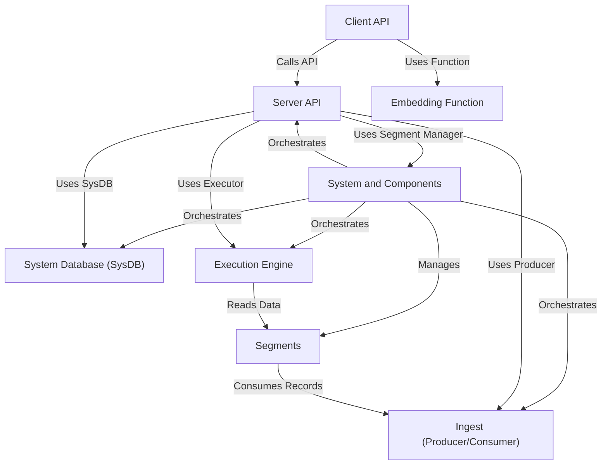

# Tutorial: chroma

Chroma is an open-source **vector database** that simplifies building AI applications using **embeddings**.
Users interact with Chroma through a *Client API*, which communicates with the *Server API*.
The server orchestrates various internal *Components* via a *System*, including the *System Database* for managing collections and segments, *Segments* for storing data, the *Execution Engine* for queries, and the *Ingest* pipeline for data changes.

**Source Repository:** [None](None)

## Chapters

1. [Client API
](01_client_api_.md)
2. [Embedding Function
](02_embedding_function_.md)
3. [Server API
](03_server_api_.md)
4. [System and Components
](04_system_and_components_.md)
5. [System Database (SysDB)
](05_system_database__sysdb__.md)
6. [Ingest (Producer/Consumer)
](06_ingest__producer_consumer__.md)
7. [Segments
](07_segments_.md)
8. [Execution Engine
](08_execution_engine_.md)

---

Generated by [AI Codebase Knowledge Builder](https://github.com/The-Pocket/Tutorial-Codebase-Knowledge)