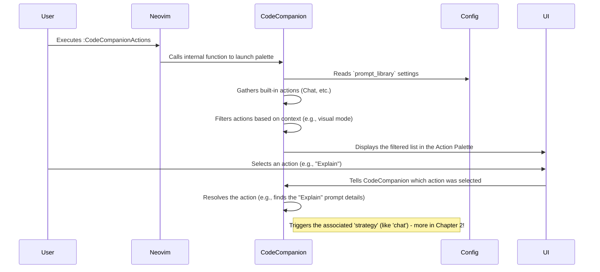

# Chapter 1: Action Palette & Prompt Library

Welcome to your journey with `codecompanion.nvim`! Think of CodeCompanion as your AI-powered coding partner right inside Neovim. But how do you talk to it? How do you tell it what you need? That's where the **Action Palette** and **Prompt Library** come in.

## What's the Big Idea?

Imagine you're working on some tricky code, and you wish you could just ask an expert, "Hey, what does this piece of code do?" Or maybe you often need help writing commit messages based on your changes. Doing this manually – copying code, switching to a browser, pasting into an AI chat, copying the answer back – gets tedious fast!

CodeCompanion solves this by giving you a central place to trigger common AI tasks directly from Neovim.

*   The **Action Palette** is like the main menu or remote control for CodeCompanion.
*   The **Prompt Library** is like a collection of speed-dial buttons for your most frequent AI requests.

Let's explore these two key concepts.

## Meet the Action Palette: Your Command Center

The Action Palette is the primary way you'll interact with CodeCompanion. It's a pop-up menu that lists all the available actions you can perform.

**How to open it:**

Simply run the command:

```vim
:CodeCompanionActions
```

**What you'll see:**

When you open it, you'll see a list, similar to this (the exact look might depend on your configuration):

<p align="center">
  
</p>

This list contains:

1.  **Built-in Actions:** Core functions like `Chat` (to start a new conversation with the AI) or `Open chats` (to switch between ongoing conversations).
2.  **Prompt Library Actions:** Pre-defined tasks that come bundled with CodeCompanion (like `Explain`, `Fix Code`, `Unit Tests`, `Generate a Commit Message`) and any custom tasks *you* create.

Think of it like the command palette (Ctrl+P or Cmd+P) you might find in other editors, but specifically for AI actions! You can navigate the list and press Enter to select an action.

## The Prompt Library: Your Saved AI Requests

While the Action Palette is the *menu*, the Prompt Library provides many of the *items* on that menu. It's a collection of pre-written instructions (prompts) that you can easily trigger.

**Why is this useful?**

*   **Consistency:** Ask the AI the same way every time for tasks like explaining code.
*   **Speed:** Trigger complex requests with a single command or key press instead of typing them out.
*   **Customization:** Define *your own* common AI tasks tailored to your workflow.

**Default Prompts:**

CodeCompanion comes with several helpful prompts built-in, such as:

*   `/explain`: Explain the code you have selected.
*   `/fix`: Suggest fixes for the selected code.
*   `/tests`: Generate unit tests for the selected code.
*   `/commit`: Generate a Git commit message based on your staged changes.

*(These are often called "slash commands" because you can trigger them directly like `/explain`)*

**Triggering Library Prompts:**

You have a few ways to use these prompts:

1.  **From the Action Palette:** As we saw, just run `:CodeCompanionActions` and select the prompt you want (e.g., "Explain").
2.  **Directly via Command:** You can run many prompts directly. For example, select some code in visual mode and run:
    ```vim
    :CodeCompanion /explain
    ```
    This will trigger the "Explain" prompt specifically for the selected code. (Note: You usually need to select code or have relevant context for these commands to work best).
3.  **With Keymappings:** You can even assign your favorite prompts to keyboard shortcuts! (We'll touch on how later). Imagine selecting code and pressing `<leader>ce` (or your chosen key) to instantly ask the AI to explain it.

## Adding Your Own Prompt: Customizing Your Assistant

The real power comes when you add your *own* prompts to the library. Let's say you frequently need to translate code comments from English to Spanish.

You can add a custom prompt in your CodeCompanion configuration (usually in your `init.lua` or a dedicated config file).

```lua
-- Inside your Neovim configuration (e.g., init.lua)
require("codecompanion").setup({
  -- ... other configurations might be here ...

  prompt_library = {
    -- Give your prompt a unique name
    ["Translate Comment to Spanish"] = {
      -- What kind of action is this? 'chat' opens a chat window.
      strategy = "chat",
      -- A description shown in the Action Palette
      description = "Translate selected comment block to Spanish",
      -- The actual instructions for the AI
      prompts = {
        {
          -- 'user' means this is coming from you
          role = "user",
          -- The text to send. We'll add the selected code later!
          content = "Translate the following comment into Spanish:"
          -- NOTE: CodeCompanion automatically adds selected code for many prompts!
        }
      },
      -- Optional settings for this prompt
      opts = {
          -- Only show this action when text is selected (visual mode)
          modes = { "v" },
          -- Make it auto-submit to the AI
          auto_submit = true,
          -- Don't let CodeCompanion add the selected code automatically,
          -- because we'll handle it in a more complex prompt later.
          -- For now, let's keep it simple and remove this line to let it auto-add.
          -- stop_context_insertion = true, -- We'll remove this for now
      }
    }
  },

  -- ... maybe more configurations ...
})
```

**Explanation:**

*   `require("codecompanion").setup({...})`: This is how you configure CodeCompanion.
*   `prompt_library = {...}`: This table holds all your custom prompts.
*   `["Translate Comment to Spanish"] = {...}`: This defines a new prompt. The part in `[]` is the name that appears in the Action Palette.
*   `strategy = "chat"`: This tells CodeCompanion *how* to handle the prompt. `"chat"` means it will likely open a new chat window to show the interaction. We'll learn more about [Strategies](02_strategies.md) in the next chapter.
*   `description = "..."`: Text shown in the Action Palette to help you remember what it does.
*   `prompts = {{...}}`: A list of messages to send to the AI.
    *   `role = "user"`: Specifies who is sending the message (you!). Other roles like `system` can set up context for the AI.
    *   `content = "..."`: The actual text of your request. CodeCompanion is smart enough to often automatically include the code you selected *after* this content when you trigger the action from visual mode!
*   `opts = {...}`: Extra options. Here, `modes = { "v" }` means this prompt will *only* appear in the Action Palette when you are in Visual mode (having selected text). `auto_submit = true` sends the request immediately.

Now, if you select a comment block in Neovim (using Visual mode) and run `:CodeCompanionActions`, you should see your new "Translate Comment to Spanish" action in the list! Selecting it will send your request (plus the selected comment) to the AI.

## How It Works Under the Hood (A Quick Peek)

You don't *need* to know this to use it, but a little insight can be helpful!

When you run `:CodeCompanionActions`:

1.  **Gather:** CodeCompanion looks at its built-in actions (like `Chat`) and reads your `prompt_library` from your configuration.
2.  **Filter:** It checks the current context (e.g., are you in Normal or Visual mode?) and filters the list based on rules like the `modes` option in your custom prompt.
3.  **Display:** It uses a Neovim UI element (like `vim.ui.select` or maybe the Telescope plugin if you have it configured) to show you the filtered list (the Action Palette).
4.  **Execute:** When you select an item, CodeCompanion figures out what to do based on the item's definition (e.g., run a built-in function or trigger the specified `strategy` for a library prompt).

Here's a simplified flow:



Code files involved (you don't need to edit these, just for reference):

*   `lua/codecompanion/actions/init.lua`: Handles launching the palette (`Actions.launch`) and gathering/filtering items (`Actions.items`).
*   `lua/codecompanion/actions/prompt_library.lua`: Specifically loads and prepares prompts from your configuration.
*   `lua/codecompanion/actions/static.lua`: Defines the built-in actions like `Chat`.
*   `lua/codecompanion/providers/actions/`: Contains code for *how* the palette is displayed (e.g., `default.lua`, `telescope.lua`).

## Conclusion

You've learned about two fundamental concepts in CodeCompanion:

*   **Action Palette (`:CodeCompanionActions`):** Your main menu for interacting with the AI.
*   **Prompt Library:** A collection of reusable AI tasks, both built-in and custom, that populate the Action Palette.

This combination allows you to quickly access powerful AI features and tailor CodeCompanion to your specific needs by adding your own prompts.

But what happens *after* you select an action? How does CodeCompanion actually interact with the AI to explain code, generate tests, or run your custom prompts? That's determined by **Strategies**.

Let's dive into those next!

**Next:** [Chapter 2: Strategies](02_strategies.md)

---

Generated by [AI Codebase Knowledge Builder](https://github.com/The-Pocket/Tutorial-Codebase-Knowledge)