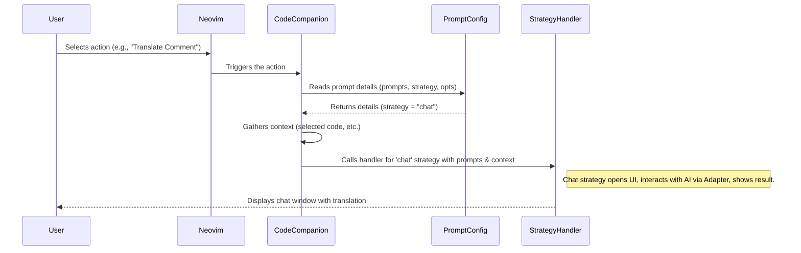

# Chapter 2: Strategies

In the [previous chapter](01_action_palette___prompt_library.md), we learned how the Action Palette and Prompt Library let you trigger AI tasks. You select an action, like "Explain Code" or your custom "Translate Comment to Spanish", and CodeCompanion does something magical.

But *how* does CodeCompanion handle these different requests? Does it always open a chat window? Does it sometimes edit your code directly? This is where **Strategies** come into play.

## What's the Big Idea? Different Tools for Different Jobs

Imagine you have a toolbox. Inside, you might find a hammer, a screwdriver, and a wrench. You wouldn't use a hammer to turn a screw, right? Each tool is suited for a specific type of job.

**Strategies** in CodeCompanion are like those different tools. They define the *way* you interact with the AI for a particular task. Some tasks are best handled with a conversation in a chat window, others involve changing your code directly, and some might even generate commands for Neovim itself.

CodeCompanion uses Strategies to offer these distinct interaction methods:

1.  **Conversation:** Chatting back and forth with the AI.
2.  **Direct Editing:** Letting the AI modify code right in your file.
3.  **Command Generation:** Asking the AI to figure out a Neovim command for you.

By having different Strategies, CodeCompanion can provide specialized tools for your various coding needs, all while sharing common parts behind the scenes (like the connection to the AI, which we'll cover in the [Adapters](06_adapters.md) chapter).

## Meet the Strategies

CodeCompanion currently comes with three main strategies:

1.  **`chat` Strategy:**
    *   **What it does:** Handles conversational interactions. Think of it like opening a dedicated chat window or buffer inside Neovim where you can talk back and forth with the AI.
    *   **When it's used:** Perfect for asking questions, explaining concepts, getting suggestions, generating commit messages, or anything where a dialogue makes sense.
    *   **Analogy:** Your main chat tool, like a messaging app.

2.  **`inline` Strategy:**
    *   **What it does:** Handles interactions that directly modify the code in your current file (your "buffer"). It allows the AI to suggest changes, additions, or replacements right where your cursor is or for the code you've selected.
    *   **When it's used:** Ideal for tasks like fixing a piece of code, refactoring a function, adding documentation automatically, or generating boilerplate code directly in place.
    *   **Analogy:** An intelligent code editor assistant that can type or change things for you.

3.  **`cmd` Strategy:**
    *   **What it does:** Handles requests specifically aimed at generating Neovim commands. You ask the AI what command you need (e.g., "sort these lines alphabetically"), and it tries to generate the correct `:sort` command for you.
    *   **When it's used:** Useful when you know *what* you want to do in Neovim but can't remember the exact command syntax.
    *   **Analogy:** A command-line helper that suggests the right incantation.

*Bonus Strategy: `workflow`*
*   There's also a more advanced `workflow` strategy that chains multiple prompts together, often using the `chat` or `inline` strategies underneath. We won't dive deep into this one now, but it's good to know it exists for complex, multi-step tasks.

## How Are Strategies Chosen? The Prompt Library Connection

So, how does CodeCompanion know which strategy to use when you select an action from the [Action Palette](01_action_palette___prompt_library.md)? It's usually defined right in the **Prompt Library** configuration!

Let's look back at the `Translate Comment to Spanish` example from Chapter 1:

```lua
-- Inside your Neovim configuration (e.g., init.lua)
require("codecompanion").setup({
  -- ... other configurations ...

  prompt_library = {
    ["Translate Comment to Spanish"] = {
      -- >>> HERE IT IS! <<<
      strategy = "chat", -- Tells CodeCompanion to use the chat interface
      description = "Translate selected comment block to Spanish",
      prompts = {
        {
          role = "user",
          content = "Translate the following comment into Spanish:"
        }
      },
      opts = {
          modes = { "v" },
          auto_submit = true,
      }
    }
  },

  -- ... more configurations ...
})
```

See that line `strategy = "chat"`? That's the key! When you define a custom prompt (or use a built-in one), you specify which "tool" CodeCompanion should use to handle it.

*   If you wanted a prompt to, say, automatically format the selected code according to a specific style guide, you might set `strategy = "inline"` because you want the code changed directly in your buffer.
*   If you wanted a prompt to generate a `:sort` command based on your selection, you might use `strategy = "cmd"`.

Most built-in prompts like `/explain` or `/commit` use the `chat` strategy because they typically involve explanations or generated text that's best displayed in a separate chat area. Prompts like `/fix` might use `chat` to suggest fixes or sometimes `inline` to apply them directly, depending on the specific implementation.

## How It Works Under the Hood (A Peek Inside)

When you trigger an action (often from the Action Palette or a direct command like `:CodeCompanion /explain`):

1.  **Lookup:** CodeCompanion finds the definition for that action (either a built-in action or one from your `prompt_library`).
2.  **Identify Strategy:** It reads the `strategy` specified in the action's definition (e.g., `chat`, `inline`, `cmd`).
3.  **Prepare Context:** It gathers necessary information, like the code you selected (if any), the current file type, your cursor position, etc. This is the "context".
4.  **Dispatch:** CodeCompanion calls the specific Lua module responsible for handling that strategy, passing along the prompt messages and the context.
5.  **Execute:** The strategy module then takes over:
    *   `chat`: Opens or updates a chat buffer, sends the messages to the AI via an [Adapter](06_adapters.md), and displays the response.
    *   `inline`: Sends the prompt and context to the AI, receives code changes, and applies them (often using diffing) to your current buffer.
    *   `cmd`: Sends the request to the AI and puts the generated command into your Neovim command line.

Here's a simplified view:



Relevant Code Files (for the curious, no need to edit!):

*   `lua/codecompanion/strategies/init.lua`: The main entry point that receives an action and dispatches it to the correct strategy based on the `strategy` field.
*   `lua/codecompanion/strategies/chat.lua`: Contains the logic for the `chat` strategy (handling the chat buffer, messages, etc.). We'll explore this in the next chapter!
*   `lua/codecompanion/strategies/inline/init.lua`: Contains the logic for the `inline` strategy (handling direct buffer modifications, diffing). We'll explore this later.
*   `lua/codecompanion/strategies/cmd.lua`: Contains the logic for the `cmd` strategy.

## Conclusion

You've now learned about **Strategies**, the different *methods* CodeCompanion uses to interact with the AI:

*   **`chat`:** For conversations in a dedicated buffer.
*   **`inline`:** For direct code modifications in your file.
*   **`cmd`:** For generating Neovim commands.

Strategies are like different tools in your AI toolbox, chosen based on the task defined in the Prompt Library. They provide flexibility in how you leverage AI within Neovim.

Now that we understand the *different ways* to interact, let's zoom in on the most common one: the `chat` strategy and its dedicated buffer.

**Next:** [Chapter 3: Chat Strategy / Buffer](03_chat_strategy___buffer.md)

---

Generated by [AI Codebase Knowledge Builder](https://github.com/The-Pocket/Tutorial-Codebase-Knowledge)