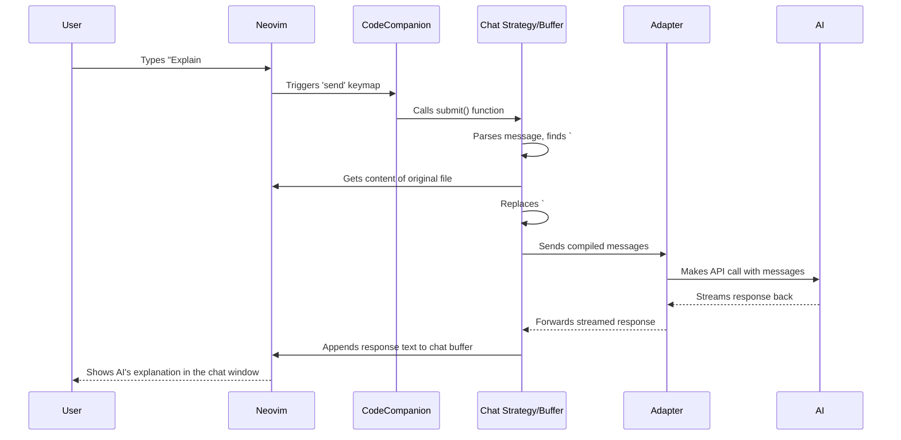

# Chapter 3: Chat Strategy / Buffer

In the [previous chapter](02_strategies.md), we learned about the different **Strategies** CodeCompanion uses to interact with the AI, like `chat`, `inline`, and `cmd`. We saw that the `chat` strategy is designed for conversations. But what does that actually look like inside Neovim?

Let's dive into the **Chat Buffer**, the heart of CodeCompanion's conversational `chat` strategy!

## What's the Big Idea? An Integrated Chat for Your Code

Imagine you're working on a complex function and have a bunch of questions. Maybe you want to ask:

*   "What's the main purpose of this function?"
*   "Can you suggest a more efficient way to write this loop?"
*   "How would I add error handling here?"

Normally, you might copy the code, switch to your web browser, paste it into an AI chat website, copy the answer, and switch back. This is slow and breaks your focus.

The **Chat Buffer** solves this by bringing that conversation directly into Neovim.

Think of it as an instant messaging app built right into your editor, specifically designed for talking to your AI assistant *about your code*. You type messages, the AI responds, and the conversation history is kept neatly in a special Neovim buffer (like a temporary file).

## Meet the Chat Buffer: Your AI Conversation Window

When you start a chat with CodeCompanion (e.g., by running `:CodeCompanionChat` or selecting an action like `/explain` from the [Action Palette](01_action_palette___prompt_library.md)), it opens the Chat Buffer.

**How to open it directly:**

```vim
:CodeCompanionChat
```

**What you'll see:**

It typically opens in a new window (split vertically, horizontally, or as a floating window, depending on your configuration). It looks something like this:

<p align="center">
  
</p>

**Key Parts:**

1.  **Header/Settings (Optional):** Sometimes shows the AI model being used (like `DeepSeek`) or other settings you can tweak.
2.  **Conversation History:** Shows the back-and-forth between you ("Me") and the AI ("CodeCompanion"). Your messages and the AI's responses are clearly separated.
3.  **Input Area:** The last part of the buffer is where you type your next message to the AI.

**Interacting:**

*   **Type:** Just type your message like you would in any chat app.
*   **Send:** Press `<Enter>` or `<C-s>` (Control + s) in Normal or Insert mode (these are the defaults, you can customize them!) to send your message to the AI.
*   **Response:** The AI's response will stream back into the buffer below your message.

It's designed to feel intuitive and familiar if you've ever used a chat application.

## Superpowers for Coding Chats

While it looks like a simple chat, the Chat Buffer has some special features tailored for coding:

1.  **Variables (`#`): Easy Context Sharing**
    Instead of manually copying and pasting code, you can use **Variables**. These are special codes starting with `#` that automatically insert relevant information.
    *   `#buffer`: Inserts the *entire content* of the file you were working on when you opened the chat.
    *   `#selection`: Inserts the code you had *selected* (in Visual mode).
    *   *(There are others, and you can even create your own! More on this in [Chapter 5: Variables & Slash Commands](05_variables___slash_commands.md))*

    **Example:** Open a chat while editing `my_script.py` and type:
    ```markdown
    Explain this code: #buffer
    ```
    When you send this, CodeCompanion replaces `#buffer` with the actual content of `my_script.py` before sending it to the AI. Super convenient!

2.  **Slash Commands (`/`): Running Quick Actions**
    Remember the [Prompt Library](01_action_palette___prompt_library.md)? Many prompts can be triggered directly within the chat using **Slash Commands**. These start with `/`.
    *   `/explain`: Ask the AI to explain the last piece of context (like code added via `#selection`).
    *   `/file`: Opens a file picker (like Telescope or fzf) so you can select *another* file and add its content to the chat context.
    *   *(Again, many built-in commands exist, and you can create your own. We'll cover these in detail in [Chapter 5: Variables & Slash Commands](05_variables___slash_commands.md))*

    **Example:**
    ```markdown
    Compare the logic in #selection with the logic in this other file: /file
    ```
    Typing `/file` and pressing Enter (or using completion) would pop up a file finder. Selecting `utils.py` would add its content to the conversation history under a "Sharing" blockquote.

3.  **Agents & Tools (`@`): Giving the AI Abilities**
    This is a more advanced feature. You can invoke **Agents** or **Tools** using `@`. These allow the AI to perform actions beyond just talking.
    *   `@editor`: The AI can suggest changes and *apply them* directly to your code files (often showing you a diff first).
    *   `@cmd_runner`: The AI can generate and ask for permission to run shell commands.
    *   *(We'll explore these powerful features in [Chapter 8: Agents & Tools](08_agents___tools.md))*

    **Example:**
    ```markdown
    Refactor the selected code to be more Pythonic using the @editor tool.
    ```
    The AI might respond with not just text, but also an instruction for the `@editor` tool to modify your code.

These special features make the Chat Buffer much more powerful than a standard web chat for coding tasks.

## How to Use It: A Simple Example

Let's walk through explaining a file:

1.  **Open your code:** Have a file open in Neovim, say `calculator.js`.
2.  **Open the Chat:** Run `:CodeCompanionChat`. A new chat window appears.
3.  **Type your request:** Go to the bottom of the chat buffer and type:
    ```markdown
    Could you explain what this JavaScript code does? Please be concise. #buffer
    ```
4.  **Send it:** Press `<C-s>` (or `<Enter>`).
5.  **Wait for the AI:** CodeCompanion sends your message (with the content of `calculator.js` automatically inserted where `#buffer` was) to the configured AI model via an [Adapter](06_adapters.md).
6.  **See the response:** The AI's explanation streams back into the chat buffer below your message, looking something like this:

    ```markdown
    ## Me

    Could you explain what this JavaScript code does? Please be concise. #buffer

    > Sharing:
    > - calculator.js

    ## CodeCompanion (DeepSeek)

    This JavaScript code defines a simple calculator object. It has functions for basic arithmetic operations:

    *   `add(a, b)`: Returns the sum of `a` and `b`.
    *   `subtract(a, b)`: Returns the difference between `a` and `b`.
    *   `multiply(a, b)`: Returns the product of `a` and `b`.
    *   `divide(a, b)`: Returns the quotient of `a` and `b`, handling division by zero by returning an error message.

    It seems designed for straightforward calculations within a larger application.
    ```

Now you can continue the conversation, ask follow-up questions, use `/` commands, or add more context with `#` variables, all without leaving Neovim!

## How It Works Under the Hood (A Peek Inside)

What happens when you interact with the Chat Buffer?

1.  **Initialization (`:CodeCompanionChat` or strategy trigger):**
    *   CodeCompanion creates a new, dedicated Neovim buffer (like a temporary file) with the `codecompanion` filetype.
    *   It sets up the window layout (split, float) based on your `config.display.chat.window` settings.
    *   It attaches keymaps (`<C-s>`, `q`, `?`, etc.) defined in `config.strategies.chat.keymaps`.
    *   It may add an initial system prompt (instructions for the AI) to the internal message list.
    *   It renders the initial UI, perhaps with a welcome message.

2.  **Sending a Message (`<C-s>` or `<Enter>`):**
    *   The Chat module reads the text you just typed from the buffer.
    *   It parses the message for Variables (`#...`), Slash Commands (`/...`), and Agent/Tool invocations (`@...`).
    *   **Context Expansion:** It replaces Variables like `#buffer` with the actual content. It executes Slash Commands (like `/file` which adds content from another file).
    *   **History Compilation:** It gathers the *entire* conversation history (including hidden system prompts and context added via commands/variables) and appends your new, processed message.
    *   **Adapter Call:** It sends this complete message list to the configured AI model through the active [Adapter](06_adapters.md) (e.g., OpenAI, Ollama).
    *   **UI Update:** It locks the buffer temporarily and might show a "processing" indicator.

3.  **Receiving a Response:**
    *   The [Adapter](06_adapters.md) receives the AI's response (often streamed piece by piece).
    *   The Chat module receives this streamed text.
    *   It appends the AI's response text to the chat buffer under the "CodeCompanion" header.
    *   It handles special instructions if the AI uses Agents/Tools (`@editor`).
    *   Once the response is complete, it unlocks the buffer so you can type again.

Here's a simplified diagram:



**Relevant Code Files (For the Curious):**

*   `lua/codecompanion/strategies/chat/init.lua`: This is the main engine for the chat strategy. The `Chat.new()` function sets up a new chat buffer, and `Chat:submit()` handles sending messages and processing context.
*   `lua/codecompanion/strategies/chat/ui.lua`: Manages the visual aspects – creating the window, rendering headers, displaying messages, handling scrolling.
*   `lua/codecompanion/strategies/chat/keymaps.lua`: Defines the default keybindings within the chat buffer (like sending, closing, getting help with `?`).
*   `lua/codecompanion/strategies/chat/variables/init.lua`: Logic for detecting and handling `#` variables.
*   `lua/codecompanion/strategies/chat/slash_commands/init.lua`: Logic for detecting and executing `/` commands.
*   `lua/codecompanion/strategies/chat/agents/init.lua`: Logic for detecting `@` mentions and coordinating with Agents/Tools.

You don't need to modify these files to use the chat buffer, but knowing where the logic lives can be helpful!

## Conclusion

The **Chat Strategy / Buffer** is your primary tool for having conversations with your AI coding assistant directly within Neovim. It provides a familiar chat interface supercharged with coding-specific features:

*   **Easy Context:** Use `#` Variables (`#buffer`, `#selection`) to quickly include code.
*   **Quick Actions:** Use `/` Slash Commands (`/file`, `/explain`) to run predefined tasks or add more context dynamically.
*   **AI Abilities:** Use `@` Agents/Tools (`@editor`) to let the AI perform actions (more advanced).

It keeps your coding workflow smooth by eliminating the need to constantly switch between your editor and external AI tools.

But what if you don't need a full conversation? What if you just want the AI to quickly generate or modify a small piece of code right where your cursor is? For that, CodeCompanion offers the `inline` strategy.

**Next:** [Chapter 4: Inline Strategy / Assistant](04_inline_strategy___assistant.md)

---

Generated by [AI Codebase Knowledge Builder](https://github.com/The-Pocket/Tutorial-Codebase-Knowledge)