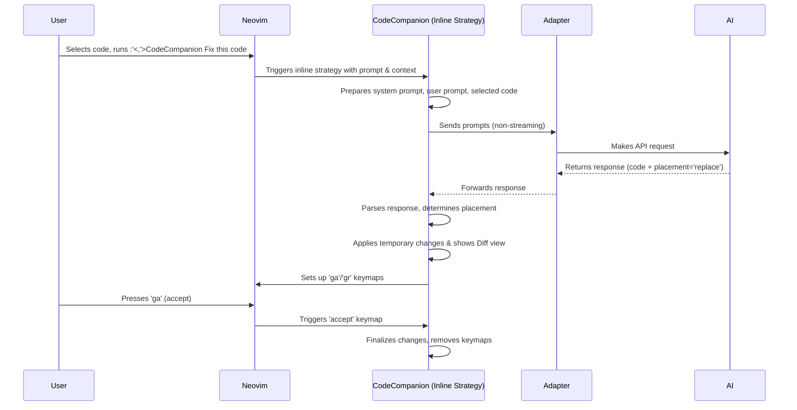

# Chapter 4: Inline Strategy / Assistant

In the [previous chapter](03_chat_strategy___buffer.md), we explored the **Chat Strategy / Buffer**, which gives you a dedicated conversation window inside Neovim for talking with your AI assistant. It's great for asking questions, getting explanations, and longer interactions.

But what if you need a quick change? Maybe you want the AI to fix a small typo, add a comment, or generate a short piece of boilerplate code directly into your file? Switching to a chat window for that feels a bit heavy.

This is where the **Inline Strategy / Assistant** shines!

## What's the Big Idea? An AI Assistant Inside Your Code

Imagine you've just written a small function in Python, like this:

```python
def greet(name):
  print(f"Hello, {name}!")
```

You realize you forgot to add a docstring explaining what it does. You *could* manually type it, or you could ask your AI assistant. With the `chat` strategy, you'd copy the code, open the chat, ask for a docstring, copy the response, and paste it back.

The **Inline Strategy** makes this much faster. It acts like an AI assistant working *directly within your code file* (your buffer), almost like it's typing alongside you.

**Use Case: Adding a Docstring**

1.  You select the `greet` function in Visual mode.
2.  You run a command like `:CodeCompanion Add Python docstring`.
3.  Instead of opening a chat, CodeCompanion interacts with the AI behind the scenes.
4.  The AI generates the docstring.
5.  CodeCompanion shows you the proposed change *directly in your buffer*, often highlighting what will be added or changed (like a "diff").
6.  You press a key (like `ga` - "go accept") to accept the change, and the docstring is permanently added. Or you press another key (like `gr` - "go reject") to discard it.

It's designed for quick, targeted code modifications and generation, making the AI feel like a seamless part of your editing workflow.

## How It Works: The Inline Magic

The Inline Strategy is quite clever. When you trigger an action that uses it:

1.  **Context Grab:** It grabs your prompt and often the code you've selected, your cursor position, and the file type.
2.  **AI Request:** It sends this information to the AI, asking it to fulfill your request (e.g., "Add a Python docstring for this code").
3.  **Smart Placement (Classification):** Here's the clever part! The AI doesn't just send back the code. It also tries to figure out *how* the code should be inserted:
    *   **`replace`:** Should it replace the code you selected? (Useful for refactoring or fixing).
    *   **`add`:** Should it add the code *after* your cursor or selection? (Useful for generating code below).
    *   **`before`:** Should it add the code *before* your cursor or selection? (Perfect for adding docstrings or comments).
    *   **`new`:** Should the code go into a completely new buffer? (Good for generating unit tests).
    *   **`chat`:** Is this request actually better suited for a conversation? (If you ask "Explain this code" using an inline prompt, it might switch to chat).
4.  **Diff View:** Before making any permanent changes, CodeCompanion usually presents the AI's suggestion as a **diff**. This visually highlights the lines that will be added, removed, or changed, comparing the original code with the AI's suggestion. You can clearly see what the AI wants to do.
    <p align="center">
      
    </p>
5.  **Accept or Reject:** You are in control! Using pre-configured keymaps (check the documentation or your config, defaults are often `ga` to accept and `gr` to reject), you decide whether to apply the changes or discard them.

This combination of smart placement and a diff view makes the Inline Strategy powerful yet safe – you always get the final say before the AI modifies your code.

## Using the Inline Assistant

There are a few ways to trigger the Inline Assistant:

1.  **Direct Command:** You can type a command directly.
    *   To add that docstring without selecting code first (placing it after your cursor):
        ```vim
        :CodeCompanion Add a Python docstring for the function below
        ```
    *   To fix selected code: Select the code in Visual mode (`V`, `v`, or `Ctrl-V`), then run:
        ```vim
        :'<,'>CodeCompanion Fix this code
        ```
        *(The `:'<,'>` part is automatically added by Neovim when you run a command from Visual mode)*

2.  **Prompt Library Actions:** If you have prompts defined in your [Prompt Library](01_action_palette___prompt_library.md) with `strategy = "inline"`, you can trigger them via the [Action Palette](01_action_palette___prompt_library.md) or directly.
    *   Example prompt library entry:
        ```lua
        -- In your codecompanion config
        prompt_library = {
          ["Add Docstring"] = {
            strategy = "inline", -- Use the inline assistant!
            description = "Generate a Python docstring for selected function",
            prompts = {
              { role = "user", content = "Generate a Python docstring for the following code:" }
            },
            opts = { modes = { "v" } } -- Only show in visual mode
          }
        }
        ```
    *   Triggering it: Select your function, run `:CodeCompanionActions`, choose "Add Docstring". Or run directly: `:'<,'>CodeCompanion /Add Docstring`

3.  **Variables:** Just like the Chat Buffer, the Inline Assistant supports [Variables](05_variables___slash_commands.md) like `#buffer` to include context easily.
    ```vim
    :CodeCompanion #buffer Add a main execution block to this Python script
    ```

**Accepting/Rejecting Changes:**

Once the diff view appears:

*   Press `ga` (default): Applies the AI's suggested changes.
*   Press `gr` (default): Rejects the changes and restores your code to how it was.

*(These keymaps can be configured in the `strategies.inline.keymaps` section of your setup)*

## How It Works Under the Hood (A Peek Inside)

Let's follow the journey when you select code and run `:'<,'>CodeCompanion Fix this code`:

1.  **Trigger:** Neovim tells CodeCompanion to run the "Fix this code" action using the `inline` strategy.
2.  **Context:** The `inline` strategy module (`inline/init.lua`) gathers details: your selected code (`context.lines`), the start/end lines (`context.start_line`, `context.end_line`), filetype (`context.filetype`), etc.
3.  **Prompt Prep:** It prepares the messages for the AI. This includes a special "system prompt" telling the AI it's working inline, needs to provide code *and* a placement suggestion (like `replace`), and your user prompt ("Fix this code") along with the selected code context.
4.  **Adapter Call:** It sends these prompts to the AI model via the configured [Adapter](06_adapters.md). Importantly, for inline actions, it usually tells the adapter *not* to stream the response, waiting for the full result.
5.  **AI Response:** The AI processes the request and sends back a response, typically in a structured format (like XML) containing the suggested code and the placement (`<placement>replace</placement>`).
6.  **Parsing:** The `inline` strategy parses this response (`Inline:parse_output`). It extracts the code and the placement (`replace`).
7.  **Placement Logic:** Based on the `replace` placement, it figures out where to put the code (in this case, it will replace the lines you originally selected) (`Inline:place`). It also saves the original content of your buffer (`self.lines`) in case you reject the changes.
8.  **Diff Display:** If diffing is enabled (usually is!), it calls a diff provider (`default.lua` or `mini_diff.lua`). This provider compares the *current* state of the buffer (which might already be temporarily modified by the placement logic) with the saved *original* content and displays the differences. It also sets up the `ga` and `gr` keymaps (`inline/keymaps.lua`).
9.  **User Action:** It waits for you to press `ga` or `gr`.
10. **Apply/Revert:**
    *   If `ga`: The diff provider finalizes the changes (`diff:accept()`). The keymaps are removed.
    *   If `gr`: The diff provider reverts the buffer content back to the saved original state (`diff:reject()`). The keymaps are removed.

Here's a simplified sequence diagram:



**Relevant Code Files (For the Curious):**

*   `lua/codecompanion/strategies/inline/init.lua`: The main engine for the inline strategy. Handles context, prompts, calling the adapter, parsing the response (`Inline:parse_output`), determining placement (`Inline:place`), and coordinating the diff (`Inline:start_diff`).
*   `lua/codecompanion/providers/diff/default.lua` / `mini_diff.lua`: Implement the visual diffing logic, comparing original vs. suggested code.
*   `lua/codecompanion/strategies/inline/keymaps.lua`: Defines the functions that run when you press `ga` (`accept_change`) or `gr` (`reject_change`).
*   `lua/codecompanion/strategies/inline/variables/init.lua`: Handles parsing and expanding variables like `#buffer` in inline prompts (more on this next!).

## Conclusion

The **Inline Strategy / Assistant** provides a powerful way to interact with AI for direct code manipulation within your Neovim buffers. Key takeaways:

*   It works **directly in your code file**, not a separate chat window.
*   It's ideal for **quick fixes, refactoring, and code generation**.
*   It intelligently tries to **determine the best placement** (`replace`, `add`, `before`, `new`, `chat`).
*   It uses a **diff view** so you can review changes before applying them.
*   You have **final control** via accept/reject keymaps (`ga`/`gr`).

This strategy seamlessly integrates AI into your moment-to-moment coding, making it feel less like a separate tool and more like a true coding companion.

Both the Chat and Inline strategies benefit from powerful ways to add context using Variables (`#`) and trigger actions using Slash Commands (`/`). Let's explore those next!

**Next:** [Chapter 5: Variables & Slash Commands](05_variables___slash_commands.md)

---

Generated by [AI Codebase Knowledge Builder](https://github.com/The-Pocket/Tutorial-Codebase-Knowledge)