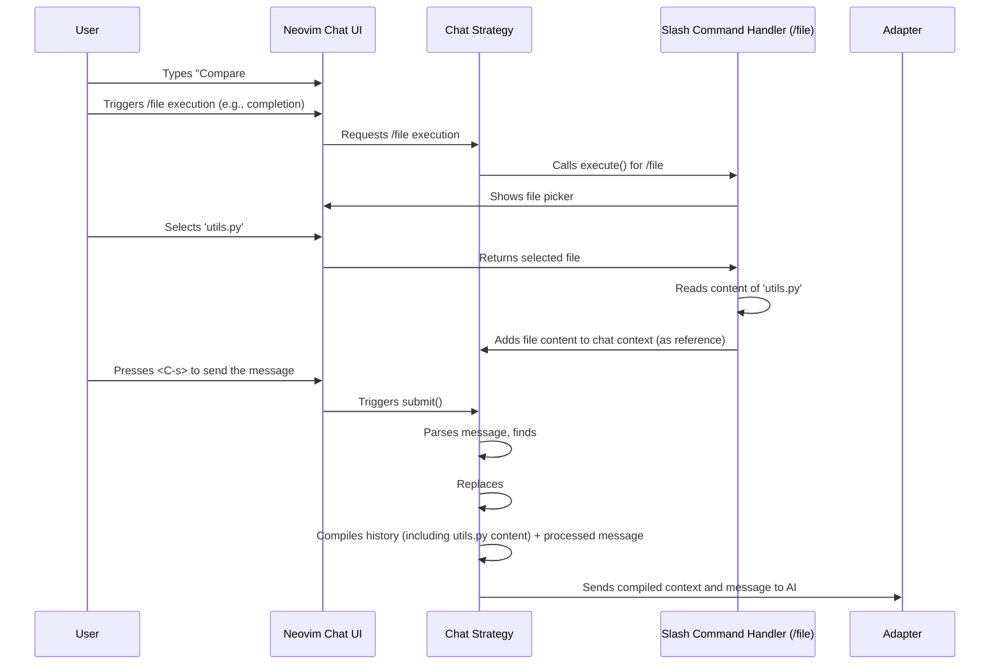

# Chapter 5: Variables & Slash Commands

In the [previous chapter](04_inline_strategy___assistant.md), we saw how the `inline` strategy helps with quick code edits directly in your buffer. Before that, in [Chapter 3](03_chat_strategy___buffer.md), we explored the `chat` strategy for conversations. Both ways of interacting with your AI assistant become much more powerful when you can easily provide the right *context*.

Manually copying code snippets, error messages, or the content of other files into your prompts is slow and breaks your flow. How can we make adding this crucial information easier? That's where **Variables** and **Slash Commands** come in!

## What's the Big Idea? Smart Shortcuts for Context

Imagine you're using the Chat Buffer. You want to ask the AI, "How does the function I just selected compare to the main function in `utils.py`?". You *could*:

1.  Copy the selected function.
2.  Open `utils.py`.
3.  Copy its main function.
4.  Go back to the chat.
5.  Paste both pieces of code into your message.
6.  Finally, type your question.

That's a lot of steps!

**Variables (`#`)** and **Slash Commands (`/`)** are shortcuts primarily used within the [Chat Strategy / Buffer](03_chat_strategy___buffer.md) to avoid this manual work.

*   **Variables (like `#buffer`)** automatically pull in *dynamic* information from your current Neovim environment. Think of them as live data feeds.
*   **Slash Commands (like `/file`)** trigger *actions*, often involving a menu or picker, to fetch specific information and insert it. Think of them as context-gathering tools.

Let's look at each one.

## Meet Variables: Your Dynamic Data (`#`)

Variables start with a `#` symbol. When you send a message in the Chat Buffer containing a variable, CodeCompanion automatically replaces it with the relevant information *before* sending the message to the AI.

**Common Built-in Variables:**

*   `#buffer`: Replaced with the *entire content* of the file you were in when you opened the chat (or the last active buffer).
*   `#selection`: Replaced with the text you had *selected* in Visual mode when you triggered the action or opened the chat. (We saw this implicitly in Chapter 3!).
*   `#lsp`: Replaced with diagnostic information (errors, warnings) from the Language Server Protocol for the current buffer. Great for asking about errors!
*   `#viewport`: Replaced with the text currently visible on your screen in the source buffer.

**Example Usage in Chat:**

Let's say you're editing `my_script.py` and it has an LSP error. You open the chat (`:CodeCompanionChat`) and type:

```markdown
Why am I getting this error in my code?

Error details: #lsp

Full file content for context: #buffer
```

**What Happens:**

When you press `<C-s>` (or your send key):

1.  CodeCompanion sees `#lsp`. It asks Neovim for the diagnostics in `my_script.py`.
2.  It sees `#buffer`. It grabs the full content of `my_script.py`.
3.  It constructs a message for the AI, replacing the variables:

    ```markdown
    Why am I getting this error in my code?

    Error details: 
    Severity: ERROR
    LSP Message: Undefined variable 'my_var'
    Code:
    ```python
    10: print(my_var) 
    ```

    Full file content for context: 
    ```python
    # Content of my_script.py...
    import os

    def process_data(data):
        # ... lots of code ...
        print(my_var) # Line 10
        # ... more code ...
    ```
    ```

4.  This complete message is sent to the AI.

Notice how `#lsp` and `#buffer` were automatically expanded! You didn't have to copy anything manually.

**(Note:** You can define your own custom variables! We'll touch upon this in the [Chapter 7: Configuration System](07_configuration_system.md)).

## Meet Slash Commands: Your Context Tools (`/`)

Slash Commands start with a `/` symbol. Unlike variables, they usually don't represent *existing* dynamic data. Instead, they trigger an *action* to fetch or select specific content. This often involves a pop-up menu or file picker.

**Common Built-in Slash Commands:**

*   `/file`: Opens a file picker (like Telescope, fzf, or a default menu) allowing you to select one or more files. Their content is then added to the chat context.
*   `/buffer`: Opens a buffer picker, similar to `/file` but for currently open buffers in Neovim. Lets you add content from other *open* files. (Don't confuse this with the `#buffer` variable which grabs the *current* buffer automatically).
*   `/symbols`: Uses Tree-sitter to parse a file you select, extracts its structure (functions, classes, etc.), and adds this *outline* to the chat. Useful for giving the AI an overview without sending the whole file.
*   `/terminal`: Adds the output from the last Neovim terminal buffer you used. Handy for sharing test results or command outputs.
*   `/help`: Lets you search Vim/Neovim help tags and add content from a help file.
*   `/fetch`: Lets you provide a URL, fetches the content (using jina.ai by default), and adds it to the chat.

**Example Usage in Chat:**

Let's revisit our original use case: comparing a selected function with one in `utils.py`.

1.  Select the function in your current file (e.g., `main.py`).
2.  Open the chat (`:CodeCompanionChat`).
3.  Type your message, using `#selection` for the selected code and `/file` to grab the other file:

    ```markdown
    Compare the selected function (#selection) with the main logic in this other file: /file
    ```

4.  Place your cursor after `/file` and press Enter (or trigger completion and select `/file`).
5.  A file picker pops up! Navigate and select `utils.py`.
6.  Press Enter to confirm the selection.
7.  Now, press `<C-s>` to send the whole request.

**What Happens:**

1.  CodeCompanion processes the message *before* sending.
2.  It sees `#selection` and grabs your visually selected code from `main.py`.
3.  It sees `/file` was used, and you selected `utils.py`. It reads the content of `utils.py`.
4.  It constructs the context for the AI. This often involves adding the fetched content under a "Sharing" block:

    ```markdown
    ## Me

    Compare the selected function (#selection) with the main logic in this other file: /file

    > Sharing:
    > - utils.py

    ## CodeCompanion (DeepSeek) 
    
    Okay, let's compare the two... 
    The function you selected (`your_selected_function_name`) seems to handle X, while the main logic in `utils.py` focuses on Y...
    ```
    *(The exact format may vary slightly)*

The `/file` command triggered an action (the file picker) and injected the content of `utils.py` into the conversation history automatically.

**(Note:** You can also turn prompts from your [Prompt Library](01_action_palette___prompt_library.md) into Slash Commands by setting `opts.is_slash_cmd = true` in their configuration!)

## How It Works Under the Hood (A Peek Inside)

When you type a message in the Chat Buffer and hit send (e.g., `<C-s>`):

1.  **Input Capture:** The [Chat Strategy / Buffer](03_chat_strategy___buffer.md) captures the text you typed.
2.  **Parsing:** It scans your message for `#` prefixes (Variables) and `/` prefixes (Slash Commands).
3.  **Variable Expansion:** For each `#variable` found (like `#buffer`), it calls the corresponding variable handler (e.g., `variables/buffer.lua`). This handler fetches the required data (like buffer content) and *replaces* the `#variable` text in your message with this data.
4.  **Slash Command Execution:** If you explicitly executed a `/command` (like typing `/file` and hitting Enter to trigger the picker), that command's handler (e.g., `slash_commands/file.lua`) runs. It performs its action (shows picker, reads file) and adds the fetched content as *new context* to the conversation history, often marked clearly (like in a "Sharing:" blockquote). Your original message might just contain `/file` as text, but the *context* now includes the file content.
5.  **History Compilation:** The Chat Strategy gathers the *entire* conversation history, including system prompts, previous messages, context added by Slash Commands, and your latest message (with Variables expanded).
6.  **Adapter Call:** This complete package is sent to the AI via the configured [Adapter](06_adapters.md).

Here's a simplified sequence diagram for the `/file` example:



**Code Pointers (For the Curious):**

*   **Parsing & Handling:**
    *   `lua/codecompanion/strategies/chat/variables/init.lua`: Contains the logic (`Variables:parse`) to find `#` variables in messages and call the correct handlers.
    *   `lua/codecompanion/strategies/chat/slash_commands/init.lua`: Contains the logic (`SlashCommands:execute`) to run `/` commands when triggered, often involving UI providers.
*   **Example Handlers:**
    *   `lua/codecompanion/strategies/chat/variables/buffer.lua`: Implements the logic for `#buffer`, reading the buffer content (`Variable:read`) and adding it (`Variable:output`).
    *   `lua/codecompanion/strategies/chat/slash_commands/file.lua`: Implements `/file`. Note how it uses different *providers* (default, telescope, fzf) to show the file picker (`providers.telescope`, `providers.default`, etc.) and then reads the file (`SlashCommand:read`) and adds it to the chat (`SlashCommand:output`).
*   **Completion:**
    *   `lua/codecompanion/completion.lua`: Provides the lists of available variables (`M.variables`) and slash commands (`M.slash_commands`) used for autocompletion when you type `#` or `/` in the chat buffer.

Here's a tiny glimpse of how variable parsing might look conceptually:

```lua
-- Simplified idea from lua/codecompanion/strategies/chat/variables/init.lua
local Variables = {}

function Variables:find(message_content)
  local found = {}
  -- Loop through configured variables (like "buffer", "lsp")
  for var_name, _ in pairs(configured_variables) do
    -- Check if the message contains "#" followed by the variable name
    if message_content:match("#" .. var_name) then
      table.insert(found, var_name) -- Remember we found it
    end
  end
  return found
end

function Variables:parse(chat, message)
  local vars_found = self:find(message.content)
  if vars_found then
    for _, var_name in ipairs(vars_found) do
      -- Get the handler function/module for this variable
      local handler = get_variable_handler(var_name)
      -- Execute the handler to add the context
      handler:output(chat)
      -- Remove the "#variable" text from the original message (simplified)
      message.content = message.content:gsub("#" .. var_name, "")
    end
    return true -- Indicate that variables were processed
  end
  return false
end
```
This shows the basic idea: find the `#variable` pattern, call a specific function to handle it (which adds context), and clean up the original message. Slash commands work similarly but are usually triggered explicitly and add context separately rather than replacing text in the message itself.

## Conclusion

Variables (`#`) and Slash Commands (`/`) are powerful tools, primarily within the [Chat Strategy / Buffer](03_chat_strategy___buffer.md), that make providing context to your AI assistant fast and effortless.

*   **Variables (`#`)** are placeholders for *dynamic data* automatically pulled from Neovim (e.g., `#buffer`, `#lsp`).
*   **Slash Commands (`/`)** are *actions* that fetch specific content, often interactively (e.g., `/file`, `/symbols`).

By using these shortcuts, you can keep your focus on the coding task and let CodeCompanion handle the tedious work of gathering and injecting the necessary information into your AI conversations.

Now that we understand how to structure prompts and add context, how does CodeCompanion *actually* talk to different AI models (like OpenAI's GPT, Anthropic's Claude, or a local Ollama instance)? That's the job of **Adapters**.

**Next:** [Chapter 6: Adapters](06_adapters.md)

---

Generated by [AI Codebase Knowledge Builder](https://github.com/The-Pocket/Tutorial-Codebase-Knowledge)