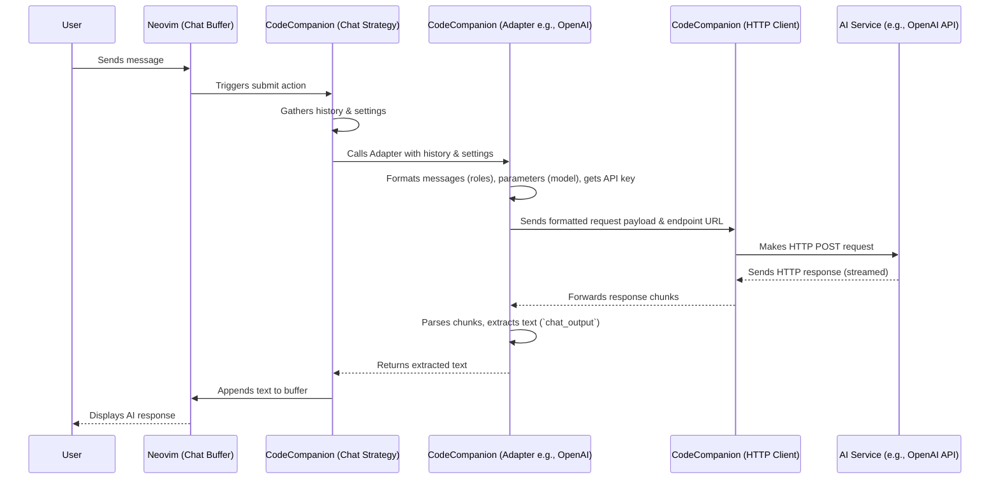

# Chapter 6: Adapters

In [Chapter 5: Variables & Slash Commands](05_variables___slash_commands.md), we saw how to easily add context to our conversations with the AI assistant using `#` variables and `/` slash commands. Now we have our message ready, maybe asking the AI to explain some code. But *how* does CodeCompanion actually send this message to an AI service like OpenAI, Copilot, or a local model running with Ollama? And how does it understand the response?

That's where **Adapters** come in!

## What's the Big Idea? Universal Translators for AI

Think about traveling to another country. Your phone charger might not fit their wall sockets, so you use a **power plug adapter**. Or, if you don't speak the local language, you might use a **translation app** or a phrasebook.

**Adapters** in CodeCompanion are like those power plugs and translators, but for different Artificial Intelligence services, specifically Large Language Models (LLMs).

CodeCompanion wants to be able to talk to various AI providers (OpenAI's GPT models, GitHub Copilot, local models via Ollama, Google Gemini, Anthropic's Claude, etc.). However, each of these services has its own specific way of receiving requests and sending back responses – they speak different "technical languages" (different Application Programming Interfaces or APIs).

An Adapter solves this problem:

1.  **Takes the Request:** It receives a standard request from CodeCompanion's core logic (like the [Chat Strategy / Buffer](03_chat_strategy___buffer.md)). This request includes things like the conversation history, the user's latest message, and maybe some settings like the desired creativity level (`temperature`).
2.  **Translates:** It translates this standard request into the *exact* format required by a *specific* AI service (e.g., formatting the messages correctly for OpenAI's API, adding the necessary authentication key).
3.  **Sends and Receives:** It sends the translated request to the AI service (using CodeCompanion's [HTTP Client](10_http_client.md) behind the scenes) and waits for the response.
4.  **Translates Back:** It takes the AI service's response (which might be in a specific format) and translates it back into a standard format that CodeCompanion's core logic can understand (e.g., extracting just the helpful text part of the answer).

This way, the main parts of CodeCompanion (like the Chat Buffer or the [Inline Strategy / Assistant](04_inline_strategy___assistant.md)) don't need to know the complicated details of how to talk to *each individual* AI service. They just talk to the currently selected Adapter, and the Adapter handles the rest.

## What Adapters Do

Adapters handle several important tasks:

*   **Authentication:** Managing API keys or other secrets needed to access the AI service. They know where to put the key (e.g., in an "Authorization" header).
*   **Request Formatting:** Building the specific data structure (often JSON) that the target API expects. This includes:
    *   Mapping CodeCompanion's standard roles (`user`, `llm`, `system`) to the roles the AI service expects (e.g., OpenAI uses `user`, `assistant`, `system`).
    *   Including parameters like the chosen model name (`gpt-4o`, `llama3`), `temperature`, `max_tokens`, etc., in the correct place.
*   **Response Parsing:** Extracting the useful information (like the generated text or code) from the potentially complex response sent back by the AI service. They might need to handle streaming data (where the response comes in chunks) or specific error formats.
*   **Feature Compatibility:** Knowing what features an AI service supports (e.g., can it understand images? Does it support streaming responses?).

## Choosing Your Adapter

How does CodeCompanion know which Adapter to use? You configure it!

In your CodeCompanion setup, you can specify which adapter should be used by default for different [Strategies](02_strategies.md).

Here's a simplified example of how you might tell CodeCompanion to use the `openai` adapter for the chat strategy and the `copilot` adapter for the inline strategy:

```lua
-- Inside your Neovim configuration (e.g., init.lua)
require("codecompanion").setup({
  -- ... other configurations ...

  strategies = {
    chat = {
      -- Use the OpenAI adapter for chat interactions
      adapter = "openai",
      -- ... other chat strategy settings ...
    },
    inline = {
      -- Use the Copilot adapter for inline code suggestions
      adapter = "copilot",
      -- ... other inline strategy settings ...
    },
    -- cmd = { ... } -- You can configure the cmd strategy too
  },

  -- You can also configure specific adapter details here
  adapters = {
    openai = function()
      -- Load the base OpenAI adapter and extend it
      return require("codecompanion.adapters").extend("openai", {
        -- Tell the adapter which specific OpenAI model to use
        schema = {
          model = {
            default = "gpt-4o-mini" -- Use the cheaper/faster mini model
          }
        },
        -- You might configure API keys here too (see docs for secure ways!)
        env = {
          -- Example: read API key from environment variable OPENAI_API_KEY
          api_key = "OPENAI_API_KEY"
        }
      })
    end,
    -- You could configure the 'ollama' adapter similarly if you use it
  },

  -- ... maybe more configurations ...
})
```

**Explanation:**

*   `strategies.chat.adapter = "openai"`: Tells the chat strategy to use the adapter named "openai".
*   `strategies.inline.adapter = "copilot"`: Tells the inline strategy to use the adapter named "copilot".
*   `adapters = {...}`: This section allows you to customize the adapters themselves.
*   `adapters.openai = function() ... end`: We define custom settings for the "openai" adapter.
*   `require("codecompanion.adapters").extend("openai", {...})`: This is the standard way to take a built-in adapter (like "openai") and override some of its settings.
*   `schema.model.default = "gpt-4o-mini"`: We're telling the OpenAI adapter to use the "gpt-4o-mini" model by default.
*   `env.api_key = "OPENAI_API_KEY"`: This tells the adapter to look for your OpenAI API key in an environment variable named `OPENAI_API_KEY`. (Check the [Configuration System](07_configuration_system.md) chapter and the official docs for more secure ways to handle keys, like using `cmd:` to fetch from password managers).

Now, when you use the chat, CodeCompanion will use your configured OpenAI adapter. When you use an inline action, it will use the Copilot adapter. It's plug-and-play!

*(See `doc/configuration/adapters.md` in the CodeCompanion project for many more examples of configuring adapters like Ollama, Anthropic, Gemini, and handling API keys.)*

## How It Works Under the Hood (A Peek Inside)

Let's trace a request from the [Chat Strategy / Buffer](03_chat_strategy___buffer.md) using the `openai` adapter:

1.  **User Sends Message:** You type a message in the chat buffer and hit send (`<C-s>`).
2.  **Strategy Prepares:** The Chat Strategy module gathers the full conversation history (mapping roles like "Me" to `user` and "CodeCompanion" to `llm`), your latest message, and any settings configured in the chat UI (like `temperature`).
3.  **Resolve Adapter:** The strategy looks up the configured adapter (e.g., `"openai"`). It loads the `openai` adapter's configuration and code.
4.  **Adapter Processing (Request):**
    *   The strategy calls the adapter's `handlers.form_messages` function, passing the conversation history. The adapter converts the generic `user`/`llm` roles into the `user`/`assistant` roles OpenAI expects.
    *   The strategy calls the adapter's `handlers.form_parameters` function to combine user settings with adapter defaults (like the `model` name).
    *   The adapter retrieves the API key (e.g., from the `env` configuration).
    *   It builds the final request payload (a JSON object) containing the formatted messages, parameters, and potentially headers (like `Authorization: Bearer YOUR_API_KEY`).
5.  **HTTP Request:** The adapter uses CodeCompanion's internal [HTTP Client](10_http_client.md) to send this formatted request to the OpenAI API endpoint (`https://api.openai.com/v1/chat/completions`).
6.  **AI Service Processes:** OpenAI receives the request, processes it using the specified model (e.g., `gpt-4o-mini`), and generates a response.
7.  **HTTP Response:** The [HTTP Client](10_http_client.md) receives the response from OpenAI (often streaming it back in chunks).
8.  **Adapter Processing (Response):**
    *   As chunks of the response arrive, the adapter's `handlers.chat_output` function is called.
    *   This function parses the incoming data (which might be prefixed with `data: ` in streaming).
    *   It extracts the actual text content from the response structure (e.g., from `choices[0].delta.content`).
    *   It might also extract token usage information if available (`handlers.tokens`).
    *   It returns the extracted text in a standard format back to the Chat Strategy.
9.  **Strategy Displays:** The Chat Strategy receives the processed text from the adapter and appends it to the chat buffer for you to see.
10. **Adapter Cleanup (Optional):** Once the request is fully finished, the adapter's `handlers.on_exit` might run (e.g., to log errors if the request failed) and `handlers.teardown` might perform any cleanup.

Here's a simplified diagram of the flow:



**Code Pointers (For the Curious):**

*   **Adapter Interface/Base:** `lua/codecompanion/adapters/init.lua` defines the core structure (`Adapter.new`, `Adapter.extend`) and helper functions for handling environment variables (`get_env_vars`, `set_env_vars`) and schema mapping (`map_schema_to_params`).
*   **Specific Adapters:** Files like `lua/codecompanion/adapters/openai.lua`, `lua/codecompanion/adapters/ollama.lua`, and `lua/codecompanion/adapters/copilot.lua` contain the actual implementation for talking to those services. You can see how they define their specific `url`, `headers`, `roles`, and implement the `handlers` functions.
    *   For example, in `openai.lua`, the `handlers.form_messages` function ensures messages have `role` and `content`. The `handlers.chat_output` function parses the JSON (`vim.json.decode`), accesses `json.choices[1].delta.content`, and returns it.
*   **Extending Adapters:** The documentation under `doc/extending/adapters.md` provides a detailed guide if you want to add support for a new LLM by creating your own adapter.

Here’s a tiny conceptual snippet of how an adapter might translate roles:

```lua
-- Simplified idea from an adapter's form_messages handler
local function form_messages(self, messages)
  local formatted_messages = {}
  for _, msg in ipairs(messages) do
    -- 'self.roles' maps generic roles to service-specific ones
    -- e.g., self.roles = { user = "user", llm = "assistant" }
    local specific_role = self.roles[msg.role] or msg.role -- Fallback if no mapping
    table.insert(formatted_messages, {
      role = specific_role,
      content = msg.content
      -- Some adapters might need other fields here
    })
  end
  -- Return the messages structured correctly for the API request body
  return { messages = formatted_messages }
end
```

And how it might extract content:

```lua
-- Simplified idea from an adapter's chat_output handler
local function chat_output(self, data_chunk)
  -- Clean up potential streaming prefixes like "data: "
  local clean_data = clean_streamed_data(data_chunk)
  -- Try to decode the JSON chunk
  local ok, json = pcall(vim.json.decode, clean_data)

  if ok and json and json.choices and #json.choices > 0 then
    -- Extract the text content based on this API's structure
    local content = json.choices[1].delta.content
    if content then
      return { status = "success", output = { content = content } }
    end
  elseif not ok then
    -- Handle JSON decoding errors
    log:error("Failed to decode JSON chunk: %s", clean_data)
    return { status = "error", output = "Error decoding response." }
  end
  -- Return nil or an empty success if the chunk had no content
  return nil
end
```

These examples are heavily simplified, but they show the core idea: Adapters handle the specific details of communication for one particular AI service.

## Conclusion

Adapters are the crucial "universal translators" that allow CodeCompanion to communicate with a wide variety of AI services without complicating the core plugin logic.

*   They translate **requests** into the format the specific AI service expects.
*   They handle **authentication** (like API keys).
*   They parse **responses** back into a standard format CodeCompanion understands.
*   They are **configurable**, allowing you to choose which AI service to use for different tasks.
*   They make CodeCompanion **extensible**, as adding support for new AI services primarily involves creating a new Adapter.

Now that we understand the major components like Strategies, the Chat/Inline interfaces, Variables/Commands, and Adapters, how do we tie it all together? How do we manage all the settings for these components?

**Next:** [Chapter 7: Configuration System](07_configuration_system.md)

---

Generated by [AI Codebase Knowledge Builder](https://github.com/The-Pocket/Tutorial-Codebase-Knowledge)