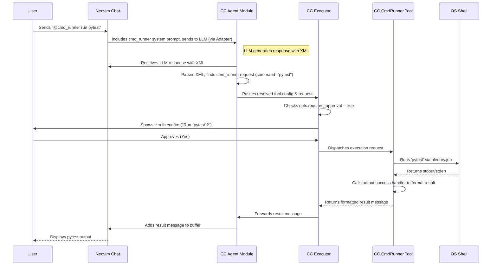

# Chapter 8: Agents & Tools

In the [previous chapter](07_configuration_system.md), we learned how the **Configuration System** lets you customize almost every aspect of CodeCompanion. We saw how to change adapters, add prompts, and tweak settings. Now, let's explore one of the most powerful features you can enable and customize: **Agents & Tools**.

## What's the Big Idea? Giving Your AI Assistant Superpowers

So far, we've mostly seen the AI assistant *generating text* – explanations, code suggestions, commit messages. But what if you want the AI to actually *do* something?

Imagine you're chatting with CodeCompanion and you've just finished fixing a bug. You might want to say:

> "Okay, I think I fixed it. Can you run the tests for me using `pytest`?"

A standard AI assistant would just reply with text, maybe telling you *how* to run the command yourself. But wouldn't it be amazing if it could actually *run* the `pytest` command and tell you the results?

This is exactly what **Agents & Tools** enable! It's like giving your AI assistant access to a toolbox, allowing it to perform actions beyond just talking.

*   The **Agent** is the AI itself, acting intelligently to decide *when* and *how* to use a tool.
*   The **Tool** is a specific capability that CodeCompanion makes available to the Agent, like running commands or editing your code.

Think of it like giving a virtual assistant access to specific apps on your computer.

## Meet the Tools: What Can the Agent Do?

CodeCompanion comes with several powerful built-in tools that the Agent can request to use:

1.  **`@cmd_runner`:** Allows the Agent to request permission to run shell commands (like `pytest`, `git status`, `npm install`). This is super useful for automating common developer tasks.
2.  **`@editor`:** Allows the Agent to request changes directly in your code buffers. It can add, delete, or update lines of code based on your instructions (we saw a glimpse of this indirectly with the [Inline Strategy / Assistant](04_inline_strategy___assistant.md), but this tool lets the AI propose edits within the chat).
3.  **`@files`:** Allows the Agent to request permission to perform file operations like creating, reading, editing, or deleting files on your system.

(You can even create your own custom tools! See `doc/extending/tools.md` in the CodeCompanion project for details.)

## How Does the Agent Ask? The Magic XML Request

How does the AI (the Agent) tell CodeCompanion it wants to use a tool? It can't just *say* "run pytest". It needs a more structured way.

When the AI decides to use a tool, it includes a special **XML code block** in its response within the [Chat Strategy / Buffer](03_chat_strategy___buffer.md).

Let's say you ask: `@cmd_runner Can you run pytest?`

The AI might respond with something like this (simplified):

```markdown
Okay, I can run that for you.

```xml
<tools>
  <tool name="cmd_runner">
    <action>
      <command><![CDATA[pytest]]></command>
    </action>
  </tool>
</tools>
```

**Explanation:**

*   ````xml ... ````: This tells CodeCompanion that the block contains XML.
*   `<tools>`: The outer container for tool requests.
*   `<tool name="cmd_runner">`: Specifies *which* tool the Agent wants to use (the command runner).
*   `<action>`: Describes the specific action to perform.
*   `<command><![CDATA[pytest]]></command>`: Provides the argument for the tool – in this case, the command `pytest`. `CDATA` is used to handle special characters safely.

CodeCompanion sees this XML block, understands the request, and takes the next steps.

## The Execution Flow: Request -> Approve -> Execute -> Result

Here’s what happens when the AI sends an XML request to use a tool like `@cmd_runner`:

1.  **Parse Request:** CodeCompanion's "Agent" component reads the XML block from the AI's response in the [Chat Strategy / Buffer](03_chat_strategy___buffer.md). It figures out which tool (`cmd_runner`) and what parameters (`command = "pytest"`) are requested.
2.  **Ask for Approval (Safety First!):** Many tools, especially those that can run commands or modify files (`@cmd_runner`, `@files`), are configured to require *your* permission before executing. CodeCompanion will pop up a confirmation dialog:
    ```
    Run the command `pytest`?
    [&Yes] [N&o] [&Cancel]
    ```
    This is crucial for security – you always have the final say before the AI does anything potentially impactful. (Tools like `@editor` might show a diff instead). You can disable approvals globally or per-tool if you're feeling adventurous, but it's generally recommended to keep them enabled.
3.  **Execute Tool:** If you approve (e.g., press 'y' or Enter), CodeCompanion runs the specific logic for the requested tool. For `@cmd_runner`, it would execute the `pytest` command in a shell process. For `@editor`, it would apply the proposed code changes to the specified buffer.
4.  **Feed Result Back:** Once the tool finishes, CodeCompanion captures the result (e.g., the text output and exit code from `pytest`, or a success message from `@editor`). It then formats this result and adds it back into the chat buffer as a new message, usually from you (the user role), informing the AI (and yourself) what happened. For example:

    ```markdown
    ## Me

    The output from the command `pytest` is:

    ```txt
    ============================= test session starts ==============================
    platform linux -- Python 3.10.12, pytest-7.4.0, pluggy-1.0.0
    rootdir: /home/user/myproject
    collected 5 items

    test_math.py .....                                                     [100%]

    ============================== 5 passed in 0.12s ===============================
    ```
    ```

Now the conversation can continue, with the AI aware of the test results.

## How to Use Agents & Tools in Chat

Using Agents & Tools is straightforward from the [Chat Strategy / Buffer](03_chat_strategy___buffer.md):

1.  **Mention the Tool:** Start your message by mentioning the tool using the `@` symbol, followed by the tool name (e.g., `@cmd_runner`, `@editor`).
2.  **State Your Request:** Clearly tell the AI what you want it to do using that tool.

**Examples:**

*   To run tests:
    ```markdown
    @cmd_runner Can you run my test suite using `make test`?
    ```
*   To apply a suggested code change (assuming the code is in buffer 3):
    ```markdown
    @editor That looks good, please apply the change to buffer 3.
    ```
*   To create a new file:
    ```markdown
    @files Can you create a new file named `README.md` in the current directory with the content "TODO: Add project description"?
    ```

The AI will then (hopefully) respond with the appropriate XML request, triggering the execution flow described above.

## Configuration Snippet (Enabling Tools)

Tools are configured within the `strategies.chat.tools` section of your `setup()` call ([Chapter 7: Configuration System](07_configuration_system.md)). You don't usually need to define the built-in tools yourself, but you might enable/disable them or tweak their options (like requiring approval).

Here's a conceptual glimpse (not the full configuration, just showing where they live):

```lua
-- In your Neovim config (e.g., using lazy.nvim)
{
  "olimorris/codecompanion.nvim",
  opts = {
    strategies = {
      chat = {
        -- Configuration for tools available in the chat strategy
        tools = {
          -- Enable the built-in cmd_runner tool
          cmd_runner = {
            description = "Run shell commands", -- Shown in completion/help
            callback = "strategies.chat.agents.tools.cmd_runner", -- Path to the tool's code
            opts = {
              requires_approval = true -- IMPORTANT: Ask user before running!
            }
          },
          -- Enable the built-in editor tool
          editor = {
            description = "Edit code in buffers",
            callback = "strategies.chat.agents.tools.editor",
            opts = {
              -- Editor tool often relies on diff view, not just yes/no prompt
            }
          },
          -- Enable the built-in files tool
          files = {
            description = "Manage files",
            callback = "strategies.chat.agents.tools.files",
            opts = {
              requires_approval = true
            }
          },
          -- You could add custom tools here too!
          -- my_custom_tool = { ... }
        }
      }
    }
    -- ... other settings ...
  }
}
```

Consult the plugin's documentation (`doc/usage/chat-buffer/agents.md` and `doc/configuration/*.md`) for the exact details on configuring tools and their options.

## How It Works Under the Hood (A Peek Inside)

Let's trace the `@cmd_runner run pytest` example:

1.  **User Sends:** You send the message `@cmd_runner run pytest` in the chat.
2.  **Agent Parsing (Chat Strategy):** The [Chat Strategy / Buffer](03_chat_strategy___buffer.md) detects `@cmd_runner`. It includes the specific system prompt for the `cmd_runner` tool when sending the message history to the AI via the configured [Adapter](06_adapters.md). This system prompt tells the AI *how* to format the XML request.
3.  **LLM Responds:** The AI generates its text response and includes the XML block requesting to run `pytest`.
4.  **Tool Detection (Agent Module):** The `Agent` module (`strategies/chat/agents/init.lua`) monitors the chat buffer. It uses Tree-sitter to efficiently find XML code blocks in the AI's responses.
5.  **XML Parsing:** It extracts the XML content and uses an XML parser (`utils/xml/XmlParser.lua`) to convert it into a Lua table representing the request (`tool="cmd_runner"`, `command="pytest"`).
6.  **Tool Resolution:** The Agent module looks up the configuration for `cmd_runner` (from your `setup` config) to find its code (`callback`) and options (`opts`).
7.  **Executor Handles Request:** The request is passed to the `Executor` (`strategies/chat/agents/executor/init.lua`).
8.  **Approval Check:** The Executor checks `tool.opts.requires_approval`. Since it's `true` for `@cmd_runner` by default, it calls `vim.fn.confirm` to show the "Run the command `pytest`?" prompt.
9.  **User Approves:** You press 'y'.
10. **Dispatch to Tool Type:** The Executor determines the type of tool. Since `@cmd_runner` involves shell commands, it likely dispatches to the command executor (`executor/cmd.lua`).
11. **Command Execution:** `cmd.lua` uses Neovim's `plenary.nvim` library (`plenary.job`) to run `pytest` asynchronously in a separate process, capturing its standard output (stdout) and standard error (stderr).
12. **Result Handling:** When the `pytest` command finishes, `plenary.job` notifies the `cmd.lua` executor.
13. **Output Formatting:** The `cmd_runner` tool's specific output handler (`tools/cmd_runner.lua`'s `output.success` or `output.error` function) is called with the captured stdout/stderr. It formats this into a user-friendly message (like "The output from the command `pytest` is: ...").
14. **Update Chat:** This formatted message is added back to the [Chat Strategy / Buffer](03_chat_strategy___buffer.md) using `agent.chat:add_buf_message`.
15. **Cleanup:** The Agent module performs any necessary cleanup (`Agent:reset()`).

Here’s a simplified sequence diagram:



**Key Code Files (For the Curious):**

*   `lua/codecompanion/strategies/chat/agents/init.lua`: Detects `@tool` mentions, parses XML responses, resolves tool configurations, and starts the execution flow.
*   `lua/codecompanion/strategies/chat/agents/executor/init.lua`: Manages the queue of tools to run, handles the user approval process, and dispatches to the correct executor type (command or function).
*   `lua/codecompanion/strategies/chat/agents/executor/cmd.lua`: Specifically handles executing shell commands using `plenary.job`.
*   `lua/codecompanion/strategies/chat/agents/executor/func.lua`: Handles executing Lua functions defined directly in a tool's configuration.
*   `lua/codecompanion/strategies/chat/agents/tools/`: This directory contains the Lua files defining the built-in tools like `cmd_runner.lua`, `editor.lua`, and `files.lua`. Each file typically defines the tool's `schema`, `system_prompt`, `cmds` (or functions), and `output` handlers.
*   `lua/codecompanion/utils/xml/XmlParser.lua`: The utility used to parse the XML responses from the LLM.

## Conclusion

**Agents & Tools** transform CodeCompanion from a text-based assistant into an active participant in your workflow.

*   The **Agent** (the LLM) can intelligently decide to use **Tools**.
*   **Tools** (`@cmd_runner`, `@editor`, `@files`, etc.) provide specific capabilities beyond text generation.
*   The LLM requests tool usage via a structured **XML format**.
*   CodeCompanion handles **parsing**, **user approval** (for safety), **execution**, and feeding **results** back to the chat.

This powerful system allows you to automate tasks, apply changes, and manage files directly through conversation, making your AI coding partner even more helpful.

Now that we've covered the core logic, strategies, configuration, and advanced features like Agents & Tools, let's take a look at how CodeCompanion manages its various user interface elements.

**Next:** [Chapter 9: UI Management](09_ui_management.md)

---

Generated by [AI Codebase Knowledge Builder](https://github.com/The-Pocket/Tutorial-Codebase-Knowledge)