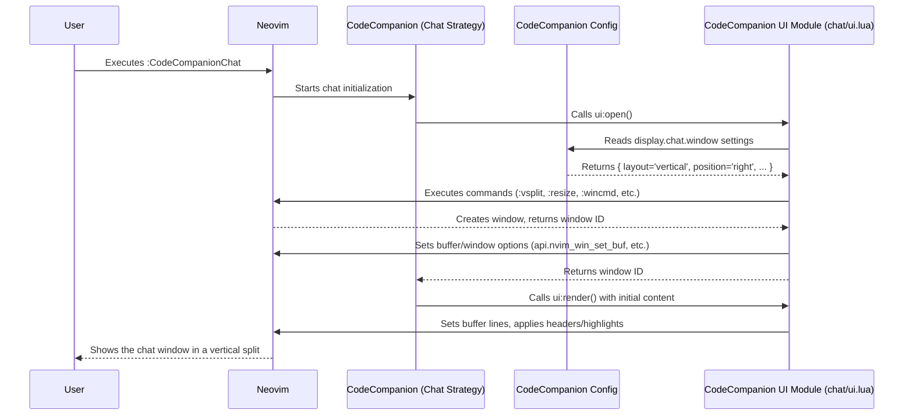

# Chapter 9: UI Management

In the [previous chapter](08_agents___tools.md), we explored the powerful **Agents & Tools** system, which lets your AI assistant perform actions like running commands or editing files. Now, let's step back and look at how CodeCompanion presents all this information and interaction visually within Neovim. How does it create chat windows, show diffs, or integrate with your status line? This is the job of **UI Management**.

## What's the Big Idea? The Dashboard for Your AI Companion

Think about driving a car. The dashboard shows you important information (speed, fuel level) and provides controls (steering wheel, buttons). It's designed to give you the information you need clearly and allow you to interact easily.

**UI Management** in CodeCompanion is like that dashboard. It's not a single feature you *use* directly, but rather the underlying system that handles *how* CodeCompanion displays information and interacts with you visually inside Neovim. Its goal is to provide a consistent and pleasant user experience, whether you're chatting, using the action palette, or reviewing inline code suggestions.

It covers things like:

*   Creating the pop-up **floating window** or **split** for the [Chat Strategy / Buffer](03_chat_strategy___buffer.md).
*   Displaying the [Action Palette](01_action_palette___prompt_library.md) using different backends (like Telescope or a simple built-in menu).
*   Showing **diff views** when the [Inline Strategy / Assistant](04_inline_strategy___assistant.md) suggests code changes.
*   Adding helpful **virtual text** (like token counts in the chat or spinners during loading).
*   Setting special **options** for CodeCompanion's buffers (like making the chat history read-only).
*   Providing ways to integrate with popular status line plugins like **Lualine** or **Heirline**.

Essentially, UI Management is the abstraction responsible for CodeCompanion's "look and feel" within Neovim.

## Key Components of UI Management

Let's break down the main parts of CodeCompanion's UI system:

1.  **Windows & Buffers:**
    *   **Layouts:** CodeCompanion needs ways to display information without disrupting your main coding window. It uses Neovim's built-in capabilities to create:
        *   **Floating Windows:** Pop-up windows that appear over your code (often used for the Action Palette or sometimes the Chat).
        *   **Splits:** Dividing the screen horizontally or vertically to show CodeCompanion alongside your code (a common layout for the Chat).
    *   **Dedicated Buffers:** Special, temporary Neovim buffers (like files) are created to hold the content for the chat history or the diff view. These often have specific settings.

2.  **Buffer Settings:**
    *   **Filetype:** CodeCompanion buffers (like the chat) often get a specific `filetype` (e.g., `codecompanion`). This allows for custom syntax highlighting or keymaps specific to that buffer.
    *   **Options:** Certain options are crucial for usability. For instance, the main chat history area is usually set to `nomodifiable` so you don't accidentally edit past conversations, while the input area at the bottom remains editable.

3.  **Visual Feedback & Decoration:**
    *   **Virtual Text:** CodeCompanion can display small pieces of text that aren't *actually* part of the buffer content but appear alongside lines. This is used for:
        *   Showing token counts in the chat buffer (optional).
        *   Displaying temporary messages or prompts (like the intro message in chat).
        *   Potentially showing loading spinners (like the Fidget examples).
    *   **Diff Highlighting:** For the [Inline Strategy / Assistant](04_inline_strategy___assistant.md), CodeCompanion needs to clearly show what lines the AI wants to add, remove, or change. It leverages Neovim's built-in diff mode or integrates with plugins like `mini.diff` to provide this visual comparison.
    *   **Highlight Groups:** CodeCompanion defines custom highlight groups (like `CodeCompanionChatHeader`, `CodeCompanionVirtualText`) so you can customize the colors of its UI elements to match your Neovim theme.

4.  **Integration Points:**
    *   **Status Line:** CodeCompanion fires events (`CodeCompanionRequestStarted`, `CodeCompanionRequestFinished`) that status line plugins like Lualine or Heirline can listen to. This allows you to show a small indicator (like a spinner icon) in your status line whenever CodeCompanion is busy talking to the AI.
    *   **Action Palette Providers:** The [Action Palette](01_action_palette___prompt_library.md) can be displayed using different UI backends. CodeCompanion supports the built-in `vim.ui.select`, but can also automatically use popular plugins like `Telescope.nvim` or `mini.pick` if you have them installed, providing a more familiar interface.

## Configuring Your UI Experience

Much of the UI behavior is configurable through the [Configuration System](07_configuration_system.md) (`setup()` function). You can decide how *you* want CodeCompanion to look and feel.

**Example 1: Changing Chat Window Layout**

By default, the chat might open as a floating window. If you prefer a vertical split on the right:

```lua
-- In your CodeCompanion setup()
require("codecompanion").setup({
  display = {
    chat = {
      window = {
        layout = "vertical", -- Options: "float", "vertical", "horizontal", "current"
        position = "right", -- Options: "left", "right" (for vertical)
        width = 0.3, -- Use 30% of screen width
        -- height = 0.5 -- Height is less relevant for full vertical splits
      }
      -- ... other chat display settings ...
    }
  },
  -- ... other configurations ...
})
```

**Explanation:**

*   `display.chat.window`: This table holds settings for the chat window.
*   `layout = "vertical"`: We tell CodeCompanion to use a vertical split instead of the default float.
*   `position = "right"`: We specify the split should appear on the right side.
*   `width = 0.3`: We set the width to be 30% of the total Neovim window width.

With this change, running `:CodeCompanionChat` will now open the chat in a vertical split on the right.

**Example 2: Status Line Integration (Lualine)**

To show a spinner in Lualine when CodeCompanion is working, you'd add a custom component to your Lualine configuration (this code snippet is adapted from the CodeCompanion documentation):

```lua
-- In your Lualine configuration file

-- Define the CodeCompanion component
local M = require("lualine.component"):extend()
M.processing = false
M.spinner_index = 1
local spinner_symbols = { "⠋", "⠙", "⠹", "⠸", "⠼", "⠴", "⠦", "⠧", "⠇", "⠏" }
local spinner_symbols_len = #spinner_symbols

-- Setup autocommands to track CodeCompanion status
function M:init(options)
  M.super.init(self, options)
  local group = vim.api.nvim_create_augroup("CodeCompanionLualineHook", { clear = true })
  vim.api.nvim_create_autocmd({ "User" }, {
    pattern = "CodeCompanionRequest*",
    group = group,
    callback = function(request)
      self.processing = (request.match == "CodeCompanionRequestStarted")
    end,
  })
end

-- Function called by Lualine to get the component's text
function M:update_status()
  if self.processing then
    self.spinner_index = (self.spinner_index % spinner_symbols_len) + 1
    return spinner_symbols[self.spinner_index] -- Return the current spinner character
  else
    return "" -- Return nothing when not processing
  end
end

-- Add the component to your Lualine sections
require('lualine').setup {
  options = { -- ... your lualine options ...
  },
  sections = {
    lualine_a = {'mode'},
    lualine_b = {'branch', 'diff'},
    -- Add our component (assuming it's saved as codecompanion_component.lua)
    lualine_c = { require('codecompanion_component') },
    lualine_x = {'diagnostics', 'encoding', 'filetype'},
    lualine_y = {'progress'},
    lualine_z = {'location'}
  },
  -- ... other lualine settings ...
}
```

**Explanation:**

*   We define a Lualine component (`M`) that keeps track of whether CodeCompanion is `processing`.
*   An autocommand listens for CodeCompanion's `User` events (`CodeCompanionRequestStarted`, `CodeCompanionRequestFinished`) to update the `processing` status.
*   The `update_status` function returns a spinner character if `processing` is true, otherwise nothing.
*   We then include this component in one of Lualine's sections (e.g., `lualine_c`).

Now, your status line will automatically show a spinner when CodeCompanion is busy! Similar integrations exist for Heirline and potentially other plugins via the event system.

## How It Works Under the Hood (A Peek Inside)

Let's trace what happens when you run `:CodeCompanionChat` and you've configured a vertical split layout:

1.  **Trigger:** You execute the `:CodeCompanionChat` command.
2.  **Strategy Invoked:** This typically invokes the `chat` strategy's `Chat:new()` or a similar entry point.
3.  **UI Module Called:** The chat strategy logic needs to create the window, so it calls its dedicated UI handler (`strategies/chat/ui.lua`).
4.  **Configuration Check:** The `Chat.UI:open()` function reads the configuration from `config.display.chat.window` (which was merged from your `setup()` call in [Chapter 7: Configuration System](07_configuration_system.md)). It sees `layout = "vertical"` and `position = "right"`.
5.  **Window Creation:** Based on the configuration:
    *   It executes Vim commands like `:botright vsplit` to create the split in the correct location.
    *   It sets the width using `:vertical resize`.
    *   It gets the new window's ID (`winnr`).
    *   It associates the chat buffer (`bufnr`) with this new window using `api.nvim_win_set_buf()`.
6.  **Buffer/Window Options:** It applies other configured options from `config.display.chat.window.opts` to the new window using `api.nvim_set_option_value()`. It also sets buffer-local options like `nomodifiable` for the history part (done within the chat strategy logic usually).
7.  **Initial Rendering:** The chat strategy calls functions like `Chat.UI:render()` to populate the buffer with any existing messages, headers, and potentially the intro message.
8.  **Focus (Optional):** It might switch focus to the new window depending on configuration.

Here's a simplified sequence diagram:



**Relevant Code Files (For the Curious):**

*   `lua/codecompanion/utils/ui.lua`: Contains generic UI helper functions like `create_float`, `set_virtual_text`, `action_palette_selector`. These are used by various parts of the plugin.
*   `lua/codecompanion/strategies/chat/ui.lua`: Manages the specific UI for the chat buffer – opening/hiding the window (`UI:open`, `UI:hide`), rendering content (`UI:render`), formatting headers (`UI:format_header`), displaying tokens (`UI:display_tokens`), handling virtual text (`UI:set_virtual_text`).
*   `lua/codecompanion/providers/diff/`: Contains the logic for different diff viewers.
    *   `default.lua`: Uses Neovim's built-in diff mode.
    *   `mini_diff.lua`: Integrates with the `mini.diff` plugin if available.
*   `lua/codecompanion/providers/actions/`: Contains the logic for displaying the Action Palette.
    *   `default.lua`: Uses `vim.ui.select`.
    *   `telescope.lua`: Integrates with `Telescope.nvim`.
    *   *(Potentially `mini_pick.lua` too)*
*   `lua/codecompanion/config.lua`: Defines the *default* values for all UI-related settings under the `display` key. Your `setup()` call merges your preferences on top of these.
*   `doc/usage/ui.md`: Contains examples of UI customizations, like the Lualine/Heirline integrations.

Here's a very simplified snippet showing the idea behind creating a floating window from `utils/ui.lua`:

```lua
-- Simplified idea from lua/codecompanion/utils/ui.lua

local M = {}

--- Open a floating window
--- @param lines table Initial content for the buffer
--- @param opts table Configuration options (width, height, border, etc.)
--- @return number, number The buffer and window numbers
function M.create_float(lines, opts)
  -- Get dimensions from opts or defaults
  local width = opts.width or 80
  local height = opts.height or 15

  -- Create a new scratch buffer (temporary, unnamed)
  local bufnr = vim.api.nvim_create_buf(false, true)
  -- Set filetype if provided
  if opts.filetype then
    vim.bo[bufnr].filetype = opts.filetype
  end

  -- Configure the window appearance and position
  local win_config = {
    relative = opts.relative or "editor",
    width = width,
    height = height,
    border = opts.border or "single",
    -- ... other positioning options ...
  }

  -- Open the window!
  local winnr = vim.api.nvim_open_win(bufnr, true, win_config)

  -- Put the initial lines into the buffer
  vim.api.nvim_buf_set_lines(bufnr, 0, -1, false, lines)

  -- Apply buffer/window options (like making it read-only if needed)
  if opts.lock then
    vim.bo[bufnr].modifiable = false
  end
  -- ... apply other options ...

  -- Set up basic keymaps (like 'q' to close) if not ignored
  if not opts.ignore_keymaps then
     vim.keymap.set("n", "q", function() vim.api.nvim_win_close(winnr, true) end, { buffer = bufnr })
  end

  return bufnr, winnr
end

return M
```

This shows the core steps: create buffer, configure window, open window, set content, apply options. The actual code handles more edge cases and details, but this gives the basic flavor.

## Conclusion

**UI Management** is the collection of systems and utilities within CodeCompanion responsible for creating and managing its visual elements in Neovim.

*   It handles **windows and splits** for displaying things like the chat and action palette.
*   It manages **buffer-specific settings** for usability.
*   It provides **visual feedback** through virtual text and diff views.
*   It offers **integration points** for status lines and other UI plugins.
*   It is highly **configurable** via the `display` section of your `setup()` call.

While you might not interact with the "UI Management" system directly, understanding its role helps you appreciate how CodeCompanion presents itself and how you can customize its appearance to fit your preferences, leading to a smoother and more integrated AI coding experience.

Finally, how does CodeCompanion actually send requests to AI services over the internet? Underneath the Adapters, there's another layer handling the raw network communication.

**Next:** [Chapter 10: HTTP Client](10_http_client.md)

---

Generated by [AI Codebase Knowledge Builder](https://github.com/The-Pocket/Tutorial-Codebase-Knowledge)