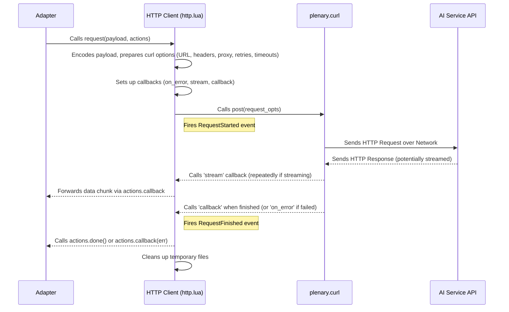

# Chapter 10: HTTP Client

In [Chapter 9: UI Management](09_ui_management.md), we looked at how CodeCompanion presents information visually inside Neovim, managing windows, diffs, and status line updates. But after an [Adapter](06_adapters.md) formats a request for an AI service, how does that request actually get sent over the internet? And how does the response get back? That crucial step is handled by the **HTTP Client**.

## What's the Big Idea? The Mail Carrier for Your AI Requests

Think of the process of sending a message to an AI:

1.  You write your message (using the [Chat Strategy / Buffer](03_chat_strategy___buffer.md) or [Inline Strategy / Assistant](04_inline_strategy___assistant.md)).
2.  The [Adapter](06_adapters.md) acts like a translator and address expert. It takes your message, formats it exactly how the specific AI service (like OpenAI or Ollama) expects it, and puts the correct address (API endpoint URL) and postage (API key) on it.
3.  Now, someone needs to actually *take* that perfectly prepared letter and *deliver* it.

That delivery person is the **HTTP Client**.

It's the component responsible for the low-level task of sending the request prepared by the Adapter across the network to the AI service's server and bringing back the reply. It doesn't care *what* the message says or *which* AI service it's going to; it just focuses on the reliable delivery.

Why is this separate from the Adapter? Because sending things over the internet involves common challenges: networks can be unreliable, requests might need to be retried, sometimes you need to go through a proxy server, and responses might come back all at once or piece by piece (streaming). The HTTP Client centralizes the logic for handling these network details, so each Adapter doesn't have to reinvent the wheel.

## What the HTTP Client Does

The HTTP Client, working behind the scenes, takes care of several important network-related tasks:

*   **Sending the Request:** It takes the final URL, headers (like authentication), and body (the actual data payload, usually JSON) from the Adapter and uses a powerful Neovim networking library called `plenary.curl` to send the HTTP request (like a POST or GET request).
*   **Receiving the Response:** It listens for the response from the AI service's server.
*   **Handling Retries:** If the first attempt to send the request fails (maybe due to a temporary network glitch), the HTTP Client can automatically try sending it again a few times before giving up.
*   **Managing Timeouts:** It sets limits on how long to wait for a connection or a response, preventing CodeCompanion from getting stuck indefinitely if a server is unresponsive.
*   **Streaming Support:** For AI models that support it, the response might come back in small chunks instead of one big block. This allows CodeCompanion to display the AI's response progressively (like characters appearing one by one in the chat). The HTTP Client handles receiving these chunks and passing them back to the Adapter as they arrive.
*   **Proxy Support:** If you need to route your internet traffic through a proxy server (common in some corporate environments), the HTTP Client respects the proxy settings configured in CodeCompanion.
*   **Security:** It can handle secure connections (HTTPS) and allows configuration for whether to allow insecure connections if needed (though generally not recommended).

Essentially, it's the robust engine ensuring the messages prepared by the Adapters get delivered and replies are received, handling the messy details of network communication.

## How It's Used (By Adapters)

You, as a user configuring CodeCompanion, almost never interact with the HTTP Client directly. Its services are primarily used by the [Adapters](06_adapters.md).

When an Adapter has formatted a request (like the messages for OpenAI's API), it calls the HTTP Client's `request` function, passing along:

1.  The data payload (messages, model parameters).
2.  Callback functions: What should the HTTP Client do when a chunk of data arrives? What should it do when the entire response is finished? What should it do if there's an error?
3.  Other relevant details derived from the Adapter's configuration (URL, headers, method like POST).

The HTTP Client then takes over, performs the network communication using `plenary.curl`, and calls the Adapter's callback functions with the results (or errors).

## How It Works Under the Hood (A Peek Inside)

Let's trace the journey when an Adapter asks the HTTP Client to send a request:

1.  **Adapter Call:** An Adapter (e.g., `openai.lua`) has prepared the request body (JSON) and headers. It calls `Client:request(payload, actions, opts)`.
2.  **HTTP Client Setup:** The `request` function in `lua/codecompanion/http.lua` receives the call. It performs some preliminary setup, like loading configuration and potentially running the adapter's `setup` handler. It encodes the payload into JSON and often writes it to a temporary file (required by `plenary.curl` for POST requests).
3.  **Configure `plenary.curl`:** It builds a table (`request_opts`) containing all the necessary options for `plenary.curl`:
    *   `url`: The AI service endpoint (from the Adapter).
    *   `headers`: Request headers (from the Adapter).
    *   `body`: Path to the temporary file containing the JSON payload.
    *   `proxy`: The proxy server address, if configured (`config.adapters.opts.proxy`).
    *   `insecure`: Boolean flag for allowing insecure connections (`config.adapters.opts.allow_insecure`).
    *   `raw`: A list of raw command-line arguments for `curl`. This is where retry (`--retry 3`), timeout (`--connect-timeout 10`), and streaming (`--no-buffer`) options are set.
    *   **Callbacks:** Crucially, it defines the functions `plenary.curl` should call:
        *   `callback`: Called *once* when the entire request/response cycle is finished. It forwards the final data or status back to the Adapter's `actions.done` or `handlers.on_exit` function.
        *   `on_error`: Called if `plenary.curl` encounters an error. It forwards the error to the Adapter's `actions.callback` function.
        *   `stream`: If streaming is enabled (`adapter.opts.stream`), this function is called *multiple times*, once for each chunk of data received. It forwards each chunk to the Adapter's main `actions.callback` function.
4.  **Fire Events:** Before starting the request, it fires a `RequestStarted` event, which UI components like the [status line integration](09_ui_management.md#example-2-status-line-integration-lualine) can listen to.
5.  **Execute Request:** It calls the appropriate `plenary.curl` function based on the HTTP method (usually `self.opts.post(request_opts)` which defaults to `require("plenary.curl").post`). `plenary.curl` then handles the actual network communication using the system's `curl` command or a built-in library.
6.  **Data Handling:**
    *   If streaming, the `stream` callback gets called repeatedly.
    *   When finished (or if not streaming), the `callback` function gets called.
7.  **Adapter Notified:** The HTTP Client's callbacks ensure the raw data chunks (for streaming) or the final result/error are passed back to the original callback functions provided by the Adapter.
8.  **Fire Events (End):** Once the `callback` function completes, it fires a `RequestFinished` event.
9.  **Cleanup:** It removes the temporary file used for the request body.

Here’s a simplified diagram showing the interaction:



**Relevant Code Files (For the Curious):**

*   `lua/codecompanion/http.lua`: This is the heart of the HTTP Client. The `Client.new()` function sets it up, and the `Client:request()` function orchestrates the call to `plenary.curl`. You can see how `request_opts` are assembled here, including `url`, `headers`, `body`, `proxy`, `raw` arguments, and the crucial `callback`, `on_error`, and `stream` functions.
*   `plenary.curl` (External Library): CodeCompanion relies heavily on this library from `nvim-lua/plenary.nvim` to handle the actual HTTP communication. You don't need to look into Plenary's code, just know that CodeCompanion's HTTP Client is configuring and using it.
*   `lua/codecompanion/config.lua`: The default configuration file contains settings used by the HTTP Client under `adapters.opts`, such as `allow_insecure` and `proxy`.

Let's look at a highly simplified snippet focusing on setting up the `request_opts` inside `Client:request`:

```lua
-- Simplified idea from lua/codecompanion/http.lua inside Client:request

-- Adapter provides details like URL, headers, body content, stream preference
local adapter = self.adapter
local payload = ... -- Data from the adapter
local actions = ... -- Callback functions from the adapter

-- ... (Payload encoding, temp file creation) ...

-- Base raw curl arguments for retries, timeouts etc.
local raw = { "--retry", "3", "--connect-timeout", "10" }
if adapter.opts and adapter.opts.stream then
  table.insert(raw, "--no-buffer") -- Option often needed for streaming
end
-- ... (Add adapter-specific raw arguments) ...

-- Assemble options for plenary.curl
local request_opts = {
  url = adapter:set_env_vars(adapter.url),
  headers = adapter:set_env_vars(adapter.headers),
  body = body_file.filename, -- Path to temp file with JSON payload
  proxy = config.adapters.opts.proxy, -- Use configured proxy
  insecure = config.adapters.opts.allow_insecure,
  raw = raw, -- Pass the raw arguments for retries, timeouts, etc.

  -- === Callbacks ===
  callback = function(data)
    -- Called ONCE when the request is fully done.
    vim.schedule(function()
      if not adapter.opts.stream then
         actions.callback(nil, data, adapter) -- Send final data if not streaming
      end
      if actions.done then actions.done() end
      -- ... (Fire RequestFinished event, cleanup) ...
    end)
  end,
  on_error = function(err)
    -- Called if plenary.curl encounters an error.
    vim.schedule(function()
       actions.callback(err, nil) -- Pass error back to adapter
       -- ... (Fire RequestFinished event) ...
    end)
  end,
}

-- Add stream callback ONLY if the adapter requests streaming
if adapter.opts and adapter.opts.stream then
  request_opts["stream"] = vim.schedule_wrap(function(_, data)
     -- Called MULTIPLE times for each chunk received.
     if data and data ~= "" then
        actions.callback(nil, data, adapter) -- Pass chunk back to adapter
     end
  end)
end

-- Determine HTTP method (usually POST)
local request_method = "post"
if adapter.opts and adapter.opts.method then
  request_method = adapter.opts.method:lower()
end

-- Fire the request using plenary.curl!
local job = self.opts[request_method](request_opts) -- e.g., Curl.post(request_opts)

-- ... (Fire RequestStarted event) ...

return job
```

This simplified view shows how the HTTP Client acts as an intermediary, taking high-level requirements from the Adapter and translating them into specific options for the underlying `plenary.curl` library, including crucial network parameters and callbacks.

## Conclusion

The **HTTP Client** is the unsung hero working deep within CodeCompanion, ensuring that communication with AI services happens reliably and efficiently.

*   It acts as the **mail carrier**, taking formatted requests from Adapters and handling network delivery.
*   It leverages the `plenary.curl` library for the actual HTTP communication.
*   It manages crucial network details like **retries, timeouts, streaming, and proxy support**.
*   Users typically don't interact with it directly; it's used internally by **Adapters**.

Understanding its role helps complete the picture of how CodeCompanion interacts with the outside world, bridging the gap between the intelligently formatted requests from Adapters and the actual bytes sent over the network.

This concludes our journey through the core concepts of `codecompanion.nvim`! From the user-facing [Action Palette & Prompt Library](01_action_palette___prompt_library.md) and different interaction [Strategies](02_strategies.md), through powerful context tools like [Variables & Slash Commands](05_variables___slash_commands.md), versatile [Adapters](06_adapters.md) for different AI models, flexible [Configuration](07_configuration_system.md), advanced capabilities with [Agents & Tools](08_agents___tools.md), managing the [UI](09_ui_management.md), and finally, the reliable [HTTP Client](10_http_client.md) – you now have a solid foundation for understanding how CodeCompanion works and how to make the most of it. Happy coding!

---

Generated by [AI Codebase Knowledge Builder](https://github.com/The-Pocket/Tutorial-Codebase-Knowledge)