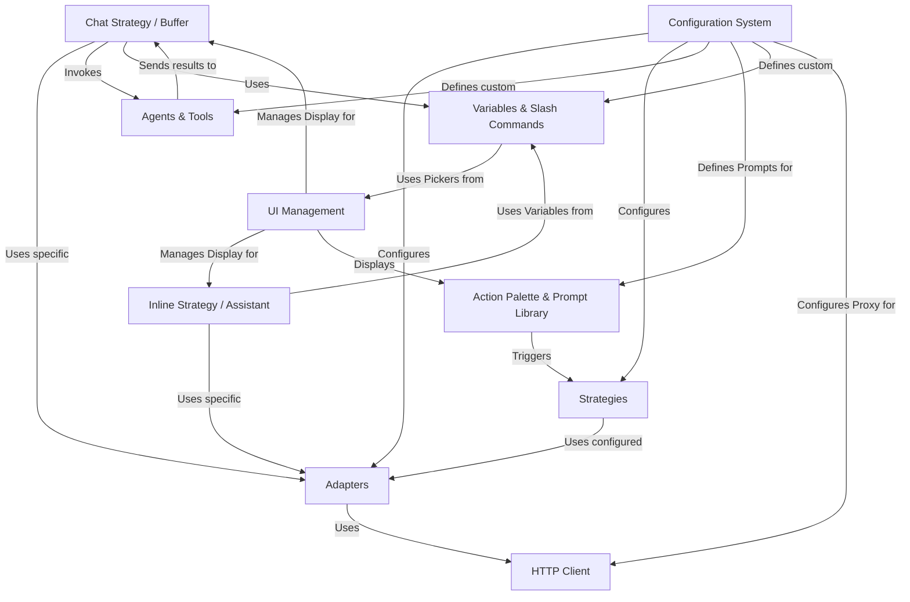

# Tutorial: codecompanion.nvim

CodeCompanion.nvim is a Neovim plugin that acts as your **AI coding partner**.
It allows you to talk to various *Large Language Models* (LLMs) directly within your editor. You can interact through different *Strategies*, like an interactive *chat window* or an *inline assistant* that modifies your code directly.
The plugin uses **Adapters** to connect to different AI services (like OpenAI or Copilot), making it flexible. You can customize it heavily through its **Configuration System**, defining custom prompts in the **Prompt Library**, setting up **Agents & Tools** to let the AI perform actions (like running commands or editing files), and adding **Variables & Slash Commands** for quickly inserting context into your conversations. **UI Management** handles how these features look and feel inside Neovim.

**Source Repository:** [None](None)

## Chapters

1. [Action Palette & Prompt Library](01_action_palette___prompt_library.md)
2. [Strategies](02_strategies.md)
3. [Chat Strategy / Buffer](03_chat_strategy___buffer.md)
4. [Inline Strategy / Assistant](04_inline_strategy___assistant.md)
5. [Variables & Slash Commands](05_variables___slash_commands.md)
6. [Adapters](06_adapters.md)
7. [Configuration System](07_configuration_system.md)
8. [Agents & Tools](08_agents___tools.md)
9. [UI Management](09_ui_management.md)
10. [HTTP Client](10_http_client.md)

---

Generated by [AI Codebase Knowledge Builder](https://github.com/The-Pocket/Tutorial-Codebase-Knowledge)