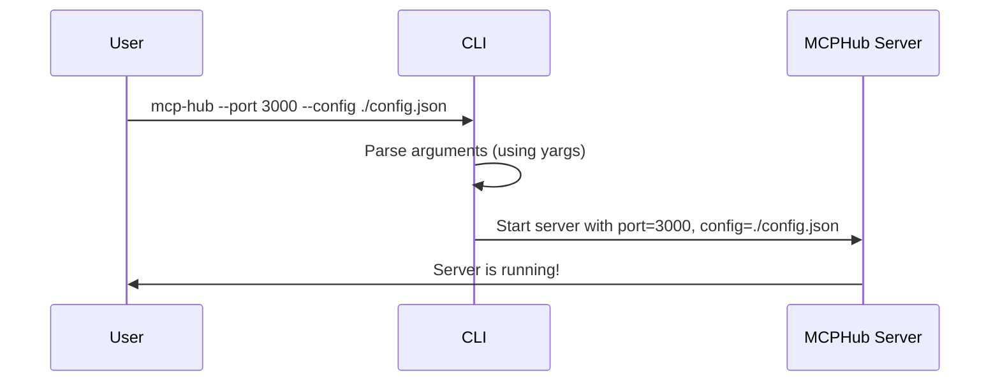

# Chapter 1: CLI

Welcome to the exciting world of MCP Hub! This tutorial will guide you through the core concepts and how they all work together. Let's start with the very first piece: the Command Line Interface, or CLI for short.

Imagine you're ordering pizza. You need to tell the pizza place *what* you want (pepperoni, extra cheese), *where* to deliver it (your address), and *when* you want it (as soon as possible!). The CLI is like that phone call to the pizza place for the MCP Hub. It's how you tell the MCP Hub server what to do and how to start up.

**Why do we need a CLI?**

Think about starting a server like planting a garden. You need to specify things like:

*   **Where the seeds (configuration) are:** Which config file to use
*   **Where the plants (server) will grow:** Which port the server will use

The CLI lets you provide this information, so the MCP Hub server knows how to get started.

**Key Concepts:**

The CLI does a few important things:

1.  **Accepts Commands:**  It listens for instructions you type into your computer's terminal or command prompt. These instructions are called "commands" or "arguments".
2.  **Parses Commands:** It understands what you're trying to tell it. It figures out which options you've specified (like the port or config file).
3.  **Starts the Server:**  It takes your instructions and uses them to start the MCP Hub server with the settings you provided.

**A Simple Use Case**

Let's say you want to start the MCP Hub server on port 3000 and you have a configuration file called `mcp-servers.json`.  You would use the CLI like this (in your terminal):

```bash
mcp-hub --port 3000 --config ./mcp-servers.json
```

Let's break down what each part means:

*   `mcp-hub`: This is the name of the program you're running.
*   `--port 3000`:  This tells the server to listen for connections on port 3000. Think of a port like a specific door to your computer.
*   `--config ./mcp-servers.json`: This tells the server where to find the configuration file that describes the MCP servers it should connect to.  `./mcp-servers.json` means the file is in the current directory.

**Example Input & Output**

*   **Input:**  `mcp-hub --port 3000 --config ./mcp-servers.json`
*   **Output:** The server starts up, and you'll see log messages in your terminal indicating that it's running.  You can then connect to the MCP Hub server using other tools or applications.

**Code Snippets**

Let's look at a simplified version of how the CLI works under the hood (from `src/utils/cli.js`):

```javascript
import yargs from "yargs";
import { hideBin } from "yargs/helpers";

async function run() {
  const argv = yargs(hideBin(process.argv))
    .options({
      port: {
        alias: "p",
        describe: "Port to run the server on",
        type: "number",
        demandOption: true,
      },
      config: {
        alias: "c",
        describe: "Path to config file",
        type: "string",
        demandOption: true,
      },
    })
    .parse();

  console.log("Port:", argv.port);
  console.log("Config:", argv.config);
}

run();
```

This code does the following:

1.  **Imports Libraries:**  `yargs` is a library that helps us easily parse command-line arguments. Think of it as a tool that translates your instructions into something the computer understands.
2.  **Defines Options:** The `.options()` part tells `yargs` what options the CLI accepts (like `--port` and `--config`).
3.  **Parses Arguments:**  The `.parse()` part takes the arguments you typed in the terminal and stores them in the `argv` variable.
4.  **Prints the Values:**  Finally, we print the values of `port` and `config` to the console (in the real code, these values are used to start the server).

If you were to run this simplified script with `node your-script.js --port 3000 --config ./mcp-servers.json`, the output would be:

```
Port: 3000
Config: ./mcp-servers.json
```

**Internal Implementation**

Here's a simplified sequence diagram of how the CLI works:



1.  **User Input:** The user types a command into the terminal (e.g., `mcp-hub --port 3000 --config ./config.json`).
2.  **CLI Parsing:** The CLI uses the `yargs` library to parse the arguments and extract the values for `port` and `config`.
3.  **Server Startup:** The CLI then calls the `startServer` function (which we'll cover in the next chapter, [MCPHub](02_mcphub_.md)) passing in the parsed arguments.
4.  **Server Running:** The `startServer` function initializes and starts the MCP Hub server.

Let's look at another snippet from `src/utils/cli.js` that shows how the `startServer` function is called:

```javascript
import { startServer } from "../server.js";

async function run() {
  // ... (argument parsing code from before) ...

  await startServer({
    port: argv.port,
    config: argv.config,
    watch: argv.watch,
    autoShutdown: argv["auto-shutdown"],
    shutdownDelay: argv["shutdown-delay"],
  });
}

run();
```

Here, the `startServer` function is imported from `../server.js` (we will explore that in [MCPHub](02_mcphub_.md)) and called with an object containing the parsed arguments. This object contains all the information the server needs to start.

**Conclusion**

The CLI is the gateway to the MCP Hub. It allows you to configure and start the server with specific settings.  You learned how to use the CLI with arguments like `--port` and `--config`, and you got a glimpse of how it works behind the scenes using `yargs` to parse those arguments and then calling the `startServer` function.

Now that you know how to start the server with the CLI, the next step is to understand what happens *inside* the server. In the next chapter, we'll dive into the heart of the MCP Hub: [MCPHub](02_mcphub_.md).


---

Generated by [AI Codebase Knowledge Builder](https://github.com/The-Pocket/Tutorial-Codebase-Knowledge)