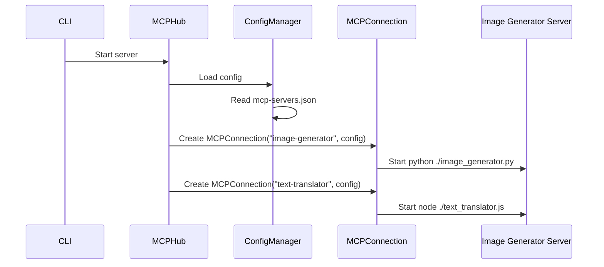

# Chapter 2: MCPHub

In the previous chapter, [CLI](01_cli_.md), you learned how to use the Command Line Interface to start the MCP Hub server. Now, let's dive into what happens *inside* the server. This chapter is all about the **MCPHub**, the brain of the operation!

**Why do we need an MCPHub?**

Imagine you're a conductor of an orchestra. You don't play any instruments yourself, but you manage all the musicians (each playing their own instrument) to create beautiful music. The MCPHub is like that conductor. It doesn't directly serve requests, but it manages all the **MCPConnections** (think of each MCPConnection as a musician), ensuring they work together harmoniously.

Let's say you want to connect to *three* different MCP servers: one for generating images, another for translating text, and a third for answering questions. You don't want to manually start and stop each server individually. The MCPHub allows you to configure all three servers in one place and manage them together. This is its central use case: **managing the lifecycle of multiple MCPConnections**.

**Key Concepts:**

The MCPHub handles a few key things:

1.  **MCPConnections Management:** It keeps track of all the MCPConnections that are connected.
2.  **Lifecycle Management:** It allows you to start, stop, and restart MCPConnections.
3.  **Configuration Updates:** It allows you to update the configuration of MCPConnections dynamically.
4.  **Event Handling:** It listens for and broadcasts events from the MCPConnections, such as changes to available tools or resources.

**A Simple Use Case**

Let's say you have a configuration file (`mcp-servers.json`) that defines two MCP servers: "image-generator" and "text-translator". You want to start both servers and later stop the "image-generator" server because you don't need it anymore.

Here's a simplified version of how you would interact with the MCPHub (this is a conceptual example and not actual code you would run directly):

1.  **Start the MCP Hub (using the CLI, as you learned in the previous chapter):**

    ```bash
    mcp-hub --port 3000 --config ./mcp-servers.json
    ```

    This starts the MCP Hub, which reads the `mcp-servers.json` file.

2.  **The MCPHub reads `mcp-servers.json` and starts the "image-generator" and "text-translator" MCPConnections.** These connections are managed by the `MCPHub`.

3.  **Later, you decide to stop the "image-generator" server. You would send a request to the MCP Hub (through its API):** (We'll see how the API works in later chapters.)

    `POST /servers/stop` with body `{ server_name: "image-generator" }`

4.  **The MCPHub receives the request and stops the "image-generator" MCPConnection.** The "text-translator" server continues to run.

**Code Snippets**

Let's look at a simplified version of how the MCPHub manages MCPConnections (from `src/MCPHub.js`):

```javascript
class MCPHub {
  constructor(configPathOrObject) {
    this.connections = new Map(); // Stores the MCPConnections
    this.configManager = new ConfigManager(configPathOrObject); // Manages the configuration
  }

  async initialize() {
    await this.configManager.loadConfig(); // Load the configuration from the file
    await this.startConfiguredServers(); // Start the servers defined in the configuration
  }

  async startConfiguredServers() {
    const config = this.configManager.getConfig();
    const servers = Object.entries(config?.mcpServers || {});

    servers.forEach(([name, serverConfig]) => {
      const connection = new MCPConnection(name, serverConfig); // Create a new MCPConnection
      this.connections.set(name, connection); // Store the connection
      connection.connect(); // Connect to the server
    });
  }

  async stopServer(name) {
    const connection = this.connections.get(name); // Get the connection
    if (connection) {
      await connection.disconnect(); // Disconnect from the server
      this.connections.delete(name); // Remove the connection
    }
  }
}
```

This code does the following:

1.  **`constructor`:** Initializes the `connections` map (which stores MCPConnections) and the `configManager` (which reads the configuration file).
2.  **`initialize`:** Loads the configuration file and starts the servers defined in the file.
3.  **`startConfiguredServers`:** Creates an MCPConnection for each server in the configuration and stores it in the `connections` map, then connects to it.
4.  **`stopServer`:** Stops and removes an MCPConnection.

The `MCPConnection` class will be explained in its own chapter: [MCPConnection](05_mcpconnection_.md).

**Example Input & Output**

Imagine you have the following `mcp-servers.json` file:

```json
{
  "mcpServers": {
    "image-generator": {
      "command": "python",
      "args": ["./image_generator.py"]
    },
    "text-translator": {
      "command": "node",
      "args": ["./text_translator.js"]
    }
  }
}
```

When you start the MCP Hub with this configuration, the MCPHub will:

*   Read the `mcp-servers.json` file.
*   Create two MCPConnections: one for "image-generator" and one for "text-translator".
*   Start the "image-generator" server by running the command `python ./image_generator.py`.
*   Start the "text-translator" server by running the command `node ./text_translator.js`.

When you send a request to stop the "image-generator" server, the MCPHub will:

*   Stop the "image-generator" server process.
*   Remove the "image-generator" MCPConnection from the `connections` map.
*   The "text-translator" server will continue to run without interruption.

**Internal Implementation**

Here's a simplified sequence diagram of how the MCPHub starts the servers:



1.  The CLI tells the MCPHub to start the server.
2.  The MCPHub uses the `ConfigManager` to load the `mcp-servers.json` configuration file. The [ConfigManager](07_configmanager_.md) is responsible for reading and managing configurations.
3.  For each server in the configuration, the MCPHub creates an `MCPConnection`.
4.  The `MCPConnection` then starts the actual MCP server (e.g., `python ./image_generator.py`).

Let's look at another code snippet from `src/server.js` that shows how the `MCPHub` is instantiated:

```javascript
import { MCPHub } from "./MCPHub.js";

async function startServer(options = {}) {
  // ...
  const mcpHub = new MCPHub(options.config, {
    watch: options.watch,
    port: options.port,
    marketplace,
  });
  await mcpHub.initialize();
  // ...
}
```

Here, the `MCPHub` is created with the configuration file path (or object) and options like the port and marketplace.  The [Marketplace](04_marketplace_.md) provides an additional source of MCP servers. The `initialize` method is then called to load the configuration and start the servers.

Another code snippet from `src/MCPHub.js` that shows how config changes are handled:

```javascript
  async handleConfigUpdated(newConfig, changes) {
    try {
      const isSignificant = changes.added.length > 0 || changes.removed.length > 0 || changes.modified.length > 0;
      if (!isSignificant) {
        return;
      }
      const addPromises = changes.added.map(async (name) => {
        const serverConfig = newConfig.mcpServers[name];
        await this.connectServer(name, serverConfig);
        logger.info(`Added new server '${name}'`)
      })

      const removePromises = changes.removed.map(async (name) => {
        await this.disconnectServer(name);
        this.connections.delete(name); // Clean up the connection
        logger.info(`Removed server ${name}`)
      })
    } catch (error) {
      // Handle errors
    }
  }
```

Here the `handleConfigUpdated` method is responsible for handling changes to the config, which are then processed by the `ConfigManager`. This method is used to add, remove, and modify servers based on the changes in the config file.

**Conclusion**

The MCPHub is the central component for managing your MCPConnections. You learned how it reads configurations, starts and stops servers, and handles configuration changes. It acts as a conductor, ensuring all your MCP servers work together smoothly.

Now that you understand how the MCPHub manages MCPConnections, the next step is to see how these connections route requests to the correct server. In the next chapter, we'll explore the [Router](03_router_.md).


---

Generated by [AI Codebase Knowledge Builder](https://github.com/The-Pocket/Tutorial-Codebase-Knowledge)