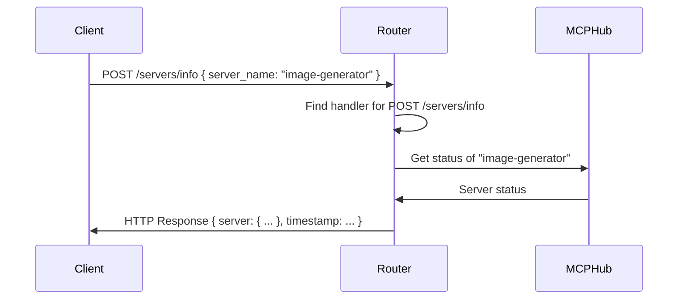

# Chapter 3: Router

In the previous chapter, [MCPHub](02_mcphub_.md), you learned how the MCPHub manages multiple MCPConnections, like starting and stopping them. But how do you *actually tell* the MCPHub what to do? That's where the **Router** comes in!

**Why do we need a Router?**

Imagine you're in a big office building. You need to find the right department to help you with your request. The Router is like the receptionist in that building. It receives your request (an HTTP request from your browser or application) and directs it to the correct handler function within the MCP Hub.

Let's say you want to get the status of a specific MCP server called "image-generator". You send a request to the MCP Hub, but how does the MCP Hub know which part of the code to run to fulfill your request? The Router is responsible for recognizing the request (e.g., `GET /servers/info`) and sending it to the appropriate function that retrieves and returns the server's status.

**Key Concepts:**

The Router does a few important things:

1.  **Receives HTTP Requests:** It listens for incoming requests from clients (like your web browser or a command-line tool).
2.  **Routes Requests:** It analyzes the request (the URL, the method, and any data it contains) and determines which handler function should handle it.
3.  **Handles Different HTTP Methods:** It supports different types of requests like `GET` (to retrieve data), `POST` (to send data), `PUT` (to update data), and `DELETE` (to delete data).
4.  **Error Handling:** It catches any errors that occur during the request processing and sends appropriate error responses back to the client.

**A Simple Use Case**

You want to get the status of the "image-generator" server.

1.  **You send an HTTP request to the MCP Hub:**

    `POST /servers/info` with the following data:

    ```json
    {
      "server_name": "image-generator"
    }
    ```

2.  **The Router receives the request.** It sees the `POST` method and the `/servers/info` path.

3.  **The Router finds the handler function associated with `POST /servers/info`.**

4.  **The Router executes the handler function,** which retrieves the status of the "image-generator" server from the [MCPHub](02_mcphub_.md).

5.  **The handler function returns the server's status.**

6.  **The Router sends the server's status back to you as an HTTP response.**

**Code Snippets**

Let's look at a simplified version of how the Router works (from `src/utils/router.js`):

```javascript
import express from "express";

const router = express.Router(); // Creates a new router instance

function registerRoute(method, path, description, handler) {
  router[method.toLowerCase()](path, (req, res, next) => {
    Promise.resolve(handler(req, res, next)).catch(next);
  });
}

export { router, registerRoute };
```

This code does the following:

1.  **`express.Router()`:** Creates a new Router instance using Express.js. Think of it as creating a new "reception desk" in our office building.
2.  **`registerRoute()`:** This function is how we tell the Router which paths (like `/servers/info`) should be handled by which functions. It takes the HTTP method (`GET`, `POST`, etc.), the path, a description, and the handler function as arguments.  It uses `router[method.toLowerCase()]` to register the actual route.
3.  **`handler()`:** This is the function that will be executed when a request matches the specified method and path.

Here is another snippet of how the `registerRoute` function is used (from `src/server.js`):

```javascript
registerRoute(
  "POST",
  "/servers/info",
  "Get status of a specific server",
  async (req, res) => { // This is the handler function
    const { server_name } = req.body;
    // ... (code to get the server status from the MCPHub) ...
    res.json({
      server: status,
      timestamp: new Date().toISOString(),
    });
  }
);
```

This code snippet registers a route for `POST` requests to `/servers/info`. When a request is made to this path, the provided function will be executed. This handler extracts the `server_name` from the request body, gets the server's status (from the [MCPHub](02_mcphub_.md)), and sends it back as a JSON response.

**Example Input & Output**

If you send the following request:

*   **Method:** `POST`
*   **Path:** `/servers/info`
*   **Body:**

    ```json
    {
      "server_name": "image-generator"
    }
    ```

And the "image-generator" server is connected and has the status:

```json
{
  "name": "image-generator",
  "status": "connected",
  "tools": ["generate_image", "resize_image"],
  "resources": ["./images"]
}
```

Then the Router, after executing the handler function, will send back the following response:

```json
{
  "server": {
    "name": "image-generator",
    "status": "connected",
    "tools": ["generate_image", "resize_image"],
    "resources": ["./images"]
  },
  "timestamp": "2024-10-27T10:00:00.000Z" // Example timestamp
}
```

**Internal Implementation**

Let's break down what happens step-by-step:



1.  **Client Sends Request:** A client (like your web browser) sends an HTTP `POST` request to the `/servers/info` endpoint with the server name in the body.
2.  **Router Finds Handler:** The Router receives the request and finds the handler function associated with the `POST /servers/info` route using the `registerRoute` function (from `src/utils/router.js`).
3.  **Router Calls MCPHub:** The handler function calls the [MCPHub](02_mcphub_.md) to retrieve the status of the specified server.
4.  **MCPHub Returns Status:** The MCPHub retrieves the server's status and returns it to the handler function.
5.  **Router Sends Response:** The handler function formats the server's status into a JSON response and sends it back to the client.

Another key part of the implementation is how errors are handled.  Here's a simplified example of the error handling in `src/server.js`:

```javascript
// Error handler middleware
router.use((err, req, res, next) => {
  console.error(err); // Log the error (for debugging)
  res.status(500).json({ // Send an error response
    error: "Something went wrong!",
    timestamp: new Date().toISOString(),
  });
});
```

This code defines a middleware function that catches any errors that occur during request processing. When an error occurs, this middleware logs the error to the console and sends a generic error response back to the client.

**Conclusion**

The Router is the traffic controller for the MCP Hub. It receives HTTP requests, routes them to the correct handler functions, and sends responses back to the client. You learned how to register routes, handle different HTTP methods, and handle errors.

Now that you understand how the Router directs requests, the next step is to see how the [Marketplace](04_marketplace_.md) provides a list of MCP servers. In the next chapter, we'll explore the Marketplace.


---

Generated by [AI Codebase Knowledge Builder](https://github.com/The-Pocket/Tutorial-Codebase-Knowledge)