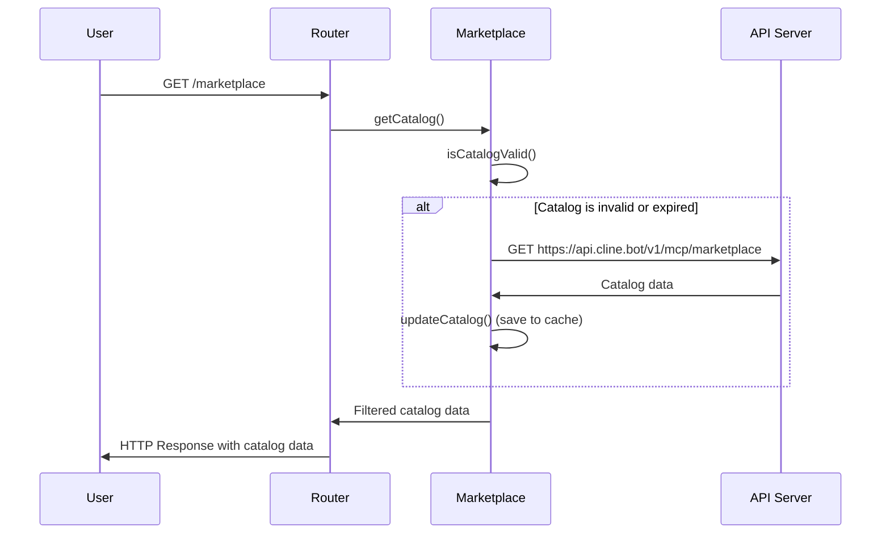

# Chapter 4: Marketplace

In the previous chapter, [Router](03_router_.md), you learned how the Router directs HTTP requests to the correct parts of the MCP Hub. But where do these requests *come from*? How do you know what MCP servers are available to connect to? That's where the **Marketplace** comes in!

**Why do we need a Marketplace?**

Imagine you have a new phone. The phone itself is powerful, but it's not very useful without apps. The Marketplace is like an app store for MCP servers. It's a central catalog that helps you *discover* and *manage* different MCP servers. It lists available servers with descriptions, categories, and other useful information, allowing you to easily find and connect to new servers.

Let's say you're looking for an MCP server that can generate QR codes. Without a marketplace, you'd have to search the internet, find a suitable server, and manually configure it. But with a Marketplace, you can simply browse the "QR Code Generators" category, find a server that looks promising, and install it with a few clicks (in reality, it would involve adding the server to your config file and restarting/reloading the hub). The central use case is to **easily discover new MCP servers**.

**Key Concepts:**

The Marketplace handles a few key things:

1.  **Catalog:** It maintains a list of available MCP servers with their descriptions, categories, and other metadata. This catalog is fetched from a central API.
2.  **Discovery:** It allows you to search and filter the catalog to find servers that meet your needs.
3.  **Caching:** It stores the catalog locally to improve performance and allow you to browse even when you're offline.
4.  **Server Details:** It provides detailed information about each server, such as its capabilities, installation instructions, and documentation.

**A Simple Use Case**

You want to find an MCP server that can translate text from English to Spanish.

1.  **You open the Marketplace (through the MCP Hub's user interface, or via the API).**

2.  **You search for "translate" or browse the "Translation" category.**

3.  **The Marketplace displays a list of matching servers.**

4.  **You select a server called "English to Spanish Translator".**

5.  **The Marketplace displays detailed information about the server,** including a description of its capabilities and instructions on how to configure it in your `mcp-servers.json` file.

6.  **You add the server to your `mcp-servers.json` file and restart/reload the MCP Hub.** The [MCPHub](02_mcphub_.md) then connects to the new server.

**Code Snippets**

Let's look at a simplified version of how the Marketplace fetches the catalog (from `src/marketplace.js`):

```javascript
async function fetchCatalog() {
  const API_BASE_URL = "https://api.cline.bot/v1/mcp"; // Where the server list comes from
  const response = await fetch(`${API_BASE_URL}/marketplace`); // Get the list
  const data = await response.json(); // Turn the response into usable data
  return data;
}
```

This code does the following:

1.  **`API_BASE_URL`:** Defines the URL of the API that provides the list of MCP servers.
2.  **`fetch()`:** Sends a request to the API to get the list of servers.
3.  **`response.json()`:** Converts the response from the API into a JavaScript object that can be used by the MCP Hub.

Here's another snippet of how the Marketplace caches the catalog (from `src/marketplace.js`):

```javascript
async function updateCatalog(items) {
  this.cache.catalog = {
    items,
    lastUpdated: new Date().toISOString(),
  };
  await this.saveCache();
}
```

This code does the following:

1.  **`this.cache.catalog`:** Stores the list of servers in the Marketplace's local cache.
2.  **`lastUpdated`:** Records the time when the cache was last updated.
3.  **`saveCache()`:** Saves the cache to a file on disk, so it can be used later even if the MCP Hub is restarted.

**Example Input & Output**

Imagine the API returns the following list of MCP servers:

```json
[
  {
    "mcpId": "example.com/translator",
    "name": "English to Spanish Translator",
    "description": "Translates text from English to Spanish.",
    "category": "Translation"
  },
  {
    "mcpId": "example.com/qr-generator",
    "name": "QR Code Generator",
    "description": "Generates QR codes from text.",
    "category": "Utilities"
  }
]
```

When you open the Marketplace, it will:

1.  Fetch this list from the API.
2.  Store it in the local cache.
3.  Display the list of servers to you, allowing you to browse and search.

If you then search for "translate", the Marketplace will filter the list and only show the "English to Spanish Translator" server.

**Internal Implementation**

Let's break down what happens step-by-step when you open the Marketplace:



1.  **User Opens Marketplace:** You open the Marketplace through the MCP Hub's user interface (which sends a `GET /marketplace` request).
2.  **Router Calls Marketplace:** The [Router](03_router_.md) receives the request and calls the `getCatalog()` function in the Marketplace.
3.  **Marketplace Checks Cache:** The `getCatalog()` function checks if the cached catalog is valid (not too old).
4.  **Marketplace Fetches from API (if needed):** If the cache is invalid or expired, the `getCatalog()` function fetches the latest catalog from the API server.
5.  **Marketplace Updates Cache:** The `getCatalog()` function updates the local cache with the new catalog data.
6.  **Marketplace Filters and Sorts:** The `getCatalog()` function filters and sorts the catalog based on any search terms or filters you've applied.
7.  **Router Sends Response:** The Router sends the filtered and sorted catalog data back to you in an HTTP response.

Another important part of the internal implementation is how the Marketplace is initialized. Here's a simplified example of the initialization code (from `src/marketplace.js`):

```javascript
async function initialize() {
  try {
    await loadCache(); // Try to load cache from file
    if (!isCatalogValid()) {
      await fetchCatalog(); // Fetch catalog if cache is invalid
    }
  } catch (error) {
    console.error("Marketplace initialization failed:", error);
  }
}
```

This code does the following:

1.  **`loadCache()`:** Tries to load the catalog from a file on disk.
2.  **`isCatalogValid()`:** Checks if the loaded catalog is still valid.
3.  **`fetchCatalog()`:** If the catalog is not valid, fetches a new one from the API.
4.  **Error Handling:** Catches any errors that occur during initialization and logs them to the console.

Let's look at another snippet of how the Marketplace gets server details (from `src/server.js`):
```javascript
registerRoute(
  "POST",
  "/marketplace/details",
  "Get detailed server information",
  async (req, res) => {
    const { mcpId } = req.body;
    try {
      if (!mcpId) {
        throw new ValidationError("Missing mcpId in request body");
      }

      const details = await marketplace.getServerDetails(mcpId);
      if (!details) {
        throw new ValidationError("Server not found", { mcpId });
      }

      res.json({
        server: details,
        timestamp: new Date().toISOString(),
      });
    } catch (error) {
      throw wrapError(error, "MARKETPLACE_ERROR", {
        mcpId: req.body.mcpId,
      });
    }
  }
);
```

This shows how the [Router](03_router_.md) registers a new route for `/marketplace/details`, and uses the `Marketplace.getServerDetails()` method to query the marketplace. The `mcpId` is provided in the request body, and used to get server details, handling edge cases where the `mcpId` is not provided or the server is not found.

**Conclusion**

The Marketplace is your gateway to discovering and managing MCP servers. You learned how it fetches a catalog from a central API, caches the catalog locally, and allows you to search and filter the catalog to find the servers you need.

Now that you understand how the Marketplace provides a list of MCP servers, the next step is to dive deeper into how the MCP Hub connects to and manages individual servers. In the next chapter, we'll explore the [MCPConnection](05_mcpconnection_.md).


---

Generated by [AI Codebase Knowledge Builder](https://github.com/The-Pocket/Tutorial-Codebase-Knowledge)