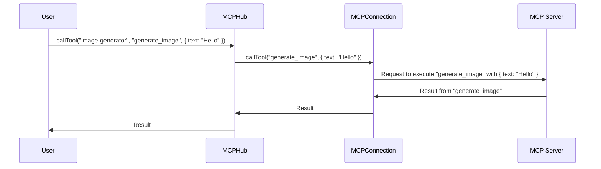

# Chapter 5: MCPConnection

In the previous chapter, [Marketplace](04_marketplace_.md), you learned how to discover available MCP servers. Now, let's talk about what happens *when you actually connect* to one of those servers. This chapter is all about the **MCPConnection**.

**Why do we need an MCPConnection?**

Imagine you're calling a friend on the phone. You need to dial the number, wait for them to answer, and then have a conversation. The MCPConnection is like that phone call. It handles all the messy details of connecting to and communicating with an individual MCP server.

Let's say you want to use an "image-generator" MCP server. You don't want to worry about whether it's running locally or remotely, how to send it commands, or how to handle errors. The MCPConnection takes care of all that, so you can simply tell it what you want and get the result. Its central use case is **managing the connection to a single MCP server and handling communication**.

**Key Concepts:**

The MCPConnection handles several important tasks:

1.  **Connection Management:** It establishes and maintains a connection to a single MCP server. This could be a local process (STDIO) or a remote service (HTTP/SSE).
2.  **Transport Abstraction:** It hides the details of the underlying communication protocol (STDIO, HTTP, SSE) from the rest of the MCP Hub. You don't need to know *how* it's talking to the server, just that it *is* talking to it.
3.  **Error Handling:** It handles any errors that occur during communication, such as connection failures or invalid responses.
4.  **Data Serialization/Deserialization:** It translates data into a format that can be sent to and received from the MCP server.
5.  **Authentication:** It handles authentication to secure MCP servers if needed.

**A Simple Use Case**

You want to connect to an "image-generator" server and call a tool named "generate_image".

1.  **The [MCPHub](02_mcphub_.md) creates an MCPConnection for the "image-generator" server.** It passes in the server's configuration (e.g., command to run, URL, etc.).

2.  **The MCPConnection establishes a connection to the server.** It might start a local process or connect to a remote service.

3.  **You (through the MCPHub) call the "generate_image" tool on the "image-generator" server.**

4.  **The MCPConnection sends a request to the server to execute the "generate_image" tool.** It might send a command to a local process or an HTTP request to a remote service.

5.  **The server executes the tool and sends a response back to the MCPConnection.**

6.  **The MCPConnection receives the response and returns the result to you.**

**Code Snippets**

Let's look at a simplified version of how the MCPConnection connects to a server (from `src/MCPConnection.js`):

```javascript
class MCPConnection {
  constructor(name, config) {
    this.name = name;
    this.config = config;
    this.status = 'disconnected';
  }

  async connect() {
    this.status = 'connecting';
    // Code to establish a connection to the server
    this.status = 'connected';
  }
}
```

This code does the following:

1.  **`constructor`:** Initializes the MCPConnection with the server's name and configuration. Sets the initial status to 'disconnected'.
2.  **`connect`:** Sets the status to 'connecting', then contains the logic to establish a connection to the server. After successfully connecting, sets the status to 'connected'. Note that we're skipping the actual connection logic for simplicity.

Let's look at another snippet of how the MCPConnection calls a tool (from `src/MCPConnection.js`):

```javascript
class MCPConnection {
  // ... (constructor and connect method from before) ...

  async callTool(toolName, args) {
    if (this.status !== 'connected') {
      throw new Error('Server not connected');
    }
    // Code to send a request to the server to execute the tool
    return "Result from tool: " + toolName; // Mock result
  }
}
```

This code does the following:

1.  **`callTool`:** Checks if the connection is established. If not, throws an error. Contains the logic to send a request to the server to execute the specified tool. Returns the result from the tool (in this simplified example, it just returns a mock result).

**Example Input & Output**

If you create an MCPConnection and call the `callTool` method like this (this is conceptual, not runnable code):

```javascript
const connection = new MCPConnection("my-server", { /* config */ });
await connection.connect();
const result = await connection.callTool("generate_image", { text: "Hello" });
console.log(result);
```

The output would be:

```
Result from tool: generate_image
```

**Internal Implementation**

Here's a simplified sequence diagram of how the MCPConnection calls a tool:



1.  The user (through the [Router](03_router_.md)) calls the `callTool` method on the [MCPHub](02_mcphub_.md).
2.  The MCPHub finds the appropriate MCPConnection and calls its `callTool` method.
3.  The MCPConnection sends a request to the MCP server to execute the specified tool.
4.  The MCP server executes the tool and sends a response back to the MCPConnection.
5.  The MCPConnection receives the response and returns it to the MCPHub, which then returns it to the user.

Let's look at another code snippet from `src/MCPConnection.js` that shows how the connection status is managed:

```javascript
class MCPConnection {
  // ... (constructor and connect method from before) ...

  async disconnect() {
    this.status = 'disconnected';
    // Code to close the connection to the server
  }

  getServerInfo() {
    return {
      name: this.name,
      status: this.status,
    };
  }
}
```

This code does the following:

1.  **`disconnect`:** Sets the status to 'disconnected' and contains the logic to close the connection to the server.
2.  **`getServerInfo`:** Returns an object containing the server's name and status. This method is used by the [MCPHub](02_mcphub_.md) to get the status of the connection.

Another code snippet from `src/MCPConnection.js` demonstrates the use of OAuth authentication flow:
```javascript
  async authorize() {
    if (!this.authorizationUrl) {
      throw new Error(`No authorization URL available for server '${this.name}'`);
    }
    //validate
    new URL(this.authorizationUrl)
    // log it in cases where the user in a browserless environment
    logger.info(`Opening authorization URL for server '${this.name}': ${this.authorizationUrl.toString()}`);
    // Open the authorization URL in the default browser
    await open(this.authorizationUrl.toString())
    //Once the user authorizes, handleAuthCallback is called.
    return {
      authorizationUrl: this.authorizationUrl,
    }
  }
```
This demonstrates the basic authentication flow, and is initiated via the MCP Hub API and can be triggered by the user. The function also opens the Auth url via default browser, or logs the auth url in headless situations.

**Conclusion**

The MCPConnection is the dedicated line to a single MCP server. It manages the connection, handles communication, and provides a simple interface for calling tools and reading resources. You learned how it connects to a server, calls tools, and manages its connection status.

Now that you understand how the MCPConnection works, the next step is to explore how Server-Sent Events (SSE) are managed for real-time updates. In the next chapter, we'll explore the [SSEManager](06_ssemanager_.md).


---

Generated by [AI Codebase Knowledge Builder](https://github.com/The-Pocket/Tutorial-Codebase-Knowledge)