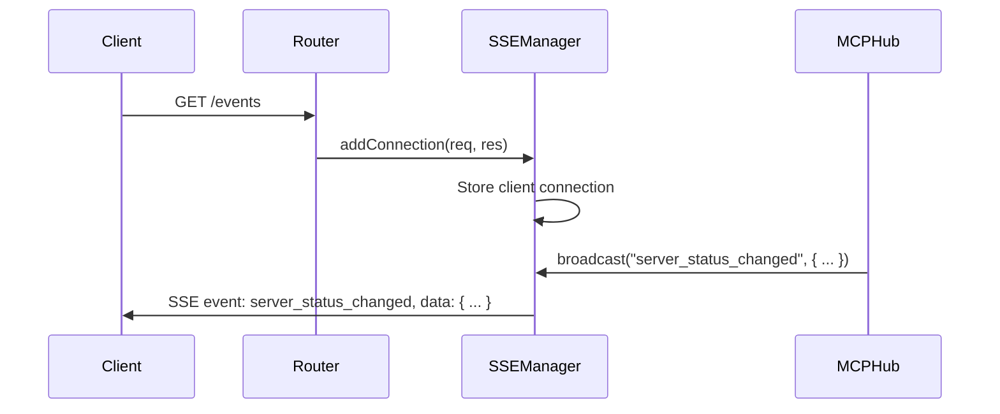

# Chapter 6: SSEManager

In the previous chapter, [MCPConnection](05_mcpconnection_.md), you learned how the MCP Hub connects to and manages individual MCP servers. But what if you want to know *immediately* when something changes – like when a server connects or disconnects? That's where the **SSEManager** comes in!

**Why do we need an SSEManager?**

Imagine you're listening to a radio station. You don't have to constantly call the station to ask if there's any news. The radio station *broadcasts* updates to you in real-time. The SSEManager is like that radio station for the MCP Hub. It uses Server-Sent Events (SSE) to push real-time updates to connected clients (like your web browser), so you don't have to keep asking for the latest information.

Let's say you're monitoring the status of several MCP servers. You want to be notified instantly when one of them goes offline. Instead of constantly refreshing a web page, the SSEManager can send you an SSE event whenever a server's status changes. This central use case allows you to **receive real-time updates from the MCP Hub**.

**Key Concepts:**

The SSEManager handles these key things:

1.  **Client Connections:** It manages a list of all connected clients (the "listeners" of our radio station).
2.  **Event Broadcasting:** It sends events to all connected clients whenever something important happens in the MCP Hub.
3.  **Heartbeats:** It sends regular "heartbeat" events to keep the connections alive and check if clients are still listening.
4.  **Connection Cleanup:** It automatically removes clients that have disconnected.

**A Simple Use Case**

You want to receive real-time updates about the status of your MCP servers in a web browser.

1.  **Your web browser connects to the MCP Hub's `/events` endpoint** (using JavaScript that utilizes the `EventSource` API - a standard web API for SSE).

2.  **The SSEManager adds your browser as a new client connection.**

3.  **When an MCP server connects or disconnects, the MCP Hub tells the SSEManager.**

4.  **The SSEManager sends an SSE event (like `hub_state`) to all connected clients, including your browser.** This event contains information about the server's status change.

5.  **Your browser receives the event and updates its display accordingly.**

**Code Snippets**

Let's look at a simplified version of how the SSEManager adds a new client connection (from `src/utils/sse-manager.js`):

```javascript
class SSEManager {
  constructor() {
    this.connections = new Map(); // Store clients
  }

  addConnection(req, res) {
    const id = Math.random(); // Generate a unique id.

    // Configure SSE headers
    res.setHeader('Content-Type', 'text/event-stream');
    res.setHeader('Cache-Control', 'no-cache');
    res.setHeader('Connection', 'keep-alive');

    this.connections.set(id, res); // Store client

    req.on('close', () => {
      this.connections.delete(id); // Clean up if disconnected
    });

    return { id };
  }
}
```

This code does the following:

1.  **`constructor`:** Initializes the `connections` map, which will store all connected clients.
2.  **`addConnection`:** This method is called when a new client connects to the `/events` endpoint. It generates a unique ID for the client, sets the appropriate headers for SSE, and stores the client's `res` object (the response object from Express.js) in the `connections` map. It also sets up a listener for the `close` event, so it can remove the client when they disconnect.

Let's look at a simplified version of how the SSEManager broadcasts an event (from `src/utils/sse-manager.js`):

```javascript
class SSEManager {
    //...previous code...

    broadcast(event, data) {
        for (const [id, res] of this.connections) {
            res.write(`event: ${event}\n`);
            res.write(`data: ${JSON.stringify(data)}\n\n`);
        }
    }
}
```

This code iterates through all connected clients and sends the specified event and data to each client using `res.write()`. The data is stringified to convert it into a format that can be sent over the network.

**Example Input & Output**

If you have two clients connected to the SSEManager, and you call the `broadcast` method like this (this is conceptual, not runnable code):

```javascript
const sseManager = new SSEManager();
sseManager.broadcast("server_status_changed", { server_name: "image-generator", status: "online" });
```

Then *both* clients will receive the following SSE event:

```
event: server_status_changed
data: {"server_name":"image-generator","status":"online"}
```

In their browsers, the JavaScript code listening for this event would receive this data and could update the display to show that the "image-generator" server is now online.

**Internal Implementation**

Let's break down what happens step-by-step when a client connects and an event is broadcast:



1.  **Client Connects:** A client (like your web browser) connects to the `/events` endpoint. The [Router](03_router_.md) directs the request to the `addConnection` method of the SSEManager.
2.  **SSEManager Stores Connection:** The SSEManager stores the client's connection information.
3.  **MCPHub Triggers Broadcast:**  The [MCPHub](02_mcphub_.md) (or another part of the server) calls the `broadcast` method of the SSEManager to send an event.
4.  **SSEManager Sends Event:** The SSEManager iterates through all connected clients and sends the event to each client.
5.  **Client Receives Event:** The client receives the SSE event and processes the data.

Let's look at another code snippet from `src/server.js` that shows how the `/events` endpoint is registered using the [Router](03_router_.md):

```javascript
registerRoute("GET", "/events", "Subscribe to server events", (req, res) => {
  try {
    // Add client connection
    const connection = serviceManager.sseManager.addConnection(req, res);
    // Send initial state
    serviceManager.broadcastHubState();
  } catch (error) {
    // Handle errors
  }
});
```

Here, the `registerRoute` function (from `src/utils/router.js`) is used to register a route for `GET` requests to `/events`. When a client connects to this path, the provided function is executed, which calls the `addConnection` method of the SSEManager. The initial hub state is also immediately broadcast so the client can initialize properly.

Also from `src/utils/sse-manager.js`, heartbeat events are handled automatically. Here's the code:

```javascript
  setupHeartbeat() {
    this.heartbeatTimer = setInterval(() => {
      this.broadcast(EventTypes.HEARTBEAT, {
        connections: this.connections.size,
        timestamp: new Date().toISOString()
      });
    }, this.heartbeatInterval);
  }
```
This function is called during object construction in `src/utils/sse-manager.js`, and periodically broadcasts a `heartbeat` event which contains the number of active SSE connections.

**Conclusion**

The SSEManager provides real-time updates from the MCP Hub to connected clients. You learned how it manages client connections, broadcasts events, and handles connection cleanup. Think of it as the radio station broadcasting important announcements about your MCP servers.

Now that you understand how the SSEManager provides real-time updates, the next step is to explore how the MCP Hub manages configuration settings. In the next chapter, we'll explore the [ConfigManager](07_configmanager_.md).


---

Generated by [AI Codebase Knowledge Builder](https://github.com/The-Pocket/Tutorial-Codebase-Knowledge)