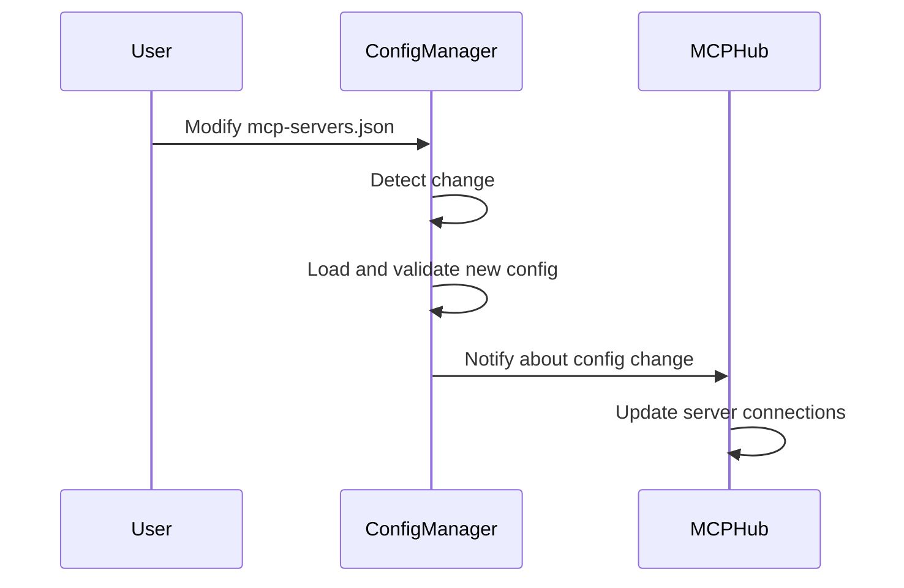

# Chapter 7: ConfigManager

In the previous chapter, [SSEManager](06_ssemanager_.md), you learned how the MCP Hub sends real-time updates to clients using Server-Sent Events. But how does the MCP Hub *know* what servers to manage in the first place? Where does it get its instructions? That's where the **ConfigManager** comes in!

**Why do we need a ConfigManager?**

Imagine you have a settings panel for your home. You can adjust things like the brightness of the lights, the temperature, and the security settings. The ConfigManager is like that settings panel for the MCP Hub. It's responsible for loading, validating, and watching the configuration file (usually `mcp-servers.json`). It handles updates to the config and notifies the MCPHub about changes.

Let's say you want to add a new MCP server to your setup or change the command used to start an existing server. Instead of modifying the MCP Hub's code directly, you can simply update the `mcp-servers.json` file. The ConfigManager will detect these changes and tell the [MCPHub](02_mcphub_.md) to update its connections accordingly. The ConfigManager's central use case is **managing the MCP Hub's configuration and reacting to changes**.

**Key Concepts:**

The ConfigManager handles a few key things:

1.  **Loading Configuration:** It reads the `mcp-servers.json` file and parses it into a usable format.
2.  **Validating Configuration:** It checks if the configuration is valid (e.g., if all required fields are present).
3.  **Watching for Changes:** It monitors the `mcp-servers.json` file for any changes and notifies the MCPHub when they occur.
4.  **Updating Configuration:** It updates the MCP Hub's configuration when the file changes.

**A Simple Use Case**

You want to add a new MCP server called "audio-converter" to your `mcp-servers.json` file.

1.  **You edit the `mcp-servers.json` file** and add a new entry for the "audio-converter" server:

    ```json
    {
      "mcpServers": {
        "image-generator": {
          "command": "python",
          "args": ["./image_generator.py"]
        },
        "audio-converter": {
          "command": "ffmpeg",
          "args": ["-i", "input.mp3", "output.wav"]
        }
      }
    }
    ```

2.  **The ConfigManager detects the change to the `mcp-servers.json` file.**

3.  **The ConfigManager loads and validates the new configuration.**

4.  **The ConfigManager notifies the [MCPHub](02_mcphub_.md) about the change.**

5.  **The MCPHub creates a new [MCPConnection](05_mcpconnection_.md) for the "audio-converter" server** and starts it.

**Code Snippets**

Let's look at a simplified version of how the ConfigManager loads the configuration (from `src/utils/config.js`):

```javascript
import fs from 'fs/promises';

class ConfigManager {
  constructor(configPath) {
    this.configPath = configPath;
  }

  async loadConfig() {
    const content = await fs.readFile(this.configPath, 'utf-8');
    this.config = JSON.parse(content);
    return this.config;
  }
}
```

This code does the following:

1.  **`constructor`:** Initializes the ConfigManager with the path to the configuration file.
2.  **`loadConfig`:** Reads the contents of the configuration file, parses it as JSON, and stores it in the `config` property.

Here's another snippet of how the ConfigManager watches for changes (from `src/utils/config.js`):

```javascript
import chokidar from 'chokidar';

class ConfigManager {
  // ... (constructor and loadConfig method from before) ...

  watchConfig() {
    this.watcher = chokidar.watch(this.configPath);
    this.watcher.on('change', () => {
      console.log('Config file changed!');
      // In a real implementation, you'd reload the config and
      // notify the MCPHub about the changes here.
    });
  }
}
```

This code does the following:

1.  **`watchConfig`:** Uses the `chokidar` library to watch the configuration file for changes.
2.  **`watcher.on('change', ...)`:** Sets up a listener for the `change` event, which is triggered whenever the file is modified. In a real implementation, this listener would reload the configuration and notify the [MCPHub](02_mcphub_.md) about the changes.

**Example Input & Output**

Imagine you have the following `mcp-servers.json` file:

```json
{
  "mcpServers": {
    "image-generator": {
      "command": "python",
      "args": ["./image_generator.py"]
    }
  }
}
```

And you call the `loadConfig` method:

```javascript
const configManager = new ConfigManager('./mcp-servers.json');
const config = await configManager.loadConfig();
console.log(config);
```

The output would be:

```json
{
  "mcpServers": {
    "image-generator": {
      "command": "python",
      "args": ["./image_generator.py"]
    }
  }
}
```

If you then modify the `mcp-servers.json` file and the `watchConfig` method detects the change, you would see the message "Config file changed!" printed to the console.

**Internal Implementation**

Let's break down what happens step-by-step when the ConfigManager detects a change:



1.  **User Modifies File:** You modify the `mcp-servers.json` file.
2.  **ConfigManager Detects Change:** The ConfigManager (using `chokidar`) detects the change to the file.
3.  **ConfigManager Loads and Validates:** The ConfigManager reloads and validates the new configuration.
4.  **ConfigManager Notifies MCPHub:** The ConfigManager emits a `configChanged` event (from `src/utils/config.js`), notifying the [MCPHub](02_mcphub_.md) about the change.
5.  **MCPHub Updates Connections:** The MCPHub receives the `configChanged` event and updates its server connections accordingly (starting new connections, stopping old connections, etc.).

Let's look at another code snippet from `src/MCPHub.js` that shows how the MCPHub handles config updates:

```javascript
class MCPHub {
  constructor(configPathOrObject) {
    this.configManager = new ConfigManager(configPathOrObject);
  }

  async initialize() {
    this.configManager.on('configChanged', (config) => {
      console.log('Config changed:', config);
      // In a real implementation, you'd update the MCPHub's
      // server connections based on the new configuration here.
    });
  }
}
```

This code does the following:

1.  **`constructor`:** Creates a new ConfigManager instance and stores it in the `configManager` property.
2.  **`initialize`:** Sets up a listener for the `configChanged` event on the ConfigManager. When the event is triggered, this listener receives the new configuration and updates the MCP Hub's server connections based on the new configuration.

**Conclusion**

The ConfigManager makes managing MCP Hub much easier. You learned how it loads and validates the configuration, watches for changes, and notifies the MCP Hub when updates are available. Think of it as the settings panel that keeps your MCP Hub running smoothly.

Now that you understand how the ConfigManager handles configuration, the next step is to explore how the MCP Hub logs information. In the next chapter, we'll explore the [Logger](08_logger_.md).


---

Generated by [AI Codebase Knowledge Builder](https://github.com/The-Pocket/Tutorial-Codebase-Knowledge)