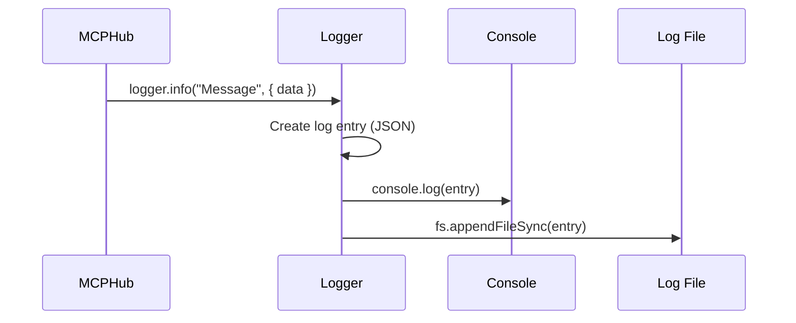

# Chapter 8: Logger

In the previous chapter, [ConfigManager](07_configmanager_.md), you learned how the MCP Hub manages its configuration settings. But how do you know what's going on *inside* the MCP Hub? How do you keep track of errors, warnings, and important events? That's where the **Logger** comes in!

**Why do we need a Logger?**

Imagine you're the captain of a ship. You need to keep a logbook to record important events like changes in weather, arrival at ports, and any problems that occur. The Logger is like that logbook for the MCP Hub. It records events and messages within the application, helping you understand what's happening and troubleshoot any issues.

Let's say an MCP server fails to connect. Without a Logger, you might not even know it happened! But with a Logger, the MCP Hub can record an error message, including details about the server and the reason for the failure. The central use case is to **record important events for debugging and monitoring the MCP Hub**.

**Key Concepts:**

The Logger handles a few key things:

1.  **Log Levels:** It provides different levels of logging, such as `info`, `debug`, `warn`, and `error`. This allows you to control the amount of detail that is recorded.
2.  **Console Logging:** It prints log messages to the console, so you can see what's happening in real-time.
3.  **File Logging:** It writes log messages to a file, so you can review them later.
4.  **Structured Logging:** It formats log messages in a structured way (JSON), making them easy to analyze.

**A Simple Use Case**

You want to know when an MCP server successfully connects to the MCP Hub.

1.  **The [MCPHub](02_mcphub_.md) uses the Logger to record an "info" message when a server connects.**

2.  **The Logger prints the message to the console and writes it to the log file.**

3.  **You can see the message in the console:**

    ```
    {"type":"info","message":"'image-generator' MCP server connected","data":{},"timestamp":"2024-10-27T12:00:00.000Z"}
    ```

4.  **You can also find the message in the `mcp-hub.log` file.**

**Code Snippets**

Let's look at a simplified version of how the Logger logs an info message (from `src/utils/logger.js`):

```javascript
class Logger {
  info(message, data = {}) {
    this.log('info', message, data);
  }

  log(type, message, data = {}) {
    const entry = {
      type,
      message,
      data,
      timestamp: new Date().toISOString()
    };
    console.log(JSON.stringify(entry));
  }
}

const logger = new Logger();
export default logger;
```

This code does the following:

1.  **`info(message, data)`:** This function is used to log an "info" message. It calls the `log` function with the message and any additional data.
2.  **`log(type, message, data)`:** This function creates a log entry with the specified type, message, data, and timestamp. It then prints the log entry to the console as a JSON string.
3.  **`const logger = new Logger();`:** Creates a single instance of the `Logger` class, which is then exported. This means that other parts of the application can use this logger to record messages.
4. **`export default logger;`**: This line makes the `logger` object available for use in other modules.

Here's another snippet of how the Logger is used in the [MCPHub](02_mcphub_.md) (from `src/MCPHub.js`):

```javascript
import logger from "./utils/logger.js";

class MCPHub {
  async startConfiguredServers() {
    const config = this.configManager.getConfig();
    const servers = Object.entries(config?.mcpServers || {});

    servers.forEach(([name, serverConfig]) => {
      logger.info(`Initializing MCP server '${name}'`, { server: name });
      // ... (code to start the server) ...
    });
  }
}
```

This code imports the Logger and uses it to log an "info" message when a new MCP server is initialized. This helps you track which servers are being started and when.

**Example Input & Output**

If the MCPHub calls the Logger like this:

```javascript
logger.info("Initializing MCP server 'image-generator'", { server: 'image-generator' });
```

The output in the console would be:

```json
{"type":"info","message":"Initializing MCP server 'image-generator'","data":{"server":"image-generator"},"timestamp":"2024-10-27T12:00:00.000Z"}
```

**Internal Implementation**

Let's break down what happens step-by-step when the Logger is called:



1.  **MCPHub Calls Logger:** The [MCPHub](02_mcphub_.md) calls the `logger.info()` method with a message and some data.
2.  **Logger Creates Entry:** The Logger creates a log entry object, including the message, data, and timestamp.
3.  **Logger Prints to Console:** The Logger prints the log entry to the console using `console.log()`.
4.  **Logger Writes to File:** The Logger writes the log entry to the log file using `fs.appendFileSync()`.

Let's look at another code snippet from `src/utils/logger.js` that shows how file logging is handled:

```javascript
import fs from "fs";

class Logger {
  constructor(options = {}) {
    this.logFile = options.logFile || 'mcp-hub.log';
    this.enableFileLogging = true;
  }

  file(message) {
    if (this.enableFileLogging) {
      fs.appendFileSync(this.logFile, message + '\n');
    }
  }

  log(type, message, data = {}) {
    const entry = {
      type,
      message,
      data,
      timestamp: new Date().toISOString()
    };
    console.log(JSON.stringify(entry));
    this.file(JSON.stringify(entry));
  }
}
```

This code does the following:

1.  **`constructor`:** Initializes the Logger with the log file path.
2.  **`file(message)`:** This function appends the message to the log file. It checks if file logging is enabled before writing to the file.
3.  **`log(type, message, data)`:** The `log` function now also calls the `file` function to write the log entry to the log file.

**Conclusion**

The Logger is your window into the MCP Hub. It records important events and messages, helping you understand what's happening and troubleshoot any issues. You learned how it uses different log levels, prints messages to the console, and writes them to a file.

Now that you understand how the Logger works, the next step is to explore how the MCP Hub handles authentication. In the next chapter, we'll explore the [OAuthProvider](09_oauthprovider_.md).


---

Generated by [AI Codebase Knowledge Builder](https://github.com/The-Pocket/Tutorial-Codebase-Knowledge)