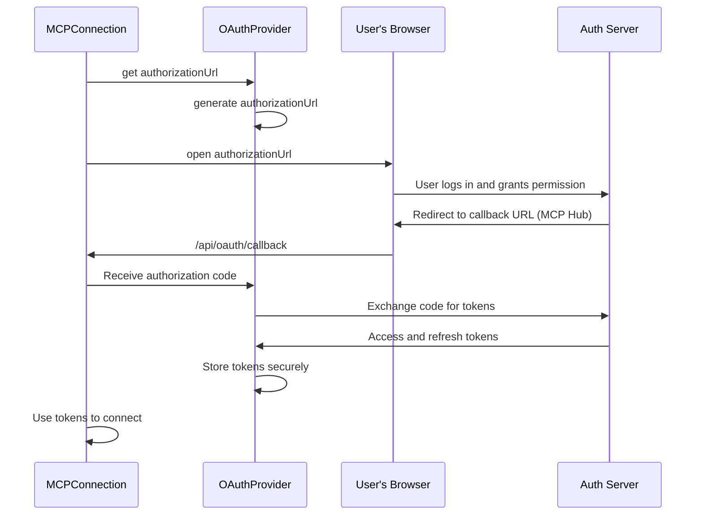

# Chapter 9: OAuthProvider

In the previous chapter, [Logger](08_logger_.md), you learned how the MCP Hub records important events to help with debugging and monitoring. But what if you need to securely connect to an MCP server that requires authentication? That's where the **OAuthProvider** comes in!

**Why do we need an OAuthProvider?**

Imagine you want to access your bank account online. You wouldn't give your username and password directly to *every* website that wants to access your account. Instead, you use OAuth (like "Login with Google" or "Login with Facebook") to grant limited access to certain websites without sharing your credentials.

The OAuthProvider acts as a security guard for your MCP Hub. It handles the OAuth 2.0 authorization flow for remote MCP servers that require it. Think of it as the middleman that helps the MCP Hub authenticate with those servers, ensuring your credentials stay safe. Let's say you want to connect to a secure "data-analysis" MCP server that needs you to log in with a Google account. The OAuthProvider manages the entire process of getting permission from Google and passing that permission to the data-analysis server, so the server knows it can trust the MCP Hub. The central use case is **handling secure authentication with remote MCP servers using OAuth 2.0**.

**Key Concepts:**

The OAuthProvider manages a few key things:

1.  **Client Registration:** Before anything else, OAuth requires the client to be registered. The OAuthProvider ensures your MCP Hub has registered itself with the remote MCP server that it is trying to connect to.
2.  **Authorization URL Redirection:** Directs you to the correct web page to log in with the remote MCP server, where you will grant the MCP Hub permission.
3.  **Token Storage:** Securely stores the "tokens" (digital keys) that allow the MCP Hub to access the remote server on your behalf.
4.  **Token Refresh:** Handles refreshing these tokens when they expire, so you don't have to log in again and again.

**A Simple Use Case**

You want to connect to a "secure-image-generator" MCP server that requires OAuth 2.0 authentication.

1.  **The [MCPConnection](05_mcpconnection_.md) tries to connect to the "secure-image-generator" server.**

2.  **The server responds that it requires OAuth 2.0 authentication.** The server also provides the URL to authorize.

3.  **The MCP Hub redirects you to a login page (e.g., Google's login page) where you grant permission to access the "secure-image-generator" server on your behalf.**

4.  **After you log in and grant permission, the login page redirects you back to the MCP Hub.**

5.  **The OAuthProvider receives a special "code" from the login page.**

6.  **The OAuthProvider exchanges this "code" for access and refresh tokens with the remote MCP server.**

7.  **The OAuthProvider securely stores these tokens.**

8.  **The MCPConnection uses the access token to connect to the "secure-image-generator" server.** The connection succeeds, and you can start using the image generator.

**Code Snippets**

Let's look at a simplified version of how the OAuthProvider handles the redirection to the authorization URL (from `src/utils/oauth-provider.js`):

```javascript
export default class MCPHubOAuthProvider {
    constructor({ serverName, serverUrl, hubServerUrl }) {
        this.serverName = serverName;
        this.serverUrl = serverUrl;
        this.hubServerUrl = hubServerUrl;
        this.generatedAuthUrl = null;
    }
    get redirectUrl() {
        const callbackURL = new URL("/api/oauth/callback", this.hubServerUrl);
        callbackURL.searchParams.append("server_name", this.serverName);
        return callbackURL.toString();
    }
    async redirectToAuthorization(authUrl) {
        this.generatedAuthUrl = authUrl;
        return true;
    }
}
```

This code does the following:

1.  **`constructor`:** Initializes the OAuthProvider with information about the server and the MCP Hub itself.
2.  **`get redirectUrl`:** This method constructs the URL that the OAuth provider uses to redirect the user back to the MCP Hub after they have authorized the connection.
3.  **`redirectToAuthorization`:** Stores the authorization URL so that it can later be opened in the client's browser

Let's look at another code snippet of the client function to actually authorize the server. (from `src/MCPConnection.js`):
```javascript
  async authorize() {
    if (!this.authorizationUrl) {
      throw new Error(`No authorization URL available for server '${this.name}'`);
    }
    // Open the authorization URL in the default browser 
    await open(this.authorizationUrl.toString())
    //Once the user authorizes, handleAuthCallback is called.
    return {
      authorizationUrl: this.authorizationUrl,
    }
  }
```

This code does the following:

1. **`authorize`:** This function triggers opening the Auth URL so that the user is able to see the provider, and authorize the server.

**Example Input & Output**

When the OAuthProvider is asked to redirect to the authorization URL (This is conceptual, not runnable code):

```javascript
const oauthProvider = new MCPHubOAuthProvider({ serverName: 'my-secure-server', serverUrl: 'https://secure.example.com', hubServerUrl: "http://localhost:3000" });
await oauthProvider.redirectToAuthorization("https://example.com/oauth/authorize?client_id=...");
```

The value of `oauthProvider.generatedAuthUrl` will be set to `"https://example.com/oauth/authorize?client_id=..."`. The browser will then open a tab at this URL.

**Internal Implementation**

Let's break down what happens step-by-step when the OAuthProvider handles the authorization flow:



1.  **MCPConnection asks for authorizationURL:** The [MCPConnection](05_mcpconnection_.md) detects the server needs authentication. The connection requests for authorizationURL.
2.  **Get the authorizationURL:** The [OAuthProvider](09_oauthprovider_.md) generates the authorizationURL.
3.  **User is prompted:** User is taken to the authorizationURL in the browser, is prompted to authorize the connection, and grants permission.
4.  **Authorization code and tokens are exchanged:** The [OAuthProvider](09_oauthprovider_.md) receives authorization code, then exchanges the tokens.
5.  **Connect to the server:** The [MCPConnection](05_mcpconnection_.md) then connect to the remote server using the tokens.

Let's look at another code snippet from `src/utils/oauth-provider.js` that shows how tokens are stored and retrieved:

```javascript
import fs from 'fs/promises';
import path from 'path';
import os from 'os';

let serversStorage = {};

class StorageManager {
  constructor() {
    this.path = path.join(os.homedir(), '.mcp-hub', 'oauth-storage.json');
  }

  async init() {
    try {
      await fs.mkdir(path.dirname(this.path), { recursive: true });
      try {
        const data = await fs.readFile(this.path, 'utf8');
        serversStorage = JSON.parse(data);
      } catch (err) {
        if (err.code !== 'ENOENT') {
          logger.warn(`Error reading storage: ${err.message}`);
        }
      }
    } catch (err) {
      logger.warn(`Storage initialization error: ${err.message}`);
    }
  }

  async save() {
    try {
      await fs.writeFile(this.path, JSON.stringify(serversStorage, null, 2), 'utf8');
    } catch (err) {
      logger.warn(`Error saving storage: ${err.message}`);
    }
  }

  get(serverUrl) {
    if (!serversStorage[serverUrl]) {
      serversStorage[serverUrl] = { clientInfo: null, tokens: null, codeVerifier: null };
    }
    return serversStorage[serverUrl];
  }

  async update(serverUrl, data) {
    const serverData = this.get(serverUrl);
    serversStorage[serverUrl] = { ...serverData, ...data };
    return this.save();
  }
}

// Singleton instance
const storage = new StorageManager();

// Initialize storage once
storage.init();
```

This code shows the `StorageManager` helper which handles writing the tokens into a local file. It does the following:

1. **`StorageManager`**: Manages the storage of OAuth-related data in a file. The `path` property sets the path to the storage file in the user's home directory. The `init`, `save`, `get`, and `update` methods handle reading, writing, and updating data in the storage file.
2.  **Stores in user home dir:** The data is stored in the home directory of the user in `.mcp-hub/oauth-storage.json`.
3.  **`get(serverUrl)`**: Retrieves the data given a server url
4.  **`update(serverUrl, data)`**: Updates the data given a server url

**Conclusion**

The OAuthProvider is your secure connection manager. It handles the complex OAuth 2.0 authentication flow, ensuring your MCP Hub can connect to secure servers without compromising your credentials. You learned how it handles client registration, authorization URL redirection, token storage, and token refresh.

Now that you understand how the OAuthProvider handles secure authentication, the next step is to explore how the MCP Hub handles errors. In the next chapter, we'll explore the [MCPHubError](10_mcphuberror_.md).


---

Generated by [AI Codebase Knowledge Builder](https://github.com/The-Pocket/Tutorial-Codebase-Knowledge)