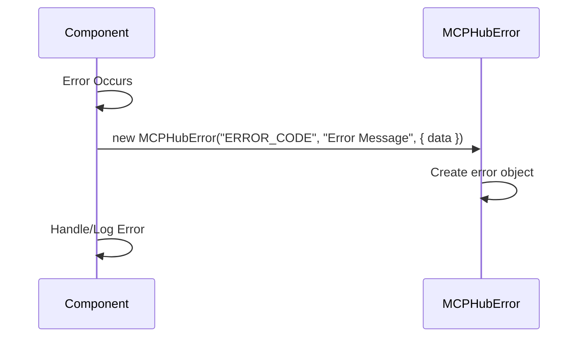

# Chapter 10: MCPHubError

In the previous chapter, [OAuthProvider](09_oauthprovider_.md), you learned how the MCP Hub handles secure authentication with remote servers. But what happens when things go wrong? How does the MCP Hub tell you *what* went wrong in a clear and consistent way? That's where `MCPHubError` comes in!

**Why do we need an MCPHubError?**

Imagine you're a detective investigating a crime. You need to collect all the evidence – the who, what, where, when, and why – to solve the case. `MCPHubError` is like a standardized incident report for the MCP Hub. It's a special error class that provides a consistent way to handle errors within the MCP Hub, making it easier to debug and troubleshoot problems.

Let's say an MCP server refuses a connection because of a configuration issue. Instead of just getting a generic "Something went wrong!" message, you get an `MCPHubError` that tells you:

*   The specific error code (e.g., `CONFIG_ERROR`)
*   A helpful error message (e.g., "Invalid config file")
*   Relevant data for debugging (e.g., the file path of the invalid config file)

The central use case is **providing consistent and informative error messages within the MCP Hub.**

**Key Concepts:**

The `MCPHubError` class has a few key components:

1.  **Error Code (`code`):** A unique identifier for the type of error that occurred. Think of it like a category label for the problem. For example, `SERVER_ERROR`, `TOOL_ERROR`, or `CONFIG_ERROR`.
2.  **Message (`message`):** A human-readable explanation of what went wrong. This should be clear and concise.
3.  **Data (`data`):** Additional information about the error that can be helpful for debugging. This might include things like the name of the server that failed to connect, the arguments that were passed to a tool, or the file path of an invalid configuration file.

**A Simple Use Case**

You try to start an MCP server, but the command specified in the configuration file is not found.

1.  **The [MCPHub](02_mcphub_.md) attempts to start the server.**

2.  **The system reports an error because the command is not found.**

3.  **The MCP Hub creates an `MCPHubError` with the following information:**

    *   `code`: `SERVER_ERROR`
    *   `message`: "Command not found: /path/to/nonexistent/command"
    *   `data`: `{ server: "my-server", command: "/path/to/nonexistent/command" }`

4.  **The error is logged, and you see a clear, informative message that helps you quickly identify the problem and fix your configuration.**

**Code Snippets**

Let's look at a simplified version of how the `MCPHubError` class is defined (from `src/utils/errors.js`):

```javascript
export class MCPHubError extends Error {
  constructor(code, message, data = {}) {
    super(message);
    this.code = code;
    this.data = data;
    this.name = "MCPHubError";
  }
}
```

This code does the following:

1.  **`extends Error`:** This makes `MCPHubError` a type of JavaScript `Error`, so it inherits all the standard error properties and behavior.
2.  **`constructor(code, message, data)`:** This is the constructor for the `MCPHubError` class. It takes three arguments: the error code, the error message, and an optional data object.
3.  **`this.code = code;`:** Sets the `code` property of the error object to the specified error code.
4.  **`this.data = data;`:** Sets the `data` property of the error object to the specified data object.
5.  **`this.name = "MCPHubError";`:** Sets the `name` property of the error object to "MCPHubError". This helps identify the error type.

Here's another snippet of how the `MCPHubError` is used (from `src/MCPHub.js`):

```javascript
import { wrapError } from "./utils/errors.js";

async function startServer(options = {}) {
    try {
        // ... some code that might throw an error ...
    } catch (error) {
        throw wrapError(error, "HUB_INIT_ERROR", {
            watchEnabled: this.shouldWatchConfig,
        });
    }
}
```

This code snippet shows how the `wrapError` function (defined later) is used to turn a normal error into a `MCPHubError`. It captures the original error, and enriches it with a HUB_INIT_ERROR code.

**Example Input & Output**

If you create an `MCPHubError` like this (this is conceptual, not runnable code):

```javascript
const error = new MCPHubError(
  "CONFIG_ERROR",
  "Invalid config file path",
  { file_path: "./bad_config.json" }
);
console.log(error.code);
console.log(error.message);
console.log(error.data);
```

The output would be:

```
CONFIG_ERROR
Invalid config file path
{ file_path: './bad_config.json' }
```

**Internal Implementation**

Let's break down what happens step-by-step when an error occurs and an `MCPHubError` is created:



1.  **Error Occurs:** An error occurs within a component of the MCP Hub (e.g., during configuration loading, server connection, or tool execution).
2.  **MCPHubError is created:** The component creates a new `MCPHubError` object, providing an error code, a message, and any relevant data.
3.  **Error Object is created:** The `MCPHubError` constructor initializes the error object with the provided information.
4.  **Error is handled or logged:** The component handles the error (e.g., by displaying an error message to the user, retrying the operation, or shutting down the system) and/or logs the error for debugging purposes.

Let's look at another code snippet from `src/utils/errors.js` that shows how the `wrapError` utility function is defined and how it's used for non `MCPHubError` errors:

```javascript
export function wrapError(error, code = "UNEXPECTED_ERROR", data = {}) {
  if (isMCPHubError(error)) {
    return error;
  }

  return new MCPHubError(error.code || code, error.message, {
    ...data,
    originalError: error,
  });
}
```

This `wrapError` function allows non `MCPHubError` errors to be converted into an `MCPHubError` if needed.

Here is yet another code snippet from `src/utils/errors.js`, that shows how `ServerError` is an extension of `MCPHubError`:

```javascript
export class ServerError extends MCPHubError {
  constructor(message, data = {}) {
    super("SERVER_ERROR", message, data);
    this.name = "ServerError";
  }
}
```

The code snippet does the following:

1.  **extends MCPHubError:** Extends `MCPHubError` to create `ServerError`
2.  **constructor(message, data):** Creates the server error, sets the code to `SERVER_ERROR`.

**Conclusion**

`MCPHubError` provides a standardized way to handle errors within the MCP Hub, making it easier to debug and troubleshoot problems. You learned how it uses error codes, messages, and data to provide clear and informative error messages. Think of it as the detective's incident report, helping you solve the mysteries of your MCP Hub.

Congratulations! You've reached the end of this tutorial! There are no further chapters planned at this time. We hope that this tutorial has given you a solid understanding of the core concepts and how they all work together. Happy Hubbing!


---

Generated by [AI Codebase Knowledge Builder](https://github.com/The-Pocket/Tutorial-Codebase-Knowledge)