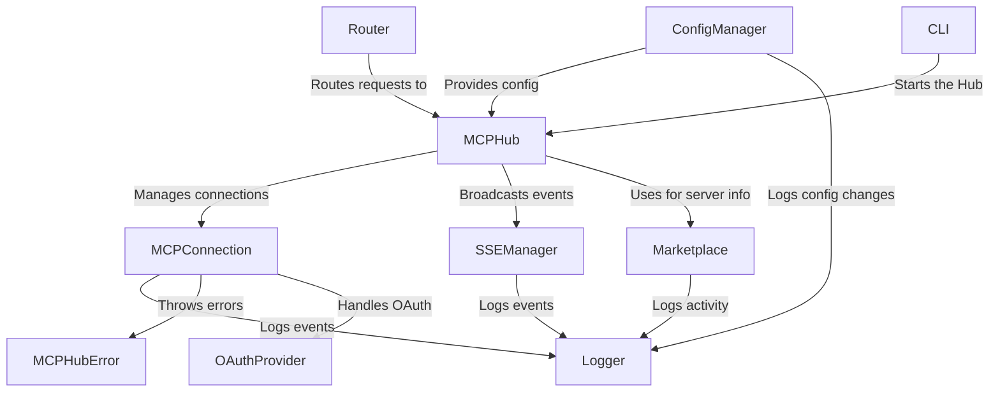

# Tutorial: mcp-hub

The `mcp-hub` project acts as a central **management point** for multiple Model Context Protocol (MCP) servers.  It *dynamically* connects to, controls, and monitors these servers, providing a unified interface for accessing their capabilities. Think of it as a universal remote for all your AI tools.

**Source Repository:** [None](None)

## Chapters

1. [CLI
](01_cli_.md)
2. [MCPHub
](02_mcphub_.md)
3. [Router
](03_router_.md)
4. [Marketplace
](04_marketplace_.md)
5. [MCPConnection
](05_mcpconnection_.md)
6. [SSEManager
](06_ssemanager_.md)
7. [ConfigManager
](07_configmanager_.md)
8. [Logger
](08_logger_.md)
9. [OAuthProvider
](09_oauthprovider_.md)
10. [MCPHubError
](10_mcphuberror_.md)

---

Generated by [AI Codebase Knowledge Builder](https://github.com/The-Pocket/Tutorial-Codebase-Knowledge)