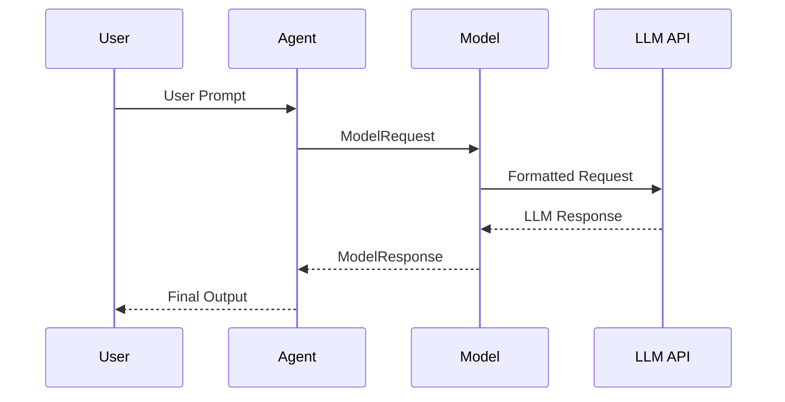

# Chapter 1: Model

Imagine you want to build a chatbot that can answer questions about anything. You need a powerful "brain" that can understand your questions and generate helpful responses. This "brain" is the language model, and in `pydantic-ai`, we represent it using the `Model` abstraction.

The `Model` abstraction is like the engine in a car. It takes your instructions (the question you ask) and produces output (the answer).  `pydantic-ai` handles interactions with different language models (like OpenAI's GPT-4 or Anthropic's Claude) using a common interface, so you don't have to worry about the specifics of each one. This chapter will guide you through understanding and using the `Model` in `pydantic-ai`.

## What is a Model?

At its core, a `Model` in `pydantic-ai` represents a language model.  Think of it as an object that you give a request to, and it gives you a response. It handles the communication with the actual language model API.  Key aspects of the `Model` abstraction include:

*   **Abstraction:** It provides a unified interface for interacting with various language models.  You can switch between different models (e.g., GPT-4 and Claude) with minimal code changes.
*   **Request Handling:** It encapsulates the process of sending requests to the language model API, including formatting the input and handling authentication.
*   **Response Parsing:** It parses the response from the language model API and presents it in a structured format.

## Using a Model

Let's see how you can use a `Model` in `pydantic-ai`.  The most common way to use the `Model` is inside an [Agent](05_agent.md). But for demonstration purposes, you can get a `Model` instance directly and call it. Here's a simple example:

```python
from pydantic_ai import Model

model = Model(model='openai:gpt-3.5-turbo')
```

This code creates a `Model` object, specifying that we want to use OpenAI's `gpt-3.5-turbo` model.  `pydantic-ai` automatically handles the details of connecting to the OpenAI API.  The `model` parameter supports a variety of models; see [models](pydantic_ai_slim/pydantic_ai/models/__init__.py) for a full list of available options.

Now, let's make a request:

```python
from pydantic_ai import Model, ModelMessage

model = Model(model='openai:gpt-3.5-turbo')

messages = [
    ModelMessage(role='user', content='What is the capital of France?')
]

response, usage = await model.request(messages=messages, model_settings=None, model_request_parameters=None)
print(response.content) # Expected: "Paris."
```

Here, we create a list containing a user message asking a question. Then we call the `request` method of the `Model` object, passing in the message.
The `request` method returns a tuple containing the `ModelResponse` (the answer from the language model) and a `Usage` object (information about token usage).

## Diving Deeper: Internal Implementation

To better understand how the `Model` abstraction works, let's take a peek under the hood. The following diagram illustrates the steps involved when you call the `request` method:



1.  **User Prompt:** The process begins when you, the user, provide a prompt or question.
2.  **Model Request:** The agent creates a `ModelRequest` and passes it to the `Model`.
3.  **Formatted Request:** The `Model` takes this request, formats it according to the specific requirements of the underlying LLM API (e.g., OpenAI, Anthropic), and sends it to the API.
4.  **LLM Response:** The LLM API processes the request and returns a response to the `Model`.
5.  **Model Response:** The `Model` parses this response, extracts the relevant information, and packages it into a structured `ModelResponse` object, which is then returned to the Agent.
6.  **Final Output:** Finally, the Agent processes the response and delivers a user-friendly output.

Let's look at a simplified code snippet from `pydantic_ai/models/__init__.py` to see how the `request` method is defined in the `Model` class:

```python
from abc import ABC, abstractmethod

class Model(ABC):
    """Abstract class for a model."""

    @abstractmethod
    async def request(
        self,
        messages: list[ModelMessage],
        model_settings: ModelSettings | None,
        model_request_parameters: ModelRequestParameters,
    ) -> tuple[ModelResponse, Usage]:
        """Make a request to the model."""
        raise NotImplementedError()
```

This abstract method defines the interface that all concrete `Model` classes must implement. Each specific language model (like OpenAI's GPT-3.5 Turbo or Anthropic's Claude) has its own concrete implementation of the `Model` class that handles the details of interacting with its API.

For example, the `OpenAIModel` class (located in `pydantic_ai/models/openai.py`) implements the `request` method to interact with the OpenAI API. It handles the specifics of formatting the request, sending it to the OpenAI API, and parsing the response. Similarly, `CohereModel` (located in `pydantic_ai/models/cohere.py`) handles the interaction with Cohere's API.

The `infer_model` function (also in `pydantic_ai/models/__init__.py`) is responsible for creating the correct `Model` instance based on the model name you provide. This function allows you to switch between different language models by simply changing the model name, without having to change the rest of your code.

```python
from pydantic_ai.exceptions import UserError
from pydantic_ai.models import OpenAIModel, GeminiModel

def infer_model(model: str):
    """Infer the model from the name."""
    if model.startswith('openai:'):
        return OpenAIModel(model)
    elif model.startswith('gemini:'):
        return GeminiModel(model)
    else:
        raise UserError(f'Unknown model: {model}')
```

This function checks the beginning of the model name and returns the correct class. If the model name is "openai:gpt-3.5-turbo", the `OpenAIModel` class is returned to handle the request.

## Conclusion

In this chapter, you've learned about the `Model` abstraction in `pydantic-ai`. You've seen how it provides a unified interface for interacting with different language models, how to create a `Model` object and make requests, and a glimpse of how it works under the hood.

In the next chapter, we'll explore the [ModelSettings](02_modelsettings.md) abstraction, which allows you to customize the behavior of the language model.


---

Generated by [AI Codebase Knowledge Builder](https://github.com/The-Pocket/Tutorial-Codebase-Knowledge)