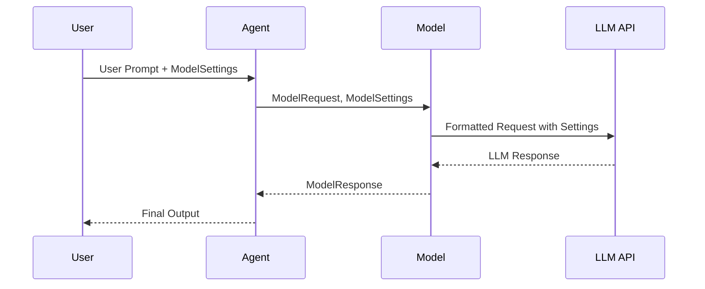

# Chapter 2: ModelSettings

In the previous chapter, [Model](01_model.md), you learned about the `Model` abstraction, which represents a language model like GPT-3.5 or Claude.  You saw how to create a `Model` object and use it to send requests and receive responses. Now, what if you want to *fine-tune* how the model behaves?  That's where `ModelSettings` comes in!

Think of it like this:  You're driving a car (`Model`), and you want to adjust the temperature inside or switch to "sport mode" for a more responsive feel. `ModelSettings` is like the dashboard controls that let you customize the model's behavior.

## What is ModelSettings?

`ModelSettings` is a way to control various aspects of how a language model processes your requests. It's essentially a dictionary of settings that you can pass along when you make a request to your `Model`.  It allows you to adjust things like:

*   **Temperature:** Controls the randomness of the model's output. Higher temperature, more creative. Lower temperature, more predictable.
*   **Max Tokens:**  Limits the length of the response.
*   **Top P:** Another way to control the randomness of the output.
*   **Timeout:**  How long to wait for a response from the model.

Not all settings are supported by all language models. `ModelSettings` allows you to set them in one place while pydantic-ai takes care of the nuances under the hood for each LLM.

## Using ModelSettings

Let's go back to our example from the previous chapter and see how we can use `ModelSettings`.

```python
from pydantic_ai import Model, ModelMessage, ModelSettings

model = Model(model='openai:gpt-3.5-turbo')

messages = [
    ModelMessage(role='user', content='Tell me a short story.')
]

settings: ModelSettings = {
    'temperature': 0.7,
    'max_tokens': 50,
}

response, usage = await model.request(messages=messages, model_settings=settings, model_request_parameters=None)
print(response.content)
```

In this example, we create a `ModelSettings` dictionary called `settings`. We set the `temperature` to `0.7`, making the story a bit more creative and the `max_tokens` to `50`, so that the story remains short.

Now, we pass this `settings` dictionary to the `model.request` method using the `model_settings` argument. This tells the language model to use these settings when generating the response. Without these settings, a story can be longer and the temperature would be at its default.

The output of this code will be a short story (likely limited to 50 tokens) generated with a moderate amount of randomness.

Here's another example:

```python
from pydantic_ai import Model, ModelMessage, ModelSettings

model = Model(model='openai:gpt-3.5-turbo')

messages = [
    ModelMessage(role='user', content='What is 2 + 2? Give only the number in the result')
]

settings: ModelSettings = {
    'temperature': 0.0,
    'max_tokens': 10,
}

response, usage = await model.request(messages=messages, model_settings=settings, model_request_parameters=None)
print(response.content)  # Expected: "4"
```

In this example, we set the `temperature` to `0.0`. With temperature set to `0.0`, the language model will attempt to provide the most deterministic output possible, perfect when asking math questions.

## Diving Deeper: Internal Implementation

Let's take a look at how `ModelSettings` is used internally. When you call the `request` method of a `Model` object, the `ModelSettings` are passed along to the underlying language model API. The specific parameters that are sent to the API depend on the language model being used.

Here's a simplified diagram of how `ModelSettings` is used:



1.  The user provides a prompt and `ModelSettings` to the agent.
2.  The agent passes the prompt and `ModelSettings` to the `Model`.
3.  The `Model` formats the request, including the settings, according to the specific requirements of the LLM API.
4.  The LLM API processes the request and returns a response.
5.  The `Model` parses the response and returns it to the agent.
6.  Finally, the Agent processes the response and delivers a user-friendly output.

Now, let's examine the code.  Here's the definition of `ModelSettings` from `pydantic_ai_slim/pydantic_ai/settings.py`:

```python
from __future__ import annotations

from httpx import Timeout
from typing_extensions import TypedDict


class ModelSettings(TypedDict, total=False):
    """Settings to configure an LLM.
    ...
    """

    max_tokens: int
    """The maximum number of tokens to generate before stopping.
    ...
    """

    temperature: float
    """Amount of randomness injected into the response.
    ...
    """

    top_p: float
    """An alternative to sampling with temperature, called nucleus sampling, where the model considers the results of the tokens with top_p probability mass.
    ...
    """

    timeout: float | Timeout
    """Override the client-level default timeout for a request, in seconds.
    ...
    """

    parallel_tool_calls: bool
    """Whether to allow parallel tool calls.
    ...
    """

    seed: int
    """The random seed to use for the model, theoretically allowing for deterministic results.
    ...
    """

    presence_penalty: float
    """Penalize new tokens based on whether they have appeared in the text so far.
    ...
    """

    frequency_penalty: float
    """Penalize new tokens based on their existing frequency in the text so far.
    ...
    """

    logit_bias: dict[str, int]
    """Modify the likelihood of specified tokens appearing in the completion.
    ...
    """

    stop_sequences: list[str]
    """Sequences that will cause the model to stop generating.
    ...
    """

    extra_body: object
    """Extra body to send to the model.
    ...
    """

```

This `TypedDict` defines the available settings and their types. The `total=False` argument means that all fields are optional.

The merge_model_settings function (`pydantic_ai_slim/pydantic_ai/settings.py`) merges two ModelSettings dictionaries, preferring the overrides:

```python
def merge_model_settings(base: ModelSettings | None, overrides: ModelSettings | None) -> ModelSettings | None:
    """Merge two sets of model settings, preferring the overrides.

    A common use case is: merge_model_settings(<agent settings>, <run settings>)
    """
    # Note: we may want merge recursively if/when we add non-primitive values
    if base and overrides:
        return base | overrides
    else:
        return base or overrides
```

This function is used to combine `ModelSettings` defined on the [Agent](05_agent.md) with `ModelSettings` provided during a specific `run`. This allows you to set defaults on the agent and then override them when needed.

## Conclusion

In this chapter, you learned about `ModelSettings` and how to use them to fine-tune the behavior of language models.  You saw how to adjust settings like temperature and max\_tokens to control the randomness and length of the generated text.

In the next chapter, we'll explore [ModelRequest/Response](03_modelrequest_response.md) to understand the objects the model receives and returns.


---

Generated by [AI Codebase Knowledge Builder](https://github.com/The-Pocket/Tutorial-Codebase-Knowledge)