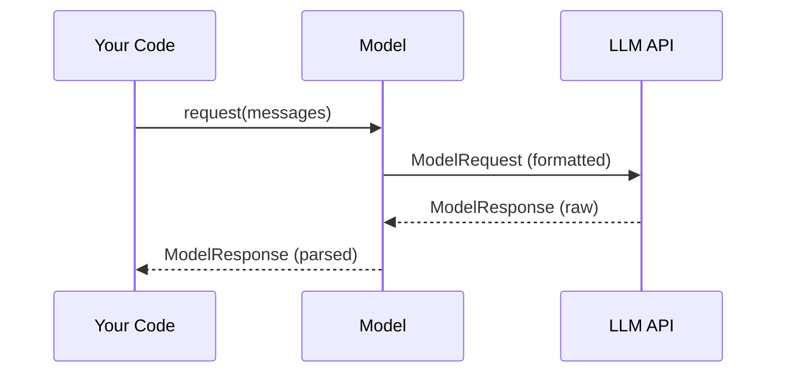

# Chapter 3: ModelRequest/Response

In the previous chapter, [ModelSettings](02_modelsettings.md), you learned how to fine-tune the behavior of your language model. You saw how to control aspects like temperature and max tokens. Now, let's talk about how your code *communicates* with the language model. This is where `ModelRequest` and `ModelResponse` come in.

Imagine you're ordering food at a restaurant. You (your code) give the waiter (the `Model`) your order (`ModelRequest`). The waiter then brings you your food (`ModelResponse`). `ModelRequest` and `ModelResponse` are like the order and the food, representing the messages exchanged between your code and the language model.

## Why ModelRequest/Response?

The main reason we use `ModelRequest` and `ModelResponse` is to structure and standardize the way we send information to and receive information from language models. Different language models might expect the input in slightly different formats, and the output can also vary. `ModelRequest` and `ModelResponse` provide a consistent way to interact with any [Model](01_model.md), regardless of its underlying API.

Let's say you're building a chatbot that summarizes articles. You need to send the article to the language model and receive a summary in return.  `ModelRequest` encapsulates the article you want to summarize, and `ModelResponse` encapsulates the summarized text that you receive from the language model.

## Key Concepts

Let's break down `ModelRequest` and `ModelResponse` into smaller, more manageable parts:

*   **ModelRequest:** Represents the message you send *to* the language model. It contains everything the model needs to fulfill your request.
*   **ModelResponse:** Represents the message you receive *from* the language model. It contains the model's response to your request.
*   **ModelRequestPart**:  This is the container of what you are sending. Examples include the `UserPromptPart` (what the user asked) or `SystemPromptPart` (instruction from developer for the [Model](01_model.md)).
*   **ModelResponsePart**: This is the container of what you receive. Examples include `TextPart` (plain text response) or `ToolCallPart` (the [Model](01_model.md) wants to use a tool).

## Using ModelRequest/Response

You don't usually create `ModelRequest` and `ModelResponse` objects directly. Instead, `pydantic-ai` creates them for you when you call the `request` method of a [Model](01_model.md) object (as shown in [Chapter 1: Model](01_model.md)).

Here's a simplified example:

```python
from pydantic_ai import Model, ModelMessage

model = Model(model='openai:gpt-3.5-turbo')

messages = [
    ModelMessage(role='user', content='What is the meaning of life?')
]

response, usage = await model.request(messages=messages, model_settings=None, model_request_parameters=None)
print(response.content)
```

In this example, the `messages` parameter passed to `model.request` is implicitly converted into a `ModelRequest` internally.  The `response` variable then contains a `ModelResponse` object with the language model's answer.  The `ModelResponse` is also usually comprised of several `ModelResponsePart` objects.

Let's examine the `ModelRequest` that is constructed within the call to `model.request`. In this specific case, it will consist of a single part: a `UserPromptPart` containing the question "What is the meaning of life?". The [Model](01_model.md) then processes this request and generates a `ModelResponse`, which will likely contain a `TextPart` with the model's answer.

Here's another example, now illustrating what happens if the [Model](01_model.md) wants to call a tool:

```python
from pydantic_ai import Model, ModelMessage

model = Model(model='openai:gpt-3.5-turbo')

messages = [
    ModelMessage(role='user', content='What is the weather today in London?')
]

response, usage = await model.request(messages=messages, model_settings=None, model_request_parameters=None)

for part in response.parts:
    if part.part_kind == "tool-call":
        print(f"The model wants to call tool: {part.tool_name}")
        print(f"With arguments: {part.args}")
```

In this scenario, the `ModelResponse` could contain a `ToolCallPart` if the model decides it needs to use a weather tool to answer the question. The code iterates through the `parts` of the `ModelResponse` and checks if a part is a `ToolCallPart`. If so, it prints the name of the tool and its arguments.

## Diving Deeper: Internal Implementation

Let's take a look at what happens internally when you call `model.request` and how `ModelRequest` and `ModelResponse` are used.

Here's a simplified sequence diagram:



1.  **Your Code:** You call the `request` method of the [Model](01_model.md) object, passing in a list of `ModelMessage` objects. These messages are used to construct a `ModelRequest`.
2.  **Model:** The `Model` object receives the request and formats it according to the specific requirements of the LLM API. The formatted request is essentially a serialized version of the `ModelRequest`.
3.  **LLM API:** The `Model` sends the formatted request to the LLM API (e.g., OpenAI, Anthropic). The LLM API processes the request and returns a raw response.
4.  **Model:** The `Model` parses the raw response from the LLM API and transforms it into a `ModelResponse` object. The parts of this response could be `TextPart` or `ToolCallPart`, for example.
5.  **Your Code:** The `Model` returns the parsed `ModelResponse` object to your code.

Now, let's look at some code snippets from `pydantic_ai_slim/pydantic_ai/messages.py`.

Here's the definition of the `ModelRequest` class:

```python
from dataclasses import dataclass, field
from typing import Literal, list, Union

@dataclass
class ModelRequest:
    """A request generated by PydanticAI and sent to a model."""

    parts: list[ModelRequestPart]
    """The parts of the user message."""

    instructions: str | None = None
    """The instructions for the model."""

    kind: Literal['request'] = 'request'
    """Message type identifier."""
```

As you can see, `ModelRequest` primarily consists of a list of `ModelRequestPart` objects and optional instructions.

Here's the definition of the `ModelResponse` class:

```python
from dataclasses import dataclass, field
from typing import Literal, list, Union

@dataclass
class ModelResponse:
    """A response from a model."""

    parts: list[ModelResponsePart]
    """The parts of the model message."""

    model_name: str | None = None
    """The name of the model that generated the response."""

    timestamp: datetime = field(default_factory=_now_utc)
    """The timestamp of the response."""

    kind: Literal['response'] = 'response'
    """Message type identifier."""
```

`ModelResponse` also has a list of `ModelResponsePart` objects that carries the response. `ModelResponse` also stores the model's name and timestamp of the response.

## Conclusion

In this chapter, you've learned about `ModelRequest` and `ModelResponse`, the messages exchanged between your code and the language model. You've seen how they provide a structured way to send requests and receive responses, and how `pydantic-ai` uses them internally to interact with different language model APIs.

In the next chapter, we'll explore [Usage](04_usage.md) to understand the token usage information returned by the [Model](01_model.md).


---

Generated by [AI Codebase Knowledge Builder](https://github.com/The-Pocket/Tutorial-Codebase-Knowledge)